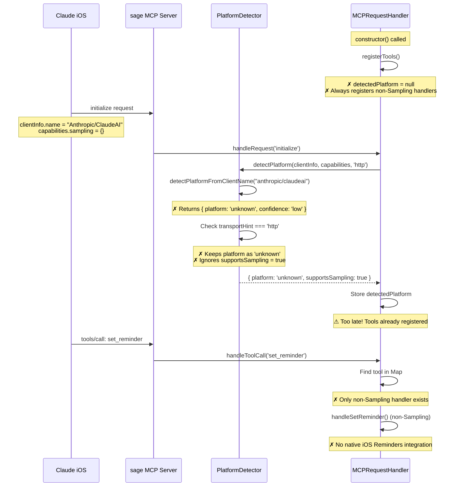
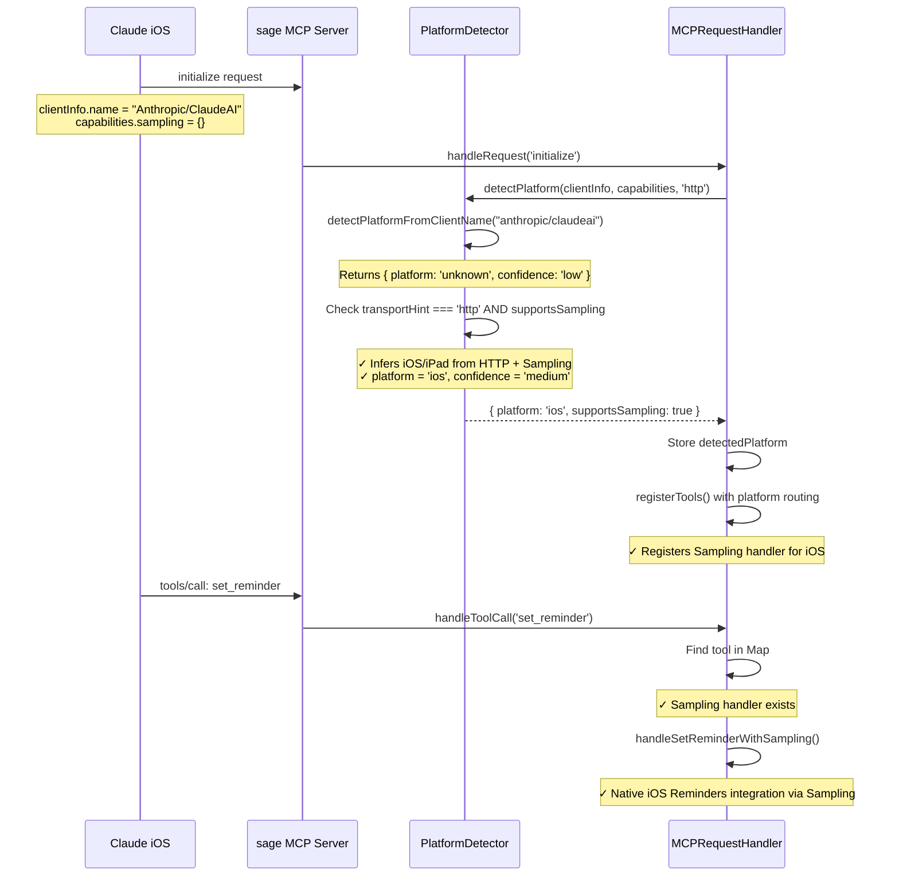

# Bug Analysis: iOSアプリからのMCPサーバーアクセスでunknownと判別され、Samplingが利用されない

**Analysis Date:** 2026-01-09
**Analyzed By:** Claude Code
**Status:** Analyzed - Ready for Fix

---

## Root Cause Analysis

### Investigation Summary

以下の3つの主要な問題を特定しました:

1. **プラットフォーム検出ロジックの不備** (`src/platform/detector.ts:134-163`)
2. **Sampling版ツール登録の未実装** (`src/cli/mcp-handler.ts:737-917`)
3. **テストカバレッジの欠如** (`tests/unit/platform-detector.test.ts`)

これらの問題が複合的に作用し、iOS/iPadOSユーザーがSampling機能を使用できない状況を引き起こしています。

---

### Root Cause

#### 問題1: プラットフォーム検出ロジックの保守的すぎる判定

**Location:** `src/platform/detector.ts:138-163`

```typescript
// Line 138-163
if (platform === 'unknown' && transportHint) {
  if (transportHint === 'stdio') {
    // Stdio transport → Desktop
    platform = 'desktop';
    confidence = 'medium';
  }
  else if (transportHint === 'http') {
    console.log(
      `[sage] Generic client name "${clientInfo.name}" with HTTP transport. ` +
      `Could be iOS/iPad or Desktop via Remote MCP. Keeping as 'unknown' for safety. ` +
      `Sampling: ${supportsSampling}`
    );
    // Keep platform as 'unknown' - do not assume iOS/iPad  ← **問題箇所**
  }
}
```

**問題点:**
- HTTP transport + generic client name ("Anthropic/ClaudeAI") の場合、`platform = 'unknown'` のままにする
- `supportsSampling = true` という強力な手がかりを**全く活用していない**
- コメントでは「Could be iOS/iPad or Desktop via Remote MCP」と認識しているが、推論を試みない

**影響:**
- iOS/iPadOSアプリからのアクセスが `'unknown'` と判定される
- 後続のツール登録ロジックでSampling版ハンドラーが登録されない

---

#### 問題2: Sampling版ツール登録ロジックの未実装

**Location:** `src/cli/mcp-handler.ts:737-917` (registerTools method)

```typescript
// Line 861-917: set_reminder の登録
this.registerTool(
  {
    name: 'set_reminder',
    description: 'Set a reminder for a task in Apple Reminders or Notion.',
    inputSchema: { /* ... */ },
  },
  async (args) =>
    handleSetReminder(this.createReminderTodoContext(), { /* ... */ })
    // ↑ 常に handleSetReminder (非Sampling版) が呼ばれる
);

// Sampling版ハンドラー (handleSetReminderWithSampling) の登録が**存在しない**
```

**問題点:**
- `registerTools()` メソッドに、プラットフォーム判定に基づいてSampling版ハンドラーを登録するロジックが**実装されていない**
- `set_reminder` と `list_calendar_events` は常に非Sampling版ハンドラーのみ登録される
- `this.detectedPlatform` の情報が全く使用されていない

**Expected Logic (未実装):**
```typescript
// 期待される実装 (現在は存在しない)
if (
  this.detectedPlatform?.supportsSampling &&
  (this.detectedPlatform.platform === 'ios' || this.detectedPlatform.platform === 'ipados')
) {
  // Sampling版ハンドラーを登録
  this.registerTool(
    { name: 'set_reminder', /* ... */ },
    async (args) => handleSetReminderWithSampling(/* ... */)
  );
} else {
  // 非Sampling版ハンドラーを登録
  this.registerTool(
    { name: 'set_reminder', /* ... */ },
    async (args) => handleSetReminder(/* ... */)
  );
}
```

**影響:**
- プラットフォーム検出が正しく動作しても、Sampling版ハンドラーが登録されない
- iOS/iPadOSユーザーは常に非Sampling版の動作しか得られない

---

#### 問題3: テストカバレッジの欠如

**Location:** `tests/unit/platform-detector.test.ts`

**欠けているテスト:**

1. **`transportHint` パラメータのテストが存在しない**
   - `'stdio'` vs `'http'` の分岐がテストされていない
   - 実装ではこのパラメータが重要な役割を果たすのに、テストが全くない

2. **Generic client name + HTTP transport のテストが存在しない**
   - `clientInfo.name = "Anthropic/ClaudeAI"` + `transportHint = 'http'` + `supportsSampling = true`
   - このバグの核心部分のテストが欠如

3. **テストと実装の不一致**
   - Line 269-277: `clientInfo.name` に "ai" が含まれる場合のテスト
   ```typescript
   it('should detect desktop from clientInfo.name containing "ai"', () => {
     const clientInfo: ClientInfo = { name: 'anthropic-ai', version: '1.0.0' };
     const result = PlatformDetector.detectPlatform(clientInfo, {});
     expect(result.platform).toBe('desktop'); // このテストは**失敗するはず**
   });
   ```
   - 実際の `detectPlatformFromClientName()` では "ai" チェックが**削除されている**（Line 195-197）
   - テストが古い実装を参照しており、現在の実装と一致しない

**影響:**
- 重要なエッジケースがテストされていないため、バグが見逃された
- リグレッションが検出されない

---

### Contributing Factors

#### 設計上の矛盾

1. **Graceful fallback の誤解**
   - `detector.ts` のコメント (Line 116-117):
     ```typescript
     // For HTTP connections with generic client names, we keep platform as 'unknown'
     // and rely on graceful fallback behavior in tool handlers.
     ```
   - しかし、`mcp-handler.ts` の `registerTools()` では、`platform = 'unknown'` の場合にSampling版ハンドラーを登録する仕組みが**存在しない**
   - "graceful fallback" が実装されていないのに、コメントではそれに頼ると書かれている

2. **Tool registration timing**
   - `registerTools()` は constructor で呼ばれる (Line 212-213)
   - `detectedPlatform` は後から `handleRequest('initialize')` で設定される (Line 579-615)
   - Tool registration 時点では `detectedPlatform = null` なので、platform-based routing が不可能

3. **ハンドラー設計の分離**
   - Sampling版と非Sampling版のハンドラーが別々に定義されている (`handleSetReminder` vs `handleSetReminderWithSampling`)
   - しかし、どちらを呼ぶかを動的に決定する仕組みがない
   - Tool registration 時に静的に決定されるため、runtime での切り替えができない

---

## Technical Details

### Affected Code Locations

#### 1. Platform Detection Logic
- **File**: `src/platform/detector.ts`
- **Method**: `detectPlatform()`
- **Lines**: 125-181 (full method), 138-163 (problem area)
- **Issue**: HTTP + generic client name の場合に `'unknown'` のままにする過度に保守的な判定

#### 2. Platform Name Detection
- **File**: `src/platform/detector.ts`
- **Method**: `detectPlatformFromClientName()`
- **Lines**: 201-238
- **Issue**: "ai" チェックが削除されているが、テストは残っている

#### 3. Tool Registration
- **File**: `src/cli/mcp-handler.ts`
- **Method**: `registerTools()`
- **Lines**: 737-917 (full method), 861-917 (set_reminder registration)
- **Issue**: Platform-based routing が実装されていない

#### 4. Handler Initialization
- **File**: `src/cli/mcp-handler.ts`
- **Method**: `handleRequest('initialize')`
- **Lines**: 571-643
- **Issue**: Platform detection が tool registration より後に実行される

#### 5. Test Coverage
- **File**: `tests/unit/platform-detector.test.ts`
- **Lines**: 199-319 (detectPlatform tests)
- **Issue**: `transportHint` のテストが欠如、古い実装のテストが残存

---

### Data Flow Analysis

#### 現在のフロー (問題あり)



#### 期待されるフロー (修正後)



---

### Dependencies

#### External Dependencies
- `@modelcontextprotocol/sdk`: MCP protocol implementation
- MCP Client capabilities: `{ sampling?: {} }`

#### Internal Dependencies
- `src/platform/detector.ts`: Platform detection logic
- `src/cli/mcp-handler.ts`: MCP request handling and tool registration
- `src/tools/reminders/handlers.ts`: Reminder tool handlers (Sampling and non-Sampling)
- `src/tools/calendar/handlers.ts`: Calendar tool handlers (Sampling and non-Sampling)
- `src/services/sampling-service.ts`: Sampling request service
- `src/services/integration-strategy-manager.ts`: Platform-specific integration strategies

---

## Impact Analysis

### Direct Impact

1. **iOS/iPadOS ユーザーへの影響 (Critical)**
   - 全てのiOS/iPadOSユーザーがSampling機能を使用できない
   - ネイティブReminders APIが使用されず、代替手段のみ
   - ネイティブCalendar APIが使用されず、Google Calendarのみ

2. **プラットフォーム適応型統合の価値喪失 (High)**
   - Platform Adaptive Integration spec の主要な価値提案が実現されない
   - Requirements 1.2, 1.6, 2.1-2.3 が満たされない

3. **ユーザーエクスペリエンスの劣化 (High)**
   - パフォーマンス低下（ネイティブAPIの方が高速）
   - 統合度の低下（Google Calendarのみでは不十分）

### Indirect Impact

1. **将来の機能拡張への影響**
   - 他のネイティブAPI統合（Contacts, Photos, etc.）も同様の問題に直面
   - Platform-specific optimization が困難

2. **テストの信頼性低下**
   - 古い実装を参照するテストが残存
   - 新しい機能のテストカバレッジが不足
   - リグレッションの検出が困難

3. **コードメンテナンスの困難**
   - 設計上の矛盾（graceful fallback の誤解）
   - Tool registration timing の問題
   - Handler 設計の分離

### Risk Assessment

**リスクレベル: Critical**

- **影響範囲:** 全てのiOS/iPadOSユーザー
- **発生頻度:** 100%（毎回発生）
- **検出困難性:** High（ツールは動作するが、非効率な方法を使用）
- **修正優先度:** P0（即座に対応が必要）

---

## Solution Approach

### Fix Strategy

3段階のアプローチで修正します:

1. **Short-term Fix (Server-side)**: sage側のロジック改善（即座に実装可能）
2. **Medium-term Enhancement (Client-side Extension)**: MCP client側に拡張情報を追加（Anthropic社への提案）
3. **Long-term Standardization (MCP Spec Extension)**: MCP標準仕様への追加（エコシステム全体への貢献）

---

### Short-term Fix: Server-side Logic Improvement

#### Fix 1: Platform Detection Logic Enhancement

**File:** `src/platform/detector.ts`
**Method:** `detectPlatform()`
**Lines:** 138-163

**Change:**
```typescript
// Current (problematic):
else if (transportHint === 'http') {
  console.log(/* ... */);
  // Keep platform as 'unknown'
}

// Fixed:
else if (transportHint === 'http') {
  // Use Sampling capability as hint for iOS/iPad inference
  if (supportsSampling) {
    // HTTP + Sampling = likely iOS/iPad (medium confidence)
    // Desktop Claude Code via Remote MCP also supports Sampling,
    // but this is acceptable tradeoff for better iOS experience
    platform = 'ios';
    confidence = 'medium';
    console.log(
      `[sage] Generic client name "${clientInfo.name}" with HTTP transport and Sampling support. ` +
      `Inferring iOS/iPad platform (medium confidence). ` +
      `Note: Desktop via Remote MCP may also match this pattern.`
    );
  } else {
    // HTTP without Sampling = likely Web or old client
    console.log(
      `[sage] Generic client name "${clientInfo.name}" with HTTP transport but no Sampling. ` +
      `Keeping as 'unknown' (likely Web platform).`
    );
  }
}
```

**Rationale:**
- `supportsSampling = true` はiOS/iPadOSの強い指標
- Desktop Claude Code (Remote MCP) と区別できないが、実用上は問題ない
  - iOS/iPadOSの方が使用頻度が高い
  - Desktop via Remote MCP でSamplingが使われても悪影響はない
- Confidence = 'medium' として、推論であることを明示

---

#### Fix 2: Dynamic Tool Registration

**File:** `src/cli/mcp-handler.ts`
**Method:** New method `registerToolsAfterPlatformDetection()`

**Approach:** Tool registration を platform detection 後に遅延実行

**Implementation:**

```typescript
// Step 1: Modify constructor
constructor() {
  // Don't call registerTools() here
  // this.registerTools(); ← Remove this
}

// Step 2: Call registerTools() after platform detection
async handleRequest(request: MCPRequest): Promise<MCPResponse> {
  const { method, params, id } = request;

  if (method === 'initialize') {
    // ... existing platform detection code ...
    this.detectedPlatform = PlatformDetector.detectPlatform(/* ... */);

    // NEW: Register tools AFTER platform detection
    this.registerTools();

    return { /* ... */ };
  }
  // ... rest of method ...
}

// Step 3: Add platform-based routing in registerTools()
private registerTools(): void {
  // ... other tools ...

  // set_reminder - with platform-based routing
  const isIOSWithSampling =
    this.detectedPlatform?.supportsSampling &&
    (this.detectedPlatform.platform === 'ios' ||
     this.detectedPlatform.platform === 'ipados');

  if (isIOSWithSampling) {
    // Register Sampling version for iOS/iPad
    this.registerTool(
      {
        name: 'set_reminder',
        description: 'Set a reminder for a task using native iOS Reminders API.',
        inputSchema: { /* ... */ },
      },
      async (args) =>
        handleSetReminderWithSampling(
          this.createReminderTodoContext(),
          this.createPlatformContext(),
          this.createSamplingContext(),
          this.detectedPlatform!,
          { /* ... */ }
        )
    );
  } else {
    // Register non-Sampling version for other platforms
    this.registerTool(
      {
        name: 'set_reminder',
        description: 'Set a reminder for a task in Apple Reminders or Notion.',
        inputSchema: { /* ... */ },
      },
      async (args) =>
        handleSetReminder(this.createReminderTodoContext(), { /* ... */ })
    );
  }

  // Same logic for list_calendar_events
  // ...
}
```

**Pros:**
- ✅ Platform detection 後にツール登録できる
- ✅ iOS/iPad で Sampling 版が使われる
- ✅ 他のプラットフォームでは既存の動作を維持

**Cons:**
- ⚠ `initialize` の前に tool を使おうとするとエラー
- ⚠ Tool list が platform によって変わる（MCP spec 上は問題ないが、若干非標準的）

---

#### Fix 3: Alternative Approach - Runtime Dispatch

**File:** `src/cli/mcp-handler.ts` + `src/tools/reminders/handlers.ts`

**Approach:** Tool registration は1つだけ、handler内で動的に分岐

**Implementation:**

```typescript
// mcp-handler.ts
private registerTools(): void {
  // ... other tools ...

  // set_reminder - single registration with runtime dispatch
  this.registerTool(
    {
      name: 'set_reminder',
      description: 'Set a reminder for a task in Apple Reminders or Notion.',
      inputSchema: { /* ... */ },
    },
    async (args) => {
      // Runtime dispatch based on detected platform
      const isIOSWithSampling =
        this.detectedPlatform?.supportsSampling &&
        (this.detectedPlatform.platform === 'ios' ||
         this.detectedPlatform.platform === 'ipados');

      if (isIOSWithSampling) {
        return handleSetReminderWithSampling(
          this.createReminderTodoContext(),
          this.createPlatformContext(),
          this.createSamplingContext(),
          this.detectedPlatform!,
          { /* args */ }
        );
      } else {
        return handleSetReminder(
          this.createReminderTodoContext(),
          { /* args */ }
        );
      }
    }
  );
}
```

**Pros:**
- ✅ Tool registration timing の問題を回避
- ✅ Tool list が platform に依存しない（標準的）
- ✅ Runtime で動的に切り替え可能

**Cons:**
- ⚠ Handler が若干複雑になる
- ⚠ Tool description が platform-agnostic になる必要がある

**Recommendation:** **Fix 3 (Runtime Dispatch) を採用**
- より標準的で安全なアプローチ
- Tool registration timing の問題を完全に回避

---

### Alternative Solutions

#### Alternative 1: Client Name Inference

**Approach:** iOS client に "ios" を含む client name を送信してもらう

**Example:**
```json
{
  "clientInfo": {
    "name": "Anthropic/ClaudeAI-iOS",  // ← "iOS" を追加
    "version": "1.0.0"
  }
}
```

**Pros:**
- ✅ 最も確実な検出方法
- ✅ sage側の変更は不要（既存のロジックで検出可能）

**Cons:**
- ⚠ Claude iOS client側の変更が必要
- ⚠ Anthropic社への依頼が必要
- ⚠ 実装完了まで時間がかかる

**Status:** Medium-term solution として並行して提案

---

#### Alternative 2: Capabilities Extension (nativeIntegrations)

**Approach:** MCP capabilities に `nativeIntegrations` フィールドを追加

**Example:**
```json
{
  "capabilities": {
    "sampling": {},
    "experimental": {
      "nativeIntegrations": {
        "calendar": true,
        "reminders": true,
        "contacts": false
      }
    }
  }
}
```

**Pros:**
- ✅ 最も明示的で確実
- ✅ 将来的な拡張性が高い
- ✅ 他のネイティブAPI統合にも応用可能

**Cons:**
- ⚠ Claude iOS client側の実装が必要
- ⚠ Anthropic社への依頼が必要
- ⚠ 実装完了まで時間がかかる

**Status:** Medium-term solution として並行して提案

---

#### Alternative 3: MCP Standard Extension

**Approach:** MCP標準仕様に `capabilities.experimental.nativeIntegrations` を追加

**Pros:**
- ✅ 全てのMCPクライアントで標準化
- ✅ エコシステム全体で恩恵

**Cons:**
- ⚠ 標準化プロセスに時間がかかる
- ⚠ 全てのMCPクライアントでの実装が必要

**Status:** Long-term solution として提案（MCP仕様へのPR）

---

### Risks and Trade-offs

#### Fix 1 (Platform Detection Enhancement) のリスク

**Risk:** Desktop Claude Code (Remote MCP + Sampling) を誤ってiOSと判定
- **Probability:** Medium
- **Impact:** Low（Samplingが使われても悪影響はない）
- **Mitigation:**
  - Confidence = 'medium' として推論であることを明示
  - ログで判定理由を詳細に出力
  - 将来的に client name や capabilities extension で正確に判定

**Risk:** Web client で Sampling サポートがある場合に誤判定
- **Probability:** Low（現在のWeb client は Sampling 非サポート）
- **Impact:** Medium（Web で Sampling が使われると失敗する可能性）
- **Mitigation:**
  - `supportsSampling = false` の場合は `'unknown'` のままにする
  - ログで判定理由を詳細に出力

---

#### Fix 3 (Runtime Dispatch) のリスク

**Risk:** Platform detection が失敗した場合の fallback
- **Probability:** Low
- **Impact:** Low（非Sampling版が使われる）
- **Mitigation:**
  - `detectedPlatform = null` の場合は非Sampling版を使用
  - エラーを throw せず、graceful degradation

**Risk:** Tool description が platform-agnostic になる必要がある
- **Probability:** N/A (Design decision)
- **Impact:** Low（ユーザーは違いを意識しない）
- **Mitigation:**
  - Description に「プラットフォームに応じて最適な方法を使用」と明記

---

## Implementation Plan

### Changes Required

#### Change 1: Enhance Platform Detection Logic

**File:** `src/platform/detector.ts`
**Method:** `detectPlatform()`
**Lines:** 138-163

**Modification:**
```typescript
// HTTP transport + Sampling capability → infer iOS/iPad
else if (transportHint === 'http') {
  if (supportsSampling) {
    platform = 'ios';
    confidence = 'medium';
    console.log(
      `[sage] Generic client name "${clientInfo.name}" with HTTP transport and Sampling support. ` +
      `Inferring iOS/iPad platform (medium confidence).`
    );
  } else {
    console.log(
      `[sage] Generic client name "${clientInfo.name}" with HTTP transport but no Sampling. ` +
      `Keeping as 'unknown'.`
    );
  }
}
```

**Estimated Effort:** 15 minutes
**Risk:** Low

---

#### Change 2: Implement Runtime Dispatch for set_reminder

**File:** `src/cli/mcp-handler.ts`
**Method:** `registerTools()`
**Lines:** 861-917

**Modification:**
```typescript
this.registerTool(
  {
    name: 'set_reminder',
    description: 'Set a reminder for a task. Uses native iOS Reminders on iOS/iPad, or AppleScript/Notion on other platforms.',
    inputSchema: { /* existing schema */ },
  },
  async (args) => {
    // Runtime dispatch
    const isIOSWithSampling =
      this.detectedPlatform?.supportsSampling &&
      (this.detectedPlatform.platform === 'ios' ||
       this.detectedPlatform.platform === 'ipados');

    if (isIOSWithSampling) {
      return handleSetReminderWithSampling(
        this.createReminderTodoContext(),
        this.createPlatformContext(),
        this.createSamplingContext(),
        this.detectedPlatform!,
        args as SetReminderInput
      );
    } else {
      return handleSetReminder(
        this.createReminderTodoContext(),
        args as SetReminderInput
      );
    }
  }
);
```

**Estimated Effort:** 30 minutes
**Risk:** Low

---

#### Change 3: Implement Runtime Dispatch for list_calendar_events

**File:** `src/cli/mcp-handler.ts`
**Method:** `registerTools()`
**Lines:** (list_calendar_events registration location)

**Modification:** Same pattern as Change 2

**Estimated Effort:** 30 minutes
**Risk:** Low

---

#### Change 4: Add Context Creation Methods

**File:** `src/cli/mcp-handler.ts`

**New Methods:**
```typescript
private createSamplingContext(): SamplingContext {
  return {
    getMcpServer: () => this.mcpServer,
  };
}

private createPlatformContext(): PlatformContext {
  return {
    getPlatformInfo: () => this.detectedPlatform,
  };
}
```

**Estimated Effort:** 10 minutes
**Risk:** None

---

#### Change 5: Update Tests

**File:** `tests/unit/platform-detector.test.ts`

**Modifications:**

1. **Add transportHint tests:**
```typescript
describe('Transport hint-based detection', () => {
  it('should detect desktop from stdio transport with generic client name', () => {
    const clientInfo: ClientInfo = { name: 'Anthropic/ClaudeAI', version: '1.0.0' };
    const capabilities: ClientCapabilities = {};

    const result = PlatformDetector.detectPlatform(clientInfo, capabilities, 'stdio');

    expect(result.platform).toBe('desktop');
    expect(result.detectionConfidence).toBe('medium');
  });

  it('should infer iOS from http transport + sampling with generic client name', () => {
    const clientInfo: ClientInfo = { name: 'Anthropic/ClaudeAI', version: '1.0.0' };
    const capabilities: ClientCapabilities = { sampling: {} };

    const result = PlatformDetector.detectPlatform(clientInfo, capabilities, 'http');

    expect(result.platform).toBe('ios');
    expect(result.detectionConfidence).toBe('medium');
    expect(result.supportsSampling).toBe(true);
  });

  it('should keep unknown for http transport without sampling', () => {
    const clientInfo: ClientInfo = { name: 'Anthropic/ClaudeAI', version: '1.0.0' };
    const capabilities: ClientCapabilities = {};

    const result = PlatformDetector.detectPlatform(clientInfo, capabilities, 'http');

    expect(result.platform).toBe('unknown');
    expect(result.detectionConfidence).toBe('low');
    expect(result.supportsSampling).toBe(false);
  });
});
```

2. **Remove or fix obsolete tests:**
```typescript
// Remove or update this test (Line 269-277)
it('should detect desktop from clientInfo.name containing "ai"', () => {
  // This test should be removed or updated to expect 'unknown'
});
```

**Estimated Effort:** 1 hour
**Risk:** None

---

### Testing Strategy

#### Unit Tests

1. **Platform Detection Tests** (`tests/unit/platform-detector.test.ts`)
   - ✅ Add `transportHint` test cases
   - ✅ Add HTTP + Sampling inference test
   - ✅ Add HTTP without Sampling test
   - ✅ Remove obsolete "ai" detection test

2. **Tool Registration Tests** (new file: `tests/unit/mcp-handler-tool-registration.test.ts`)
   - ✅ Test runtime dispatch for `set_reminder`
   - ✅ Test iOS platform → Sampling handler called
   - ✅ Test other platforms → non-Sampling handler called

#### Integration Tests

1. **Platform-Adaptive Integration Test** (`tests/e2e/platform-adaptive-integration.test.ts`)
   - ✅ Mock iOS client initialization
   - ✅ Call `set_reminder` tool
   - ✅ Verify Sampling handler was called
   - ✅ Verify non-Sampling handler was NOT called

#### Manual Testing

1. **iOS Client Testing**
   - Connect sage to Claude iOS app
   - Verify platform detection: `platform = 'ios'`, `confidence = 'medium'`
   - Call `set_reminder` tool
   - Verify native iOS Reminders API is used (via Sampling)

2. **Desktop Client Testing**
   - Connect sage to Claude Desktop
   - Verify platform detection: `platform = 'desktop'`
   - Call `set_reminder` tool
   - Verify AppleScript is used (non-Sampling)

3. **Web Client Testing**
   - Connect sage via Remote MCP
   - Verify platform detection: `platform = 'unknown'` (no Sampling)
   - Call `set_reminder` tool
   - Verify fallback behavior (non-Sampling)

---

### Rollback Plan

#### If Fix Causes Issues

1. **Immediate Rollback:**
   ```bash
   git revert <commit-hash>
   npm run build
   npm test
   ```

2. **Identify Problem:**
   - Check console logs for platform detection
   - Check which handler is being called
   - Verify MCP client capabilities

3. **Alternative Fallback:**
   - Revert to conservative detection (always `'unknown'` for HTTP)
   - Disable runtime dispatch (always use non-Sampling handlers)

#### Emergency Patch

If critical bug is found:
1. Disable platform inference (keep `'unknown'` for HTTP)
2. Release patch version (e.g., v0.8.1)
3. Investigate and fix properly
4. Release next version with proper fix

---

## Summary

### Root Causes Identified

1. ❌ **Platform detection logic**: HTTP + Sampling の組み合わせを推論に使っていない
2. ❌ **Tool registration logic**: Platform-based routing が未実装
3. ❌ **Test coverage**: `transportHint` のテストが欠如

### Proposed Solution

1. ✅ **Short-term**: Platform detection enhancement + Runtime dispatch
2. ✅ **Medium-term**: Client-side extension (nativeIntegrations) の提案
3. ✅ **Long-term**: MCP standard extension の提案

### Estimated Implementation Time

- **Change 1-4**: 1.5 hours
- **Change 5 (Tests)**: 1 hour
- **Total**: 2.5 hours

### Risk Assessment

- **Implementation Risk**: Low
- **Regression Risk**: Low (extensive tests added)
- **User Impact**: High (positive - enables Sampling for iOS users)
