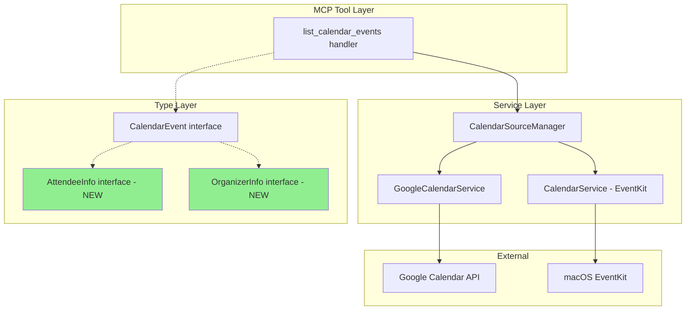
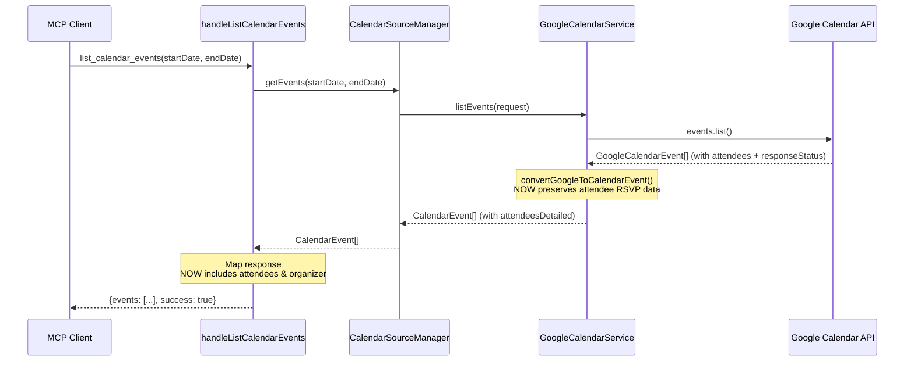

# Calendar RSVP Support - Design Document

> **Last Updated**: 2026-01-17
> **Status**: Draft
> **Feature**: calendar-rsvp-support
> **Requirements**: [requirements.md](./requirements.md)

## 1. Overview

### 1.1 Summary
This design document describes the implementation approach for exposing attendee RSVP status in the `list_calendar_events` MCP tool response. The changes involve extending type definitions, modifying the event conversion function, and updating the handler response mapping.

### 1.2 Design Goals
- **Minimal Changes**: Leverage existing Google Calendar API data that's already being fetched
- **Type Safety**: Properly typed interfaces for attendees and organizers
- **Backward Compatibility**: New fields are optional; existing consumers unaffected
- **Graceful Degradation**: Handle EventKit's limited attendee information

## 2. Architecture

### 2.1 Component Diagram



### 2.2 Data Flow



## 3. Type Definitions

### 3.1 New Interfaces

#### AttendeeInfo Interface
**File**: `src/types/calendar.ts`

```typescript
/**
 * Extended attendee information with RSVP status
 * @see FR-1 in requirements.md
 */
export interface AttendeeInfo {
  /** Attendee's email address */
  email: string;

  /** Attendee's display name (if available) */
  displayName?: string;

  /** RSVP response status */
  responseStatus: 'accepted' | 'declined' | 'tentative' | 'needsAction';

  /** True if this attendee is optional (default: false/required) */
  optional?: boolean;

  /** True if this attendee is the authenticated user */
  self?: boolean;

  /** Attendee's response comment (if provided) */
  comment?: string;
}
```

#### OrganizerInfo Interface
**File**: `src/types/calendar.ts`

```typescript
/**
 * Event organizer information
 * @see FR-2 in requirements.md
 */
export interface OrganizerInfo {
  /** Organizer's email address */
  email: string;

  /** Organizer's display name (if available) */
  displayName?: string;

  /** True if the authenticated user is the organizer */
  self?: boolean;
}
```

### 3.2 Extended CalendarEvent Interface

**File**: `src/types/calendar.ts` (modify existing)

```typescript
export interface CalendarEvent {
  // ... existing fields ...
  id: string;
  title: string;
  start: string;
  end: string;
  isAllDay: boolean;
  source: 'eventkit' | 'google';
  // ... other existing fields ...

  /**
   * Event organizer information
   * @see FR-2, US-2
   */
  organizer?: OrganizerInfo;

  /**
   * Extended attendee information with RSVP status
   * Replaces the simple string[] attendees field
   * @see FR-1, US-1, US-3, US-4
   */
  attendeesDetailed?: AttendeeInfo[];

  // Keep for backward compatibility (deprecated)
  // attendees?: string[];  // Consider removing in future version
}
```

### 3.3 Google Calendar Types Update

**File**: `src/types/google-calendar-types.ts`

The `GoogleCalendarEvent` interface already has the necessary fields:

```typescript
// Already exists - no changes needed
interface GoogleCalendarEvent {
  // ...
  attendees?: Array<{
    email: string;
    displayName?: string;
    responseStatus: 'needsAction' | 'declined' | 'tentative' | 'accepted';
    optional?: boolean;
    self?: boolean;
    comment?: string;
  }>;
  organizer?: {
    email: string;
    displayName?: string;
    self?: boolean;
  };
}
```

## 4. Implementation Changes

### 4.1 Conversion Function Update

**File**: `src/types/google-calendar-types.ts`
**Function**: `convertGoogleToCalendarEvent()`

```typescript
export function convertGoogleToCalendarEvent(
  googleEvent: GoogleCalendarEvent
): CalendarEvent {
  // ... existing conversion logic ...

  // NEW: Convert attendees with full RSVP information
  const attendeesDetailed: AttendeeInfo[] | undefined = googleEvent.attendees?.map(
    (attendee) => ({
      email: attendee.email,
      displayName: attendee.displayName,
      responseStatus: attendee.responseStatus || 'needsAction',
      optional: attendee.optional,
      self: attendee.self,
      comment: attendee.comment,
    })
  );

  // NEW: Convert organizer information
  const organizer: OrganizerInfo | undefined = googleEvent.organizer
    ? {
        email: googleEvent.organizer.email,
        displayName: googleEvent.organizer.displayName,
        self: googleEvent.organizer.self,
      }
    : undefined;

  return {
    id: googleEvent.id,
    title: googleEvent.summary,
    start: googleEvent.start.dateTime || googleEvent.start.date || '',
    end: googleEvent.end.dateTime || googleEvent.end.date || '',
    isAllDay: !!googleEvent.start.date,
    source: 'google',
    calendar: googleEvent.organizer?.email,
    location: googleEvent.location,
    description: googleEvent.description,
    // CHANGED: Use attendeesDetailed instead of simple email array
    attendeesDetailed,
    organizer,
    status: googleEvent.status,
    iCalUID: googleEvent.iCalUID,
    eventType,
    typeSpecificProperties,
    recurrence,
    recurringEventId,
    recurrenceDescription,
  };
}
```

### 4.2 Handler Response Update

**File**: `src/tools/calendar/handlers.ts`
**Function**: `handleListCalendarEvents()`

```typescript
export async function handleListCalendarEvents(
  ctx: CalendarToolsContext,
  args: ListCalendarEventsInput
) {
  // ... existing logic ...

  return createToolResponse({
    success: true,
    events: events.map((event) => ({
      id: event.id,
      title: event.title,
      start: event.start,
      end: event.end,
      isAllDay: event.isAllDay,
      calendar: event.calendar,
      location: event.location,
      source: event.source,
      eventType: event.eventType || 'default',
      typeSpecificProperties: event.typeSpecificProperties,
      // NEW: Include organizer and attendees in response
      organizer: event.organizer,
      attendees: event.attendeesDetailed,  // Use the detailed version
    })),
    // ... rest of response ...
  });
}
```

### 4.3 EventKit Handling

**File**: `src/integrations/calendar-service.ts`

EventKit events will have `attendeesDetailed` as `undefined` or empty array since macOS EventKit doesn't provide RSVP status:

```typescript
// In EventKit conversion (if any conversion exists)
// No changes needed - attendeesDetailed will simply be undefined
// This satisfies FR-5: graceful handling
```

## 5. Response Schema

### 5.1 Updated Tool Response Format

```typescript
interface ListCalendarEventsResponse {
  success: boolean;
  sources: ('eventkit' | 'google')[];
  events: Array<{
    id: string;
    title: string;
    start: string;
    end: string;
    isAllDay: boolean;
    calendar?: string;
    location?: string;
    source: 'eventkit' | 'google';
    eventType: string;
    typeSpecificProperties?: object;

    // NEW FIELDS
    organizer?: {
      email: string;
      displayName?: string;
      self?: boolean;
    };
    attendees?: Array<{
      email: string;
      displayName?: string;
      responseStatus: 'accepted' | 'declined' | 'tentative' | 'needsAction';
      optional?: boolean;
      self?: boolean;
      comment?: string;
    }>;
  }>;
  period: {
    start: string;
    end: string;
  };
  totalEvents: number;
  message: string;
}
```

### 5.2 Example Response

```json
{
  "success": true,
  "sources": ["google"],
  "events": [
    {
      "id": "abc123",
      "title": "Team Standup",
      "start": "2026-01-20T10:00:00+09:00",
      "end": "2026-01-20T10:30:00+09:00",
      "isAllDay": false,
      "calendar": "organizer@company.com",
      "source": "google",
      "eventType": "default",
      "organizer": {
        "email": "organizer@company.com",
        "displayName": "Team Lead",
        "self": false
      },
      "attendees": [
        {
          "email": "organizer@company.com",
          "displayName": "Team Lead",
          "responseStatus": "accepted",
          "self": false
        },
        {
          "email": "user@company.com",
          "displayName": "Current User",
          "responseStatus": "accepted",
          "self": true
        },
        {
          "email": "colleague@company.com",
          "displayName": "Colleague",
          "responseStatus": "tentative",
          "optional": true
        },
        {
          "email": "newmember@company.com",
          "responseStatus": "needsAction"
        }
      ]
    }
  ],
  "period": { "start": "2026-01-20", "end": "2026-01-20" },
  "totalEvents": 1,
  "message": "1件のイベントが見つかりました (ソース: google)。"
}
```

## 6. Files to Modify

| File | Change Type | Description |
|------|-------------|-------------|
| `src/types/calendar.ts` | Add | `AttendeeInfo`, `OrganizerInfo` interfaces |
| `src/types/calendar.ts` | Modify | Add `organizer`, `attendeesDetailed` to `CalendarEvent` |
| `src/types/google-calendar-types.ts` | Modify | Update `convertGoogleToCalendarEvent()` |
| `src/types/google-calendar-types.ts` | Modify | Update local `CalendarEvent` interface if different |
| `src/tools/calendar/handlers.ts` | Modify | Include attendees/organizer in response mapping |
| `tests/unit/calendar-types.test.ts` | Add | Unit tests for new types and conversion |

## 7. Testing Strategy

### 7.1 Unit Tests

**Test File**: `tests/unit/calendar-rsvp.test.ts`

```typescript
describe('convertGoogleToCalendarEvent with RSVP', () => {
  it('should convert attendees with responseStatus', () => {
    const googleEvent = createMockGoogleEvent({
      attendees: [
        { email: 'a@test.com', responseStatus: 'accepted', self: true },
        { email: 'b@test.com', responseStatus: 'declined' },
      ]
    });

    const result = convertGoogleToCalendarEvent(googleEvent);

    expect(result.attendeesDetailed).toHaveLength(2);
    expect(result.attendeesDetailed[0].responseStatus).toBe('accepted');
    expect(result.attendeesDetailed[0].self).toBe(true);
  });

  it('should convert organizer information', () => {
    const googleEvent = createMockGoogleEvent({
      organizer: { email: 'org@test.com', displayName: 'Organizer' }
    });

    const result = convertGoogleToCalendarEvent(googleEvent);

    expect(result.organizer?.email).toBe('org@test.com');
    expect(result.organizer?.displayName).toBe('Organizer');
  });

  it('should handle events without attendees', () => {
    const googleEvent = createMockGoogleEvent({ attendees: undefined });

    const result = convertGoogleToCalendarEvent(googleEvent);

    expect(result.attendeesDetailed).toBeUndefined();
  });
});
```

### 7.2 Integration Tests

**Test File**: `tests/integration/calendar-rsvp.test.ts`

```typescript
describe('list_calendar_events with RSVP', () => {
  it('should include attendee RSVP status in response', async () => {
    // Mock Google Calendar API response
    // Call handleListCalendarEvents
    // Verify response includes attendees with responseStatus
  });
});
```

## 8. Migration & Compatibility

### 8.1 Backward Compatibility
- All new fields (`organizer`, `attendees`) are optional
- Existing consumers expecting no attendee data will continue to work
- The response structure remains the same, just with additional fields

### 8.2 Breaking Changes
- None expected
- The old `attendees: string[]` field can be deprecated but not immediately removed

### 8.3 Rollout
- No migration needed
- Changes take effect immediately after deployment
- No database changes required

## 9. Security Considerations

### 9.1 Data Exposure
- Attendee emails and names are already available through Google Calendar API
- Only exposing data the authenticated user has permission to view
- No additional permissions required

### 9.2 Privacy
- RSVP status is standard calendar data, not sensitive
- Display names come from Google accounts, user-controlled

## 10. Performance Impact

### 10.1 Analysis
- **No additional API calls**: Attendee data is already included in events.list response
- **Minimal memory increase**: Additional fields in response objects
- **No latency impact**: Same API calls, just less data filtering

### 10.2 Payload Size
- Average increase: ~200-500 bytes per event (depending on attendee count)
- For typical day with 10 events: ~2-5KB additional data
- Acceptable for MCP tool responses

## 11. Appendix

### 11.1 Google Calendar API Reference
- [Events: list](https://developers.google.com/calendar/api/v3/reference/events/list)
- [Event resource](https://developers.google.com/calendar/api/v3/reference/events#resource)

### 11.2 Related Files
- Existing RSVP response handler: `src/tools/calendar/handlers.ts` (handleRespondToCalendarEvent)
- Calendar source manager: `src/integrations/calendar-source-manager.ts`
