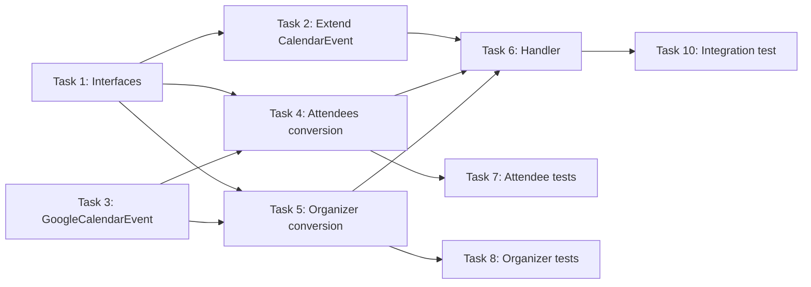

# Calendar RSVP Support - Implementation Tasks

> **Last Updated**: 2026-01-17
> **Status**: Draft
> **Feature**: calendar-rsvp-support
> **Requirements**: [requirements.md](./requirements.md)
> **Design**: [design.md](./design.md)

## Overview

This document breaks down the calendar RSVP support feature into atomic, implementable tasks. Each task is designed to be completable in 15-30 minutes and touches 1-3 files maximum.

## Task Summary

| Task | Description | Files | Refs |
|------|-------------|-------|------|
| 1 | Add AttendeeInfo and OrganizerInfo interfaces | 1 | FR-1, FR-2 |
| 2 | Extend CalendarEvent interface | 2 | FR-3, US-5 |
| 3 | Update GoogleCalendarEvent attendees type | 1 | FR-4 |
| 4 | Update convertGoogleToCalendarEvent for attendees | 1 | FR-1, FR-4 |
| 5 | Update convertGoogleToCalendarEvent for organizer | 1 | FR-2, FR-4 |
| 6 | Update handleListCalendarEvents response mapping | 1 | FR-3 |
| 7 | Add unit tests for AttendeeInfo conversion | 1 | ATS-1, ATS-3, ATS-4 |
| 8 | Add unit tests for OrganizerInfo conversion | 1 | ATS-2 |
| 9 | Add unit tests for EventKit graceful handling | 1 | ATS-5, FR-5 |
| 10 | Add integration test for list_calendar_events | 1 | FR-3 |

---

## Task 1: Add AttendeeInfo and OrganizerInfo Interfaces

**References**: FR-1, FR-2, US-1, US-2, US-3, US-4

### Description
Create new TypeScript interfaces for extended attendee information with RSVP status and organizer information.

### Files to Modify
- `src/types/calendar.ts`

### Implementation Details

1. Add `AttendeeInfo` interface with fields:
   - `email: string` (required)
   - `displayName?: string`
   - `responseStatus: 'accepted' | 'declined' | 'tentative' | 'needsAction'` (required)
   - `optional?: boolean`
   - `self?: boolean`
   - `comment?: string`

2. Add `OrganizerInfo` interface with fields:
   - `email: string` (required)
   - `displayName?: string`
   - `self?: boolean`

3. Export both interfaces

### Acceptance Criteria
- [ ] `AttendeeInfo` interface is defined and exported
- [ ] `OrganizerInfo` interface is defined and exported
- [ ] JSDoc comments reference requirements (FR-1, FR-2)
- [ ] TypeScript compiles without errors

---

## Task 2: Extend CalendarEvent Interface

**References**: FR-3, US-5

### Description
Add `organizer` and `attendeesDetailed` optional fields to the CalendarEvent interface for backward compatibility.

### Files to Modify
- `src/types/calendar.ts`
- `src/types/google-calendar-types.ts` (if has separate CalendarEvent definition)

### Implementation Details

1. In `src/types/calendar.ts`, add to `CalendarEvent` interface:
   ```typescript
   organizer?: OrganizerInfo;
   attendeesDetailed?: AttendeeInfo[];
   ```

2. If `src/types/google-calendar-types.ts` has its own `CalendarEvent` interface, add the same fields there

3. Keep existing `attendees?: string[]` for now (backward compatibility)

### Acceptance Criteria
- [ ] `CalendarEvent` interface has `organizer?: OrganizerInfo` field
- [ ] `CalendarEvent` interface has `attendeesDetailed?: AttendeeInfo[]` field
- [ ] Both fields are optional (backward compatible)
- [ ] TypeScript compiles without errors

---

## Task 3: Update GoogleCalendarEvent Attendees Type

**References**: FR-4

### Description
Ensure the `GoogleCalendarEvent` interface's `attendees` array includes all necessary fields from Google Calendar API.

### Files to Modify
- `src/types/google-calendar-types.ts`

### Implementation Details

1. Update the `attendees` field type in `GoogleCalendarEvent`:
   ```typescript
   attendees?: Array<{
     email: string;
     displayName?: string;
     responseStatus?: 'needsAction' | 'declined' | 'tentative' | 'accepted';
     optional?: boolean;
     self?: boolean;
     comment?: string;
   }>;
   ```

2. Ensure `organizer` field includes `self` flag:
   ```typescript
   organizer?: {
     email: string;
     displayName?: string;
     self?: boolean;
   };
   ```

### Acceptance Criteria
- [ ] `GoogleCalendarEvent.attendees` includes displayName, optional, self, comment fields
- [ ] `GoogleCalendarEvent.organizer` includes self field
- [ ] TypeScript compiles without errors

---

## Task 4: Update convertGoogleToCalendarEvent for Attendees

**References**: FR-1, FR-4, US-1, US-3, US-4

### Description
Modify the `convertGoogleToCalendarEvent` function to map attendee information with RSVP status to the new `attendeesDetailed` field.

### Files to Modify
- `src/types/google-calendar-types.ts`

### Implementation Details

1. Locate `convertGoogleToCalendarEvent` function (around line 373)

2. Add attendee mapping logic:
   ```typescript
   const attendeesDetailed: AttendeeInfo[] | undefined = googleEvent.attendees?.map(
     (attendee) => ({
       email: attendee.email,
       displayName: attendee.displayName,
       responseStatus: attendee.responseStatus || 'needsAction',
       optional: attendee.optional,
       self: attendee.self,
       comment: attendee.comment,
     })
   );
   ```

3. Add `attendeesDetailed` to the returned object

4. Import `AttendeeInfo` type if needed

### Acceptance Criteria
- [ ] `convertGoogleToCalendarEvent` returns `attendeesDetailed` field
- [ ] Each attendee has `responseStatus` (defaults to 'needsAction' if missing)
- [ ] Optional fields (displayName, optional, self, comment) are included when present
- [ ] Function handles undefined/null attendees gracefully

---

## Task 5: Update convertGoogleToCalendarEvent for Organizer

**References**: FR-2, FR-4, US-2

### Description
Modify the `convertGoogleToCalendarEvent` function to map organizer information to the new `organizer` field.

### Files to Modify
- `src/types/google-calendar-types.ts`

### Implementation Details

1. In `convertGoogleToCalendarEvent` function, add organizer mapping:
   ```typescript
   const organizer: OrganizerInfo | undefined = googleEvent.organizer
     ? {
         email: googleEvent.organizer.email,
         displayName: googleEvent.organizer.displayName,
         self: googleEvent.organizer.self,
       }
     : undefined;
   ```

2. Add `organizer` to the returned object

3. Import `OrganizerInfo` type if needed

### Acceptance Criteria
- [ ] `convertGoogleToCalendarEvent` returns `organizer` field
- [ ] Organizer includes email, displayName, self when available
- [ ] Function handles missing organizer gracefully (returns undefined)

---

## Task 6: Update handleListCalendarEvents Response Mapping

**References**: FR-3

### Description
Update the `handleListCalendarEvents` handler to include `organizer` and `attendees` in the response mapping.

### Files to Modify
- `src/tools/calendar/handlers.ts`

### Implementation Details

1. Locate `handleListCalendarEvents` function (around line 379)

2. Find the response mapping (around line 450-461):
   ```typescript
   events: events.map((event) => ({
     // ... existing fields ...
   }))
   ```

3. Add new fields to the mapping:
   ```typescript
   events: events.map((event) => ({
     id: event.id,
     title: event.title,
     // ... existing fields ...
     organizer: event.organizer,
     attendees: event.attendeesDetailed,  // Map to 'attendees' in response
   }))
   ```

### Acceptance Criteria
- [ ] Response includes `organizer` field from CalendarEvent
- [ ] Response includes `attendees` field (mapped from `attendeesDetailed`)
- [ ] Existing response fields are unchanged
- [ ] Handler compiles without errors

---

## Task 7: Add Unit Tests for AttendeeInfo Conversion

**References**: ATS-1, ATS-3, ATS-4

### Description
Add unit tests for the attendee conversion logic in `convertGoogleToCalendarEvent`.

### Files to Modify
- `tests/unit/google-calendar-types.test.ts` (or create new test file)

### Implementation Details

1. Add test case for multiple attendees with different statuses (ATS-1):
   ```typescript
   it('should convert attendees with different responseStatus values', () => {
     const googleEvent = createMockGoogleEvent({
       attendees: [
         { email: 'a@test.com', responseStatus: 'accepted' },
         { email: 'b@test.com', responseStatus: 'declined' },
         { email: 'c@test.com', responseStatus: 'needsAction' },
       ]
     });
     const result = convertGoogleToCalendarEvent(googleEvent);
     expect(result.attendeesDetailed).toHaveLength(3);
     // ... verify each status
   });
   ```

2. Add test case for self identification (ATS-3):
   ```typescript
   it('should mark self attendee with self: true', () => {
     // ...
   });
   ```

3. Add test case for optional attendees (ATS-4):
   ```typescript
   it('should distinguish required vs optional attendees', () => {
     // ...
   });
   ```

4. Add test case for events without attendees

### Acceptance Criteria
- [ ] Test for multiple attendees with different RSVP statuses
- [ ] Test for self identification (`self: true`)
- [ ] Test for optional vs required attendees
- [ ] Test for events without attendees (undefined/empty)
- [ ] All tests pass

---

## Task 8: Add Unit Tests for OrganizerInfo Conversion

**References**: ATS-2

### Description
Add unit tests for the organizer conversion logic in `convertGoogleToCalendarEvent`.

### Files to Modify
- `tests/unit/google-calendar-types.test.ts`

### Implementation Details

1. Add test case for organizer information (ATS-2):
   ```typescript
   it('should convert organizer information', () => {
     const googleEvent = createMockGoogleEvent({
       organizer: {
         email: 'org@test.com',
         displayName: 'Organizer Name',
         self: false
       }
     });
     const result = convertGoogleToCalendarEvent(googleEvent);
     expect(result.organizer).toEqual({
       email: 'org@test.com',
       displayName: 'Organizer Name',
       self: false
     });
   });
   ```

2. Add test case for self as organizer:
   ```typescript
   it('should identify self as organizer', () => {
     // organizer.self: true
   });
   ```

3. Add test case for events without organizer

### Acceptance Criteria
- [ ] Test for organizer with all fields
- [ ] Test for self as organizer (`self: true`)
- [ ] Test for events without organizer
- [ ] All tests pass

---

## Task 9: Add Unit Tests for EventKit Graceful Handling

**References**: ATS-5, FR-5

### Description
Add unit tests to verify EventKit events are handled gracefully without attendee data.

### Files to Modify
- `tests/unit/calendar-service.test.ts` (or appropriate test file)

### Implementation Details

1. Add test case for EventKit event without attendees:
   ```typescript
   it('should handle EventKit events without attendee data', () => {
     const eventKitEvent = createMockEventKitEvent({
       // No attendees field
     });
     // Verify no error thrown
     // Verify attendeesDetailed is undefined or empty
   });
   ```

2. Ensure the conversion/handling doesn't throw errors

### Acceptance Criteria
- [ ] Test for EventKit event without attendees
- [ ] No errors thrown when attendee data is missing
- [ ] `attendeesDetailed` is undefined or empty array for EventKit events
- [ ] All tests pass

---

## Task 10: Add Integration Test for list_calendar_events

**References**: FR-3

### Description
Add integration test to verify the full flow of `list_calendar_events` including RSVP data.

### Files to Modify
- `tests/integration/calendar-rsvp.test.ts` (create new file)

### Implementation Details

1. Create integration test file

2. Mock Google Calendar API response with attendees:
   ```typescript
   describe('list_calendar_events with RSVP', () => {
     it('should include attendee RSVP status in response', async () => {
       // Setup mock
       // Call handleListCalendarEvents
       // Verify response structure
       // Verify attendees array with responseStatus
       // Verify organizer object
     });
   });
   ```

3. Test the complete data flow from API to response

### Acceptance Criteria
- [ ] Integration test created
- [ ] Test verifies attendees with responseStatus in response
- [ ] Test verifies organizer in response
- [ ] Test passes

---

## Implementation Order

Recommended execution sequence:

```
Phase 1: Type Definitions (Tasks 1-3)
├── Task 1: Add interfaces
├── Task 2: Extend CalendarEvent
└── Task 3: Update GoogleCalendarEvent

Phase 2: Conversion Logic (Tasks 4-5)
├── Task 4: Attendees conversion
└── Task 5: Organizer conversion

Phase 3: Handler Update (Task 6)
└── Task 6: Response mapping

Phase 4: Testing (Tasks 7-10)
├── Task 7: Attendee tests
├── Task 8: Organizer tests
├── Task 9: EventKit tests
└── Task 10: Integration test
```

## Dependencies



## Progress Tracking

- [ ] Task 1: Add AttendeeInfo and OrganizerInfo interfaces
- [ ] Task 2: Extend CalendarEvent interface
- [ ] Task 3: Update GoogleCalendarEvent attendees type
- [ ] Task 4: Update convertGoogleToCalendarEvent for attendees
- [ ] Task 5: Update convertGoogleToCalendarEvent for organizer
- [ ] Task 6: Update handleListCalendarEvents response mapping
- [ ] Task 7: Add unit tests for AttendeeInfo conversion
- [ ] Task 8: Add unit tests for OrganizerInfo conversion
- [ ] Task 9: Add unit tests for EventKit graceful handling
- [ ] Task 10: Add integration test for list_calendar_events
