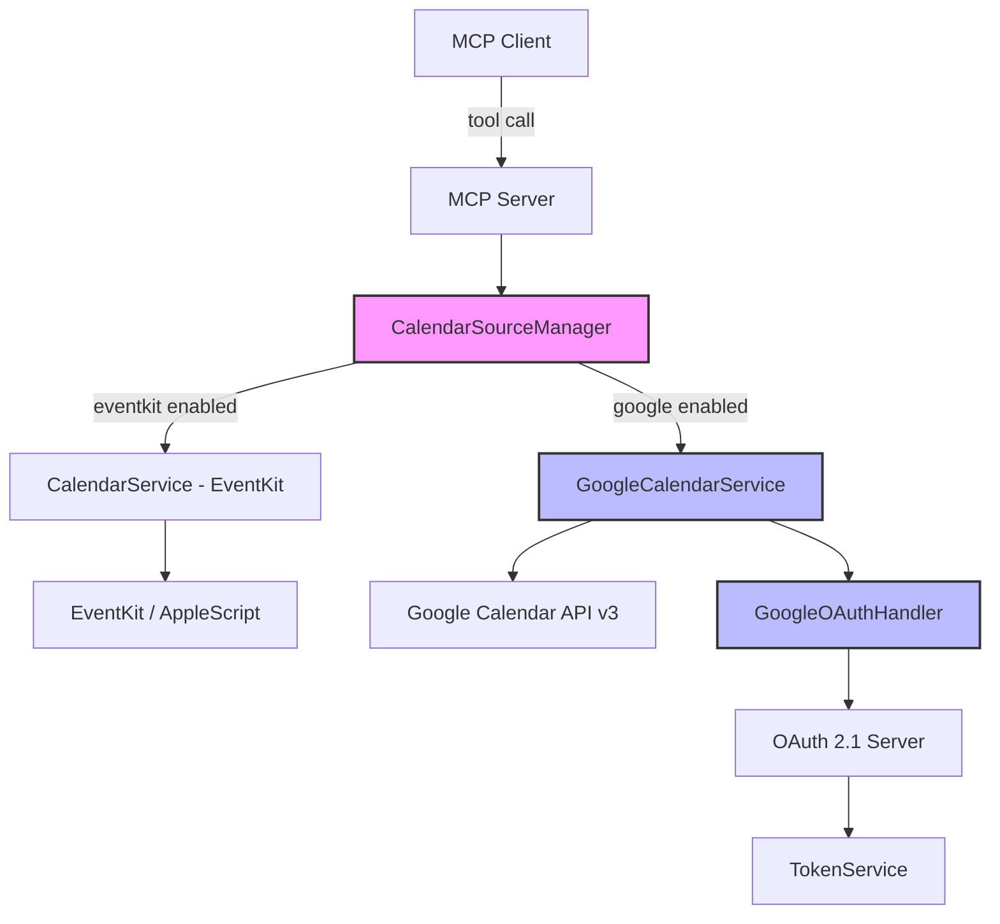
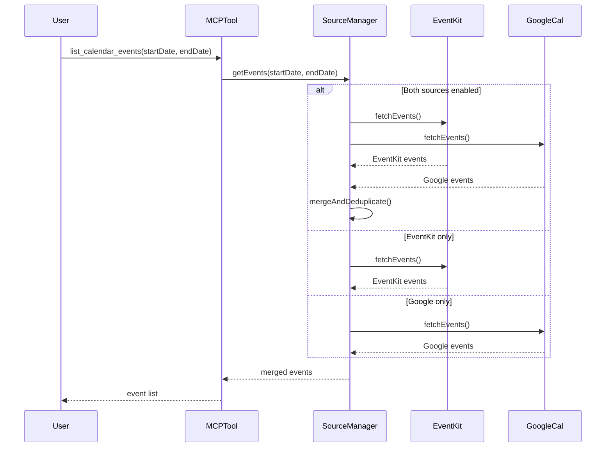
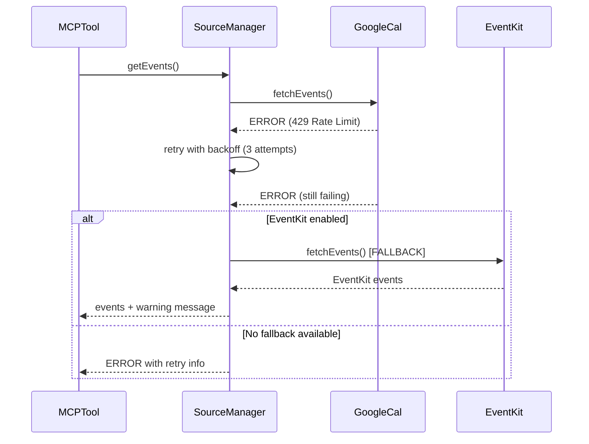
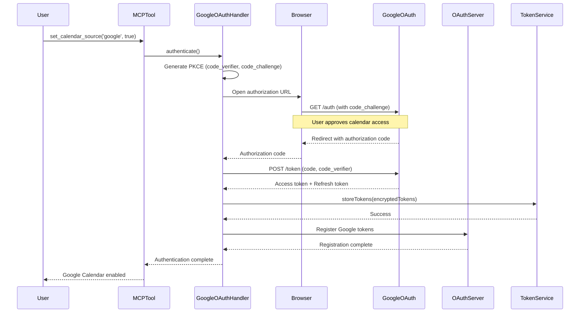
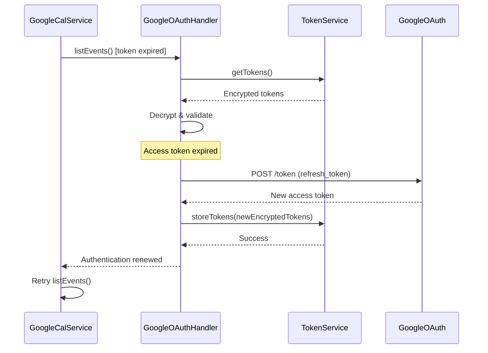

# Design Document: Google Calendar API Integration

## Overview

Google Calendar API統合は、Sageの既存EventKitカレンダー統合を補完し、ユーザーがEventKit、Google Calendar、または両方を選択可能にする機能です。プラットフォーム検出による自動ソース選択、エラー時の自動フォールバック、統一されたMCPツールインターフェースを提供します。

**主要な設計目標**:
1. **既存アーキテクチャの再利用**: OAuth 2.1サーバー、TokenService、Retry Utility、MCPツールパターンを活用
2. **最小限の変更**: 既存CalendarServiceを拡張し、破壊的変更を避ける
3. **プラットフォーム抽象化**: `detectPlatform()` パターンを活用して、どのプラットフォームでも動作
4. **透過的なフォールバック**: ユーザーが意識せずに複数ソースを利用

## Steering Document Alignment

### Technical Standards (tech.md)

**TypeScript Strict Mode**:
- すべての新規コードはTypeScript strict modeに準拠
- Zodバリデーションで実行時型安全性を確保

**既存パターンの踏襲**:
- **リトライロジック**: `src/utils/retry.ts` の `retryWithBackoff()` を使用
- **プラットフォーム検出**: `src/integrations/calendar-service.ts` の `detectPlatform()` パターンを拡張
- **OAuth認証**: `src/oauth/` の既存実装を拡張
- **MCPツール定義**: `src/index.ts` のツールパターンに従う

### Project Structure (structure.md)

**ファイル配置**:
```
src/
├── integrations/
│   ├── calendar-service.ts (既存 - 拡張)
│   ├── google-calendar-service.ts (新規)
│   └── calendar-source-manager.ts (新規)
├── oauth/
│   ├── oauth-server.ts (既存 - Google スコープ追加)
│   └── google-oauth-handler.ts (新規)
├── types/
│   └── google-calendar-types.ts (新規)
└── index.ts (既存 - MCPツール拡張)
```

## Code Reuse Analysis

### Existing Components to Leverage

#### 1. **OAuth 2.1 Server** (`src/oauth/oauth-server.ts`)
- **再利用内容**: 認可フロー、トークン管理、リフレッシュローテーション
- **拡張方法**: Google Calendar APIスコープを追加、Google OAuth同意画面への対応

#### 2. **TokenService** (`src/oauth/token-service.ts`)
- **再利用内容**: JWT生成/検証、トークン暗号化保存
- **拡張方法**: Google OAuth トークンの保存・取得インターフェース追加

#### 3. **Retry Utility** (`src/utils/retry.ts`)
- **再利用内容**: 指数バックオフリトライロジック、エラー判定
- **拡張方法**: Google API特有のエラーコード（429, 401, 500, 503）への対応

#### 4. **Calendar Service** (`src/integrations/calendar-service.ts`)
- **再利用内容**: プラットフォーム検出、イベントデータモデル、空き時間スロット計算
- **拡張方法**: 複数ソース集約、フォールバック機能追加

#### 5. **MCP Tool Patterns** (`src/index.ts`)
- **再利用内容**: ツール定義パターン、Zodスキーマバリデーション
- **拡張方法**: 既存ツールにソース選択パラメータ追加（オプション）

### Integration Points

#### **Google Calendar API v3**
- **googleapis** npm パッケージ (v134.0.0)
- RESTful API経由でイベントCRUD操作
- OAuth 2.0認証（既存OAuthサーバーと統合）

#### **既存Config管理** (`~/.sage/config.json`)
- 新規設定セクション `calendar.sources` を追加
- 既存設定読み込み/検証ロジックを拡張

#### **既存MCPツール**
- `list_calendar_events` - Google Calendarイベントも含める
- `find_available_slots` - 複数ソースのイベント集約
- 新規ツール: `list_calendar_sources`, `set_calendar_source`

## Architecture

### High-Level Architecture



### Component Interaction Flow

**イベント取得フロー**:


**エラーフォールバックフロー**:


**Google OAuth統合フロー**:


**トークンリフレッシュフロー**:


## Components and Interfaces

### 1. GoogleCalendarService

**Purpose**: Google Calendar API v3との統合、イベントCRUD操作

**Interfaces**:
```typescript
interface ListEventsRequest {
  startDate: string       // ISO 8601
  endDate: string         // ISO 8601
  calendarId?: string     // カレンダーID（オプション、指定時は特定カレンダーのみ取得）
}

class GoogleCalendarService {
  // 認証
  async authenticate(): Promise<void>
  async refreshToken(): Promise<void>

  // イベント操作
  async listEvents(request: ListEventsRequest): Promise<CalendarEvent[]>
  async createEvent(request: CreateEventRequest, calendarId?: string): Promise<CalendarEvent>
  async updateEvent(eventId: string, updates: Partial<CreateEventRequest>): Promise<CalendarEvent>
  async deleteEvent(eventId: string): Promise<void>
  async deleteEventsBatch(eventIds: string[]): Promise<{ deleted: number }>

  // 招待返信
  async respondToEvent(eventId: string, response: 'accepted' | 'declined' | 'tentative'): Promise<void>

  // カレンダー一覧
  async listCalendars(): Promise<CalendarInfo[]>

  // ヘルスチェック
  async isAvailable(): Promise<boolean>
}
```

**Dependencies**:
- `googleapis` パッケージ
- `GoogleOAuthHandler` (認証)
- `retryWithBackoff` (リトライロジック)

**Reuses**:
- 既存 `CalendarEvent` データモデル
- 既存 `ListEventsRequest` / `CreateEventRequest` 型定義

---

### 2. CalendarSourceManager

**Purpose**: 複数カレンダーソースの管理、自動選択、フォールバック

**Interfaces**:
```typescript
interface FindSlotsRequest {
  startDate: string
  endDate: string
  minDurationMinutes?: number      // 最小期間（デフォルト: 25分）
  maxDurationMinutes?: number      // 最大期間（デフォルト: 480分 = 8時間）
  workingHours?: {                 // 作業時間帯（オプション、config.jsonから取得）
    start: string  // HH:MM
    end: string    // HH:MM
  }
}

class CalendarSourceManager {
  // ソース管理
  async detectAvailableSources(): Promise<{ eventkit: boolean; google: boolean }>
  async enableSource(source: 'eventkit' | 'google'): Promise<void>
  async disableSource(source: 'eventkit' | 'google'): Promise<void>
  getEnabledSources(): ('eventkit' | 'google')[]

  // イベント操作（統合）
  async getEvents(startDate: string, endDate: string, calendarId?: string): Promise<CalendarEvent[]>
  async createEvent(request: CreateEventRequest, preferredSource?: 'eventkit' | 'google'): Promise<CalendarEvent>
  async deleteEvent(eventId: string, source?: 'eventkit' | 'google'): Promise<void>

  // 空き時間スロット（既存CalendarService.findAvailableSlots()を拡張）
  async findAvailableSlots(request: FindSlotsRequest): Promise<AvailableSlot[]>

  // 同期（両方有効な場合のみ）
  async syncCalendars(): Promise<SyncResult>
  async getSyncStatus(): Promise<SyncStatus>

  // ヘルスチェック
  async healthCheck(): Promise<{ eventkit: boolean; google: boolean }>
}
```

**Dependencies**:
- `CalendarService` (EventKit)
- `GoogleCalendarService` (Google Calendar)
- Config management

**Reuses**:
- 既存 `detectPlatform()` ロジック
- 既存 `AvailableSlot` データモデル

**Key Logic**:
- **イベント重複排除**: iCalUID、タイトル+時間マッチングで重複検出
- **フォールバック優先度**: 設定順序またはプラットフォームデフォルト
- **空き時間スロット検出の統合**:
  1. 有効なソース（EventKit、Google、または両方）から全イベントを取得
  2. イベントをマージし、重複を排除
  3. 既存 `CalendarService.findAvailableSlots()` のロジックを活用：
     - 作業時間帯内でスロット検出
     - `minDurationMinutes`/`maxDurationMinutes` でフィルタ
     - `calculateSuitability()` で深い作業日/会議の多い日を考慮
  4. 統合されたイベントリストから空き時間を計算
  5. `AvailableSlot[]` を返す（既存フォーマット維持）

---

### 3. GoogleOAuthHandler

**Purpose**: Google OAuth 2.0フローの管理、トークン交換

**Interfaces**:
```typescript
class GoogleOAuthHandler {
  // OAuth フロー
  async getAuthorizationUrl(redirectUri: string): Promise<string>
  async exchangeCodeForTokens(code: string, redirectUri: string): Promise<OAuthTokens>
  async refreshAccessToken(refreshToken: string): Promise<OAuthTokens>

  // トークン管理
  async storeTokens(tokens: OAuthTokens): Promise<void>
  async getTokens(): Promise<OAuthTokens | null>
  async revokeTokens(): Promise<void>

  // 検証
  async validateToken(accessToken: string): Promise<boolean>
}

interface OAuthTokens {
  accessToken: string
  refreshToken: string
  expiresAt: string
  scope: string[]
}
```

**Dependencies**:
- `googleapis.auth.OAuth2Client`
- `TokenService` (暗号化保存)
- Config management

**Reuses**:
- 既存 `OAuthServer` のメタデータエンドポイント
- 既存 `TokenService` の暗号化/復号化ロジック

---

### 4. Config Extension

**Purpose**: カレンダーソース設定の管理

**New Config Structure**:
```typescript
interface SageConfig {
  // ... existing config ...

  calendar?: {
    sources: {
      eventkit: {
        enabled: boolean
      }
      google: {
        enabled: boolean
        defaultCalendar: string          // "primary" or calendar ID
        excludedCalendars: string[]      // calendar IDs to exclude
        syncInterval: number              // seconds
        enableNotifications: boolean
      }
    }
  }
}
```

**Validation** (Zod):
```typescript
const CalendarConfigSchema = z.object({
  sources: z.object({
    eventkit: z.object({
      enabled: z.boolean()
    }),
    google: z.object({
      enabled: z.boolean(),
      defaultCalendar: z.string().default('primary'),
      excludedCalendars: z.array(z.string()).default([]),
      syncInterval: z.number().min(60).max(3600).default(300),
      enableNotifications: z.boolean().default(true)
    })
  }).refine(
    data => data.eventkit.enabled || data.google.enabled,
    { message: 'At least one calendar source must be enabled' }
  )
})
```

**Reuses**:
- 既存 `ConfigManager` クラス
- 既存 Zod バリデーションパターン

---

### 5. MCP Tools Interface

**Purpose**: ユーザー向けの統一されたMCPツールインターフェース

#### 既存ツールの拡張

**`list_calendar_events`** (既存 - 拡張):
```typescript
server.tool(
  "list_calendar_events",
  "List calendar events from enabled sources (EventKit, Google Calendar, or both)",
  {
    startDate: z.string().describe("Start date (ISO 8601)"),
    endDate: z.string().describe("End date (ISO 8601)"),
    calendarId: z.string().optional().describe("Specific calendar ID (optional)")
  },
  async ({ startDate, endDate, calendarId }) => {
    // CalendarSourceManagerを使用して、有効なソースからイベント取得
    const manager = new CalendarSourceManager()
    const events = await manager.getEvents(startDate, endDate, calendarId)
    return { events }
  }
)
```

**変更内容**:
- `calendarId` パラメータ追加（オプション）
- 内部実装を `CalendarService` → `CalendarSourceManager` に変更
- 複数ソースのイベントを自動的にマージ

---

**`find_available_slots`** (既存 - 拡張):
```typescript
server.tool(
  "find_available_slots",
  "Find available time slots considering all enabled calendar sources",
  {
    startDate: z.string().describe("Search start date (ISO 8601)"),
    endDate: z.string().describe("Search end date (ISO 8601)"),
    minDurationMinutes: z.number().optional().describe("Minimum slot duration (default: 25)"),
    maxDurationMinutes: z.number().optional().describe("Maximum slot duration (default: 480)")
  },
  async ({ startDate, endDate, minDurationMinutes, maxDurationMinutes }) => {
    const manager = new CalendarSourceManager()
    const slots = await manager.findAvailableSlots({
      startDate,
      endDate,
      minDurationMinutes,
      maxDurationMinutes
    })
    return { slots }
  }
)
```

**変更内容**:
- `minDurationMinutes`/`maxDurationMinutes` パラメータ追加
- 内部実装を `CalendarService` → `CalendarSourceManager` に変更
- 複数ソースのイベントを考慮した空き時間検出

---

#### 新規ツール

**`list_calendar_sources`** (新規):
```typescript
server.tool(
  "list_calendar_sources",
  "List available and enabled calendar sources (EventKit, Google Calendar)",
  {},
  async () => {
    const manager = new CalendarSourceManager()
    const available = await manager.detectAvailableSources()
    const enabled = manager.getEnabledSources()
    const health = await manager.healthCheck()

    return {
      sources: {
        eventkit: {
          available: available.eventkit,
          enabled: enabled.includes('eventkit'),
          healthy: health.eventkit
        },
        google: {
          available: available.google,
          enabled: enabled.includes('google'),
          healthy: health.google
        }
      }
    }
  }
)
```

---

**`set_calendar_source`** (新規):
```typescript
server.tool(
  "set_calendar_source",
  "Enable or disable a calendar source (EventKit or Google Calendar)",
  {
    source: z.enum(['eventkit', 'google']).describe("Calendar source to configure"),
    enabled: z.boolean().describe("Enable (true) or disable (false)")
  },
  async ({ source, enabled }) => {
    const manager = new CalendarSourceManager()

    if (enabled) {
      await manager.enableSource(source)
    } else {
      await manager.disableSource(source)
    }

    // 設定を保存
    const config = await ConfigManager.load()
    config.calendar.sources[source].enabled = enabled
    await ConfigManager.save(config)

    return {
      success: true,
      source,
      enabled,
      message: `${source} calendar source ${enabled ? 'enabled' : 'disabled'}`
    }
  }
)
```

---

**`sync_calendar_sources`** (新規 - オプション):
```typescript
server.tool(
  "sync_calendar_sources",
  "Manually sync between EventKit and Google Calendar (requires both sources enabled)",
  {},
  async () => {
    const manager = new CalendarSourceManager()
    const sources = manager.getEnabledSources()

    if (sources.length < 2) {
      return {
        error: true,
        message: 'Both EventKit and Google Calendar must be enabled for sync'
      }
    }

    const result = await manager.syncCalendars()
    return result
  }
)
```

---

**`get_calendar_sync_status`** (新規 - オプション):
```typescript
server.tool(
  "get_calendar_sync_status",
  "Get sync status between calendar sources",
  {},
  async () => {
    const manager = new CalendarSourceManager()
    const status = await manager.getSyncStatus()
    return status
  }
)
```

---

#### 既存ツールの後方互換性

**戦略**:
1. **既存ツールは破壊的変更なし**: `list_calendar_events`, `create_calendar_event`, `delete_calendar_event` などは既存シグネチャを維持
2. **内部実装のみ変更**: `CalendarService` を直接使用していた部分を `CalendarSourceManager` に置き換え
3. **デフォルト動作**: EventKitのみ有効な場合は既存と同じ動作（EventKitイベントのみ取得）
4. **オプトイン**: Google Calendarを有効化すると、自動的に両方のイベントが統合される

**移行パス**:
```typescript
// Before (既存実装)
const calendarService = new CalendarService()
const events = await calendarService.listEvents({ startDate, endDate })

// After (新実装)
const sourceManager = new CalendarSourceManager()
const events = await sourceManager.getEvents(startDate, endDate)
// ↑ 内部で CalendarService (EventKit) と GoogleCalendarService を統合
```

## Data Models

### CalendarEvent (既存 - 再利用)

```typescript
interface CalendarEvent {
  id: string                  // UID (EventKit) or Event ID (Google)
  title: string
  start: string              // ISO 8601
  end: string                // ISO 8601
  isAllDay: boolean
  source: 'eventkit' | 'google'  // 拡張: ソース識別子
  calendar?: string          // カレンダー名/ID
  location?: string
  description?: string
  attendees?: string[]       // 新規追加
  status?: 'confirmed' | 'tentative' | 'cancelled'  // 新規追加
}
```

### GoogleCalendarEvent (内部)

```typescript
interface GoogleCalendarEvent {
  id: string
  summary: string
  description?: string
  location?: string
  start: {
    dateTime?: string       // ISO 8601 (with time)
    date?: string           // YYYY-MM-DD (all-day)
    timeZone?: string
  }
  end: {
    dateTime?: string
    date?: string
    timeZone?: string
  }
  attendees?: Array<{
    email: string
    responseStatus: 'needsAction' | 'declined' | 'tentative' | 'accepted'
  }>
  reminders?: {
    useDefault: boolean
    overrides?: Array<{
      method: 'email' | 'popup'
      minutes: number
    }>
  }
  recurringEventId?: string
  iCalUID: string            // 重複検出に使用
}
```

**Conversion**: `GoogleCalendarEvent` → `CalendarEvent`
```typescript
function convertGoogleToCalendarEvent(googleEvent: GoogleCalendarEvent): CalendarEvent {
  return {
    id: googleEvent.id,
    title: googleEvent.summary,
    start: googleEvent.start.dateTime || googleEvent.start.date,
    end: googleEvent.end.dateTime || googleEvent.end.date,
    isAllDay: !!googleEvent.start.date,
    source: 'google',
    calendar: googleEvent.organizer?.email,
    location: googleEvent.location,
    description: googleEvent.description,
    attendees: googleEvent.attendees?.map(a => a.email),
    status: googleEvent.status
  }
}
```

### CalendarInfo

```typescript
interface CalendarInfo {
  id: string
  name: string
  source: 'eventkit' | 'google'
  isPrimary: boolean
  color?: string
  accessRole?: 'owner' | 'writer' | 'reader'
}
```

### SyncResult

```typescript
interface SyncResult {
  success: boolean
  eventsAdded: number
  eventsUpdated: number
  eventsDeleted: number
  conflicts: Array<{
    eventId: string
    reason: string
    resolution: 'skipped' | 'merged' | 'duplicated'
  }>
  errors: Array<{
    source: 'eventkit' | 'google'
    error: string
  }>
  timestamp: string
}
```

### SyncStatus

```typescript
interface SyncStatus {
  lastSyncTime?: string
  nextSyncTime?: string
  isEnabled: boolean
  sources: {
    eventkit: { available: boolean; lastError?: string }
    google: { available: boolean; lastError?: string }
  }
}
```

---

### Event Deduplication Strategy

**目的**: EventKitとGoogle Calendarで同じイベントが重複することを防ぐ

**重複検出ロジック**:
```typescript
function areEventsDuplicate(event1: CalendarEvent, event2: CalendarEvent): boolean {
  // Method 1: iCalUID比較（最も信頼性が高い）
  if (event1.iCalUID && event2.iCalUID && event1.iCalUID === event2.iCalUID) {
    return true
  }

  // Method 2: タイトル + 開始時刻マッチング
  const titleMatch = event1.title.toLowerCase() === event2.title.toLowerCase()
  const startMatch = event1.start === event2.start
  const endMatch = event1.end === event2.end

  return titleMatch && startMatch && endMatch
}
```

**UID Mapping Table**:

| Source | UID Field | Format | 例 |
|--------|----------|--------|---|
| **EventKit** | `uid` | UUID形式 | `550e8400-e29b-41d4-a716-446655440000` |
| **Google Calendar** | `iCalUID` | iCalendar UID | `abc123@google.com` |
| **Google Calendar** | `id` | Google Event ID | `abc123def456ghi789` |

**EventKit iCalUID Support**:
- EventKitは`iCalUID`プロパティをサポート（macOS 10.8+）
- AppleScriptObjCで取得: `event's |iCalendarUID|()`
- 既存実装では取得していないため、**CalendarServiceに追加が必要**

**実装追加**:
```typescript
// src/integrations/calendar-service.ts
// fetchEvents() メソッド内で iCalUID を取得
const script = `
  tell application "Calendar"
    repeat with anEvent in (every event of calendar "${calendarName}" ...)
      set eventUID to iCalendarUID of anEvent
      -- 既存の id|title|start|end に加えて uid を追加
    end repeat
  end tell
`
```

---

## Migration and Impact Analysis

### Existing Code Changes

**1. CalendarService (src/integrations/calendar-service.ts)**
- **変更内容**: `fetchEvents()` でiCalUIDを取得
- **影響範囲**: EventKitイベントの取得処理
- **後方互換性**: 既存の動作は変わらない（追加フィールドのみ）

**2. MCP Tools (src/index.ts)**
- **変更内容**: `CalendarService` → `CalendarSourceManager` への移行
- **影響範囲**: `list_calendar_events`, `find_available_slots` などのツール
- **後方互換性**: ツールシグネチャは変更なし、内部実装のみ変更

**3. CalendarEvent型 (src/integrations/calendar-service.ts)**
- **変更内容**:
  - `source: string` → `source: 'eventkit' | 'google'` (型を厳密化)
  - `attendees?: string[]` 追加
  - `status?: 'confirmed' | 'tentative' | 'cancelled'` 追加
  - `iCalUID?: string` 追加（重複検出用）
- **影響範囲**: CalendarEventを使用するすべてのコード
- **後方互換性**: 既存フィールドは変更なし、新規フィールドはオプション

### Migration Checklist

**Phase 1: Foundation (破壊的変更なし)**
- [ ] `GoogleCalendarService` 実装
- [ ] `GoogleOAuthHandler` 実装
- [ ] `CalendarSourceManager` 実装（EventKitのみの動作確認）
- [ ] Config Extension（`calendar.sources`）追加

**Phase 2: Integration (内部実装変更)**
- [ ] `CalendarService.fetchEvents()` にiCalUID取得を追加
- [ ] `CalendarEvent` 型拡張（オプションフィールド追加）
- [ ] MCPツールを `CalendarSourceManager` に移行
- [ ] ユニットテスト更新

**Phase 3: Google Calendar Enablement**
- [ ] Google OAuth認証フロー実装
- [ ] Google Calendarイベント取得・作成・削除
- [ ] イベント重複検出ロジック
- [ ] 統合テスト

**Phase 4: Advanced Features**
- [ ] カレンダー同期機能（オプション）
- [ ] 新規MCPツール（`list_calendar_sources`, `set_calendar_source`）
- [ ] E2Eテスト

### Rollback Strategy

**万が一の問題発生時**:
1. Config で `calendar.sources.google.enabled = false` に設定
2. システムは自動的にEventKitのみに戻る
3. 既存データは影響を受けない（EventKitイベントは変更なし）

**データ整合性**:
- Google Calendar統合は既存EventKitデータに影響しない
- Google Calendarを無効化しても、EventKitイベントは引き続き利用可能

## Error Handling

### Error Scenarios

#### 1. **Google API Rate Limit (429)**
- **Handling**: `retryWithBackoff()` で最大3回リトライ、指数バックオフ + jitter
- **Fallback**: EventKit有効な場合は自動フォールバック
- **User Impact**: "Google Calendar is temporarily unavailable. Using EventKit as fallback."

#### 2. **OAuth Token Expired (401)**
- **Handling**: 自動でリフレッシュトークン使用、更新失敗時は再認証要求
- **User Impact**: "Please re-authenticate with Google Calendar"

#### 3. **Network Error (ECONNREFUSED, ETIMEDOUT)**
- **Handling**: `retryWithBackoff()` で3回リトライ
- **Fallback**: 他のソースにフォールバック
- **User Impact**: "Unable to reach Google Calendar. Please check your internet connection."

#### 4. **Invalid Calendar ID**
- **Handling**: Zodバリデーションでエラー、有効なカレンダーリスト提示
- **User Impact**: "Calendar 'invalid-id' not found. Available calendars: [list]"

#### 5. **Duplicate Event Detection**
- **Handling**: iCalUID比較、重複時は新しいイベントをスキップまたはマージ
- **User Impact**: "Event already exists in EventKit. Skipping."

#### 6. **Both Sources Disabled**
- **Handling**: 設定バリデーションで拒否、少なくとも1つ有効化を要求
- **User Impact**: "At least one calendar source must be enabled."

### Error Response Format

```typescript
interface ErrorResponse {
  error: true
  code: string
  message: string
  source?: 'eventkit' | 'google'
  retryable: boolean
  fallbackUsed?: boolean
  details?: Record<string, any>
}
```

## Testing Strategy

### Unit Testing

**GoogleCalendarService**:
- ✅ `listEvents()`: API呼び出しとレスポンスパース
- ✅ `createEvent()`: イベント作成とバリデーション
- ✅ `deleteEvent()`: 削除操作
- ✅ `respondToEvent()`: 招待返信
- ✅ トークンリフレッシュロジック
- ✅ エラーハンドリング（429, 401, 500）

**CalendarSourceManager**:
- ✅ `detectAvailableSources()`: プラットフォーム検出
- ✅ `getEvents()`: 複数ソース集約
- ✅ イベント重複排除ロジック
- ✅ フォールバックロジック
- ✅ 設定バリデーション

**GoogleOAuthHandler**:
- ✅ OAuth フロー（認可URL生成、トークン交換）
- ✅ トークン暗号化保存・取得
- ✅ リフレッシュトークン処理

**Mocking Strategy**:
```typescript
// Google Calendar API mock
jest.mock('googleapis', () => ({
  google: {
    calendar: jest.fn(() => ({
      events: {
        list: jest.fn().mockResolvedValue({ data: { items: [...] }}),
        insert: jest.fn().mockResolvedValue({ data: { id: '123' }}),
        delete: jest.fn().mockResolvedValue({}),
      },
      calendarList: {
        list: jest.fn().mockResolvedValue({ data: { items: [...] }})
      }
    }))
  }
}))
```

### Integration Testing

**End-to-End Flows**:
1. ✅ **OAuth認証フロー**: Google同意画面 → トークン取得 → 保存
2. ✅ **イベント取得（両方有効）**: EventKit + Google → マージ → 重複排除
3. ✅ **イベント作成（Google）**: createEvent → Google API → 成功レスポンス
4. ✅ **フォールバック**: Google失敗 → EventKitにフォールバック
5. ✅ **設定更新**: ソース有効/無効切り替え → 動作変更確認

**Test Fixtures**:
- Google Calendar APIレスポンスのサンプルJSON
- EventKitとGoogle両方のイベントデータセット
- 重複イベントのテストケース

### End-to-End Testing

**User Scenarios**:

1. **初回セットアップ（Linux）**:
   - システム起動 → EventKit無効検出 → Google Calendar認証プロンプト
   - OAuth完了 → トークン保存 → イベント取得成功

2. **マルチソース使用（macOS）**:
   - 両方有効 → 空き時間スロット検索 → 両方のイベント考慮
   - Google一時的障害 → EventKitにフォールバック → 警告表示

3. **カレンダー切り替え**:
   - EventKitのみ有効 → イベント作成（EventKit）
   - Google Calendarを有効化 → イベント作成（Google）

**Test Environment**:
- macOS: 実際のEventKit + Google Calendar API (test account)
- Linux CI: EventKitモック + Google Calendar API mock

## Performance Considerations

### Optimization Strategies

1. **並列API呼び出し**:
   ```typescript
   const [eventkitEvents, googleEvents] = await Promise.all([
     eventkitService.listEvents(request),
     googleService.listEvents(request)
   ])
   ```

2. **ページネーション**:
   - Google Calendar API: `maxResults=250`, `pageToken` で自動ページング
   - メモリ効率: ストリーミング処理で大量イベント対応

3. **キャッシング（オプション）**:
   - 短期間（5分）のイベントキャッシュでAPI呼び出し削減
   - 設定 `syncInterval` に基づく自動更新

4. **バッチ操作**:
   - Google Calendar Batch API利用（最大50操作/リクエスト）
   - `deleteEventsBatch()` で複数削除を1回のAPI呼び出しに集約

### Performance Targets

- ✅ イベント取得（30日間）: < 2秒
- ✅ イベント作成: < 1秒
- ✅ 空き時間スロット計算: < 3秒
- ✅ OAuth認証フロー: < 5秒

## Security Considerations

### Authentication & Authorization

1. **OAuth 2.0 with PKCE**:
   - Code Verifier/Challenge (S256) でCSRF攻撃防止
   - State parameterでセッション検証

2. **Token Storage**:
   - 既存 `TokenService` で暗号化保存
   - リフレッシュトークンの安全な管理

3. **Scope Minimization**:
   - `https://www.googleapis.com/auth/calendar` (read/write)
   - `https://www.googleapis.com/auth/calendar.readonly` (read-only option)

### Data Protection

1. **HTTPS Only**:
   - すべてのGoogle API通信はTLS 1.2+
   - 証明書検証強制

2. **Sensitive Data**:
   - イベント内容、参加者情報はローカルメモリのみ（永続化しない）
   - ログ出力時はPII（個人識別情報）をマスク

3. **Access Control**:
   - Remote MCP使用時はOAuth 2.1認証必須
   - ローカルMCPはファイルシステム権限に依存

## Deployment Considerations

### npm Dependencies

**新規追加**:
```json
{
  "googleapis": "^134.0.0"
}
```

### Configuration Migration

既存ユーザー向けの自動マイグレーション:
```typescript
function migrateConfig(oldConfig: any): SageConfig {
  if (!oldConfig.calendar) {
    oldConfig.calendar = {
      sources: {
        eventkit: { enabled: true },  // デフォルトで既存動作維持
        google: { enabled: false }    // 新機能はオプトイン
      }
    }
  }
  return oldConfig
}
```

### Environment Variables

```bash
# Google OAuth Credentials
GOOGLE_CLIENT_ID=your-client-id.apps.googleusercontent.com
GOOGLE_CLIENT_SECRET=your-client-secret

# Optional: Override default redirect URI
GOOGLE_REDIRECT_URI=http://localhost:3000/oauth/callback
```

### Platform-Specific Notes

- **macOS**: EventKit許可が必要（初回起動時にプロンプト）
- **Linux/Windows**: Google Calendar APIのみ利用可能
- **Remote MCP**: ホストのプラットフォームに依存

## Future Enhancements

### Phase 2 (Post-MVP)
- Google Meet リンク自動生成
- Googleカレンダー共有管理
- 添付ファイルサポート

### Phase 3 (Long-term)
- Google Tasks統合
- Outlook Calendar統合
- カレンダー分析・インサイト機能

---

**Design Version**: 1.0
**Last Updated**: 2026-01-03
**Status**: Ready for Review
