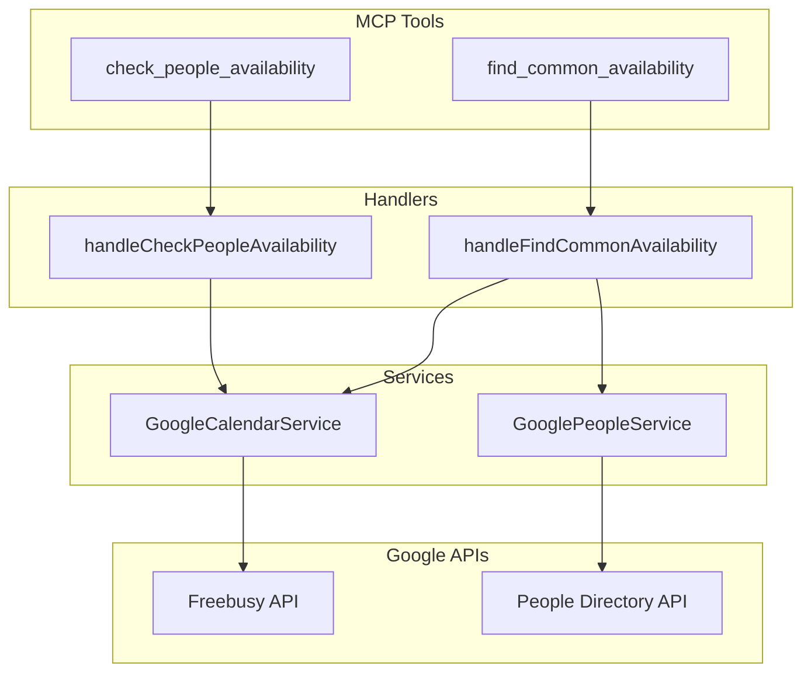
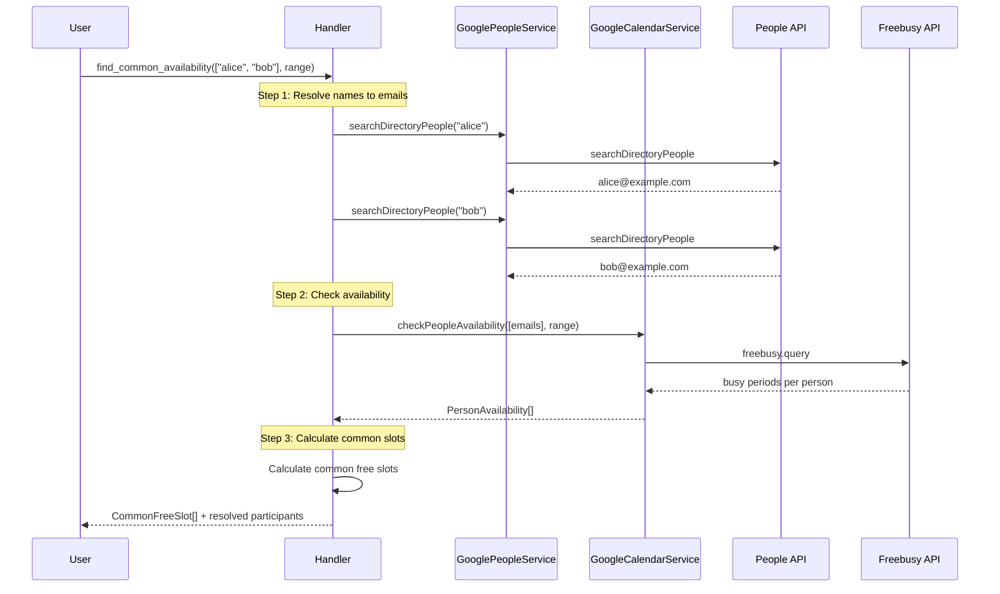

# Design Document: check-others-availability

## Overview

Google Calendar Freebusy API を使用して、複数ユーザーのカレンダー空き状況を確認する機能。既存の `GoogleCalendarService` と `GoogleCalendarRoomService` のパターンを踏襲し、2つの新しい MCP ツールを追加する。

## Steering Document Alignment

### Technical Standards (tech.md)
- TypeScript strict mode
- Zod による入力バリデーション
- retryWithBackoff による API リトライ
- 既存の GoogleCalendarService を拡張

### Project Structure (structure.md)
- サービス: `src/integrations/google-calendar-service.ts` に追加
- 型定義: `src/types/google-calendar-types.ts` に追加
- ツール定義: `src/tools/shared/` に新規ファイル
- ハンドラー: `src/tools/calendar/handlers.ts` に追加
- バリデーション: `src/config/validation.ts` に追加

## Code Reuse Analysis

### Existing Components to Leverage

| コンポーネント | 用途 |
|---------------|------|
| `GoogleCalendarService.getCalendarClient()` | 認証済み Calendar API クライアント取得 |
| `GoogleCalendarRoomService.queryFreebusy()` | Freebusy API クエリパターン（バッチ処理含む） |
| `GoogleCalendarRoomService.isRoomAvailable()` | 空き判定アルゴリズム |
| `GooglePeopleService.searchDirectoryPeople()` | ディレクトリ検索連携 |
| `retryWithBackoff()` | API リトライロジック |
| `calendarLogger` | ロギング |

### Integration Points
- `src/index.ts`: MCP ツール登録
- `src/cli/mcp-handler.ts`: Remote MCP ツール登録
- `CalendarToolsContext`: サービスアクセス

## Architecture



## Components and Interfaces

### Component 1: GoogleCalendarService Extension

**Purpose:** Freebusy API を使用した複数ユーザーの空き状況確認

**New Methods:**

```typescript
/**
 * Check availability for multiple people
 * @param emails - Array of email addresses (max 20)
 * @param startTime - Start of time range (ISO 8601)
 * @param endTime - End of time range (ISO 8601)
 * @returns Map of email to availability info
 */
async checkPeopleAvailability(
  emails: string[],
  startTime: string,
  endTime: string
): Promise<PeopleAvailabilityResult>

/**
 * Find common free time slots among multiple people
 * @param emails - Array of email addresses
 * @param startTime - Start of search range
 * @param endTime - End of search range
 * @param minDurationMinutes - Minimum slot duration (default: 30)
 * @returns Array of common free slots
 */
async findCommonAvailability(
  emails: string[],
  startTime: string,
  endTime: string,
  minDurationMinutes?: number
): Promise<CommonAvailabilityResult>
```

**Dependencies:** googleapis, GoogleOAuthHandler
**Reuses:** `getCalendarClient()`, `retryWithBackoff()`

### Component 2: Tool Definitions

**File:** `src/tools/shared/availability-tools.ts`

```typescript
export const checkPeopleAvailabilityTool = {
  name: 'check_people_availability',
  description: 'Check availability of people by their email addresses',
  inputSchema: CheckPeopleAvailabilityInputSchema
};

export const findCommonAvailabilityTool = {
  name: 'find_common_availability',
  description: 'Find common free time slots among multiple people',
  inputSchema: FindCommonAvailabilityInputSchema
};
```

### Component 3: Handlers

**File:** `src/tools/calendar/handlers.ts` (追加)

```typescript
export async function handleCheckPeopleAvailability(
  ctx: CalendarToolsContext,
  args: CheckPeopleAvailabilityInput
): Promise<ToolResponse>

export async function handleFindCommonAvailability(
  ctx: CalendarToolsContext,
  args: FindCommonAvailabilityInput
): Promise<ToolResponse>
```

## Data Models

### PersonAvailability

```typescript
interface PersonAvailability {
  email: string;
  displayName?: string;
  isAvailable: boolean;
  busyPeriods: BusyPeriod[];
  error?: string;  // Permission denied, etc.
}
```

### BusyPeriod (既存を再利用)

```typescript
interface BusyPeriod {
  start: string;  // ISO 8601
  end: string;    // ISO 8601
}
```

### CommonFreeSlot

```typescript
interface CommonFreeSlot {
  start: string;
  end: string;
  durationMinutes: number;
}
```

### Input Schemas

```typescript
// check_people_availability
interface CheckPeopleAvailabilityInput {
  emails: string[];      // 1-20 email addresses
  startTime: string;     // ISO 8601
  endTime: string;       // ISO 8601
}

// find_common_availability - 名前またはメールで指定可能
interface FindCommonAvailabilityInput {
  participants: string[];      // Names OR emails (1-20)
  startTime: string;           // ISO 8601
  endTime: string;             // ISO 8601
  minDurationMinutes?: number; // Default: 30
  includeMyCalendar?: boolean; // Default: true
}
```

**`participants` フィールドの挙動:**
- メールアドレス形式（`@`含む）→ そのまま使用
- 名前形式 → People API で検索してメールアドレスを解決
- 混在可能: `["alice", "bob@example.com", "charlie"]`

### Response Structures

```typescript
// check_people_availability response
{
  success: true,
  people: PersonAvailability[],
  timeRange: { start: string, end: string },
  message: "3名の空き状況を確認しました"
}

// find_common_availability response
{
  success: true,
  commonSlots: [
    {
      start: "2026-01-13T09:00:00+09:00",
      end: "2026-01-13T10:30:00+09:00",
      durationMinutes: 90
    },
    {
      start: "2026-01-13T14:00:00+09:00",
      end: "2026-01-13T15:00:00+09:00",
      durationMinutes: 60
    },
    {
      start: "2026-01-14T11:00:00+09:00",
      end: "2026-01-14T12:00:00+09:00",
      durationMinutes: 60
    }
  ],
  participants: [
    { query: "alice", email: "alice@example.com", displayName: "Alice Smith" },
    { query: "bob@example.com", email: "bob@example.com", displayName: "Bob Jones" }
  ],
  timeRange: { start: "2026-01-13", end: "2026-01-14" },
  message: "3件の共通空き時間が見つかりました（2名: Alice Smith, Bob Jones）"
}
```

## Error Handling

### Error Scenarios

| シナリオ | 処理 | ユーザーへの表示 |
|---------|------|----------------|
| 参加者数が20超過 | バリデーションエラー | 「最大20名まで指定できます」 |
| 名前が見つからない | 部分成功 | 該当者に `error: "見つかりません"` 設定 |
| 名前が複数マッチ | 最初の1件を使用 | レスポンスに解決結果を含める |
| カレンダーアクセス拒否 | 部分成功 | 該当者に `error` フィールド設定 |
| API レート制限 | リトライ | 自動リトライ後に結果返却 |
| Google Calendar 未設定 | 設定エラー | 「Google Calendar を設定してください」 |
| 共通空き時間なし | 正常終了 | 「共通の空き時間が見つかりませんでした」 |
| 全員解決失敗 | エラー | 「参加者が見つかりませんでした」 |

## Algorithm: Common Availability

```
1. 各ユーザーの busy periods を取得
2. 検索範囲全体を "free" として開始
3. 各ユーザーの busy periods を差し引く
4. 残った free 時間を slot に分割
5. minDuration 以上の slot のみ返却
6. 開始時刻でソート
```



## Testing Strategy

### Unit Testing
- `GoogleCalendarService.checkPeopleAvailability()` のユニットテスト
- `GoogleCalendarService.findCommonAvailability()` のユニットテスト
- 共通空き時間計算アルゴリズムのテスト
- エラーハンドリングのテスト

### Integration Testing
- MCP ツールのレスポンス形式検証
- 部分失敗（一部ユーザーアクセス不可）のテスト
- バリデーションエラーのテスト

### Test Files
- `tests/unit/google-calendar-service-availability.test.ts`
- `tests/unit/tools/availability-handlers.test.ts`
- `tests/integration/people-availability.test.ts`
