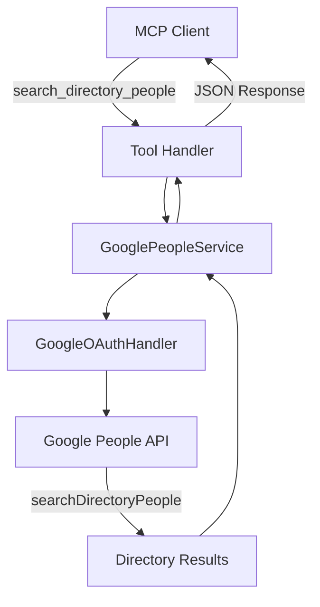

# Design Document: Directory People Search

## Overview

Google Workspace のディレクトリから参加者を検索する機能を実装します。Google People API の `searchDirectoryPeople` エンドポイントを使用し、既存の OAuth 認証フローに `directory.readonly` スコープを追加して実現します。

## Steering Document Alignment

### Technical Standards (tech.md)
- **TypeScript strict mode**: すべての新規コードで strict mode を使用
- **googleapis npm**: 既存の Google API 統合パターンを踏襲
- **Zod validation**: 入力パラメータの検証に Zod を使用
- **Error handling**: `retryWithBackoff` パターンでリトライを実装

### Project Structure (structure.md)
- **Service class**: `src/integrations/google-people-service.ts` に新規サービスを作成
- **Type definitions**: `src/types/google-people-types.ts` に型定義を追加
- **Tool handler**: `src/tools/directory/handlers.ts` にハンドラーを実装
- **Tests**: `tests/unit/google-people-service.test.ts` にユニットテストを追加

## Code Reuse Analysis

### Existing Components to Leverage
- **GoogleOAuthHandler**: OAuth 認証フロー（スコープ追加のみ）
- **retryWithBackoff**: API 呼び出しのリトライロジック
- **createToolResponse / createErrorFromCatch**: MCP レスポンス生成
- **calendarLogger**: ロギング（peopleLogger として拡張）

### Integration Points
- **OAuth Scopes**: `GOOGLE_CALENDAR_SCOPES` に `directory.readonly` を追加
- **MCP Tool Registration**: `index.ts` と `mcp-handler.ts` に新規ツールを登録

## Architecture



## Components and Interfaces

### Component 1: GooglePeopleService

- **Purpose**: Google People API との通信を管理
- **Location**: `src/integrations/google-people-service.ts`
- **Interfaces**:
  - `searchDirectoryPeople(query: string, pageSize?: number): Promise<DirectoryPerson[]>`
  - `isAvailable(): Promise<boolean>`
- **Dependencies**: GoogleOAuthHandler, googleapis
- **Reuses**: GoogleCalendarService のパターン（authenticate, isAvailable）

### Component 2: Tool Handler (handleSearchDirectoryPeople)

- **Purpose**: MCP ツールリクエストを処理
- **Location**: `src/tools/directory/handlers.ts`
- **Interfaces**: `handleSearchDirectoryPeople(ctx: DirectoryToolsContext, args: SearchDirectoryPeopleInput)`
- **Dependencies**: GooglePeopleService, ConfigManager
- **Reuses**: 既存の handleSearchRoomAvailability パターン

### Component 3: OAuth Scope Extension

- **Purpose**: People API スコープを認証フローに追加
- **Location**: `src/oauth/google-oauth-handler.ts`
- **Changes**: `GOOGLE_CALENDAR_SCOPES` に `directory.readonly` を追加
- **Reuses**: 既存の OAuth 認証フロー

## Data Models

### DirectoryPerson
```typescript
interface DirectoryPerson {
  resourceName: string;        // People API resource name
  displayName: string;         // 表示名
  emailAddress: string;        // メールアドレス
  organization?: string;       // 部署/組織
  photoUrl?: string;           // プロフィール画像 URL
}
```

### SearchDirectoryPeopleInput
```typescript
interface SearchDirectoryPeopleInput {
  query: string;               // 検索クエリ（名前またはメール）
  pageSize?: number;           // 結果の最大数（default: 20, max: 50）
}
```

### SearchDirectoryPeopleResponse
```typescript
interface SearchDirectoryPeopleResponse {
  success: boolean;
  people: DirectoryPerson[];
  totalResults: number;
  message: string;
}
```

## API Design

### MCP Tool: search_directory_people

```typescript
{
  name: 'search_directory_people',
  description: 'Search for people in the organization directory by name or email',
  inputSchema: {
    type: 'object',
    properties: {
      query: {
        type: 'string',
        description: 'Search query (name or email prefix)',
      },
      pageSize: {
        type: 'number',
        description: 'Maximum number of results (default: 20, max: 50)',
      },
    },
    required: ['query'],
  },
}
```

### Google People API Call

```typescript
// GET https://people.googleapis.com/v1/people:searchDirectoryPeople
const response = await peopleClient.people.searchDirectoryPeople({
  query: query,
  readMask: 'names,emailAddresses,organizations,photos',
  sources: ['DIRECTORY_SOURCE_TYPE_DOMAIN_PROFILE'],
  pageSize: pageSize,
});
```

## Error Handling

### Error Scenarios

1. **People API not enabled**
   - **Detection**: 403 error with "People API has not been used in project"
   - **Handling**: Return setup instructions with Google Cloud Console link
   - **User Impact**: 「People API を有効化してください: https://console.cloud.google.com/apis/library/people.googleapis.com」

2. **Directory sharing disabled**
   - **Detection**: 403 error with "PERMISSION_DENIED" for directory access
   - **Handling**: Return message to contact administrator
   - **User Impact**: 「組織のディレクトリ共有が無効です。Google Workspace 管理者に連絡してください」

3. **OAuth scope missing**
   - **Detection**: 403 error with "Request had insufficient authentication scopes"
   - **Handling**: Prompt re-authentication
   - **User Impact**: 「People API へのアクセス権限がありません。authenticate_google を実行して再認証してください」

4. **Empty query**
   - **Detection**: Input validation
   - **Handling**: Return validation error
   - **User Impact**: 「検索クエリを入力してください」

5. **No results found**
   - **Detection**: Empty response
   - **Handling**: Return empty list with message
   - **User Impact**: 「"[query]" に一致するユーザーが見つかりませんでした」

## Testing Strategy

### Unit Testing
- **GooglePeopleService**: Mock googleapis, test searchDirectoryPeople with various inputs
- **Error handling**: Test all error scenarios (API disabled, permission denied, etc.)
- **Input validation**: Test Zod schema validation

### Integration Testing
- **OAuth flow**: Test scope addition and re-authentication flow
- **End-to-end**: Test complete flow from MCP request to response

### Test Files
- `tests/unit/google-people-service.test.ts`
- `tests/unit/directory-handlers.test.ts`
- `tests/integration/directory-people-search.test.ts`
