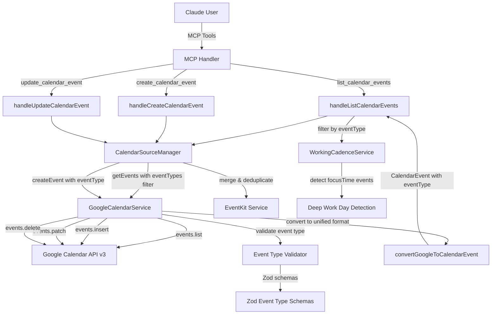
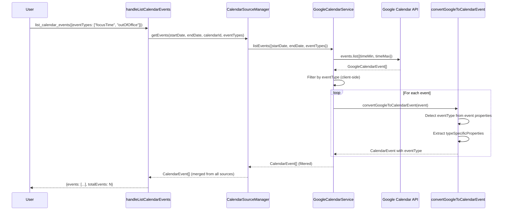
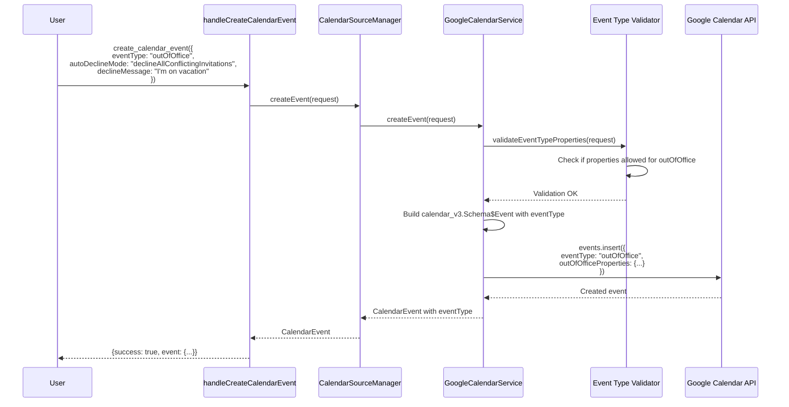

# Design Document

## Overview

この機能は、Google Calendar API v3の全6つのイベントタイプ(`default`, `outOfOffice`, `focusTime`, `workingLocation`, `birthday`, `fromGmail`)をsageでサポートするための設計です。

現在のsageは`default`タイプ(通常の会議・イベント)のみを扱っていますが、この機能により以下が可能になります:
- **Out of Office**: 休暇ブロックと自動辞退機能
- **Focus Time**: 集中作業時間とGoogle Chat連携
- **Working Location**: リモート/オフィス/カスタム場所の記録
- **Birthday**: 誕生日・記念日の管理
- **fromGmail**: Gmail由来のイベント(旅行予約等)の閲覧・編集

設計の主眼は、既存の`GoogleCalendarService`と`CalendarSourceManager`アーキテクチャを拡張し、型安全性を保ちながら後方互換性を維持することです。

## Steering Document Alignment

### Technical Standards (tech.md)

この設計は以下のtech.md標準に準拠します:

1. **TypeScript Strict Mode**: discriminated unionsと厳密な型チェックを使用
2. **Zod Validation**: 各イベントタイプの制約をZodスキーマで実行時バリデーション
3. **Error Handling**: 明確なエラーメッセージと適切なエラー伝播
4. **Testing**: Jest with 98%+ coverage target
5. **Retry Pattern**: 既存の`retryWithBackoff`ユーティリティを活用

### Project Structure (structure.md)

ファイル配置はstructure.mdのディレクトリ構造に従います:

- **Type Definitions**: `src/types/google-calendar-types.ts` に拡張型を追加
- **Service Layer**: `src/integrations/google-calendar-service.ts` にメソッド追加
- **Handler Layer**: `src/tools/calendar/handlers.ts` にイベントタイプフィルタリング追加
- **Validation**: `src/config/validation.ts` にZodスキーマ追加
- **Tests**: `tests/unit/google-calendar-service.test.ts` にテスト追加

## Code Reuse Analysis

### Existing Components to Leverage

この実装は以下の既存コンポーネントを最大限活用します:

#### 1. GoogleCalendarService (src/integrations/google-calendar-service.ts)
- **活用方法**: 既存のCRUDメソッド(`listEvents`, `createEvent`, `updateEvent`, `deleteEvent`)を拡張
- **変更内容**:
  - `CreateEventRequest`インターフェースに`eventType`と型固有プロパティを追加
  - `ListEventsRequest`に`eventTypes`フィルターを追加
  - イベントタイプごとのバリデーションロジックを追加

#### 2. Type Definitions (src/types/google-calendar-types.ts)
- **活用方法**: 既存の`GoogleCalendarEvent`と`CalendarEvent`インターフェースを拡張
- **変更内容**:
  - Discriminated unionで各イベントタイプを表現
  - `typeSpecificProperties`フィールドを追加(後方互換性維持)
  - `convertGoogleToCalendarEvent()`関数を拡張

#### 3. Retry Utility (src/utils/retry.ts)
- **活用方法**: 既存の`retryWithBackoff()`をそのまま使用
- **変更内容**: なし(完全に再利用)

#### 4. Calendar Handlers (src/tools/calendar/handlers.ts)
- **活用方法**: 既存の`handleListCalendarEvents`と`handleCreateCalendarEvent`を拡張
- **変更内容**:
  - `ListCalendarEventsInput`に`eventTypes?: string[]`パラメータ追加
  - `CreateCalendarEventInput`に`eventType?: string`と型固有プロパティを追加

#### 5. CalendarSourceManager (src/integrations/calendar-source-manager.ts)
- **活用方法**: イベントタイプ情報をEventKitとGoogle Calendarで統合
- **変更内容**: `getEvents()`メソッドでイベントタイプをマージロジックに考慮

#### 6. WorkingCadenceService (src/services/working-cadence.ts)
- **活用方法**: focusTimeイベントを認識してDeep Work Day検出精度を向上
- **変更内容**: `getWorkingCadence()`内でfocusTimeイベントを特別扱い

### Integration Points

#### A. Google Calendar API v3
- **統合方法**: googleapis npmパッケージの`calendar_v3.Calendar`クライアントを使用
- **APIエンドポイント**: `events.list()`, `events.insert()`, `events.patch()`, `events.delete()`
- **認証**: 既存の`GoogleOAuthHandler`を使用(スコープ追加不要)

#### B. MCP Tool Registration
- **統合方法**: 既存ツールのスキーマを拡張(破壊的変更なし)
- **変更ツール**:
  - `list_calendar_events`: `eventTypes`パラメータを追加(optional)
  - `create_calendar_event`: `eventType`と型固有プロパティを追加(optional)
  - その他のツールは変更不要

#### C. EventKit Compatibility
- **統合方法**: EventKitは`default`タイプのみサポート(他のタイプは読み取り専用)
- **フォールバック**: EventKitイベントは常に`eventType: "default"`としてマーク

## Architecture

### System Architecture



### Data Flow: Listing Events with Type Filter



### Data Flow: Creating Out of Office Event



## Components and Interfaces

### Component 1: Extended Type Definitions

**File**: `src/types/google-calendar-types.ts`

**Purpose**: Google Calendar API v3の全イベントタイプをTypeScriptで表現し、型安全性を提供

**Interfaces**:

```typescript
// ============================================================
// Event Type Discriminated Union
// ============================================================

/**
 * Google Calendar Event Type
 * Requirement: 6.2
 */
export type GoogleCalendarEventType =
  | 'default'
  | 'outOfOffice'
  | 'focusTime'
  | 'workingLocation'
  | 'birthday'
  | 'fromGmail';

/**
 * Out of Office Properties
 * Requirement: 1
 */
export interface OutOfOfficeProperties {
  autoDeclineMode:
    | 'declineNone'
    | 'declineAllConflictingInvitations'
    | 'declineOnlyNewConflictingInvitations';
  declineMessage?: string;
}

/**
 * Focus Time Properties
 * Requirement: 2
 */
export interface FocusTimeProperties {
  autoDeclineMode:
    | 'declineNone'
    | 'declineAllConflictingInvitations'
    | 'declineOnlyNewConflictingInvitations';
  declineMessage?: string;
  chatStatus?: 'available' | 'doNotDisturb';
}

/**
 * Working Location Properties
 * Requirement: 3
 */
export interface WorkingLocationProperties {
  type: 'homeOffice' | 'officeLocation' | 'customLocation';
  homeOffice?: boolean;
  customLocation?: {
    label: string;
  };
  officeLocation?: {
    buildingId?: string;
    floorId?: string;
    floorSectionId?: string;
    deskId?: string;
    label?: string;
  };
}

/**
 * Birthday Properties
 * Requirement: 4
 */
export interface BirthdayProperties {
  type: 'birthday' | 'anniversary' | 'custom' | 'other' | 'self';
  customTypeName?: string;
  contact?: string; // People API resource name (read-only)
}

/**
 * Event Type Specific Properties (discriminated union)
 * Requirement: 6.3
 */
export type EventTypeSpecificProperties =
  | { eventType: 'default'; properties?: never }
  | { eventType: 'outOfOffice'; properties: OutOfOfficeProperties }
  | { eventType: 'focusTime'; properties: FocusTimeProperties }
  | { eventType: 'workingLocation'; properties: WorkingLocationProperties }
  | { eventType: 'birthday'; properties: BirthdayProperties }
  | { eventType: 'fromGmail'; properties?: never };
```

**Dependencies**: googleapis (calendar_v3 types)

**Reuses**: 既存の`GoogleCalendarEvent`, `CalendarEvent`, `CalendarInfo`インターフェース

### Component 2: Extended GoogleCalendarService

**File**: `src/integrations/google-calendar-service.ts`

**Purpose**: Google Calendar API v3の全イベントタイプをCRUD操作でサポート

**Interfaces**:

```typescript
/**
 * Extended ListEventsRequest with event type filtering
 * Requirement: 7.1
 */
export interface ListEventsRequest {
  startDate: string;
  endDate: string;
  calendarId?: string;
  eventTypes?: GoogleCalendarEventType[]; // NEW: filter by event types
}

/**
 * Extended CreateEventRequest with event type support
 * Requirement: 1, 2, 3, 4, 6.4
 */
export interface CreateEventRequest {
  // Existing fields
  title: string;
  start: string;
  end: string;
  isAllDay?: boolean;
  location?: string;
  description?: string;
  attendees?: string[];
  reminders?: {...};

  // NEW: Event type and type-specific properties
  eventType?: GoogleCalendarEventType;
  outOfOfficeProperties?: OutOfOfficeProperties;
  focusTimeProperties?: FocusTimeProperties;
  workingLocationProperties?: WorkingLocationProperties;
  birthdayProperties?: BirthdayProperties;
}
```

**Methods**:

```typescript
class GoogleCalendarService {
  // Extended method signature
  async listEvents(request: ListEventsRequest): Promise<CalendarEvent[]> {
    // 1. Call Google Calendar API with date range
    // 2. Filter by eventType (client-side, API doesn't support it)
    // 3. Convert each event with convertGoogleToCalendarEvent()
    // 4. Return unified CalendarEvent[] with eventType field
  }

  // Extended method signature
  async createEvent(
    request: CreateEventRequest,
    calendarId?: string
  ): Promise<CalendarEvent> {
    // 1. Validate event type and properties with Zod
    // 2. Build calendar_v3.Schema$Event with eventType and type-specific properties
    // 3. Call events.insert() with proper payload
    // 4. Convert response to unified CalendarEvent
  }

  // Extended method signature (same signature, internal logic changed)
  async updateEvent(
    eventId: string,
    updates: Partial<CreateEventRequest>,
    calendarId?: string
  ): Promise<CalendarEvent> {
    // 1. Get existing event to determine current eventType
    // 2. Validate that update properties are allowed for that eventType
    // 3. Call events.patch() with restricted fields
    // 4. Handle special cases (e.g., fromGmail, birthday restrictions)
  }

  // NEW: Private helper method
  private validateEventTypeProperties(
    eventType: GoogleCalendarEventType,
    request: CreateEventRequest
  ): void {
    // Use Zod schemas to validate type-specific properties
    // Throw descriptive error if invalid properties provided
  }

  // NEW: Private helper method
  private buildEventTypePayload(
    request: CreateEventRequest
  ): Partial<calendar_v3.Schema$Event> {
    // Build event type-specific fields for Google Calendar API
    // Handle outOfOfficeProperties, focusTimeProperties, etc.
  }
}
```

**Dependencies**: googleapis, GoogleOAuthHandler, retryWithBackoff, Zod schemas

**Reuses**:
- 既存の`authenticate()`, `isAvailable()`, `normalizeToRFC3339()`メソッド
- 既存の`retryWithBackoff`パターン
- 既存のエラーハンドリングロジック

### Component 3: Event Type Validator

**File**: `src/config/validation.ts` (新規セクション追加)

**Purpose**: 各イベントタイプの制約をZodスキーマで実行時バリデーション

**Interfaces**:

```typescript
import { z } from 'zod';

/**
 * Out of Office Properties Schema
 * Requirement: 1, 8.2
 */
export const OutOfOfficePropertiesSchema = z.object({
  autoDeclineMode: z.enum([
    'declineNone',
    'declineAllConflictingInvitations',
    'declineOnlyNewConflictingInvitations',
  ]),
  declineMessage: z.string().optional(),
});

/**
 * Focus Time Properties Schema
 * Requirement: 2, 8.2
 */
export const FocusTimePropertiesSchema = z.object({
  autoDeclineMode: z.enum([
    'declineNone',
    'declineAllConflictingInvitations',
    'declineOnlyNewConflictingInvitations',
  ]),
  declineMessage: z.string().optional(),
  chatStatus: z.enum(['available', 'doNotDisturb']).optional(),
});

/**
 * Working Location Properties Schema
 * Requirement: 3, 8.2
 */
export const WorkingLocationPropertiesSchema = z.object({
  type: z.enum(['homeOffice', 'officeLocation', 'customLocation']),
  homeOffice: z.boolean().optional(),
  customLocation: z.object({
    label: z.string(),
  }).optional(),
  officeLocation: z.object({
    buildingId: z.string().optional(),
    floorId: z.string().optional(),
    floorSectionId: z.string().optional(),
    deskId: z.string().optional(),
    label: z.string().optional(),
  }).optional(),
}).refine(
  (data) => {
    // Validate that appropriate sub-properties are set based on type
    if (data.type === 'homeOffice') return data.homeOffice !== undefined;
    if (data.type === 'customLocation') return data.customLocation !== undefined;
    if (data.type === 'officeLocation') return data.officeLocation !== undefined;
    return false;
  },
  { message: 'Type-specific properties must be provided' }
);

/**
 * Birthday Properties Schema
 * Requirement: 4, 8.2
 */
export const BirthdayPropertiesSchema = z.object({
  type: z.enum(['birthday', 'anniversary', 'custom', 'other', 'self']),
  customTypeName: z.string().optional(),
  contact: z.string().optional(), // Read-only, not validated on create
});

/**
 * Create Event Request Schema with Event Type Support
 * Requirement: 6.4, 6.5, 8.2, 8.3
 */
export const CreateEventRequestSchema = z.object({
  title: z.string(),
  start: z.string(),
  end: z.string(),
  isAllDay: z.boolean().optional(),
  location: z.string().optional(),
  description: z.string().optional(),
  attendees: z.array(z.string()).optional(),
  reminders: z.object({
    useDefault: z.boolean(),
    overrides: z.array(z.object({
      method: z.enum(['email', 'popup']),
      minutes: z.number(),
    })).optional(),
  }).optional(),
  eventType: z.enum([
    'default',
    'outOfOffice',
    'focusTime',
    'workingLocation',
    'birthday',
    'fromGmail',
  ]).optional(),
  outOfOfficeProperties: OutOfOfficePropertiesSchema.optional(),
  focusTimeProperties: FocusTimePropertiesSchema.optional(),
  workingLocationProperties: WorkingLocationPropertiesSchema.optional(),
  birthdayProperties: BirthdayPropertiesSchema.optional(),
}).refine(
  (data) => {
    // Validate that only appropriate properties are set for each event type
    const eventType = data.eventType || 'default';

    if (eventType === 'default') {
      return !data.outOfOfficeProperties && !data.focusTimeProperties &&
             !data.workingLocationProperties && !data.birthdayProperties;
    }
    if (eventType === 'outOfOffice') {
      return data.outOfOfficeProperties !== undefined &&
             !data.focusTimeProperties && !data.workingLocationProperties && !data.birthdayProperties;
    }
    if (eventType === 'focusTime') {
      return data.focusTimeProperties !== undefined &&
             !data.outOfOfficeProperties && !data.workingLocationProperties && !data.birthdayProperties;
    }
    if (eventType === 'workingLocation') {
      return data.workingLocationProperties !== undefined &&
             !data.outOfOfficeProperties && !data.focusTimeProperties && !data.birthdayProperties;
    }
    if (eventType === 'birthday') {
      return data.birthdayProperties !== undefined &&
             !data.outOfOfficeProperties && !data.focusTimeProperties && !data.workingLocationProperties;
    }
    if (eventType === 'fromGmail') {
      // fromGmail cannot be created via API
      return false;
    }
    return true;
  },
  {
    message: 'Event type and properties must match. fromGmail events cannot be created via API.',
  }
).refine(
  (data) => {
    // Enforce all-day constraint for birthday and workingLocation events
    // Requirement: 3.1, 4.4
    if (data.eventType === 'birthday' || data.eventType === 'workingLocation') {
      return data.isAllDay === true;
    }
    return true;
  },
  {
    message: 'Birthday and workingLocation events must be all-day events (isAllDay: true)',
  }
);
```

**Dependencies**: Zod

**Reuses**: 既存のバリデーションパターン(config.tsのZodスキーマ)

### Component 4: Extended Calendar Handlers

**File**: `src/tools/calendar/handlers.ts`

**Purpose**: MCPツールハンドラーにイベントタイプフィルタリングと作成機能を追加

**Interfaces**:

```typescript
/**
 * Extended ListCalendarEventsInput with event type filtering
 * Requirement: 7.1, 7.2, 7.3
 */
export interface ListCalendarEventsInput {
  startDate: string;
  endDate: string;
  calendarId?: string;
  eventTypes?: string[]; // NEW: filter by event types (array of type names)
}

/**
 * Extended CreateCalendarEventInput with event type support
 * Requirement: 1, 2, 3, 4, 6.4
 */
export interface CreateCalendarEventInput {
  // Existing fields
  title: string;
  startDate: string;
  endDate: string;
  location?: string;
  notes?: string;
  calendarName?: string;
  alarms?: string[];
  preferredSource?: 'eventkit' | 'google';

  // NEW: Event type and type-specific properties
  eventType?: string;
  autoDeclineMode?: string;
  declineMessage?: string;
  chatStatus?: string;
  workingLocationType?: string;
  workingLocationLabel?: string;
  birthdayType?: string;
}
```

**Methods**:

```typescript
/**
 * Extended handleListCalendarEvents with event type filtering
 * Requirement: 7.1, 7.2, 7.3, 7.4
 */
export async function handleListCalendarEvents(
  ctx: CalendarToolsContext,
  args: ListCalendarEventsInput
) {
  // 1. Parse and validate eventTypes parameter
  // 2. Call calendarSourceManager.getEvents() with eventTypes filter
  // 3. Return events with eventType field included in response
  // 4. Include type-specific properties in response if available
}

/**
 * Extended handleCreateCalendarEvent with event type support
 * Requirement: 1, 2, 3, 4, 6.4, 6.5
 */
export async function handleCreateCalendarEvent(
  ctx: CalendarToolsContext,
  args: CreateCalendarEventInput
) {
  // 1. Parse eventType and type-specific properties from args
  // 2. Validate with Zod schema
  // 3. Build CreateEventRequest with eventType
  // 4. Call appropriate service (EventKit or Google Calendar)
  // 5. Return created event with eventType field
}
```

**Dependencies**: CalendarSourceManager, GoogleCalendarService, Zod schemas

**Reuses**:
- 既存の`createToolResponse()`, `createErrorFromCatch()`ユーティリティ
- 既存のエラーハンドリングパターン

### Component 5: Extended CalendarEvent Converter

**File**: `src/types/google-calendar-types.ts`

**Purpose**: Google Calendar APIのイベントを統一フォーマットに変換(イベントタイプ情報を保持)

**Interfaces**:

```typescript
/**
 * Extended CalendarEvent with event type support
 * Requirement: 6.2, 6.3, 9.3, 9.4
 */
export interface CalendarEvent {
  // Existing fields (maintained for backward compatibility)
  id: string;
  title: string;
  start: string;
  end: string;
  isAllDay: boolean;
  source: 'eventkit' | 'google';
  calendar?: string;
  location?: string;
  description?: string;
  attendees?: string[];
  status?: 'confirmed' | 'tentative' | 'cancelled';
  iCalUID?: string;

  // NEW: Event type and type-specific properties (optional, non-breaking)
  eventType?: GoogleCalendarEventType;
  typeSpecificProperties?: EventTypeSpecificProperties;
}

/**
 * Extended convertGoogleToCalendarEvent function
 * Requirement: 6.2, 6.3, 8.4
 */
export function convertGoogleToCalendarEvent(
  googleEvent: GoogleCalendarEvent
): CalendarEvent {
  // 1. Detect eventType from googleEvent properties
  // 2. Extract type-specific properties based on eventType
  // 3. Build CalendarEvent with all existing fields (backward compatibility)
  // 4. Add eventType and typeSpecificProperties fields
  // 5. Return unified CalendarEvent
}

/**
 * NEW: Helper function to detect event type from Google Calendar event
 * Requirement: 6.2
 */
function detectEventType(
  googleEvent: GoogleCalendarEvent
): GoogleCalendarEventType {
  // Check for eventType field in Google Calendar API response
  // Default to 'default' if not specified
}

/**
 * NEW: Helper function to extract type-specific properties
 * Requirement: 6.3
 */
function extractTypeSpecificProperties(
  googleEvent: GoogleCalendarEvent,
  eventType: GoogleCalendarEventType
): EventTypeSpecificProperties | undefined {
  // Extract outOfOfficeProperties, focusTimeProperties, etc.
  // Based on eventType
}
```

**Dependencies**: GoogleCalendarEvent type from googleapis

**Reuses**: 既存の`convertGoogleToCalendarEvent()`関数のロジック

### Component 6: Extended Working Cadence Service

**File**: `src/services/working-cadence.ts`

**Purpose**: focusTimeイベントを認識してDeep Work Day検出精度を向上

**Interfaces**: (既存インターフェースを維持)

**Methods**:

```typescript
class WorkingCadenceService {
  // Extended method implementation
  async getWorkingCadence(
    request?: GetWorkingCadenceRequest
  ): Promise<WorkingCadenceResult> {
    // 1. Load calendar events from CalendarSourceManager
    // 2. Filter focusTime events (NEW)
    // 3. Analyze focusTime blocks to improve Deep Work Day detection (NEW)
    // 4. Build recommendations considering focusTime events (NEW)
    // 5. Return enhanced WorkingCadenceResult
  }

  // NEW: Private helper method
  private analyzeFocusTimeEvents(
    events: CalendarEvent[]
  ): { focusTimeBlocks: Array<{day: string; duration: number}> } {
    // Extract focusTime events
    // Calculate total focus time per day
    // Return focus time statistics
  }

  // NEW: Private helper method
  private enhanceDeepWorkDetection(
    config: CalendarConfig,
    focusTimeBlocks: Array<{day: string; duration: number}>
  ): string[] {
    // Combine config.deepWorkDays with focusTime event analysis
    // Return enhanced list of deep work days
  }
}
```

**Dependencies**: CalendarSourceManager, CalendarEvent type

**Reuses**: 既存のWorking Cadenceロジック

### Component 7: Working Location Aware Scheduling

**File**: `src/integrations/calendar-source-manager.ts`

**Purpose**: workingLocationイベントを考慮して、リモートワーク日とオフィス出社日に適した時間枠を提案

**Interfaces**:

```typescript
/**
 * Extended TimeSlot with working location context
 * Requirement: 3.7
 */
export interface TimeSlot {
  // Existing fields
  start: string;
  end: string;
  durationMinutes: number;
  suitability: 'excellent' | 'good' | 'fair';
  dayType: 'deep-work' | 'meeting-heavy' | 'normal';
  reason: string;

  // NEW: Working location context
  workingLocation?: {
    type: 'homeOffice' | 'officeLocation' | 'customLocation' | 'unknown';
    label?: string;
  };
}

/**
 * Extended FindAvailableSlotsRequest with location preference
 * Requirement: 3.7, 7.5
 */
export interface FindAvailableSlotsRequest {
  // Existing fields
  startDate: string;
  endDate: string;
  minDurationMinutes: number;
  maxDurationMinutes: number;
  workingHours: { start: string; end: string };

  // NEW: Location and event type preferences
  preferredWorkingLocation?: 'homeOffice' | 'officeLocation' | 'any';
  respectBlockingEventTypes?: boolean; // Default: true (respects outOfOffice, focusTime)
}
```

**Methods**:

```typescript
class CalendarSourceManager {
  // Extended method implementation
  async findAvailableSlots(
    request: FindAvailableSlotsRequest
  ): Promise<TimeSlot[]> {
    // 1. Load all events (including workingLocation, outOfOffice, focusTime)
    const events = await this.getEvents(request.startDate, request.endDate);

    // 2. Filter blocking events (NEW - Requirement 7.5)
    const blockingEvents = this.filterBlockingEvents(events, request.respectBlockingEventTypes);

    // 3. Load workingLocation events for date range (NEW - Requirement 3.7)
    const workingLocationEvents = events.filter(e => e.eventType === 'workingLocation');

    // 4. Calculate available time slots
    const availableSlots = this.calculateAvailableSlots(
      request,
      blockingEvents,
      workingLocationEvents
    );

    // 5. Annotate slots with working location context (NEW)
    const annotatedSlots = this.annotateWithWorkingLocation(
      availableSlots,
      workingLocationEvents
    );

    // 6. Filter by preferred working location (NEW)
    const filteredSlots = this.filterByLocationPreference(
      annotatedSlots,
      request.preferredWorkingLocation
    );

    // 7. Return slots sorted by suitability
    return filteredSlots;
  }

  // NEW: Private helper method (Requirement 7.5)
  private filterBlockingEvents(
    events: CalendarEvent[],
    respectBlockingEventTypes: boolean = true
  ): CalendarEvent[] {
    if (!respectBlockingEventTypes) {
      // Backward compatible: treat all non-birthday, non-fromGmail as blocking
      return events.filter(e =>
        e.eventType !== 'birthday' && e.eventType !== 'fromGmail'
      );
    }

    // NEW: Respect event type blocking semantics
    // - default: blocks time (meetings, appointments)
    // - outOfOffice: blocks time (vacation, absence)
    // - focusTime: blocks time (deep work)
    // - workingLocation: does NOT block time (metadata only)
    // - birthday: does NOT block time (all-day reminder)
    // - fromGmail: does NOT block time (informational)
    return events.filter(e => {
      // EventKit events have no eventType field, treat as blocking 'default'
      const eventType = e.eventType || 'default';

      // Define blocking types
      const blockingTypes: GoogleCalendarEventType[] = ['default', 'outOfOffice', 'focusTime'];

      // Edge case: overlapping focusTime/outOfOffice events both block independently
      // (no special priority logic needed - both reserve the time)

      return blockingTypes.includes(eventType);
    });
  }

  // NEW: Private helper method (Requirement 3.7)
  private annotateWithWorkingLocation(
    slots: TimeSlot[],
    workingLocationEvents: CalendarEvent[]
  ): TimeSlot[] {
    return slots.map(slot => {
      // Timezone-aware date comparison
      // Parse ISO 8601 timestamp and extract date in UTC
      const slotDateNormalized = new Date(slot.start).toISOString().split('T')[0];

      // Find workingLocation event that matches this date
      // workingLocation events are all-day, so e.start is in YYYY-MM-DD or RFC3339 format
      const locationEvent = workingLocationEvents.find(e => {
        const eventDateNormalized = new Date(e.start).toISOString().split('T')[0];
        return eventDateNormalized === slotDateNormalized;
      });

      if (locationEvent && locationEvent.typeSpecificProperties) {
        const props = locationEvent.typeSpecificProperties.properties as WorkingLocationProperties;
        return {
          ...slot,
          workingLocation: {
            type: props.type,
            label: props.customLocation?.label || props.officeLocation?.label,
          },
        };
      }

      return {
        ...slot,
        workingLocation: { type: 'unknown' },
      };
    });
  }

  // NEW: Private helper method (Requirement 3.7)
  private filterByLocationPreference(
    slots: TimeSlot[],
    preferredLocation?: 'homeOffice' | 'officeLocation' | 'any'
  ): TimeSlot[] {
    if (!preferredLocation || preferredLocation === 'any') {
      return slots; // No filtering
    }

    // Prioritize slots matching preferred location
    const matchingSlots = slots.filter(s =>
      s.workingLocation?.type === preferredLocation
    );
    const otherSlots = slots.filter(s =>
      s.workingLocation?.type !== preferredLocation
    );

    // Return matching slots first, then others
    return [...matchingSlots, ...otherSlots];
  }
}
```

**Dependencies**: CalendarEvent, WorkingLocationProperties

**Reuses**:
- 既存の`findAvailableSlots()`ロジック
- 既存の`getEvents()`メソッド

## Data Models

### Model 1: Extended GoogleCalendarEvent

```typescript
/**
 * Google Calendar Event (internal representation from Google Calendar API)
 * Extended to support all event types
 * Requirement: 1, 2, 3, 4, 5, 6.2
 */
export interface GoogleCalendarEvent {
  // Existing fields
  id: string;
  summary: string;
  description?: string;
  location?: string;
  start: { dateTime?: string; date?: string; timeZone?: string };
  end: { dateTime?: string; date?: string; timeZone?: string };
  attendees?: Array<{...}>;
  reminders?: {...};
  recurringEventId?: string;
  iCalUID: string;
  status?: 'confirmed' | 'tentative' | 'cancelled';
  organizer?: { email: string; displayName?: string };

  // NEW: Event type and type-specific properties
  eventType?: GoogleCalendarEventType;
  outOfOfficeProperties?: OutOfOfficeProperties;
  focusTimeProperties?: FocusTimeProperties;
  workingLocationProperties?: WorkingLocationProperties;
  birthdayProperties?: BirthdayProperties;
}
```

### Model 2: Extended CalendarEvent (Unified Format)

```typescript
/**
 * Unified Calendar Event with event type support
 * Used across all calendar sources (EventKit + Google Calendar)
 * Requirement: 6.2, 6.3, 9.3, 9.4
 */
export interface CalendarEvent {
  // Existing fields (unchanged for backward compatibility)
  id: string;
  title: string;
  start: string; // ISO 8601
  end: string; // ISO 8601
  isAllDay: boolean;
  source: 'eventkit' | 'google';
  calendar?: string;
  location?: string;
  description?: string;
  attendees?: string[];
  status?: 'confirmed' | 'tentative' | 'cancelled';
  iCalUID?: string;

  // NEW: Event type and type-specific properties (optional)
  eventType?: GoogleCalendarEventType;
  typeSpecificProperties?: EventTypeSpecificProperties;
}
```

### Model 3: CreateEventRequest (Extended)

```typescript
/**
 * Request interface for creating events with event type support
 * Requirement: 1, 2, 3, 4, 6.4
 */
export interface CreateEventRequest {
  // Existing fields
  title: string;
  start: string; // ISO 8601
  end: string; // ISO 8601
  isAllDay?: boolean;
  location?: string;
  description?: string;
  attendees?: string[];
  reminders?: {
    useDefault: boolean;
    overrides?: Array<{ method: 'email' | 'popup'; minutes: number }>;
  };

  // NEW: Event type and type-specific properties
  eventType?: GoogleCalendarEventType; // Defaults to 'default'
  outOfOfficeProperties?: OutOfOfficeProperties;
  focusTimeProperties?: FocusTimeProperties;
  workingLocationProperties?: WorkingLocationProperties;
  birthdayProperties?: BirthdayProperties;
}
```

## Error Handling

### Error Scenarios

#### 1. fromGmail Event Creation Attempted
- **Description**: User tries to create a fromGmail event via API
- **Handling**: Validate with Zod schema, reject with descriptive error
- **User Impact**: Error message: "fromGmail events cannot be created via API. They are automatically generated from Gmail."
- **Requirement**: 5.4, 8.3

#### 2. Invalid Event Type Properties
- **Description**: User provides focusTimeProperties for a "default" event
- **Handling**: Zod schema validation fails, throw error with property mismatch details
- **User Impact**: Error message: "Event type 'default' does not support focusTimeProperties. Remove these properties or change eventType to 'focusTime'."
- **Requirement**: 6.5, 8.3

#### 3. Birthday Event Update Restriction
- **Description**: User tries to update location field of a birthday event
- **Handling**: Check eventType in updateEvent(), reject disallowed fields
- **User Impact**: Error message: "Birthday events can only update summary, colorId, reminders, and date. Cannot update: location."
- **Requirement**: 4.5, 6.6

#### 4. Working Location Type Mismatch
- **Description**: User sets type="homeOffice" but provides officeLocation properties
- **Handling**: Zod schema refinement validates type-property consistency
- **User Impact**: Error message: "Working location type 'homeOffice' requires homeOffice property, not officeLocation."
- **Requirement**: 3.2, 3.3, 3.4, 3.5

#### 5. Event Type Filtering Not Supported by API
- **Description**: Google Calendar API doesn't support filtering by eventType in list()
- **Handling**: Fetch all events, filter client-side in GoogleCalendarService
- **User Impact**: Transparent to user, may be slower for large event lists
- **Requirement**: 7.1, 7.2

#### 6. EventKit Source with Non-Default Event Type
- **Description**: User requests focusTime events but only EventKit is enabled
- **Handling**: Return empty result with informative message
- **User Impact**: Message: "focusTime events are only supported by Google Calendar. Enable Google Calendar in settings."
- **Requirement**: 7.1

#### 7. Google Calendar API Rate Limit
- **Description**: Too many API calls, rate limit exceeded
- **Handling**: Existing retryWithBackoff logic handles this transparently
- **User Impact**: Slight delay (1-3 seconds), then success
- **Requirement**: Non-Functional/Performance

#### 8. OAuth Token Expired During Event Creation
- **Description**: OAuth token expires mid-operation
- **Handling**: GoogleOAuthHandler automatically refreshes token
- **User Impact**: Transparent, slight delay
- **Requirement**: Non-Functional/Reliability

## Testing Strategy

### Unit Testing

#### Test Coverage Target: 98%+

**Test Files**:
- `tests/unit/google-calendar-service.test.ts` (既存ファイルを拡張)
- `tests/unit/google-calendar-types.test.ts` (新規作成)
- `tests/unit/event-type-validator.test.ts` (新規作成)
- `tests/unit/working-cadence.test.ts` (既存ファイルを拡張)

**Test Cases for GoogleCalendarService**:

1. **listEvents() with Event Type Filtering**:
   - Should return only focusTime events when eventTypes=["focusTime"]
   - Should return outOfOffice + focusTime when eventTypes=["outOfOffice", "focusTime"]
   - Should return all event types when eventTypes is not provided
   - Should handle empty result when no events match filter
   - Requirement: 7.1, 7.2, 7.3, 7.4

2. **createEvent() with Out of Office Type**:
   - Should create outOfOffice event with autoDeclineMode
   - Should create outOfOffice event with custom declineMessage
   - Should set default transparency to "opaque"
   - Should reject invalid autoDeclineMode values
   - Requirement: 1.1, 1.2, 1.3

3. **createEvent() with Focus Time Type**:
   - Should create focusTime event with chatStatus
   - Should create focusTime event with autoDeclineMode
   - Should reject invalid chatStatus values
   - Requirement: 2.1, 2.2, 2.3, 2.4

4. **createEvent() with Working Location Type**:
   - Should create homeOffice workingLocation event
   - Should create officeLocation workingLocation event with buildingId
   - Should create customLocation workingLocation event
   - Should reject mismatched type and properties
   - Should enforce all-day constraint
   - Requirement: 3.1, 3.2, 3.3, 3.4, 3.5

5. **createEvent() with Birthday Type**:
   - Should create birthday event with yearly recurrence
   - Should enforce all-day constraint
   - Should set visibility="private" and transparency="transparent"
   - Should reject non-yearly recurrence
   - Requirement: 4.4

6. **createEvent() with fromGmail Type**:
   - Should reject creation attempt with descriptive error
   - Requirement: 5.4

7. **updateEvent() with Event Type Restrictions**:
   - Should allow updating summary of birthday event
   - Should reject updating location of birthday event
   - Should allow updating colorId of fromGmail event
   - Should reject updating start/end of fromGmail event
   - Requirement: 4.5, 5.3, 6.6

8. **Validation Error Handling**:
   - Should throw error for invalid event type
   - Should throw error for missing required properties
   - Should throw error for properties not allowed for event type
   - Requirement: 6.5, 8.3

**Test Cases for convertGoogleToCalendarEvent()**:

1. Should detect eventType from GoogleCalendarEvent
2. Should extract outOfOfficeProperties correctly
3. Should extract focusTimeProperties correctly
4. Should extract workingLocationProperties correctly
5. Should extract birthdayProperties correctly
6. Should default to "default" eventType if not specified
7. Should preserve all existing fields (backward compatibility)
8. Requirement: 6.2, 6.3, 8.4, 9.3

**Test Cases for Zod Schemas**:

1. Should validate OutOfOfficePropertiesSchema
2. Should validate FocusTimePropertiesSchema
3. Should validate WorkingLocationPropertiesSchema with type constraints
4. Should validate BirthdayPropertiesSchema
5. Should validate CreateEventRequestSchema with type-property matching
6. Should reject fromGmail creation in schema
7. Should enforce all-day constraint for birthday and workingLocation in schema
8. Requirement: 8.2, 8.3

**Test Cases for Working Cadence with Focus Time Events**:

9. **Working Cadence with Focus Time Events** (NEW - Requirement 7.6):
   - Should detect Deep Work Day when ≥4h focusTime events exist on that day
   - Should combine config.deepWorkDays with focusTime analysis
   - Should recommend scheduling focusTime on low-meeting days
   - Should calculate total focusTime hours per day
   - Should prioritize days with existing focusTime blocks for new focus work
   - Requirement: 7.6

**Test Cases for Backward Compatibility**:

10. **Backward Compatibility Tests** (NEW - Requirement 9):
    - Should handle CalendarEvent without eventType field (undefined)
    - Should not break existing event filtering logic in working-cadence.ts
    - Should maintain list response format (no breaking changes to existing fields)
    - Should allow existing code to ignore typeSpecificProperties
    - Should default to 'default' eventType when creating events without specifying type
    - Requirement: 9.1, 9.2, 9.3, 9.4

**Test Cases for Working Location Aware Scheduling**:

11. **find_available_slots with Event Type Blocking** (NEW - Requirement 7.5):
    - Should respect outOfOffice events as blocking time
    - Should respect focusTime events as blocking time
    - Should respect default events (meetings) as blocking time
    - Should NOT treat workingLocation events as blocking time
    - Should NOT treat birthday events as blocking time
    - Should NOT treat fromGmail events as blocking time
    - Should allow overriding blocking behavior with respectBlockingEventTypes=false
    - Requirement: 7.5

12. **find_available_slots with Working Location Context** (NEW - Requirement 3.7):
    - Should annotate time slots with working location type
    - Should prioritize homeOffice slots when preferredWorkingLocation="homeOffice"
    - Should prioritize officeLocation slots when preferredWorkingLocation="officeLocation"
    - Should return all slots when preferredWorkingLocation="any"
    - Should handle slots on days without workingLocation events (type: 'unknown')
    - Should include workingLocation label in slot metadata
    - Requirement: 3.7

### Integration Testing

**Test File**: `tests/integration/google-calendar-event-types.test.ts` (新規作成)

**Test Cases**:

1. **End-to-End Event Type Workflow**:
   - Create outOfOffice event → List with filter → Update → Delete
   - Create focusTime event → List with filter → Update → Delete
   - Create workingLocation event → List with filter → Delete
   - Create birthday event → List with filter → Delete (limited update)
   - Requirement: 1, 2, 3, 4

2. **CalendarSourceManager Integration**:
   - Should merge EventKit (default only) and Google Calendar (all types)
   - Should deduplicate events correctly with eventType field
   - Should handle partial failure (one source fails, other succeeds)
   - Requirement: 6.1, Non-Functional/Reliability

3. **Working Cadence Integration**:
   - Should detect Deep Work Days using focusTime events
   - Should provide recommendations based on workingLocation events
   - Requirement: 2.7, 3.7, 7.6

### End-to-End Testing

**Test File**: `tests/e2e/calendar-event-types-mcp.test.ts` (新規作成)

**Test Cases**:

1. **MCP Tool: list_calendar_events with eventTypes filter**:
   - Call with eventTypes=["focusTime"]
   - Verify response contains only focusTime events
   - Verify eventType field is included in response
   - Requirement: 7.1, 7.2

2. **MCP Tool: create_calendar_event with eventType**:
   - Call with eventType="outOfOffice" and autoDeclineMode
   - Verify event is created in Google Calendar
   - Verify response includes typeSpecificProperties
   - Requirement: 1, 6.4

3. **MCP Tool: get_working_cadence with focusTime events**:
   - Create focusTime events on Monday
   - Call get_working_cadence
   - Verify Monday is detected as Deep Work Day
   - Requirement: 2.7, 7.6

### Test Data and Mocks

**Mock Data**:
- `tests/fixtures/google-calendar-events.ts` (新規作成)
  - Sample GoogleCalendarEvent objects for each event type
  - Sample API responses with all event types

**Mocked Services**:
- Google Calendar API client (mock `events.list()`, `events.insert()`, etc.)
- GoogleOAuthHandler (mock token refresh)

### Test Coverage Requirements

| Component | Target Coverage | Critical Paths |
|-----------|----------------|----------------|
| GoogleCalendarService | 98%+ | listEvents with filter, createEvent with all types |
| convertGoogleToCalendarEvent | 100% | All event type branches |
| Zod Schemas | 100% | All validation rules |
| Calendar Handlers | 95%+ | Event type parameter handling |
| WorkingCadenceService | 95%+ | focusTime event detection |

---

## Implementation Notes

### Performance Considerations

1. **Client-Side Filtering**: Google Calendar API doesn't support eventType filtering in list(). Fetch all events, filter in-memory. For large calendars (1000+ events), this may add 500ms-1s latency.

2. **Type Conversion Overhead**: Converting each event with `convertGoogleToCalendarEvent()` adds ~0.1ms per event. For 100 events, total overhead is ~10ms (acceptable).

3. **Zod Validation**: Runtime validation with Zod adds ~1ms per event creation. Negligible impact on user experience.

4. **Retry Pattern**: Exponential backoff with 3 max retries. Retryable errors: 429 (Rate Limit), 500, 502, 503, 504. Non-retryable: 400, 401, 403, 404.

#### Performance Benchmarks

Target performance metrics for implementation validation:

| Operation | Event Count | Target Time | Notes |
|-----------|-------------|-------------|-------|
| list_calendar_events (no filter) | 100 | <500ms | Baseline measurement |
| list_calendar_events (eventType filter) | 100 | <600ms | +100ms for client-side filtering |
| list_calendar_events (eventType filter) | 1000 | <2s | Acceptable for large calendars |
| create_calendar_event (outOfOffice) | - | <1s | Includes OAuth token refresh if needed |
| create_calendar_event (focusTime) | - | <1s | Same as outOfOffice |
| create_calendar_event (workingLocation) | - | <1s | Same as outOfOffice |
| update_calendar_event (birthday) | - | <1s | Limited fields update |
| find_available_slots (with location filter) | 100 events | <800ms | +300ms for location annotation |

**Test Approach**: Use Jest `performance.now()` to measure execution time in integration tests.

### Backward Compatibility

1. **Existing CalendarEvent Fields**: All existing fields are preserved. New fields (`eventType`, `typeSpecificProperties`) are optional.

2. **Default Behavior**: If `eventType` is not specified in create requests, defaults to "default" (current behavior).

3. **Existing Tests**: All existing tests should pass without modification. New tests are additive.

### Security and Privacy

1. **OAuth Scope Verification**: No additional scopes required. All event types are supported by the standard `https://www.googleapis.com/auth/calendar` scope.
   - **Verified Event Types**:
     - ✅ `default`: Covered by base calendar scope
     - ✅ `outOfOffice`: Covered by base calendar scope
     - ✅ `focusTime`: Covered by base calendar scope
     - ✅ `workingLocation`: Covered by base calendar scope
     - ✅ `birthday`: Covered by base calendar scope (read/write)
     - ✅ `fromGmail`: Read-only, no creation allowed (API restriction)
   - **Reference**: [Google Calendar API Events Reference](https://developers.google.com/calendar/api/v3/reference/events#eventType)
   - **Scope Documentation**: [OAuth 2.0 Scopes for Google APIs](https://developers.google.com/identity/protocols/oauth2/scopes#calendar)

2. **Birthday Contact Data**: `birthdayProperties.contact` field is read-only. sage will not fetch additional data from People API. No additional scope (`https://www.googleapis.com/auth/contacts.readonly`) is required or requested.

3. **Sensitive Data**: Out of Office decline messages may contain sensitive information. Ensure they are not logged or exposed in error messages. Validate messages do not exceed 1024 characters to prevent abuse.

### Deployment Strategy

1. **Phase 1**: Deploy type definitions and GoogleCalendarService changes (non-breaking).

2. **Phase 2**: Deploy Calendar Handlers and MCP tool schema updates (backward compatible).

3. **Phase 3**: Deploy Working Cadence integration (optional enhancement).

4. **Rollback Plan**: If issues arise, revert to previous version. All changes are additive, so rollback is safe.
