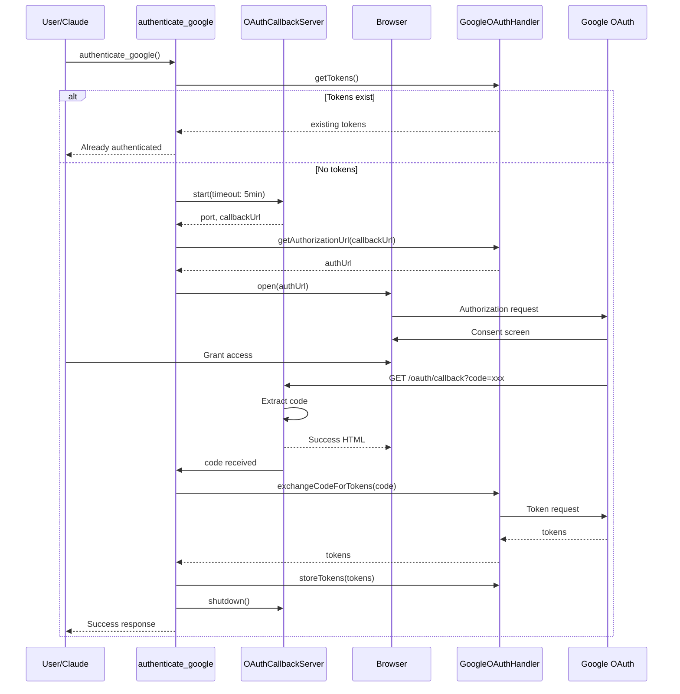

# Design Document: Google OAuth Auto-Callback

## Overview

Google OAuth自動コールバック機能は、一時的なローカルHTTPサーバーを使用してOAuth認証フローを自動化します。ユーザーはブラウザで認証を行うだけで、認証コードの取得からトークン保存までがシームレスに完了します。

## Steering Document Alignment

### Technical Standards (tech.md)
- **TypeScript Strict Mode**: 全コンポーネントでstrict mode使用
- **Zod Validation**: コールバックパラメータの検証にZodを使用
- **Error Handling**: 全エラーをthrow、静かに無視しない
- **OAuth 2.1**: PKCE S256を継続使用（AD-003準拠）
- **Token Encryption**: AES-256-GCM暗号化（既存EncryptionService使用）

### Project Structure (structure.md)
- **ファイル命名**: kebab-case (`oauth-callback-server.ts`)
- **テストファイル**: `tests/unit/oauth/oauth-callback-server.test.ts`
- **ツールハンドラ**: `src/tools/oauth/` に配置
- **MCP Tool命名**: snake_case (`authenticate_google`)

## Code Reuse Analysis

### Existing Components to Leverage
- **GoogleOAuthHandler** (`src/oauth/google-oauth-handler.ts`):
  - `getAuthorizationUrl()` - 認証URL生成（PKCE含む）
  - `exchangeCodeForTokens()` - コード→トークン交換
  - `storeTokens()` - 暗号化保存
  - `getTokens()` - 既存トークン確認
- **EncryptionService** (`src/oauth/encryption-service.ts`):
  - トークン暗号化（GoogleOAuthHandler経由で間接使用）
- **Platform Detector** (`src/platform/detector.ts`):
  - プラットフォーム検出（ブラウザ起動コマンド決定に使用）
- **mcpLogger** (`src/utils/logger.ts`):
  - 構造化ロギング

### Integration Points
- **index.ts**: グローバルサービス初期化、ツール登録
- **GoogleCalendarService**: 認証完了後のサービス利用
- **CalendarSourceManager**: Google Calendar有効化

## Architecture



## Components and Interfaces

### Component 1: OAuthCallbackServer

**Purpose:** 一時的なHTTPサーバーでOAuthコールバックを受信

**File:** `src/oauth/oauth-callback-server.ts`

**Interface:**
```typescript
interface OAuthCallbackServerOptions {
  port?: number;          // デフォルト: 3000
  timeout?: number;       // デフォルト: 300000 (5分)
  host?: string;          // デフォルト: '127.0.0.1'
}

interface CallbackResult {
  success: boolean;
  code?: string;
  error?: string;
  errorDescription?: string;
}

class OAuthCallbackServer extends EventEmitter {
  constructor(options?: OAuthCallbackServerOptions);

  // サーバー起動、使用可能なポートを返す
  start(): Promise<{ port: number; callbackUrl: string }>;

  // コールバック待機（Promise解決またはタイムアウト）
  waitForCallback(): Promise<CallbackResult>;

  // サーバー停止
  shutdown(): Promise<void>;

  // ステータス確認
  isRunning(): boolean;
}
```

**Dependencies:** Node.js `http` module, `events.EventEmitter`

**Reuses:** なし（新規コンポーネント）

### Component 2: BrowserOpener

**Purpose:** プラットフォームに応じたブラウザ起動

**File:** `src/utils/browser-opener.ts`

**Interface:**
```typescript
interface BrowserOpenResult {
  success: boolean;
  error?: string;
}

async function openBrowser(url: string): Promise<BrowserOpenResult>;
```

**Dependencies:** `child_process.exec`

**Reuses:** Platform detection pattern from `src/platform/detector.ts`

### Component 3: authenticate_google Tool Handler

**Purpose:** MCPツールとして認証フロー全体を orchestrate

**File:** `src/tools/oauth/authenticate-google.ts`

**Interface:**
```typescript
interface AuthenticateGoogleArgs {
  force?: boolean;    // 既存トークンがあっても再認証
  timeout?: number;   // タイムアウト秒数（デフォルト: 300）
}

interface AuthenticateGoogleResult {
  success: boolean;
  message: string;
  alreadyAuthenticated?: boolean;
  expiresAt?: string;
  scopes?: string[];
  authorizationUrl?: string;  // ブラウザ自動起動失敗時
}

async function handleAuthenticateGoogle(
  args: AuthenticateGoogleArgs,
  context: OAuthToolsContext
): Promise<AuthenticateGoogleResult>;
```

**Dependencies:** OAuthCallbackServer, GoogleOAuthHandler, BrowserOpener

**Reuses:** GoogleOAuthHandler全機能

## Data Models

### CallbackResult
```typescript
interface CallbackResult {
  success: boolean;
  code?: string;           // 認証コード（成功時）
  error?: string;          // エラーコード（失敗時）
  errorDescription?: string; // エラー詳細
  state?: string;          // CSRFトークン（将来用）
}
```

### ServerState
```typescript
interface ServerState {
  isRunning: boolean;
  port: number | null;
  startedAt: number | null;
  callbackReceived: boolean;
}
```

## Error Handling

### Error Scenarios

1. **環境変数未設定**
   - **Handling:** 起動前にチェック、即座にエラー返却
   - **User Impact:** 設定手順を含むエラーメッセージ表示

2. **ポートバインド失敗**
   - **Handling:** 代替ポート（3001-3010）を試行、全て失敗時エラー
   - **User Impact:** ポート競合の解消方法を案内

3. **タイムアウト**
   - **Handling:** サーバー停止、タイムアウトエラー返却
   - **User Impact:** 再試行を促すメッセージ

4. **ユーザーがアクセス拒否**
   - **Handling:** `error=access_denied` をキャプチャ、適切なエラー返却
   - **User Impact:** 拒否された旨と再試行方法を案内

5. **トークン交換失敗**
   - **Handling:** Google APIエラーをラップして返却
   - **User Impact:** 詳細なエラーメッセージと対処法

6. **ブラウザ起動失敗**
   - **Handling:** URLを返却してユーザーに手動コピーを促す
   - **User Impact:** 認証URLが表示される（コピー可能）

## Testing Strategy

### Unit Testing

**File:** `tests/unit/oauth/oauth-callback-server.test.ts`

- サーバー起動/停止のライフサイクル
- コールバックパラメータの正しいパース
- タイムアウト動作
- 並行リクエストの処理
- エラーケース（不正なパラメータ、サーバー未起動等）

**File:** `tests/unit/utils/browser-opener.test.ts`

- 各プラットフォームでの正しいコマンド選択
- 実行失敗時のエラーハンドリング

**File:** `tests/unit/tools/oauth/authenticate-google.test.ts`

- 既存トークンがある場合のスキップ
- 正常な認証フロー（モック使用）
- 各種エラーケースのハンドリング

### Integration Testing

**File:** `tests/integration/google-oauth-flow.test.ts`

- OAuthCallbackServer + GoogleOAuthHandler の統合
- 実際のHTTPリクエストによるコールバックシミュレーション
- トークン保存の確認

### End-to-End Testing

**Note:** E2Eテストは実際のGoogleアカウントが必要なため、手動テストで対応

手動テスト項目:
1. 新規認証フロー完了
2. 既存トークンでのスキップ
3. force=true での再認証
4. タイムアウト動作
5. アクセス拒否時の動作

## File Structure

```
src/
├── oauth/
│   ├── oauth-callback-server.ts    # NEW: コールバックサーバー
│   └── google-oauth-handler.ts     # EXISTING: 認証URL生成、トークン交換
├── utils/
│   └── browser-opener.ts           # NEW: ブラウザ起動ユーティリティ
├── tools/
│   └── oauth/
│       ├── index.ts                # NEW: OAuth ツールエクスポート
│       └── authenticate-google.ts  # NEW: ツールハンドラ
└── index.ts                        # MODIFY: ツール登録追加

tests/
├── unit/
│   ├── oauth/
│   │   └── oauth-callback-server.test.ts  # NEW
│   ├── utils/
│   │   └── browser-opener.test.ts         # NEW
│   └── tools/
│       └── oauth/
│           └── authenticate-google.test.ts # NEW
└── integration/
    └── google-oauth-flow.test.ts          # NEW
```

## Success HTML Template

コールバック成功時に表示するHTML:

```html
<!DOCTYPE html>
<html>
<head>
  <title>sage - Google Calendar 認証完了</title>
  <style>
    body { font-family: system-ui; text-align: center; padding: 50px; }
    .success { color: #22c55e; }
    .error { color: #ef4444; }
  </style>
</head>
<body>
  <h1 class="success">✓ 認証が完了しました</h1>
  <p>このウィンドウを閉じて、Claude に戻ってください。</p>
</body>
</html>
```

エラー時:

```html
<!DOCTYPE html>
<html>
<head>
  <title>sage - Google Calendar 認証エラー</title>
  <style>
    body { font-family: system-ui; text-align: center; padding: 50px; }
    .error { color: #ef4444; }
  </style>
</head>
<body>
  <h1 class="error">✗ 認証に失敗しました</h1>
  <p>エラー: {{error_description}}</p>
  <p>Claude に戻って再試行してください。</p>
</body>
</html>
```
