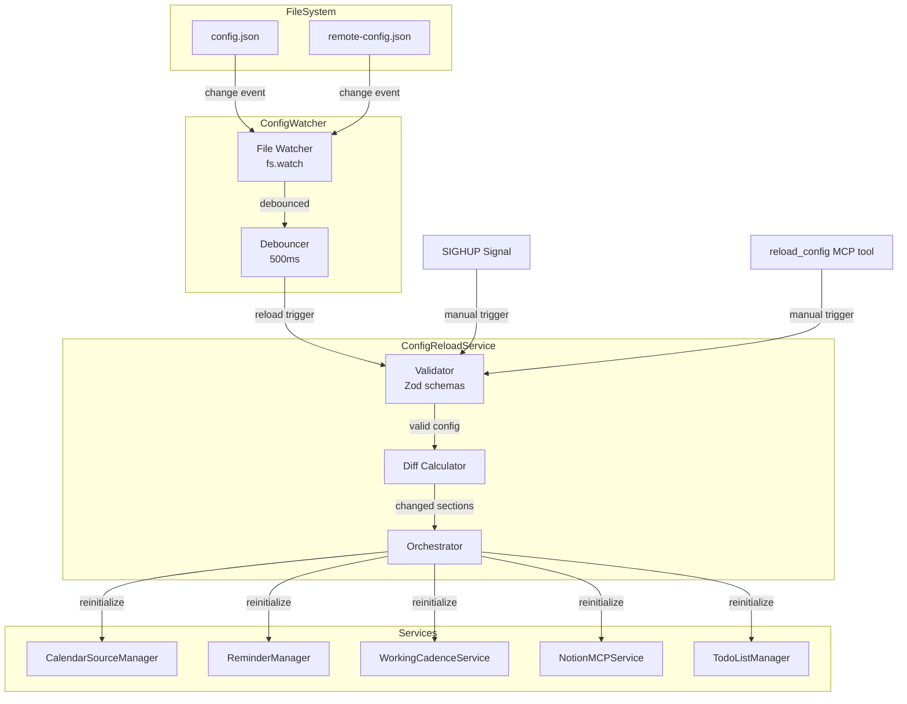
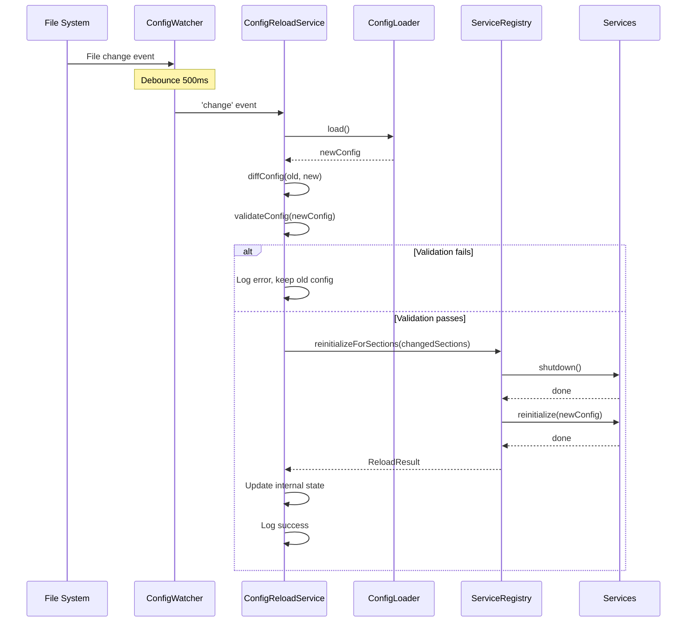
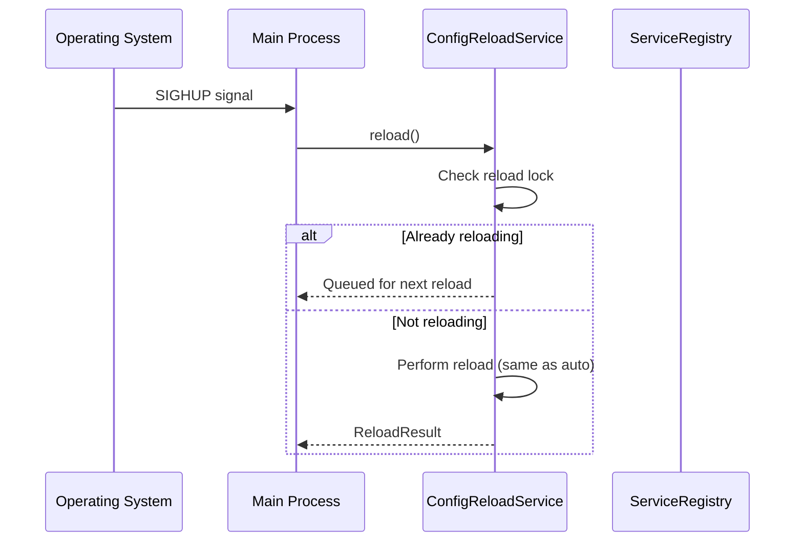

# Design Document: Hot Config Reload

## Overview

Hot Config Reload機能は、sageサーバーの実行中に設定ファイルの変更を検出し、サーバー再起動なしに新しい設定を適用するシステムです。

この機能は以下の3つのコアコンポーネントで構成されます：
1. **ConfigWatcher**: ファイル変更監視とdebounce処理
2. **ConfigReloadService**: 設定の検証・適用・サービス再初期化オーケストレーション
3. **ReloadableService**: 各サービスのhot reload対応インターフェース

## Steering Document Alignment

### Technical Standards (tech.md)
- **TypeScript Strict Mode**: すべての新規コードはstrict modeで記述
- **Zod for validation**: 既存のZodスキーマを活用して設定検証
- **Error Handling**: try-catch with fallback patternを採用
- **Response Time < 2s**: リロード処理を2秒以内に完了

### Project Structure (structure.md)
- **src/config/**: ConfigWatcher、ConfigReloadServiceを配置
- **src/services/**: ReloadableServiceインターフェース、container拡張
- **tests/unit/**: 各コンポーネントのユニットテスト
- **tests/integration/**: リロードフローの統合テスト

## Code Reuse Analysis

### Existing Components to Leverage
- **ConfigLoader** (`src/config/loader.ts`): 設定ファイルの読み込み・保存・検証ロジック
- **ConfigValidation** (`src/config/validation.ts`): Zodスキーマによる設定検証
- **applyConfigUpdates** (`src/config/update-validation.ts`): 設定更新の適用ロジック
- **initializeServices** (`src/index.ts`, `src/cli/mcp-handler.ts`): サービス初期化パターン
- **pino logger** (`src/utils/logger.ts`): 構造化ロギング

### Integration Points
- **index.ts**: stdio transport用のサービス初期化
- **mcp-handler.ts**: HTTP transport用のサービス管理
- **http-server-with-config.ts**: Remote MCP設定管理
- **services/container.ts**: 依存性注入コンテナ

## Architecture

全体的なアーキテクチャは、イベント駆動型のリアクティブパターンを採用します。



## Components and Interfaces

### Component 1: ConfigWatcher

- **Purpose:** 設定ファイルの変更を監視し、debounce処理後にリロードイベントを発行
- **Location:** `src/config/config-watcher.ts`
- **Interfaces:**
  ```typescript
  interface ConfigWatcherOptions {
    debounceMs?: number;  // default: 500
    configPaths?: string[];  // default: [userConfigPath, remoteConfigPath]
  }

  class ConfigWatcher extends EventEmitter {
    constructor(options?: ConfigWatcherOptions);
    start(): Promise<void>;
    stop(): void;
    isWatching(): boolean;

    // Events
    on(event: 'change', listener: (path: string) => void): this;
    on(event: 'error', listener: (error: Error) => void): this;
  }
  ```
- **Dependencies:** Node.js `fs.watch`, EventEmitter
- **Reuses:** `ConfigLoader.getConfigPath()` for path resolution

### Component 2: ConfigReloadService

- **Purpose:** 設定のリロード処理全体をオーケストレーション
- **Location:** `src/config/config-reload-service.ts`
- **Interfaces:**
  ```typescript
  interface ReloadResult {
    success: boolean;
    changedSections: string[];
    reinitializedServices: string[];
    error?: string;
    timestamp: string;
  }

  interface ConfigReloadServiceOptions {
    watcher?: ConfigWatcher;
    enableAutoReload?: boolean;  // default: true
    onReload?: (result: ReloadResult) => void;
  }

  class ConfigReloadService {
    constructor(
      private configLoader: typeof ConfigLoader,
      private serviceRegistry: ServiceRegistry,
      options?: ConfigReloadServiceOptions
    );

    start(): Promise<void>;
    stop(): void;
    reload(): Promise<ReloadResult>;
    getLastReloadResult(): ReloadResult | null;
    isAutoReloadEnabled(): boolean;
  }
  ```
- **Dependencies:** ConfigWatcher, ConfigLoader, ServiceRegistry
- **Reuses:** `ConfigLoader.load()`, `validateConfigUpdate()`, `applyConfigUpdates()`

### Component 3: ServiceRegistry

- **Purpose:** Reloadable servicesの登録・管理・再初期化
- **Location:** `src/services/service-registry.ts`
- **Interfaces:**
  ```typescript
  interface ReloadableService {
    readonly name: string;
    readonly dependsOnSections: string[];
    reinitialize(config: UserConfig): Promise<void>;
    shutdown(): Promise<void>;
  }

  class ServiceRegistry {
    register(service: ReloadableService): void;
    unregister(name: string): void;
    getServicesForSections(sections: string[]): ReloadableService[];
    reinitializeForSections(sections: string[], config: UserConfig): Promise<void>;
    shutdownAll(): Promise<void>;
  }
  ```
- **Dependencies:** ReloadableService implementations
- **Reuses:** Existing service patterns from `services/container.ts`

### Component 4: ConfigDiffer

- **Purpose:** 設定変更の差分を検出し、変更されたセクションを特定
- **Location:** `src/config/config-differ.ts`
- **Interfaces:**
  ```typescript
  interface ConfigDiff {
    changedSections: string[];
    addedKeys: Record<string, unknown>;
    removedKeys: string[];
    modifiedKeys: Record<string, { old: unknown; new: unknown }>;
  }

  function diffConfig(oldConfig: UserConfig, newConfig: UserConfig): ConfigDiff;
  function hasSignificantChanges(diff: ConfigDiff): boolean;
  ```
- **Dependencies:** None (pure function)
- **Reuses:** UserConfig type from `types/config.ts`

### Component 5: ReloadableService Adapters

各既存サービスをReloadableServiceインターフェースに適合させるアダプター群。

- **Location:** `src/services/reloadable/`
- **Services to adapt:**
  ```typescript
  // src/services/reloadable/calendar-source-manager-adapter.ts
  class ReloadableCalendarSourceManager implements ReloadableService {
    readonly name = 'CalendarSourceManager';
    readonly dependsOnSections = ['integrations', 'calendar'];
    // ...
  }

  // src/services/reloadable/reminder-manager-adapter.ts
  class ReloadableReminderManager implements ReloadableService {
    readonly name = 'ReminderManager';
    readonly dependsOnSections = ['integrations', 'reminders'];
    // ...
  }

  // src/services/reloadable/working-cadence-adapter.ts
  class ReloadableWorkingCadenceService implements ReloadableService {
    readonly name = 'WorkingCadenceService';
    readonly dependsOnSections = ['calendar'];
    // ...
  }
  ```
- **Reuses:** Existing service implementations (CalendarSourceManager, ReminderManager, etc.)

## Data Models

### ReloadResult
```typescript
interface ReloadResult {
  success: boolean;
  changedSections: string[];  // ['integrations', 'calendar', ...]
  reinitializedServices: string[];  // ['CalendarSourceManager', ...]
  error?: string;
  timestamp: string;  // ISO 8601 format
  durationMs: number;  // Time taken for reload
}
```

### WatcherState
```typescript
interface WatcherState {
  isWatching: boolean;
  watchedPaths: string[];
  lastChangeDetected?: string;  // ISO 8601
  errorCount: number;
}
```

### ReloadStatus (for MCP tool response)
```typescript
interface ReloadStatus {
  autoReloadEnabled: boolean;
  watcherState: WatcherState;
  lastReloadResult: ReloadResult | null;
  currentConfig: {
    lastUpdated: string;
    sections: string[];
  };
}
```

## Sequence Diagrams

### Automatic Reload Flow



### Manual Reload Flow (SIGHUP)



## Error Handling

### Error Scenarios

1. **File Watch Initialization Failure**
   - **Handling:** Log error at WARN level, continue without auto-reload
   - **User Impact:** Manual reload still available via SIGHUP or MCP tool
   - **Recovery:** Retry on next startup

2. **Configuration File Not Found / Deleted**
   - **Handling:** Log warning, preserve current config in memory
   - **User Impact:** Server continues with last known good config
   - **Recovery:** Resume watching when file is recreated

3. **Invalid JSON Syntax**
   - **Handling:** Log parse error with line/column info, keep previous config
   - **User Impact:** Clear error message in logs, server unaffected
   - **Recovery:** User fixes JSON, next change triggers successful reload

4. **Zod Validation Failure**
   - **Handling:** Log validation errors with path info, keep previous config
   - **User Impact:** Detailed error message showing which fields failed
   - **Recovery:** User fixes config, next change triggers successful reload

5. **Service Re-initialization Failure**
   - **Handling:** Catch per-service, log error, mark service as degraded
   - **User Impact:** Failed service unavailable, others continue working
   - **Recovery:** Next reload attempts re-initialization

6. **Rapid File Changes (Debounce Scenario)**
   - **Handling:** Only final change triggers reload after debounce period
   - **User Impact:** Slight delay (500ms) before reload, but consistent
   - **Recovery:** N/A - this is expected behavior

### Error Handling Pattern

```typescript
async function safeReload(config: UserConfig): Promise<ReloadResult> {
  const startTime = Date.now();
  const result: ReloadResult = {
    success: false,
    changedSections: [],
    reinitializedServices: [],
    timestamp: new Date().toISOString(),
    durationMs: 0,
  };

  try {
    // 1. Validate new config
    const validation = await validateConfig(config);
    if (!validation.success) {
      throw new ConfigValidationError(validation.errors);
    }

    // 2. Calculate diff
    const diff = diffConfig(this.currentConfig, config);
    result.changedSections = diff.changedSections;

    // 3. Reinitialize affected services
    const services = this.registry.getServicesForSections(diff.changedSections);
    for (const service of services) {
      try {
        await service.shutdown();
        await service.reinitialize(config);
        result.reinitializedServices.push(service.name);
      } catch (serviceError) {
        logger.error({ service: service.name, error: serviceError },
          'Service re-initialization failed');
        // Continue with other services
      }
    }

    // 4. Update current config
    this.currentConfig = config;
    result.success = true;
  } catch (error) {
    result.error = error instanceof Error ? error.message : String(error);
    logger.error({ error }, 'Config reload failed');
  } finally {
    result.durationMs = Date.now() - startTime;
  }

  return result;
}
```

## Testing Strategy

### Unit Testing

**ConfigWatcher Tests** (`tests/unit/config/config-watcher.test.ts`)
- Debounce behavior: multiple rapid changes trigger single event
- Error handling: invalid path, permission denied
- Start/stop lifecycle
- Event emission correctness

**ConfigReloadService Tests** (`tests/unit/config/config-reload-service.test.ts`)
- Successful reload flow
- Validation failure handling
- Service re-initialization ordering
- Reload lock (concurrent reload prevention)
- SIGHUP signal handling

**ConfigDiffer Tests** (`tests/unit/config/config-differ.test.ts`)
- Section change detection
- Nested object diff
- Array diff handling
- Empty config edge cases

**ServiceRegistry Tests** (`tests/unit/services/service-registry.test.ts`)
- Service registration/unregistration
- Section-based service filtering
- Graceful shutdown ordering

### Integration Testing

**Reload Flow Tests** (`tests/integration/config-reload.test.ts`)
- End-to-end reload with real ConfigLoader
- Service re-initialization verification
- Config persistence after reload
- Multiple reload cycles

**File System Tests** (`tests/integration/config-watcher.test.ts`)
- Real file system watching (with temp files)
- File deletion/recreation scenarios
- Permission change handling

### End-to-End Testing

**MCP Tool Tests** (`tests/e2e/reload-config-tool.test.ts`)
- `reload_config` tool invocation
- Status reporting via `check_setup_status`
- Error message formatting

### Platform-Specific Tests
- macOS: Full functionality
- Linux: Full functionality
- Windows: File watching compatibility (fs.watch behavior differences)

## MCP Tool Integration

### New Tool: reload_config

```typescript
// Added to src/index.ts tool definitions
{
  name: 'reload_config',
  description: 'Manually trigger a configuration reload without server restart',
  inputSchema: {
    type: 'object',
    properties: {
      force: {
        type: 'boolean',
        description: 'Force reload even if no changes detected',
        default: false,
      },
    },
  },
}
```

### Updated Tool: check_setup_status

Extend existing `check_setup_status` response to include:
```typescript
interface SetupStatus {
  // ... existing fields
  hotReload: {
    enabled: boolean;
    watching: boolean;
    lastReload: ReloadResult | null;
  };
}
```

## Configuration Options

### Environment Variables

```bash
# Disable auto-reload (for testing or specific deployments)
SAGE_DISABLE_HOT_RELOAD=true

# Custom debounce delay (ms)
SAGE_HOT_RELOAD_DEBOUNCE=1000
```

### Config Section (Future Enhancement)

```typescript
// Potential addition to UserConfig
interface UserConfig {
  // ... existing fields
  hotReload?: {
    enabled?: boolean;  // default: true
    debounceMs?: number;  // default: 500
    watchRemoteConfig?: boolean;  // default: true
  };
}
```

## Performance Considerations

1. **File Watching Efficiency**
   - Use native `fs.watch` (not polling) for minimal CPU usage
   - Single watcher instance for all config files

2. **Debounce Optimization**
   - 500ms default balances responsiveness with stability
   - Configurable for different use cases

3. **Service Re-initialization**
   - Only affected services are restarted
   - Parallel re-initialization where possible
   - Graceful shutdown prevents resource leaks

4. **Memory Usage**
   - Previous config kept in memory for diff calculation
   - Single copy after successful reload

## Security Considerations

1. **File Path Validation**
   - Only watch user-owned config files
   - Prevent path traversal attacks

2. **Config Content Validation**
   - All input validated via Zod before use
   - No code execution from config

3. **Sensitive Data Handling**
   - OAuth tokens not logged during reload
   - Diff output redacts sensitive fields
