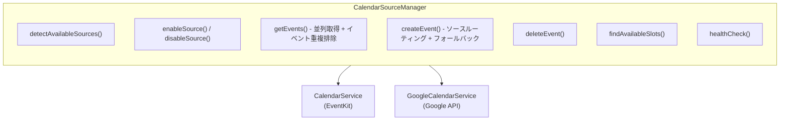

# 外部統合仕様

このドキュメントでは、sageシステムの外部サービス統合とRemote MCP設定について説明します。

## CLIインターフェース

### CLIオプション処理

sageは2つのモードで動作します：

1. **Local MCP Mode (Stdio Transport)**: デフォルトモード
2. **Remote MCP Mode (HTTP/WebSocket)**: `--remote`オプション指定時

```bash
# Local MCP Mode (デフォルト)
npx @shin1ohno/sage

# Remote MCP Mode
npx @shin1ohno/sage --remote
npx @shin1ohno/sage --remote --port 3000
npx @shin1ohno/sage --remote --config ~/.sage/remote-config.json
```

### CLI Arguments

| オプション | 説明 | デフォルト値 | 例 |
|----------|------|------------|---|
| `--remote` | HTTPサーバーモードで起動 | false | `--remote` |
| `--port` | HTTPサーバーのポート番号 | 3000 | `--port 8080` |
| `--host` | HTTPサーバーのホストアドレス | 0.0.0.0 | `--host localhost` |
| `--config` | 設定ファイルのパス | ~/.sage/config.json | `--config /path/to/config.json` |
| `--remote-config` | Remote MCP設定ファイルのパス | ~/.sage/remote-config.json | `--remote-config /path/to/remote.json` |

### 環境変数

| 変数名 | 説明 | 例 |
|-------|------|---|
| `SAGE_REMOTE_MODE` | Remote MCPモードを有効化 | `true` |
| `SAGE_PORT` | HTTPサーバーポート | `3000` |
| `SAGE_AUTH_SECRET` | JWT認証シークレット | `your-secret-key` |
| `NOTION_API_KEY` | Notion API Key (Notion MCP用) | `secret_xxx` |

## Remote MCP Server

### HTTPサーバーエンドポイント

| エンドポイント | メソッド | 説明 |
|-------------|---------|------|
| `/health` | GET | ヘルスチェック |
| `/mcp` | POST | MCP JSON-RPCリクエスト |
| `/auth/token` | POST | JWT認証トークン取得 |

### HTTP Transport

**POST `/mcp` (JSON-RPC)**

MCP JSON-RPCリクエストの送受信。

```typescript
// Request
{
  "jsonrpc": "2.0",
  "id": 1,
  "method": "tools/call",
  "params": {
    "name": "analyze_tasks",
    "arguments": {
      "tasks": ["タスク1", "タスク2"]
    }
  }
}

// Response
{
  "jsonrpc": "2.0",
  "id": 1,
  "result": {
    "analyzed_tasks": [...]
  }
}
```

### Remote MCP設定ファイル

**~/.sage/remote-config.json**

```json
{
  "remote": {
    "enabled": true,
    "port": 3000,
    "host": "0.0.0.0",
    "auth": {
      "type": "jwt",
      "secret": "your-secure-secret-key-at-least-32-chars",
      "expiresIn": "24h"
    },
    "cors": {
      "allowedOrigins": ["*"]
    },
    "rateLimit": {
      "requestsPerMinute": 60,
      "requestsPerHour": 1000,
      "burstLimit": 10
    }
  }
}
```

### 認証フロー

#### JWT認証

1. クライアントが`/auth/token`にPOST
2. サーバーがJWTトークンを返却
3. クライアントが`Authorization: Bearer <token>`ヘッダーで`/mcp`にアクセス

```bash
# トークン取得
curl -X POST http://localhost:3000/auth/token \
  -H "Content-Type: application/json" \
  -d '{"secret": "your-secure-secret-key"}'

# MCPリクエスト
curl -X POST http://localhost:3000/mcp \
  -H "Authorization: Bearer <token>" \
  -H "Content-Type: application/json" \
  -d '{...}'
```

### 設定読み込み優先順位

1. コマンドライン引数 (`--config`, `--remote-config`)
2. 環境変数 (`SAGE_REMOTE_MODE`, `SAGE_PORT`)
3. デフォルト設定ファイル (`~/.sage/config.json`, `~/.sage/remote-config.json`)
4. ハードコードされたデフォルト値

## Apple Reminders統合

### プラットフォーム別実装

| プラットフォーム | 実装方式 | 権限要求 | フォールバック |
|----------------|----------|---------|--------------|
| **macOS Desktop** | AppleScript | macOS Automation | 手動コピー |
| **iOS/iPadOS** | Remote MCP経由 | N/A (サーバー側で処理) | 手動コピー |
| **Web** | Remote MCP経由 | N/A (サーバー側で処理) | 手動コピー |

### macOS AppleScript統合

```typescript
import applescript from 'node-applescript';

async function createAppleReminder(request: ReminderRequest): Promise<ReminderResult> {
  const script = `
    tell application "Reminders"
      set myList to list "${request.list || 'Today'}"
      set newReminder to make new reminder at end of myList
      set name of newReminder to "${request.title}"
      ${request.notes ? `set body of newReminder to "${request.notes}"` : ''}
      ${request.dueDate ? `set due date of newReminder to date "${request.dueDate}"` : ''}
      return id of newReminder
    end tell
  `;

  return new Promise((resolve) => {
    applescript.execString(script, (error: any, result: any) => {
      if (error) {
        resolve({
          success: false,
          method: 'applescript',
          error: `AppleScript エラー: ${error.message}`
        });
      } else {
        resolve({
          success: true,
          method: 'applescript',
          reminderId: result
        });
      }
    });
  });
}
```

### 短期/長期タスクの振り分け

```typescript
function determineDestination(task: Task, config: UserConfig): 'apple' | 'notion' {
  const deadline = task.deadline ? new Date(task.deadline) : null;
  const now = new Date();

  if (!deadline) {
    // 期限なし → 長期タスク → Notion
    return 'notion';
  }

  const daysUntilDeadline = Math.ceil((deadline.getTime() - now.getTime()) / (1000 * 60 * 60 * 24));
  const threshold = config.integrations.appleReminders.threshold;

  if (daysUntilDeadline <= threshold) {
    // 短期タスク → Apple Reminders
    return 'apple';
  } else {
    // 長期タスク → Notion
    return 'notion';
  }
}
```

## Calendar統合

### プラットフォーム別実装

| プラットフォーム | カレンダーソース | 権限要求 | フォールバック |
|----------------|-----------------|---------|--------------|
| **macOS Desktop** | EventKit + Google Calendar | macOS Automation / OAuth 2.0 | 他ソースに自動切り替え |
| **Linux/Windows Desktop** | Google Calendar のみ | OAuth 2.0 | 手動入力 |
| **iOS/iPadOS** | Remote MCP経由 (EventKit + Google) | N/A (サーバー側で処理) | 他ソースに自動切り替え |
| **Web** | Remote MCP経由 (EventKit + Google) | N/A (サーバー側で処理) | 他ソースに自動切り替え |

### マルチソースアーキテクチャ

sageは複数のカレンダーソースを同時に管理できます：



### イベント重複排除

複数ソースからイベントを取得する際、重複を排除します：

1. **iCalUID マッチング**: 同じiCalUIDを持つイベントは同一とみなす
2. **ヒューリスティックマッチング**: タイトル + 開始時刻 + 終了時刻が一致するイベントは同一とみなす

```typescript
function areEventsDuplicate(event1: CalendarEvent, event2: CalendarEvent): boolean {
  // iCalUID が両方に存在する場合
  if (event1.iCalUID && event2.iCalUID) {
    return event1.iCalUID === event2.iCalUID;
  }

  // ヒューリスティックマッチング
  return (
    event1.title === event2.title &&
    event1.startDate === event2.startDate &&
    event1.endDate === event2.endDate
  );
}
```

### エラー時の自動フォールバック

カレンダーソースでエラーが発生した場合、自動的に他のソースを使用します：

```typescript
// Google Calendar API エラー時
try {
  events = await googleCalendarService.listEvents(request);
} catch (error) {
  console.warn('Google Calendar unavailable, falling back to EventKit');
  events = await calendarService.listEvents(request);
}
```

### macOS EventKit統合 (AppleScriptObjC)

```applescript
use framework "EventKit"
use scripting additions

set eventStore to current application's EKEventStore's alloc()'s init()
set startDate to current application's NSDate's dateWithTimeIntervalSince1970:${Date.parse(startDate) / 1000}
set endDate to current application's NSDate's dateWithTimeIntervalSince1970:${Date.parse(endDate) / 1000}

set calendars to eventStore's calendarsForEntityType:0
set predicate to eventStore's predicateForEventsWithStartDate:startDate endDate:endDate calendars:calendars
set events to eventStore's eventsMatchingPredicate:predicate

-- イベントをJSON形式で返す
```

### カレンダーイベント一覧取得

**ツール名:** `list_calendar_events`

**入力パラメータ:**
```typescript
{
  startDate: string;      // ISO 8601形式 (例: "2025-01-15")
  endDate: string;        // ISO 8601形式 (例: "2025-01-20")
  calendarName?: string;  // 特定カレンダーでフィルタ（省略時は全カレンダー）
}
```

**出力:**
```typescript
{
  events: CalendarEvent[];
  period: { start: string; end: string; };
  totalEvents: number;
}
```

### カレンダーイベント作成

**ツール名:** `create_calendar_event`

**入力パラメータ:**
```typescript
{
  title: string;           // 必須: イベントタイトル
  startDate: string;       // 必須: ISO 8601形式
  endDate: string;         // 必須: ISO 8601形式
  location?: string;
  notes?: string;
  calendarName?: string;   // 未指定時はデフォルトカレンダー
  alarms?: string[];       // 例: ["-15m", "-1h", "-1d"]
}
```

**出力:**
```typescript
{
  success: boolean;
  eventId?: string;
  title?: string;
  startDate?: string;
  endDate?: string;
  calendarName?: string;
  isAllDay?: boolean;
  message: string;
}
```

### カレンダーイベント削除

**ツール名:** `delete_calendar_event`

**入力パラメータ:**
```typescript
{
  eventId: string;         // 必須: イベントID (UUID または フルID)
  calendarName?: string;   // 未指定時は全カレンダー検索
}
```

**出力:**
```typescript
{
  success: boolean;
  eventId: string;
  title?: string;
  calendarName?: string;
  message: string;
}
```

**バッチ削除:** `delete_calendar_events_batch`

```typescript
{
  eventIds: string[];      // 必須: イベントIDの配列
  calendarName?: string;
}
```

### カレンダーイベント返信

**ツール名:** `respond_to_calendar_event`

**入力パラメータ:**
```typescript
{
  eventId: string;         // 必須: イベントID
  response: "accept" | "decline" | "tentative";  // 必須
  comment?: string;        // オプション: コメント
}
```

**バッチ返信:** `respond_to_calendar_events_batch`

```typescript
{
  eventIds: string[];      // 必須: イベントIDの配列
  response: "accept" | "decline" | "tentative";
  comment?: string;
}
```

**注意:**
- 主催者であるイベントはスキップ
- 出席者情報のないイベント（個人の予定）はスキップ
- Google Calendarイベントは Calendar API または EventKit経由で返信
- 読み取り専用カレンダーはエラー

## Google Calendar API統合

### 概要

Google Calendar APIを使用したカレンダー統合。EventKitが利用できないLinux/Windowsプラットフォームでも、またmacOSでもEventKitと併用してカレンダー機能を提供します。

### OAuth 2.0認証

**GoogleOAuthHandler** がOAuth 2.0フローを管理します：

```typescript
class GoogleOAuthHandler {
  // PKCE対応の認証URL生成
  async getAuthorizationUrl(): Promise<{ url: string; codeVerifier: string }>;

  // 認証コードとトークンの交換
  async exchangeCodeForTokens(code: string, codeVerifier: string): Promise<OAuthTokens>;

  // トークンのリフレッシュ
  async refreshAccessToken(refreshToken: string): Promise<OAuthTokens>;

  // トークンの検証（期限切れ時は自動リフレッシュ）
  async validateToken(): Promise<boolean>;

  // トークンの保存・取得（暗号化）
  async storeTokens(tokens: OAuthTokens): Promise<void>;
  async getTokens(): Promise<OAuthTokens | null>;
}
```

### Google Calendar Service

**GoogleCalendarService** がGoogle Calendar APIとの通信を担当：

```typescript
class GoogleCalendarService {
  // カレンダー一覧取得
  async listCalendars(): Promise<CalendarInfo[]>;

  // イベント一覧取得（繰り返しイベント展開、ページネーション対応）
  async listEvents(request: ListEventsRequest): Promise<CalendarEvent[]>;

  // イベント作成（終日イベント、アラーム、出席者対応）
  async createEvent(request: CreateEventRequest, calendarId?: string): Promise<CalendarEvent>;

  // イベント更新
  async updateEvent(eventId: string, updates: Partial<CreateEventRequest>): Promise<CalendarEvent>;

  // イベント削除（単体・バッチ）
  async deleteEvent(eventId: string): Promise<void>;
  async deleteEventsBatch(eventIds: string[]): Promise<void>;

  // イベント返信
  async respondToEvent(eventId: string, response: 'accepted' | 'declined' | 'tentative'): Promise<void>;

  // ヘルスチェック
  async isAvailable(): Promise<boolean>;
}
```

### カレンダーソース管理ツール

**ツール名:** `list_calendar_sources`

有効なカレンダーソースとその状態を一覧表示します。

**入力パラメータ:** なし

**出力:**
```typescript
{
  sources: {
    eventkit: {
      available: boolean;      // プラットフォームで利用可能か
      enabled: boolean;        // 設定で有効化されているか
      healthy: boolean;        // 現在正常に動作しているか
    };
    google: {
      available: boolean;
      enabled: boolean;
      healthy: boolean;
      authenticated: boolean;  // OAuth認証済みか
    };
  };
  primarySource: 'eventkit' | 'google' | null;
}
```

---

**ツール名:** `set_calendar_source`

カレンダーソースの有効/無効を切り替えます。

**入力パラメータ:**
```typescript
{
  source: 'eventkit' | 'google';  // 必須: 対象ソース
  enabled: boolean;                // 必須: 有効化するか
}
```

**出力:**
```typescript
{
  success: boolean;
  source: string;
  enabled: boolean;
  message: string;
  oauthRequired?: boolean;  // Google Calendar初回有効化時
  oauthUrl?: string;        // OAuth認証URL（必要な場合）
}
```

---

**ツール名:** `sync_calendar_sources`

EventKitとGoogle Calendar間でイベントを同期します（両方有効時のみ）。

**入力パラメータ:** なし

**出力:**
```typescript
{
  success: boolean;
  syncResult: {
    added: number;
    updated: number;
    deleted: number;
    conflicts: number;
  };
  lastSyncTime: string;  // ISO 8601形式
  message: string;
}
```

---

**ツール名:** `get_calendar_sync_status`

カレンダー同期の状態を取得します。

**入力パラメータ:** なし

**出力:**
```typescript
{
  success: boolean;
  syncEnabled: boolean;
  lastSyncTime?: string;
  nextSyncTime?: string;
  errors?: string[];
}
```

### Google Calendar設定例

**~/.sage/config.json**

```json
{
  "calendar": {
    "sources": {
      "eventkit": {
        "enabled": true
      },
      "google": {
        "enabled": true,
        "clientId": "your-client-id.apps.googleusercontent.com",
        "clientSecret": "your-client-secret",
        "defaultCalendar": "primary",
        "excludedCalendars": ["holidays@group.v.calendar.google.com"]
      }
    },
    "syncEnabled": true,
    "syncInterval": 3600
  }
}
```

### エラーハンドリング

```typescript
// Google API エラーの処理
interface GoogleCalendarError {
  code: number;        // HTTP status code
  message: string;
  errors: Array<{
    domain: string;
    reason: string;
    message: string;
  }>;
}

// リトライロジック（指数バックオフ）
async function retryWithBackoff<T>(
  fn: () => Promise<T>,
  maxRetries: number = 3,
  baseDelay: number = 1000
): Promise<T>;
```

| エラーコード | 意味 | 対処 |
|------------|------|-----|
| 401 | 認証エラー | トークンリフレッシュを試行 |
| 403 | 権限エラー | ユーザーに再認証を促す |
| 429 | レート制限 | 指数バックオフでリトライ |
| 500/503 | サーバーエラー | リトライ後、EventKitにフォールバック |

## Notion統合

### Notion MCP Server経由の統合

sageはNotion MCP Serverと通信してNotionと統合します。

**前提条件:**
- Notion MCP Serverが設定済み
- `NOTION_API_KEY`環境変数が設定済み
- Notion Database IDが設定済み

### MCP Client実装

```typescript
import { Client } from '@modelcontextprotocol/sdk/client/index.js';
import { StdioClientTransport } from '@modelcontextprotocol/sdk/client/stdio.js';

class NotionMCPService {
  private client: Client;
  private transport: StdioClientTransport;

  async connect() {
    this.transport = new StdioClientTransport({
      command: 'npx',
      args: ['-y', '@modelcontextprotocol/server-notion']
    });

    this.client = new Client({
      name: 'sage-notion-client',
      version: '1.0.0'
    }, {
      capabilities: {}
    });

    await this.client.connect(this.transport);
  }

  async createPage(request: NotionPageRequest) {
    const result = await this.client.request({
      method: 'tools/call',
      params: {
        name: 'create_page',
        arguments: {
          database_id: request.databaseId,
          properties: request.properties
        }
      }
    });
    return result;
  }

  async disconnect() {
    if (this.client) {
      await this.client.close();
    }
  }
}
```

### Notionページ作成

**ツール名:** `sync_to_notion`

**入力パラメータ:**
```typescript
{
  taskTitle: string;
  priority: Priority;
  deadline?: string;
  stakeholders?: string[];
  estimatedMinutes?: number;
}
```

**出力:**
```typescript
{
  success: boolean;
  pageId?: string;
  pageUrl?: string;
  error?: string;
}
```

### Notion設定例

**~/.sage/config.json**

```json
{
  "integrations": {
    "notion": {
      "enabled": true,
      "threshold": 8,
      "unit": "days",
      "databaseId": "your-database-id-here",
      "mcpServerName": "notion",
      "propertyMappings": {
        "Title": "title",
        "Priority": "priority",
        "Deadline": "deadline",
        "Stakeholders": "stakeholders"
      }
    }
  }
}
```

## Working Cadence (勤務リズム)

### 取得ツール

**ツール名:** `get_working_cadence`

**入力パラメータ:**
```typescript
{
  dayOfWeek?: 'Monday' | 'Tuesday' | 'Wednesday' | 'Thursday' | 'Friday' | 'Saturday' | 'Sunday';
  date?: string; // ISO 8601形式 (例: "2025-01-15")
}
```

**出力:**
```typescript
{
  success: boolean;
  user: { name: string; timezone: string; };
  workingHours: { start: string; end: string; totalMinutes: number; };
  weeklyPattern: {
    deepWorkDays: string[];
    meetingHeavyDays: string[];
    normalDays: string[];
  };
  deepWorkBlocks: DeepWorkBlockInfo[];
  weeklyReview?: { enabled: boolean; day: string; time: string; };
  specificDay?: {
    date?: string;
    dayOfWeek: string;
    dayType: 'deep-work' | 'meeting-heavy' | 'normal';
    recommendations: string[];
  };
  recommendations: SchedulingRecommendation[];
  summary: string;
}
```

### 推奨事項の生成

```typescript
function generateRecommendations(config: CalendarConfig): SchedulingRecommendation[] {
  const recommendations: SchedulingRecommendation[] = [];

  if (config.deepWorkDays.length > 0) {
    recommendations.push({
      type: 'deep-work',
      recommendation: `複雑なタスクは${formatDays(config.deepWorkDays)}にスケジュールしてください`,
      bestDays: config.deepWorkDays,
      reason: 'これらの日はDeep Work日として設定されており、集中作業に適しています'
    });
  }

  if (config.meetingHeavyDays.length > 0) {
    recommendations.push({
      type: 'meeting',
      recommendation: `ミーティングは${formatDays(config.meetingHeavyDays)}に集中させることを推奨します`,
      bestDays: config.meetingHeavyDays,
      reason: 'これらの日はミーティング集中日として設定されています'
    });
  }

  return recommendations;
}
```

## エラーハンドリング

### 統合エラー

```typescript
interface IntegrationError {
  service: 'apple_reminders' | 'notion' | 'calendar';
  method: string;
  error: string;
  fallbackAvailable: boolean;
  fallbackText?: string;
}

function handleIntegrationError(error: IntegrationError): string {
  const messages = {
    apple_reminders: 'Apple Remindersへのアクセスに失敗しました。',
    notion: 'Notionへのアクセスに失敗しました。Notion MCP Serverが正しく設定されているか確認してください。',
    calendar: 'カレンダーへのアクセスに失敗しました。'
  };

  let message = messages[error.service] || '外部サービスへのアクセスに失敗しました。';

  if (error.fallbackAvailable && error.fallbackText) {
    message += `\n\n手動でコピーして使用してください:\n${error.fallbackText}`;
  }

  return message;
}
```
