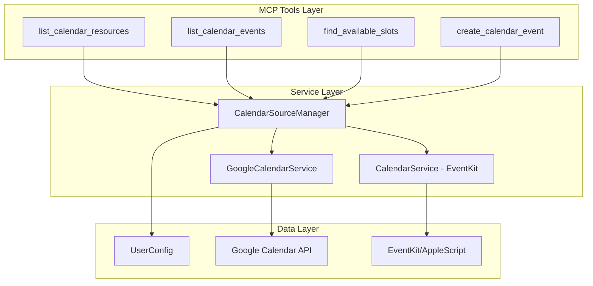

# Design Document: Multi-Calendar Resources

## Overview

この機能は、ユーザーが複数のカレンダーリソース（Google Calendar、EventKit）を同時に参照・管理できるようにするものです。既存の `CalendarSourceManager` を拡張し、カレンダーリソースレベルでの選択・フィルタリング機能を追加します。

## Steering Document Alignment

### Technical Standards (tech.md)
- 既存のTypeScriptパターンに従う
- Zodスキーマによる入力バリデーション
- 既存のログ出力パターン（pinoベース）を使用
- エラーハンドリングは既存のリトライロジックを活用

### Project Structure (structure.md)
- 型定義は `src/types/` に配置
- サービスロジックは `src/integrations/` に配置
- MCPツールハンドラは `src/tools/calendar/` に配置
- 設定は `~/.sage/config.json` に保存

## Code Reuse Analysis

### Existing Components to Leverage
- **CalendarSourceManager**: マルチソースイベント取得・マージの基盤
- **GoogleCalendarService.listCalendars()**: Google Calendarのカレンダー一覧取得
- **CalendarService**: EventKitからのカレンダー情報取得（AppleScript経由）
- **retryWithBackoff()**: API呼び出しのリトライロジック
- **calendarLogger**: ログ出力ユーティリティ

### Integration Points
- **UserConfig.calendar.sources**: カレンダーソース設定（既存）
- **GoogleCalendarSourceConfig.excludedCalendars**: 除外カレンダー設定（既存）
- **MCPツール**: `list_calendar_events`, `find_available_slots`, `create_calendar_event`

## Architecture



## Components and Interfaces

### Component 1: CalendarResource Type

- **Purpose:** カレンダーリソースの統一的な表現
- **Location:** `src/types/calendar.ts`
- **Interfaces:**
```typescript
export interface CalendarResource {
  id: string;                              // カレンダー固有ID
  name: string;                            // 表示名
  source: 'eventkit' | 'google';           // ソースタイプ
  color?: string;                          // カレンダーカラー（hex）
  isPrimary?: boolean;                     // プライマリカレンダーかどうか
  isWritable?: boolean;                    // 書き込み可能か
  accessRole?: 'owner' | 'writer' | 'reader' | 'freeBusyReader';
}
```
- **Reuses:** 既存の `CalendarType` 定義パターン

### Component 2: CalendarSourceManager Extension

- **Purpose:** カレンダーリソース一覧取得・フィルタリング機能
- **Location:** `src/integrations/calendar-source-manager.ts`
- **New Methods:**
```typescript
// カレンダーリソース一覧取得
async listCalendarResources(): Promise<CalendarResource[]>

// 複数カレンダーIDでのイベント取得（既存getEventsの拡張）
async getEvents(
  startDate: string,
  endDate: string,
  calendarIds?: string[]  // 単一 → 配列に変更
): Promise<CalendarEvent[]>

// 設定から選択済みカレンダーを取得
getSelectedCalendarIds(): string[]

// 選択済みカレンダーを設定に更新（永続化は呼び出し元のConfigManagerが担当）
updateSelectedCalendarIds(calendarIds: string[]): void
```
- **Dependencies:** GoogleCalendarService, CalendarService, UserConfig
- **Reuses:** 既存の `getEnabledSources()`, `deduplicateEvents()`
- **Config Persistence:** 設定の永続化は呼び出し元（MCPハンドラ）が `ConfigManager.save()` を呼び出す責任を持つ（既存パターンに準拠）

### Component 3: Configuration Extension

- **Purpose:** 選択済みカレンダーの永続化
- **Location:** `src/types/config.ts`
- **Changes:**
```typescript
export interface GoogleCalendarSourceConfig {
  enabled: boolean;
  defaultCalendar: string;
  excludedCalendars: string[];
  selectedCalendars?: string[];  // NEW: 明示的に選択されたカレンダー
  syncInterval: number;
  enableNotifications: boolean;
}

export interface EventKitSourceConfig {
  enabled: boolean;
  selectedCalendars?: string[];  // NEW: 明示的に選択されたカレンダー
}
```
- **Reuses:** 既存の `CalendarSources` 構造

### Component 4: FindSlotsRequest Extension

- **Purpose:** 空き時間検索で参照するカレンダーを指定可能にする
- **Location:** `src/integrations/calendar-source-manager.ts`
- **Changes:**
```typescript
export interface FindSlotsRequest {
  startDate: string;
  endDate: string;
  minDurationMinutes?: number;
  maxDurationMinutes?: number;
  workingHours?: { start: string; end: string };
  preferredWorkingLocation?: PreferredWorkingLocation;
  respectBlockingEventTypes?: boolean;
  calendarIds?: string[];  // NEW: 特定カレンダーのみを考慮
}
```
- **Behavior:**
  - `calendarIds` が指定された場合、そのカレンダーのイベントのみを取得
  - 未指定の場合は `getSelectedCalendarIds()` または全有効カレンダーを使用
- **Reuses:** 既存の `findAvailableSlots()` ロジック

### Component 5: MCP Tool - list_calendar_resources

- **Purpose:** 利用可能なカレンダーリソースをMCP経由で公開
- **Location:** `src/tools/calendar/handlers.ts`
- **Interface:**
```typescript
// Input Schema
{
  name: "list_calendar_resources",
  description: "List all available calendar resources from enabled sources",
  inputSchema: {
    type: "object",
    properties: {
      source: {
        type: "string",
        enum: ["eventkit", "google", "all"],
        description: "Filter by source (default: all)"
      }
    }
  }
}

// Output
{
  resources: CalendarResource[],
  sources: {
    eventkit: { available: boolean, error?: string },
    google: { available: boolean, error?: string }
  }
}
```
- **Reuses:** 既存のMCPツール登録パターン

## Data Models

### CalendarResource
```typescript
interface CalendarResource {
  id: string;              // e.g., "primary", "work@gmail.com", "EventKit:Calendar1"
  name: string;            // e.g., "Work Calendar", "Personal"
  source: 'eventkit' | 'google';
  color?: string;          // e.g., "#4285f4"
  isPrimary?: boolean;     // true for default/primary calendar
  isWritable?: boolean;    // true if user can create events
  accessRole?: 'owner' | 'writer' | 'reader' | 'freeBusyReader';
}
```

### Extended CalendarEvent
```typescript
// 既存のCalendarEventを拡張
interface CalendarEvent {
  id: string;
  title: string;
  start: string;
  end: string;
  isAllDay: boolean;
  source: 'eventkit' | 'google';
  iCalUID?: string;
  attendees?: Array<{ email: string; status?: string }>;
  status?: string;
  // NEW fields
  calendarId?: string;     // 所属カレンダーID
  calendarName?: string;   // 所属カレンダー名
  calendarColor?: string;  // カレンダーカラー
}
```

### Configuration Addition
```json
{
  "calendar": {
    "sources": {
      "eventkit": {
        "enabled": true,
        "selectedCalendars": ["Calendar", "Work"]
      },
      "google": {
        "enabled": true,
        "defaultCalendar": "primary",
        "excludedCalendars": [],
        "selectedCalendars": ["primary", "work@gmail.com"],
        "syncInterval": 300,
        "enableNotifications": true
      }
    }
  }
}
```

## Performance Optimization

### カレンダーリソースキャッシュ
- **TTL:** 5分間
- **無効化条件:** OAuth再認証時、設定変更時
- **実装:** メモリ内キャッシュ（`Map<string, { data: CalendarResource[], timestamp: number }>`）

### 並列API呼び出し
- **パターン:** `Promise.allSettled()` を使用して EventKit と Google Calendar を並列取得
- **タイムアウト:** 各ソースに3秒のタイムアウトを設定
- **フォールバック:** 一方がタイムアウトしても他方の結果は返却

### パフォーマンス目標
| 操作 | 目標時間 | 実現方法 |
|------|---------|---------|
| カレンダーリソース一覧取得 | 2秒以内 | キャッシュ + 並列取得 |
| 複数カレンダーからのイベント取得 | 5秒以内 | 並列取得 + 部分障害継続 |

## Error Handling

### Error Scenarios

1. **ソース接続エラー**
   - **Handling:** 一部ソースが失敗しても他のソースからは取得継続。失敗したソースはログに記録し、レスポンスの `sources` フィールドにエラーを含める
   - **User Impact:** 利用可能なカレンダーのみ表示。エラーメッセージで接続問題を通知

2. **指定カレンダーが存在しない**
   - **Handling:** 存在しないカレンダーIDはスキップし、警告ログを出力。有効なカレンダーからのみイベントを取得
   - **User Impact:** 有効なカレンダーのイベントは正常に表示。存在しないカレンダーについては警告メッセージ

3. **書き込み不可カレンダーへのイベント作成**
   - **Handling:** イベント作成前に `isWritable` をチェック。不可の場合はエラーを返し、代替カレンダーを提案
   - **User Impact:** 明確なエラーメッセージと代替案の提示

4. **OAuth認証切れ**
   - **Handling:** 既存のOAuth再認証フローを活用（`GoogleOAuthHandler`）
   - **User Impact:** 再認証が必要な旨のメッセージを表示

## Testing Strategy

### Unit Testing
- `CalendarSourceManager.listCalendarResources()` のモックテスト
- カレンダーフィルタリングロジックのテスト
- 設定の読み書きテスト
- エラーハンドリングのテスト（部分的ソース障害）

### Integration Testing
- Google Calendar APIとの統合テスト（モック使用）
- EventKitとの統合テスト（macOS環境のみ）
- 複数ソースからのイベント取得・マージテスト

### End-to-End Testing
- MCPツール `list_calendar_resources` の動作確認
- `list_calendar_events` でのカレンダーフィルタリング確認
- `find_available_slots` での複数カレンダー考慮確認
- `create_calendar_event` での宛先カレンダー指定確認

## Implementation Notes

### EventKitカレンダー一覧取得

**CalendarServiceへの新メソッド追加:**
- **Location:** `src/integrations/calendar-service.ts`
- **Method:** `async listCalendars(): Promise<CalendarResource[]>`

**AppleScript実装:**
```applescript
use framework "EventKit"
use framework "Foundation"
use scripting additions

set eventStore to current application's EKEventStore's alloc()'s init()
set calendars to eventStore's calendarsForEntityType:0

set calendarList to {}
repeat with cal in calendars
    set calTitle to cal's title() as text
    set calId to cal's calendarIdentifier() as text
    set calType to cal's |type|() as integer
    -- type: 0=local, 1=CalDAV, 2=Exchange, 3=Birthday
    set isWritable to (cal's allowsContentModifications()) as boolean

    -- 色の取得 (CGColor -> Hex)
    set cgColor to cal's CGColor()
    -- 簡易実装: 色は後で変換

    set end of calendarList to {id:calId, name:calTitle, isWritable:isWritable}
end repeat

return calendarList as JSON
```

**エラーハンドリング:**
- EventKit権限エラー → 空配列を返却、ログ出力
- AppleScript実行エラー → リトライ（最大3回、exponential backoff）

### Google Calendar一覧取得
既存の `GoogleCalendarService.listCalendars()` を活用：

```typescript
// 既に実装済み
async listCalendars(): Promise<CalendarInfo[]>
```

### カレンダーID形式
- **Google Calendar:** メールアドレス形式（例: `primary`, `work@gmail.com`）
- **EventKit:** カレンダー名またはUID（例: `Calendar`, `Work`）

統一的なID形式として、ソースプレフィックスを付与することも検討：
- `google:primary`
- `eventkit:Calendar`

ただし、既存APIとの互換性を保つため、内部変換で対応。

## Validation Schemas

新しいパラメータ用のZodスキーマ定義:

```typescript
// src/config/validation.ts への追加

export const CalendarResourceSchema = z.object({
  id: z.string(),
  name: z.string(),
  source: z.enum(['eventkit', 'google']),
  color: z.string().optional(),
  isPrimary: z.boolean().optional(),
  isWritable: z.boolean().optional(),
  accessRole: z.enum(['owner', 'writer', 'reader', 'freeBusyReader']).optional(),
});

export const ListCalendarEventsInputSchema = z.object({
  startDate: z.string(),
  endDate: z.string(),
  calendarIds: z.array(z.string()).optional(),
  eventTypes: z.array(z.string()).optional(),
});

export const FindSlotsInputSchema = z.object({
  // ...existing fields...
  calendarIds: z.array(z.string()).optional(),
});
```
