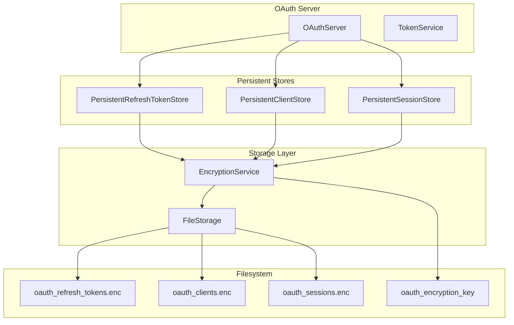
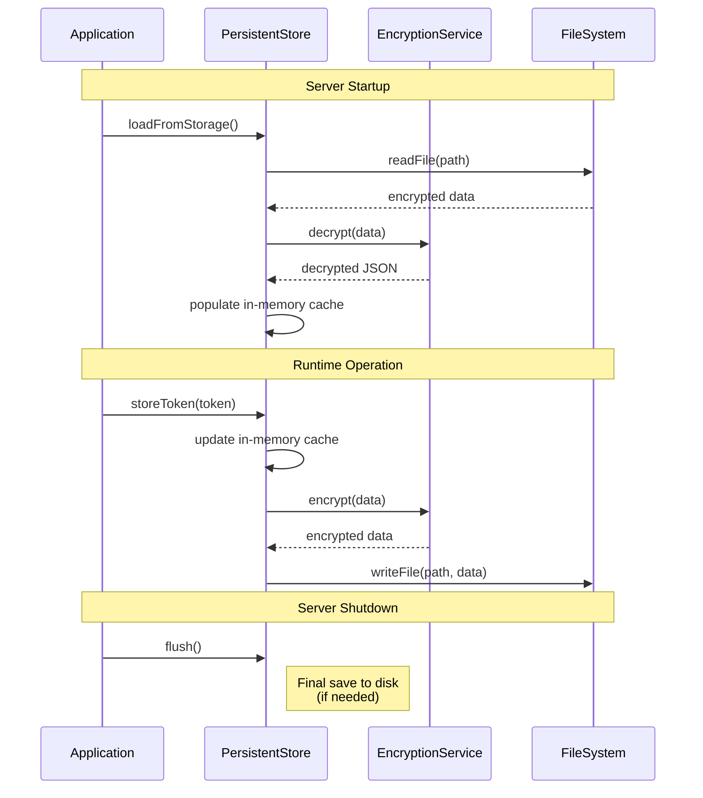

# Design Document: OAuth Token Persistence

## Overview

This design implements filesystem-based persistence for OAuth 2.1 server state to prevent token invalidation and forced re-authentication after server restarts. The design maintains the existing OAuth store interfaces while adding encrypted filesystem storage.

## Architecture

### High-Level Architecture



### Component Interaction



## Detailed Design

### 1. Encryption Service

Reuse and extract encryption logic from `GoogleOAuthHandler`:

**File**: `src/oauth/encryption-service.ts`

```typescript
/**
 * Encryption Service for OAuth Data
 *
 * Provides AES-256-GCM encryption/decryption for sensitive OAuth data.
 * Supports key derivation via scrypt and secure key management.
 */

import { createCipheriv, createDecipheriv, randomBytes, scrypt } from 'crypto';
import { promisify } from 'util';
import { readFile, writeFile, mkdir, chmod } from 'fs/promises';
import { join } from 'path';
import { homedir } from 'os';
import { existsSync } from 'fs';

const scryptAsync = promisify(scrypt);

export interface EncryptionServiceConfig {
  encryptionKey?: string; // From SAGE_ENCRYPTION_KEY env var
  keyStoragePath?: string; // Default: ~/.sage/oauth_encryption_key
}

export class EncryptionService {
  private encryptionKey: string;
  private keyStoragePath: string;

  constructor(config: EncryptionServiceConfig = {}) {
    this.keyStoragePath = config.keyStoragePath || join(homedir(), '.sage', 'oauth_encryption_key');
    this.encryptionKey = ''; // Will be loaded in initialize()
  }

  /**
   * Initialize encryption service and load/generate key
   */
  async initialize(): Promise<void> {
    // Priority 1: Use SAGE_ENCRYPTION_KEY environment variable
    if (process.env.SAGE_ENCRYPTION_KEY) {
      this.encryptionKey = process.env.SAGE_ENCRYPTION_KEY;
      console.log('[OAuth] Using encryption key from SAGE_ENCRYPTION_KEY');
      return;
    }

    // Priority 2: Load existing key from storage
    if (existsSync(this.keyStoragePath)) {
      try {
        this.encryptionKey = await readFile(this.keyStoragePath, 'utf-8');
        console.log('[OAuth] Loaded encryption key from storage');
        return;
      } catch (error) {
        console.error('[OAuth] Failed to load encryption key:', error);
        // Fall through to generation
      }
    }

    // Priority 3: Generate new key and store it
    console.warn('[OAuth] No encryption key found. Generating new key...');
    console.warn('[OAuth] Warning: Set SAGE_ENCRYPTION_KEY environment variable for production use');

    this.encryptionKey = randomBytes(32).toString('hex');

    // Ensure directory exists
    const dir = join(homedir(), '.sage');
    await mkdir(dir, { recursive: true, mode: 0o700 });

    // Write key with restricted permissions
    await writeFile(this.keyStoragePath, this.encryptionKey, { mode: 0o600 });
    console.log(`[OAuth] Generated encryption key stored at: ${this.keyStoragePath}`);
  }

  /**
   * Encrypt data using AES-256-GCM
   * Format: salt:iv:authTag:encrypted
   */
  async encrypt(data: string): Promise<string> {
    const salt = randomBytes(16);
    const key = (await scryptAsync(this.encryptionKey, salt, 32)) as Buffer;
    const iv = randomBytes(16);
    const cipher = createCipheriv('aes-256-gcm', key, iv);

    let encrypted = cipher.update(data, 'utf8', 'hex');
    encrypted += cipher.final('hex');

    const authTag = cipher.getAuthTag();
    return `${salt.toString('hex')}:${iv.toString('hex')}:${authTag.toString('hex')}:${encrypted}`;
  }

  /**
   * Decrypt data using AES-256-GCM
   */
  async decrypt(encryptedData: string): Promise<string> {
    const parts = encryptedData.split(':');
    if (parts.length !== 4) {
      throw new Error('Invalid encrypted data format');
    }

    const [saltHex, ivHex, authTagHex, encrypted] = parts;
    const salt = Buffer.from(saltHex, 'hex');
    const iv = Buffer.from(ivHex, 'hex');
    const authTag = Buffer.from(authTagHex, 'hex');

    const key = (await scryptAsync(this.encryptionKey, salt, 32)) as Buffer;
    const decipher = createDecipheriv('aes-256-gcm', key, iv);
    decipher.setAuthTag(authTag);

    let decrypted = decipher.update(encrypted, 'hex', 'utf8');
    decrypted += decipher.final('utf8');

    return decrypted;
  }

  /**
   * Encrypt and save data to file
   */
  async encryptToFile(data: string, filePath: string): Promise<void> {
    const encrypted = await this.encrypt(data);

    // Ensure directory exists
    const dir = join(homedir(), '.sage');
    await mkdir(dir, { recursive: true, mode: 0o700 });

    // Atomic write using temp file + rename
    const tempPath = `${filePath}.tmp`;
    await writeFile(tempPath, encrypted, { mode: 0o600 });
    await chmod(tempPath, 0o600);

    // Rename is atomic on most filesystems
    const { rename } = await import('fs/promises');
    await rename(tempPath, filePath);
  }

  /**
   * Load and decrypt data from file
   */
  async decryptFromFile(filePath: string): Promise<string | null> {
    try {
      if (!existsSync(filePath)) {
        return null;
      }
      const encrypted = await readFile(filePath, 'utf-8');
      return await this.decrypt(encrypted);
    } catch (error) {
      console.error(`[OAuth] Failed to decrypt file ${filePath}:`, error);
      return null;
    }
  }
}
```

### 2. Persistent Refresh Token Store

**File**: `src/oauth/persistent-refresh-token-store.ts`

Extends `InMemoryRefreshTokenStore` with filesystem persistence:

```typescript
/**
 * Persistent Refresh Token Store
 *
 * Extends InMemoryRefreshTokenStore with encrypted filesystem persistence.
 * Maintains same interface but survives server restarts.
 */

import { join, homedir } from 'path';
import { RefreshTokenStore, GenerateRefreshTokenOptions, RefreshTokenValidationResult } from './refresh-token-store.js';
import { EncryptionService } from './encryption-service.js';

interface StoredRefreshToken {
  token: string;
  client_id: string;
  user_id: string;
  scope: string[];
  created_at: number;
  expires_at: number;
  rotated: boolean;
}

interface RefreshTokenStorage {
  tokens: StoredRefreshToken[];
  version: number; // For future migrations
}

export class PersistentRefreshTokenStore implements RefreshTokenStore {
  private tokens: Map<string, StoredRefreshToken> = new Map();
  private encryptionService: EncryptionService;
  private storagePath: string;
  private saveDebounceTimer: NodeJS.Timeout | null = null;
  private saveDebounceMs = 1000; // Batch saves within 1 second

  constructor(
    encryptionService: EncryptionService,
    storagePath?: string
  ) {
    this.encryptionService = encryptionService;
    this.storagePath = storagePath || join(homedir(), '.sage', 'oauth_refresh_tokens.enc');
  }

  /**
   * Load tokens from encrypted file
   */
  async loadFromStorage(): Promise<void> {
    const data = await this.encryptionService.decryptFromFile(this.storagePath);
    if (!data) {
      console.log('[OAuth] No existing refresh tokens found, starting fresh');
      return;
    }

    try {
      const storage: RefreshTokenStorage = JSON.parse(data);

      // Load tokens and filter expired ones
      const now = Date.now();
      let loadedCount = 0;
      let expiredCount = 0;

      for (const token of storage.tokens) {
        if (now < token.expires_at) {
          this.tokens.set(token.token, token);
          loadedCount++;
        } else {
          expiredCount++;
        }
      }

      console.log(`[OAuth] Loaded ${loadedCount} refresh tokens (${expiredCount} expired tokens cleaned up)`);
    } catch (error) {
      console.error('[OAuth] Failed to parse refresh token storage, starting fresh:', error);
    }
  }

  /**
   * Save tokens to encrypted file (debounced)
   */
  private async scheduleSave(): Promise<void> {
    // Clear existing timer
    if (this.saveDebounceTimer) {
      clearTimeout(this.saveDebounceTimer);
    }

    // Schedule save after debounce period
    this.saveDebounceTimer = setTimeout(async () => {
      await this.saveToStorage();
    }, this.saveDebounceMs);
  }

  /**
   * Save tokens to encrypted file immediately
   */
  async saveToStorage(): Promise<void> {
    const storage: RefreshTokenStorage = {
      version: 1,
      tokens: Array.from(this.tokens.values()),
    };

    const data = JSON.stringify(storage, null, 2);
    await this.encryptionService.encryptToFile(data, this.storagePath);
  }

  /**
   * Generate new refresh token
   */
  async generateToken(options: GenerateRefreshTokenOptions): Promise<string> {
    // Implementation from InMemoryRefreshTokenStore
    // ... (same logic)

    // After storing in memory:
    await this.scheduleSave();
    return token;
  }

  /**
   * Validate refresh token
   */
  async validateToken(token: string, clientId: string): Promise<RefreshTokenValidationResult> {
    // Implementation from InMemoryRefreshTokenStore
    // ... (same logic, no persistence needed for validation)
  }

  /**
   * Rotate refresh token
   */
  async rotateToken(token: string, clientId: string): Promise<string | null> {
    // Implementation from InMemoryRefreshTokenStore
    // ... (same logic)

    // After rotation:
    await this.scheduleSave();
    return newToken;
  }

  /**
   * Revoke refresh token
   */
  async revokeToken(token: string): Promise<void> {
    this.tokens.delete(token);
    await this.scheduleSave();
  }

  /**
   * Revoke all tokens for client
   */
  async revokeAllForClient(clientId: string): Promise<void> {
    for (const [token, data] of this.tokens) {
      if (data.client_id === clientId) {
        this.tokens.delete(token);
      }
    }
    await this.scheduleSave();
  }

  /**
   * Clean up expired tokens
   */
  async cleanup(): Promise<number> {
    const now = Date.now();
    let count = 0;

    for (const [token, data] of this.tokens) {
      if (now >= data.expires_at) {
        this.tokens.delete(token);
        count++;
      }
    }

    if (count > 0) {
      await this.scheduleSave();
    }

    return count;
  }

  /**
   * Flush pending saves (call on server shutdown)
   */
  async flush(): Promise<void> {
    if (this.saveDebounceTimer) {
      clearTimeout(this.saveDebounceTimer);
      this.saveDebounceTimer = null;
    }
    await this.saveToStorage();
  }
}
```

### 3. Persistent Client Store

**File**: `src/oauth/persistent-client-store.ts`

Similar pattern to refresh token store:

```typescript
/**
 * Persistent Client Store
 *
 * Extends InMemoryClientStore with encrypted filesystem persistence.
 */

import { join, homedir } from 'path';
import {
  ClientStore,
  ClientRegistrationRequest,
  ClientRegistrationResult,
  ClientStoreConfig,
} from './client-store.js';
import { OAuthClient } from './types.js';
import { EncryptionService } from './encryption-service.js';

interface ClientStorage {
  clients: OAuthClient[];
  version: number;
}

export class PersistentClientStore implements ClientStore {
  private clients: Map<string, OAuthClient> = new Map();
  private config: ClientStoreConfig;
  private encryptionService: EncryptionService;
  private storagePath: string;

  constructor(
    config: ClientStoreConfig,
    encryptionService: EncryptionService,
    storagePath?: string
  ) {
    this.config = config;
    this.encryptionService = encryptionService;
    this.storagePath = storagePath || join(homedir(), '.sage', 'oauth_clients.enc');
  }

  /**
   * Load clients from encrypted file
   */
  async loadFromStorage(): Promise<void> {
    const data = await this.encryptionService.decryptFromFile(this.storagePath);
    if (!data) {
      console.log('[OAuth] No existing clients found, starting fresh');
      return;
    }

    try {
      const storage: ClientStorage = JSON.parse(data);
      for (const client of storage.clients) {
        this.clients.set(client.client_id, client);
      }
      console.log(`[OAuth] Loaded ${storage.clients.length} OAuth clients`);
    } catch (error) {
      console.error('[OAuth] Failed to parse client storage, starting fresh:', error);
    }
  }

  /**
   * Save clients to encrypted file
   */
  private async saveToStorage(): Promise<void> {
    const storage: ClientStorage = {
      version: 1,
      clients: Array.from(this.clients.values()),
    };

    const data = JSON.stringify(storage, null, 2);
    await this.encryptionService.encryptToFile(data, this.storagePath);
  }

  /**
   * Register new client (with persistence)
   */
  async registerClient(request: ClientRegistrationRequest): Promise<ClientRegistrationResult> {
    // Implementation from InMemoryClientStore
    // ... (same validation and generation logic)

    // After storing:
    await this.saveToStorage();
    return { success: true, client };
  }

  /**
   * Get client by ID
   */
  async getClient(clientId: string): Promise<OAuthClient | null> {
    return this.clients.get(clientId) || null;
  }

  /**
   * Delete client (with persistence)
   */
  async deleteClient(clientId: string): Promise<boolean> {
    const result = this.clients.delete(clientId);
    if (result) {
      await this.saveToStorage();
    }
    return result;
  }

  /**
   * Validate redirect URI
   */
  async isValidRedirectUri(clientId: string, redirectUri: string): Promise<boolean> {
    // Implementation from InMemoryClientStore
    // ... (same logic, no persistence needed)
  }

  /**
   * Flush pending saves
   */
  async flush(): Promise<void> {
    await this.saveToStorage();
  }
}
```

### 4. Persistent Session Store

**File**: `src/oauth/persistent-session-store.ts`

```typescript
/**
 * Persistent Session Store
 *
 * Stores user sessions with encrypted filesystem persistence.
 * Implements automatic cleanup of expired sessions.
 */

import { join, homedir } from 'path';
import { UserSession } from './types.js';
import { EncryptionService } from './encryption-service.js';
import { randomBytes } from 'crypto';

interface SessionStorage {
  sessions: UserSession[];
  version: number;
}

export interface SessionStore {
  createSession(userId: string): UserSession;
  getSession(sessionId: string): UserSession | null;
  deleteSession(sessionId: string): void;
  loadFromStorage(): Promise<void>;
  flush(): Promise<void>;
}

export class PersistentSessionStore implements SessionStore {
  private sessions: Map<string, UserSession> = new Map();
  private sessionExpiryMs = 24 * 60 * 60 * 1000; // 24 hours
  private maxSessions = 100; // Limit to prevent unbounded growth
  private encryptionService: EncryptionService;
  private storagePath: string;

  constructor(
    encryptionService: EncryptionService,
    storagePath?: string
  ) {
    this.encryptionService = encryptionService;
    this.storagePath = storagePath || join(homedir(), '.sage', 'oauth_sessions.enc');
  }

  /**
   * Load sessions from encrypted file
   */
  async loadFromStorage(): Promise<void> {
    const data = await this.encryptionService.decryptFromFile(this.storagePath);
    if (!data) {
      console.log('[OAuth] No existing sessions found, starting fresh');
      return;
    }

    try {
      const storage: SessionStorage = JSON.parse(data);

      // Load sessions and filter expired ones
      const now = Date.now();
      let loadedCount = 0;
      let expiredCount = 0;

      for (const session of storage.sessions) {
        if (now < session.expiresAt) {
          this.sessions.set(session.sessionId, session);
          loadedCount++;
        } else {
          expiredCount++;
        }
      }

      console.log(`[OAuth] Loaded ${loadedCount} sessions (${expiredCount} expired sessions cleaned up)`);
    } catch (error) {
      console.error('[OAuth] Failed to parse session storage, starting fresh:', error);
    }
  }

  /**
   * Save sessions to encrypted file
   */
  private async saveToStorage(): Promise<void> {
    // Enforce session limit by keeping only most recent sessions
    let sessions = Array.from(this.sessions.values());
    if (sessions.length > this.maxSessions) {
      sessions.sort((a, b) => b.createdAt - a.createdAt);
      sessions = sessions.slice(0, this.maxSessions);

      // Update map to reflect limit
      this.sessions.clear();
      for (const session of sessions) {
        this.sessions.set(session.sessionId, session);
      }
    }

    const storage: SessionStorage = {
      version: 1,
      sessions,
    };

    const data = JSON.stringify(storage, null, 2);
    await this.encryptionService.encryptToFile(data, this.storagePath);
  }

  /**
   * Create new session
   */
  createSession(userId: string): UserSession {
    const sessionId = randomBytes(32).toString('hex');
    const now = Date.now();
    const session: UserSession = {
      sessionId,
      userId,
      createdAt: now,
      expiresAt: now + this.sessionExpiryMs,
    };
    this.sessions.set(sessionId, session);

    // Save asynchronously (don't wait)
    this.saveToStorage().catch(err =>
      console.error('[OAuth] Failed to save session:', err)
    );

    return session;
  }

  /**
   * Get session by ID
   */
  getSession(sessionId: string): UserSession | null {
    const session = this.sessions.get(sessionId);
    if (!session) return null;

    // Check expiry
    if (Date.now() > session.expiresAt) {
      this.sessions.delete(sessionId);
      this.saveToStorage().catch(err =>
        console.error('[OAuth] Failed to save after session expiry:', err)
      );
      return null;
    }

    return session;
  }

  /**
   * Delete session
   */
  deleteSession(sessionId: string): void {
    this.sessions.delete(sessionId);
    this.saveToStorage().catch(err =>
      console.error('[OAuth] Failed to save after session deletion:', err)
    );
  }

  /**
   * Flush pending saves
   */
  async flush(): Promise<void> {
    await this.saveToStorage();
  }
}
```

### 5. Integration with OAuth Server

**File**: `src/oauth/oauth-server.ts` (modifications)

```typescript
// Add to OAuthServerConfig interface:
export interface OAuthServerConfig {
  // ... existing fields
  enablePersistence?: boolean; // Default: true
  encryptionService?: EncryptionService;
}

// Modify OAuthServer constructor:
export class OAuthServer {
  private tokenService: TokenService;
  private codeStore: AuthorizationCodeStore;
  private refreshTokenStore: RefreshTokenStore;
  private clientStore: ClientStore;
  private sessionStore: SessionStore;
  private encryptionService?: EncryptionService;

  constructor(config: OAuthServerConfig) {
    // ... existing initialization

    const enablePersistence = config.enablePersistence !== false; // Default true

    if (enablePersistence) {
      // Initialize encryption service
      this.encryptionService = config.encryptionService || new EncryptionService();

      // Create persistent stores
      this.refreshTokenStore = new PersistentRefreshTokenStore(this.encryptionService);
      this.clientStore = new PersistentClientStore(
        { allowedRedirectUris: config.allowedRedirectUris || [] },
        this.encryptionService
      );
      this.sessionStore = new PersistentSessionStore(this.encryptionService);
    } else {
      // Use in-memory stores (for testing)
      this.refreshTokenStore = createRefreshTokenStore(/* ... */);
      this.clientStore = createClientStore(/* ... */);
      this.sessionStore = new InMemorySessionStore();
    }

    // Authorization codes remain in-memory (short-lived, not needed)
    this.codeStore = createAuthorizationCodeStore(/* ... */);
  }

  /**
   * Initialize OAuth server and load persisted data
   */
  async initialize(): Promise<void> {
    if (this.encryptionService) {
      await this.encryptionService.initialize();

      // Load persisted data in parallel
      await Promise.all([
        (this.refreshTokenStore as PersistentRefreshTokenStore).loadFromStorage(),
        (this.clientStore as PersistentClientStore).loadFromStorage(),
        (this.sessionStore as PersistentSessionStore).loadFromStorage(),
      ]);

      console.log('[OAuth] Persistent storage initialized');
    }
  }

  /**
   * Flush all pending writes (call on server shutdown)
   */
  async shutdown(): Promise<void> {
    if (this.encryptionService) {
      await Promise.all([
        (this.refreshTokenStore as PersistentRefreshTokenStore).flush(),
        (this.clientStore as PersistentClientStore).flush(),
        (this.sessionStore as PersistentSessionStore).flush(),
      ]);

      console.log('[OAuth] All data flushed to storage');
    }
  }
}
```

### 6. Server Initialization

**File**: `src/cli/http-server-with-config.ts` (modifications)

```typescript
// In startRemoteServer() method:

// Initialize OAuth server with persistence
const oauthServer = new OAuthServer({
  issuer,
  allowedRedirectUris: ['*'],
  users: [{ id: 'user1', username: 'user' }],
  enablePersistence: true, // Enable persistence
});

// Initialize and load persisted data
await oauthServer.initialize();

// Register shutdown handler
process.on('SIGTERM', async () => {
  console.log('SIGTERM received, flushing OAuth data...');
  await oauthServer.shutdown();
  process.exit(0);
});

process.on('SIGINT', async () => {
  console.log('SIGINT received, flushing OAuth data...');
  await oauthServer.shutdown();
  process.exit(0);
});
```

## File Structure

All persistent data stored in `~/.sage/`:

```
~/.sage/
├── oauth_encryption_key          # Encryption key (600 permissions)
├── oauth_refresh_tokens.enc      # Encrypted refresh tokens (600 permissions)
├── oauth_clients.enc             # Encrypted client registrations (600 permissions)
├── oauth_sessions.enc            # Encrypted user sessions (600 permissions)
└── google_oauth_tokens.enc       # Existing Google OAuth tokens (unchanged)
```

### Storage Format

Each encrypted file contains JSON data in the format:

```json
{
  "version": 1,
  "tokens": [ /* array of tokens */ ]
}
```

The entire JSON is encrypted using AES-256-GCM with format: `salt:iv:authTag:encrypted`

## Data Flow

### Startup Flow

1. Server starts
2. EncryptionService initializes (load/generate key)
3. Each persistent store loads from encrypted file
4. Expired entries are filtered out during load
5. In-memory cache is populated
6. Server is ready to handle requests

### Runtime Flow

1. OAuth operation (e.g., generate token)
2. Update in-memory cache immediately
3. Schedule save operation (debounced)
4. Multiple updates batched together
5. Save to encrypted file after debounce period

### Shutdown Flow

1. Server receives SIGTERM/SIGINT
2. Call `oauthServer.shutdown()`
3. Flush all pending saves
4. Server exits cleanly

## Error Handling

### Corrupted Storage File

```typescript
async loadFromStorage(): Promise<void> {
  const data = await this.encryptionService.decryptFromFile(this.storagePath);
  if (!data) {
    console.log('[OAuth] No existing data, starting fresh');
    return; // Graceful degradation
  }

  try {
    const storage = JSON.parse(data);
    // Load data...
  } catch (error) {
    console.error('[OAuth] Failed to parse storage, starting fresh:', error);
    // Continue with empty state instead of crashing
  }
}
```

### Encryption Failures

```typescript
async encrypt(data: string): Promise<string> {
  try {
    // Encryption logic...
  } catch (error) {
    console.error('[OAuth] Encryption failed:', error);
    throw new Error('Failed to encrypt data'); // Let caller handle
  }
}
```

### Write Failures

```typescript
async encryptToFile(data: string, filePath: string): Promise<void> {
  try {
    // Use atomic write with temp file + rename
    const tempPath = `${filePath}.tmp`;
    await writeFile(tempPath, encrypted, { mode: 0o600 });
    await rename(tempPath, filePath);
  } catch (error) {
    console.error(`[OAuth] Failed to write ${filePath}:`, error);
    // Clean up temp file if exists
    try { await unlink(tempPath); } catch {}
    throw error; // Propagate to caller
  }
}
```

## Security Considerations

### Encryption Key Management

1. **Priority 1**: Use `SAGE_ENCRYPTION_KEY` environment variable (recommended for production)
2. **Priority 2**: Use persistent key at `~/.sage/oauth_encryption_key` (auto-generated)
3. **Warning**: Log warning if using auto-generated key (encourage explicit key management)

### File Permissions

All encrypted files created with `0o600` permissions (read/write for owner only):

```typescript
await writeFile(path, data, { mode: 0o600 });
await chmod(path, 0o600); // Ensure permissions after write
```

### Atomic Writes

Use temp file + rename pattern to prevent corruption:

```typescript
const tempPath = `${filePath}.tmp`;
await writeFile(tempPath, encrypted);
await rename(tempPath, filePath); // Atomic operation
```

## Performance Optimization

### Write Debouncing

- Batch multiple writes within 1 second
- Reduces I/O operations significantly
- Configurable debounce period

### In-Memory Caching

- All data kept in memory for fast access
- Filesystem only for persistence
- No performance degradation for reads

### Parallel Loading

Load all stores in parallel on startup:

```typescript
await Promise.all([
  refreshTokenStore.loadFromStorage(),
  clientStore.loadFromStorage(),
  sessionStore.loadFromStorage(),
]);
```

### Lazy Encryption

- Encrypt/decrypt only during I/O operations
- No encryption overhead for in-memory operations

## Migration Strategy

### First Run After Upgrade

1. User upgrades to version with persistence
2. Server starts, finds no encrypted files
3. Starts with empty state (logs: "starting fresh")
4. User re-authenticates once
5. Tokens are saved to encrypted storage
6. Subsequent restarts load tokens successfully

**No migration code needed** - existing in-memory data is ephemeral anyway.

### Future Migrations

The `version` field in storage format supports future migrations:

```typescript
interface RefreshTokenStorage {
  version: number; // Current: 1
  tokens: StoredRefreshToken[];
}

// Future: Handle version upgrades
async loadFromStorage(): Promise<void> {
  const storage = JSON.parse(data);

  if (storage.version === 1) {
    // Current format
  } else if (storage.version === 2) {
    // Future format - migrate from v1 to v2
  }
}
```

## Testing Strategy

### Unit Tests

1. **EncryptionService**:
   - Test encrypt/decrypt round-trip
   - Test key initialization (env var, file, generation)
   - Test file encryption/decryption
   - Test error handling (corrupted data, invalid format)

2. **PersistentRefreshTokenStore**:
   - Test save/load cycle
   - Test expired token cleanup on load
   - Test write debouncing
   - Test flush operation

3. **PersistentClientStore**:
   - Test client registration persistence
   - Test load/save cycle
   - Test error handling

4. **PersistentSessionStore**:
   - Test session limit enforcement
   - Test expired session cleanup
   - Test load/save cycle

### Integration Tests

1. **OAuth Server Initialization**:
   - Test server startup with persistence enabled
   - Test data loading from existing files
   - Test graceful degradation on corrupted files

2. **End-to-End Flow**:
   - Generate refresh token
   - Restart server
   - Verify token still valid
   - Use token to get new access token

3. **Shutdown Handling**:
   - Generate tokens
   - Trigger SIGTERM
   - Verify data flushed to disk
   - Restart and verify data loaded

### Manual Testing

1. **Production Scenario**:
   ```bash
   # Start server
   sage remote --port 3000

   # Authenticate from Claude Code
   # Verify tools work

   # Restart server
   pm2 restart sage-remote

   # Verify no re-authentication required
   # Verify tools still work
   ```

2. **Key Management**:
   ```bash
   # Test with explicit key
   SAGE_ENCRYPTION_KEY="my-secret-key" sage remote --port 3000

   # Verify key used from environment
   # Check logs for "Using encryption key from SAGE_ENCRYPTION_KEY"
   ```

## Success Criteria

1. ✅ Refresh tokens survive server restart
2. ✅ Client registrations survive server restart
3. ✅ Active sessions survive server restart (if not expired)
4. ✅ No re-authentication required after restart
5. ✅ All storage files encrypted with AES-256-GCM
6. ✅ File permissions set to 600 (Unix)
7. ✅ Startup time increase < 500ms
8. ✅ Corrupted files handled gracefully (start fresh)
9. ✅ No security vulnerabilities introduced

## Alternatives Considered

### Alternative 1: Database Storage (e.g., SQLite)

**Pros**:
- Better for high-volume scenarios
- ACID transactions
- Structured queries

**Cons**:
- Additional dependency
- More complex setup
- Overkill for single-user MCP server
- Migration complexity

**Decision**: Rejected - Filesystem sufficient for current use case

### Alternative 2: Unencrypted Storage

**Pros**:
- Simpler implementation
- No key management

**Cons**:
- Security risk (tokens in plain text)
- Violates security best practices
- Not production-ready

**Decision**: Rejected - Encryption is mandatory for sensitive tokens

### Alternative 3: Persist Only Refresh Tokens

**Pros**:
- Minimal implementation
- Covers most common case

**Cons**:
- Client registrations still lost on restart
- Sessions still lost on restart
- Incomplete solution

**Decision**: Rejected - Persist all long-lived data for complete solution

## Future Enhancements

1. **Key Rotation**:
   - Support rotating encryption keys
   - Re-encrypt data with new key
   - Maintain backward compatibility

2. **Database Backend**:
   - Abstract storage interface
   - Support SQLite/PostgreSQL backends
   - Maintain filesystem as default

3. **Backup/Restore**:
   - Export encrypted data
   - Import from backup
   - Scheduled backups

4. **Monitoring**:
   - Expose metrics (token count, storage size)
   - Health check endpoints
   - Alert on storage failures

5. **Multi-User Support**:
   - Per-user token isolation
   - User-specific encryption keys
   - Role-based access control

---

**Design Status**: Ready for Review
**Next Step**: User approval, then proceed to Phase 3 (Task Breakdown)
