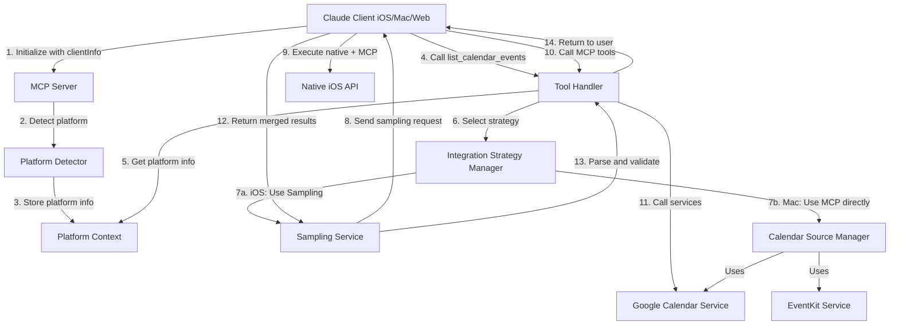
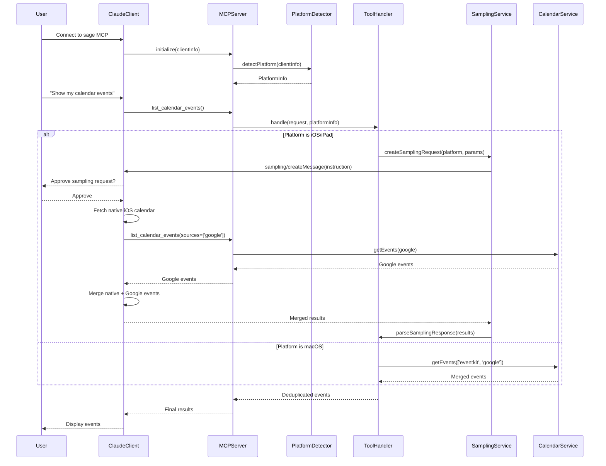

# Design Document

## Overview

プラットフォーム適応型統合機能は、sage MCP サーバーが接続元のプラットフォーム（iOS/iPad/Mac/Web）を検出し、MCP Sampling を使って Claude に最適な統合戦略を指示する機能です。

この機能により：
- iOS/iPad からは Google Calendar（MCP）+ Apple Calendar（ネイティブ）の両方にアクセス可能
- macOS からは EventKit（MCP）+ Google Calendar（MCP）の統合アクセス
- Web からは Google Calendar（MCP）のみの安全なアクセス
- ユーザーにとっては透過的でシームレスな体験を実現

## Steering Document Alignment

### Technical Standards (tech.md)

本設計は tech.md の以下の標準に準拠します：

1. **TypeScript Strict Mode**: すべての新規コンポーネントで strict mode を使用
2. **Zod Validation**: Platform detection と Sampling request の入力検証に Zod を使用
3. **Error Handling**: 明確なエラーメッセージと適切なエラー伝播（既存の `createErrorFromCatch` パターンを活用）
4. **Testing**: Jest with 98%+ coverage target（Sampling のモックを含む）
5. **Retry Pattern**: 既存の `retryWithBackoff` を Sampling リクエストに適用

### Project Structure (structure.md)

ファイル配置は structure.md のディレクトリ構造に従います：

- **Platform Detection**: `src/platform/detector.ts`（新規ディレクトリ）
- **Sampling Service**: `src/services/sampling-service.ts`
- **Integration Strategy**: `src/services/integration-strategy-manager.ts`
- **Type Definitions**: `src/types/platform.ts`（新規）
- **Tool Handlers**: `src/tools/platform/handlers.ts`（新規）
- **Tests**: `tests/unit/platform/`, `tests/integration/platform/`

## Code Reuse Analysis

### Existing Components to Leverage

#### 1. CalendarSourceManager (src/integrations/calendar-source-manager.ts)
- **活用方法**: 既存のマルチソース管理ロジックをそのまま活用
- **拡張内容**: プラットフォーム情報を Context として渡し、Sampling ベースの統合を追加
- **再利用メソッド**: `detectAvailableSources()`, `getEvents()`, deduplication ロジック

#### 2. GoogleCalendarService (src/integrations/google-calendar-service.ts)
- **活用方法**: Google Calendar API 呼び出しをそのまま使用
- **変更内容**: なし（完全に再利用）
- **統合方法**: Sampling で Claude に `list_calendar_events(sources=['google'])` を実行させる

#### 3. CalendarService (src/integrations/calendar-service.ts)
- **活用方法**: macOS EventKit アクセスをそのまま使用
- **変更内容**: なし（完全に再利用）
- **統合方法**: Sampling で Claude に `list_calendar_events(sources=['eventkit'])` を実行させる

#### 4. ReminderManager (src/integrations/reminder-manager.ts)
- **活用方法**: 既存の Apple Reminders AppleScript ロジックを活用
- **変更内容**: なし（macOS での利用）
- **統合方法**: iOS では Sampling で Claude に native API を使わせる

#### 5. McpServer (from @modelcontextprotocol/sdk)
- **活用方法**: MCP Server の initialize ハンドラで clientInfo を取得
- **追加実装**: `onInitialize` コールバックを追加して clientInfo を保存
- **Sampling 呼び出し**: SDK の Sampling 機能を使用（`server.request('sampling/createMessage', params)`）

#### 6. Retry Utility (src/utils/retry.ts)
- **活用方法**: 既存の `retryWithBackoff()` を Sampling リクエストに適用
- **変更内容**: なし（完全に再利用）

### Integration Points

#### A. MCP SDK Integration
- **統合方法**: McpServer の `onInitialize` コールバックで clientInfo を取得
- **Sampling API**: `server.request('sampling/createMessage', { messages, maxTokens })` を使用
- **エラーハンドリング**: MCP エラーコード（-1 = user rejection, -32xxx = internal error）を処理

#### B. Existing Tool Handlers
- **統合方法**: `handleListCalendarEvents` と `handleSetReminder` に Platform Context を注入
- **変更内容**:
  - Platform Context から platform 情報を取得
  - プラットフォームに応じて Sampling 経由または MCP 直接実行を選択
- **後方互換性**: Sampling 非対応クライアントは既存の MCP-only モードで動作

#### C. Context Factory Pattern
- **統合方法**: 既存の Context factory functions（`createCalendarToolsContext` など）に Platform Context を追加
- **実装**: Global state に `platformInfo` を追加、初期化時に設定

## Architecture

### System Architecture



### Component Interaction Flow



## Components and Interfaces

### Component 1: Platform Detector

**Purpose**: MCP initialize メッセージから clientInfo を抽出し、プラットフォームを判別

**Location**: `src/platform/detector.ts`

**Interface**:
```typescript
interface ClientInfo {
  name: string;
  version: string;
}

interface ClientCapabilities {
  sampling?: {};
  roots?: {};
  // ... other capabilities
}

export interface DetectedPlatform {
  platform: 'ios' | 'ipados' | 'macos' | 'desktop' | 'web' | 'unknown';
  clientName: string;
  clientVersion: string;
  supportsSampling: boolean;
  detectionConfidence: 'high' | 'medium' | 'low';
}

export class PlatformDetector {
  /**
   * Detect platform from MCP clientInfo
   * Requirement: 1.1-1.5
   */
  static detectPlatform(
    clientInfo: ClientInfo,
    capabilities: ClientCapabilities
  ): DetectedPlatform;

  /**
   * Get available integrations for detected platform
   * Requirement: 7.2-7.4
   */
  static getAvailableIntegrations(
    platform: DetectedPlatform,
    config: UserConfig
  ): PlatformInfo['availableIntegrations'];
}
```

**Dependencies**: `UserConfig` from `src/types/config.ts`

**Reuses**: Platform detection logic inspired by existing `CalendarService.detectPlatform()`

### Component 2: Sampling Service

**Purpose**: MCP Sampling リクエストの構築、送信、レスポンスパース

**Location**: `src/services/sampling-service.ts`

**Interface**:
```typescript
export interface SamplingMessage {
  role: 'user';
  content: {
    type: 'text';
    text: string;
  };
}

export interface SamplingRequest {
  messages: SamplingMessage[];
  systemPrompt?: string;
  maxTokens: number;
}

export interface SamplingResponse {
  content: Array<{
    type: 'text';
    text: string;
  }>;
  stopReason?: string;
}

export class SamplingService {
  constructor(private server: McpServer);

  /**
   * Send sampling request to Claude client
   * Requirement: 2.1-2.4
   * @throws McpError if client doesn't support sampling
   * @throws McpError if user rejects request
   *
   * NOTE: This method only SENDS the instruction to Claude.
   * Claude executes the entire workflow (MCP tools + native APIs + merging)
   * and returns the FINAL result. MCP server does NOT parse or merge.
   */
  async sendSamplingRequest(
    request: SamplingRequest
  ): Promise<SamplingResponse>;
}
```

**Dependencies**:
- `McpServer` from `@modelcontextprotocol/sdk`
- `CalendarEvent` from `src/types/google-calendar-types.ts`
- `retryWithBackoff` from `src/utils/retry.ts`

**Reuses**: Retry pattern from existing utils

### Component 3: Integration Strategy Manager

**Purpose**: プラットフォームごとの統合戦略を決定し、適切な Sampling メッセージを構築

**Location**: `src/services/integration-strategy-manager.ts`

**Interface**:
```typescript
export interface IntegrationStrategy {
  useSampling: boolean;
  samplingMessage?: string;
  mcpToolsToCall?: string[];
  nativeIntegrations?: string[];
}

export class IntegrationStrategyManager {
  /**
   * Get calendar integration strategy for platform
   * Requirement: 3.1-3.3
   */
  getCalendarStrategy(
    platform: DetectedPlatform,
    params: { startDate: string; endDate: string }
  ): IntegrationStrategy;

  /**
   * Get reminder integration strategy for platform
   * Requirement: 4.1-4.3
   */
  getReminderStrategy(
    platform: DetectedPlatform,
    params: { title: string; dueDate?: string; notes?: string }
  ): IntegrationStrategy;

  /**
   * Build sampling message for calendar events
   * Requirement: 5.1-5.4
   *
   * Example output for iOS:
   * "You are running on iOS platform. Please execute the following steps:
   *  1. Call the list_calendar_events MCP tool with parameters:
   *     { startDate: '2026-01-01', endDate: '2026-01-31', sources: ['google'] }
   *  2. Use your native iOS Calendar API to fetch events for the same date range
   *  3. Merge both sets of events, removing duplicates by iCalUID
   *  4. Return the merged events as a JSON array with this structure:
   *     [{ id, title, start, end, isAllDay, source: 'google'|'native-ios', iCalUID }]"
   */
  buildCalendarSamplingMessage(
    platform: DetectedPlatform,
    params: { startDate: string; endDate: string }
  ): string;

  /**
   * Build sampling message for reminder creation
   * Requirement: 5.1-5.4
   *
   * Example output for iOS:
   * "You are running on iOS platform. Please execute the following:
   *  1. Create a reminder using your native iOS Reminders API with:
   *     - Title: '{params.title}'
   *     - Due Date: '{params.dueDate}' (if provided)
   *     - Notes: '{params.notes}' (if provided)
   *  2. Return the result as JSON: { success: boolean, reminderId?: string, error?: string }"
   */
  buildReminderSamplingMessage(
    platform: DetectedPlatform,
    params: { title: string; dueDate?: string; notes?: string }
  ): string;
}
```

**Dependencies**:
- `DetectedPlatform` from `src/platform/detector.ts`
- `CalendarEvent` from `src/types/google-calendar-types.ts`

**Reuses**: None（新規ロジック）

### Component 4: Platform Context

**Purpose**: グローバルな Platform 情報を保持し、ツールハンドラに注入

**Location**: `src/index.ts`（既存ファイルに追加）

**Implementation**:
```typescript
// src/index.ts に追加

import { PlatformDetector, DetectedPlatform } from './platform/detector.js';

// Global state に追加
let detectedPlatform: DetectedPlatform | null = null;

// MCP Server 初期化時に clientInfo を取得
const server = new McpServer({
  name: SERVER_NAME,
  version: VERSION
}, {
  capabilities: {}
});

// Initialize ハンドラを追加してプラットフォーム検出
server.setRequestHandler('initialize', async (request) => {
  const clientInfo = request.params.clientInfo;
  const capabilities = request.params.capabilities;

  // Platform detection
  detectedPlatform = PlatformDetector.detectPlatform(clientInfo, capabilities);
  mcpLogger.info({
    platform: detectedPlatform.platform,
    clientName: detectedPlatform.clientName,
    supportsSampling: detectedPlatform.supportsSampling
  }, 'Platform detected on initialize');

  return {
    protocolVersion: '2025-06-18',
    capabilities: {},
    serverInfo: {
      name: SERVER_NAME,
      version: VERSION
    }
  };
});

// Context factory に追加
interface PlatformContext {
  getPlatformInfo: () => DetectedPlatform | null;
}

// 既存の Context に PlatformContext を追加
function createCalendarToolsContext(): CalendarToolsContext & PlatformContext {
  return {
    // ... existing methods
    getPlatformInfo: () => detectedPlatform,
  };
}
```

**Dependencies**: `DetectedPlatform` from `src/platform/detector.ts`

**Reuses**: 既存の Context factory pattern

### Component 5: Platform-Aware Tool Handlers

**Purpose**: 既存のツールハンドラを拡張し、Platform Context に応じた動作を実装

**Location**:
- `src/tools/calendar/handlers.ts`（既存ファイルを拡張）
- `src/tools/reminders/handlers.ts`（既存ファイルを拡張）
- `src/tools/platform/handlers.ts`（新規：get_platform_info ツール）

**Modified Interface** (`handleListCalendarEvents`):
```typescript
export async function handleListCalendarEvents(
  args: z.infer<typeof listCalendarEventsSchema>,
  context: CalendarToolsContext & PlatformContext
): Promise<ToolResponse> {
  const platform = context.getPlatformInfo();

  // If platform supports Sampling and is iOS/iPad, use Sampling
  if (platform?.supportsSampling &&
      (platform.platform === 'ios' || platform.platform === 'ipados')) {
    return await handleListCalendarEventsWithSampling(args, context, platform);
  }

  // Otherwise, use existing MCP-only logic
  return await handleListCalendarEventsMcpOnly(args, context);
}

/**
 * Handle calendar events with Sampling (iOS/iPad)
 *
 * This sends a Sampling request instructing Claude to:
 * 1. Call list_calendar_events MCP tool with sources=['google']
 * 2. Access native iOS Calendar API
 * 3. Merge results by iCalUID
 * 4. Return final merged events
 *
 * NOTE: MCP server does NOT parse or merge. Claude does everything.
 */
async function handleListCalendarEventsWithSampling(
  args: z.infer<typeof listCalendarEventsSchema>,
  context: CalendarToolsContext & PlatformContext,
  platform: DetectedPlatform
): Promise<ToolResponse> {
  const samplingService = new SamplingService(/* MCP server instance */);
  const strategyManager = new IntegrationStrategyManager();

  // Build instruction message for Claude
  const instruction = strategyManager.buildCalendarSamplingMessage(platform, {
    startDate: args.startDate,
    endDate: args.endDate
  });

  try {
    // Send Sampling request (Claude executes everything and returns final result)
    const response = await samplingService.sendSamplingRequest({
      messages: [{
        role: 'user',
        content: { type: 'text', text: instruction }
      }],
      maxTokens: 4000
    });

    // Simply return Claude's response (already merged and formatted)
    return {
      content: response.content,
      isError: false
    };
  } catch (error) {
    if (error.code === -1) {  // User rejection
      return {
        content: [{
          type: 'text',
          text: 'Platform-adaptive integration requires your approval. ' +
                'Operation cancelled. Falling back to MCP-only mode.'
        }],
        isError: false
      };
    }
    throw error;
  }
}
```

**New Tool** (`get_platform_info`):
```typescript
// src/tools/platform/handlers.ts
export async function handleGetPlatformInfo(
  args: {},
  context: PlatformContext & { getConfig: () => UserConfig | null }
): Promise<ToolResponse> {
  const platform = context.getPlatformInfo();
  const config = context.getConfig();

  if (!platform) {
    return {
      content: [{
        type: 'text',
        text: 'Platform not detected. Please reconnect to sage MCP server.'
      }]
    };
  }

  const platformInfo: PlatformInfo = {
    platform: platform.platform,
    clientName: platform.clientName,
    clientVersion: platform.clientVersion,
    supportsSampling: platform.supportsSampling,
    availableIntegrations: PlatformDetector.getAvailableIntegrations(platform, config!)
  };

  return {
    content: [{
      type: 'text',
      text: JSON.stringify(platformInfo, null, 2)
    }]
  };
}
```

**Dependencies**:
- `SamplingService` from `src/services/sampling-service.ts`
- `IntegrationStrategyManager` from `src/services/integration-strategy-manager.ts`
- Existing `CalendarSourceManager`, `ReminderManager`

**Reuses**: 既存のツールハンドラロジック、MCP-only モードとして完全に再利用

## Data Models

### PlatformInfo (from requirements.md)
```typescript
interface PlatformInfo {
  platform: 'ios' | 'ipados' | 'macos' | 'desktop' | 'web' | 'unknown';
  clientName: string;
  clientVersion: string;
  supportsSampling: boolean;
  availableIntegrations: {
    calendar: {
      google: boolean;
      eventkit: boolean;
      native: boolean;
    };
    reminders: {
      applescript: boolean;
      native: boolean;
    };
  };
}
```

### CalendarEvent (extended from existing)
```typescript
// src/types/google-calendar-types.ts に追加
interface CalendarEvent {
  // ... existing fields
  source: 'google' | 'eventkit' | 'native-ios';  // 新規フィールド
  platform?: 'ios' | 'ipados' | 'macos';  // オプション：どのプラットフォームから取得されたか
}
```

### DetectedPlatform (new)
```typescript
// src/types/platform.ts （新規ファイル）
export interface DetectedPlatform {
  platform: 'ios' | 'ipados' | 'macos' | 'desktop' | 'web' | 'unknown';
  clientName: string;
  clientVersion: string;
  supportsSampling: boolean;
  detectionConfidence: 'high' | 'medium' | 'low';
}
```

### SamplingRequest/Response (new)
```typescript
// src/types/platform.ts に追加
export interface SamplingRequest {
  method: 'sampling/createMessage';
  params: {
    messages: Array<{
      role: 'user';
      content: { type: 'text'; text: string };
    }>;
    systemPrompt?: string;
    maxTokens: number;
  };
}

export interface SamplingResponse {
  content: Array<{
    type: 'text';
    text: string;
  }>;
  stopReason?: 'endTurn' | 'maxTokens' | 'stopSequence';
}
```

## Error Handling

### Error Scenarios

#### 1. Client Does Not Support Sampling
**Scenario**: Client の capabilities に `sampling` が含まれていない

**Handling**:
```typescript
if (!platform.supportsSampling) {
  return {
    content: [{
      type: 'text',
      text: 'Platform-adaptive integration requires a Claude client with Sampling support. ' +
            'Falling back to MCP-only mode. ' +
            'To use native iOS integrations, please use Claude iOS/iPadOS app.'
    }],
    isError: false  // Warning, not error
  };
}
```

**User Impact**: ユーザーには警告が表示され、MCP-only モードで動作

#### 2. User Rejects Sampling Request
**Scenario**: Claude が Sampling リクエストを表示し、ユーザーが拒否

**Handling**:
```typescript
try {
  const response = await samplingService.sendSamplingRequest(request);
} catch (error) {
  if (error.code === -1) {  // User rejection
    return {
      content: [{
        type: 'text',
        text: 'Platform-adaptive integration requires your approval to access ' +
              'native calendar/reminders. Operation cancelled. ' +
              'You can retry or use MCP-only mode.'
      }],
      isError: false
    };
  }
  throw error;
}
```

**User Impact**: 明確なメッセージでキャンセル理由を説明

#### 3. All Calendar Sources Unavailable
**Scenario**: MCP Google Calendar も失敗、native iOS も失敗

**Handling**:
```typescript
if (googleCalendarFailed && nativeIosFailed) {
  return {
    content: [{
      type: 'text',
      text: 'All calendar sources unavailable. Please check:\n' +
            '1. Google OAuth token: Run authenticate_google\n' +
            '2. iOS Calendar permissions: Enable in Settings > Privacy\n' +
            '3. Network connectivity'
    }],
    isError: true
  };
}
```

**User Impact**: チェックリスト形式で明確なトラブルシューティング手順

#### 4. Platform Detection Fails
**Scenario**: clientInfo が予期しない形式

**Handling**:
```typescript
if (platform.platform === 'unknown') {
  mcpLogger.warn({
    clientInfo,
    detectedPlatform: platform
  }, 'Platform detection returned unknown');

  // Fallback to MCP-only mode
  return await handleMcpOnlyMode(args, context);
}
```

**User Impact**: ユーザーには影響なし（自動的に MCP-only モードで動作）

#### 5. Sampling Response Format Invalid
**Scenario**: Claude の返答が予期しない形式（空の content など）

**Handling**:
```typescript
// Validate response structure (NOT parse content)
if (!response.content || response.content.length === 0) {
  mcpLogger.error({
    rawResponse: response
  }, 'Empty sampling response');

  return {
    content: [{
      type: 'text',
      text: 'Received empty response from platform-adaptive integration. ' +
            'Please retry or check your calendar permissions.'
    }],
    isError: true
  };
}

// Simply return Claude's response (already merged and formatted by Claude)
return {
  content: response.content,
  isError: false
};
```

**User Impact**: 構造的な問題のみをチェック、内容は Claude が保証

#### 6. MCP SDK Errors
**Scenario**: MCP SDK が予期しないエラーを返す

**Handling**:
```typescript
try {
  await server.request('sampling/createMessage', params);
} catch (mcpError) {
  if (mcpError.code === -32601) {  // Method not found
    return {
      content: [{
        type: 'text',
        text: 'Your MCP client does not support Sampling. ' +
              'Please upgrade to the latest Claude app.'
      }],
      isError: true
    };
  }

  // Use existing error handling pattern
  throw createErrorFromCatch(mcpError);
}
```

**User Impact**: MCP 固有のエラーコードを人間が読める形に変換

## Testing Strategy

### Unit Testing

#### PlatformDetector Tests (`tests/unit/platform/detector.test.ts`)
```typescript
describe('PlatformDetector', () => {
  describe('detectPlatform', () => {
    it('should detect iOS from clientInfo.name containing "iOS"', () => {
      const result = PlatformDetector.detectPlatform(
        { name: 'Claude iOS', version: '1.0.0' },
        { sampling: {} }
      );
      expect(result.platform).toBe('ios');
      expect(result.supportsSampling).toBe(true);
    });

    it('should detect macOS from clientInfo.name "claude-ai"', () => {
      const result = PlatformDetector.detectPlatform(
        { name: 'claude-ai', version: '0.1.0' },
        { sampling: {} }
      );
      expect(result.platform).toBe('macos');
    });

    it('should return unknown for unrecognized clientInfo', () => {
      const result = PlatformDetector.detectPlatform(
        { name: 'unknown-client', version: '1.0.0' },
        {}
      );
      expect(result.platform).toBe('unknown');
      expect(result.supportsSampling).toBe(false);
    });
  });
});
```

#### SamplingService Tests (`tests/unit/services/sampling-service.test.ts`)
```typescript
describe('SamplingService', () => {
  let mockServer: jest.Mocked<McpServer>;
  let service: SamplingService;

  beforeEach(() => {
    mockServer = {
      request: jest.fn()
    } as any;
    service = new SamplingService(mockServer);
  });

  describe('sendSamplingRequest', () => {
    it('should send sampling request and return response', async () => {
      const mockResponse = {
        content: [{ type: 'text', text: 'Events: []' }]
      };
      mockServer.request.mockResolvedValue(mockResponse);

      const result = await service.sendSamplingRequest({
        messages: [{ role: 'user', content: { type: 'text', text: 'Test' } }],
        maxTokens: 1000
      });

      expect(result).toEqual(mockResponse);
      expect(mockServer.request).toHaveBeenCalledWith(
        'sampling/createMessage',
        expect.objectContaining({ maxTokens: 1000 })
      );
    });

    it('should throw on user rejection', async () => {
      mockServer.request.mockRejectedValue({ code: -1, message: 'User rejected' });

      await expect(service.sendSamplingRequest({
        messages: [{ role: 'user', content: { type: 'text', text: 'Test' } }],
        maxTokens: 1000
      })).rejects.toThrow();
    });
  });

  describe('validateSamplingResponse', () => {
    it('should validate response has content', () => {
      const response = {
        content: [{
          type: 'text',
          text: JSON.stringify([
            { id: '1', title: 'Event 1', start: '2026-01-01T10:00:00Z', end: '2026-01-01T11:00:00Z', isAllDay: false, source: 'native-ios' }
          ])
        }]
      };

      expect(() => service.validateSamplingResponse(response)).not.toThrow();
    });

    it('should throw if response is empty', () => {
      const response = { content: [] };
      expect(() => service.validateSamplingResponse(response)).toThrow('Empty sampling response');
    });
  });
});
```

### Integration Testing

#### Platform-Aware Calendar Events (`tests/integration/platform/calendar-events.test.ts`)
```typescript
describe('Platform-Aware Calendar Events', () => {
  it('should use Sampling for iOS platform', async () => {
    // Mock platform as iOS
    const platform: DetectedPlatform = {
      platform: 'ios',
      clientName: 'Claude iOS',
      clientVersion: '1.0.0',
      supportsSampling: true,
      detectionConfidence: 'high'
    };

    // Mock SamplingService
    const mockSamplingService = {
      sendSamplingRequest: jest.fn().mockResolvedValue({
        content: [{ type: 'text', text: JSON.stringify([/* events */]) }]
      }),
      parseCalendarEventsResponse: jest.fn().mockReturnValue([/* parsed events */])
    };

    // Test tool handler
    const result = await handleListCalendarEvents(
      { startDate: '2026-01-01', endDate: '2026-01-31' },
      {
        getConfig: () => mockConfig,
        getPlatformInfo: () => platform,
        getCalendarSourceManager: () => mockCalendarSourceManager
      }
    );

    expect(mockSamplingService.sendSamplingRequest).toHaveBeenCalled();
    expect(result.isError).toBe(false);
  });

  it('should use MCP-only for macOS platform', async () => {
    const platform: DetectedPlatform = {
      platform: 'macos',
      clientName: 'claude-ai',
      clientVersion: '0.1.0',
      supportsSampling: true,
      detectionConfidence: 'high'
    };

    const result = await handleListCalendarEvents(
      { startDate: '2026-01-01', endDate: '2026-01-31' },
      {
        getConfig: () => mockConfig,
        getPlatformInfo: () => platform,
        getCalendarSourceManager: () => mockCalendarSourceManager
      }
    );

    // Should NOT use Sampling, directly call CalendarSourceManager
    expect(mockCalendarSourceManager.getEvents).toHaveBeenCalled();
  });
});
```

### End-to-End Testing

#### Full Workflow Test (`tests/e2e/platform-adaptive-integration.test.ts`)
```typescript
describe('Platform Adaptive Integration E2E', () => {
  it('should detect platform, use Sampling, and return merged events', async () => {
    // 1. Initialize MCP server
    const server = new McpServer({ name: 'sage', version: VERSION });

    // 2. Mock initialize with iOS clientInfo
    const initializeResult = await server.initialize({
      protocolVersion: '2025-06-18',
      capabilities: { sampling: {} },
      clientInfo: { name: 'Claude iOS', version: '1.0.0' }
    });

    // 3. Verify platform detection
    expect(platformInfo?.platform).toBe('ios');

    // 4. Call list_calendar_events tool
    const eventsResult = await server.callTool('list_calendar_events', {
      startDate: '2026-01-01',
      endDate: '2026-01-31'
    });

    // 5. Verify Sampling was used (mock internal state)
    expect(mockSamplingService.sendSamplingRequest).toHaveBeenCalledWith(
      expect.objectContaining({
        messages: expect.arrayContaining([
          expect.objectContaining({
            content: expect.objectContaining({
              text: expect.stringContaining('native iOS Calendar API')
            })
          })
        ])
      })
    );

    // 6. Verify merged results
    expect(eventsResult.content[0].text).toContain('source');
  });
});
```

### Mock Strategy

#### Sampling Response Mocks
```typescript
// tests/mocks/sampling-responses.ts
export const mockSamplingCalendarResponse = {
  content: [{
    type: 'text',
    text: JSON.stringify([
      {
        id: 'native-1',
        title: 'Team Standup',
        start: '2026-01-07T09:00:00Z',
        end: '2026-01-07T09:30:00Z',
        isAllDay: false,
        source: 'native-ios',
        iCalUID: 'native-1@icloud.com'
      }
    ])
  }]
};

export const mockSamplingReminderResponse = {
  content: [{
    type: 'text',
    text: JSON.stringify({
      success: true,
      reminderId: 'reminder-123'
    })
  }]
};

export const mockUserRejectionError = {
  code: -1,
  message: 'User rejected sampling request'
};
```

#### Platform Detection Mocks
```typescript
// tests/mocks/client-info.ts
export const iOSClientInfo = {
  name: 'Claude iOS',
  version: '1.0.0'
};

export const macOSClientInfo = {
  name: 'claude-ai',
  version: '0.1.0'
};

export const webClientInfo = {
  name: 'claude-web',
  version: '1.0.0'
};

export const samplingCapabilities = {
  sampling: {}
};

export const noSamplingCapabilities = {};
```

## Performance Considerations

### Optimization Strategies

1. **Platform Detection Caching**: clientInfo は initialize 時に一度だけ検出し、グローバル state にキャッシュ
2. **Lazy Sampling Service Initialization**: SamplingService は初回使用時に初期化
3. **Parallel MCP Calls**: iOS で Google Calendar を MCP 経由で取得する際、他の処理と並列実行可能
4. **Response Parsing Optimization**: JSON.parse の失敗時のみパターンマッチングにフォールバック

### Performance Targets (from requirements.md)

- Platform detection: < 10ms ✓ (メモリ操作のみ)
- Sampling request construction: < 50ms ✓ (文字列テンプレート生成)
- Sampling request send (MCP server side): < 100ms ✓ (network call)

**Note**: Sampling round-trip time は **user approval を含む**ため、MCP server ではコントロール不可能。
ユーザー承認には数秒〜数十秒かかる可能性がある。

Event merge and deduplication は **Claude 側で実行**されるため、MCP server の performance target には含まれない。

## Security Considerations

### Security Measures

1. **No Sensitive Data in Sampling Messages**: OAuth tokens や API keys を Sampling プロンプトに含めない
2. **Input Sanitization**: ユーザー入力（event titles, reminder notes）を Sampling メッセージに含める前にサニタイズ
3. **Response Validation**: Sampling レスポンスを Zod スキーマで検証してから使用
4. **MCP Error Code Handling**: MCP エラーコードから機密情報を除去してユーザーに返す

### Validation Example
```typescript
// src/services/sampling-service.ts
import { z } from 'zod';

const SamplingResponseSchema = z.object({
  content: z.array(z.object({
    type: z.literal('text'),
    text: z.string()
  })).min(1, 'Sampling response must have at least one content item'),
  stopReason: z.enum(['endTurn', 'maxTokens', 'stopSequence']).optional()
});

/**
 * Validate sampling response structure
 * NOTE: We do NOT parse or validate the CONTENT of the response.
 * Claude is responsible for formatting the response correctly.
 * We only check that the response has the expected MCP structure.
 */
validateSamplingResponse(response: SamplingResponse): void {
  try {
    SamplingResponseSchema.parse(response);
  } catch (error) {
    throw new Error(`Invalid sampling response structure: ${error.message}`);
  }
}

/**
 * Send sampling request
 * Validates response structure but does NOT parse content
 */
async sendSamplingRequest(request: SamplingRequest): Promise<SamplingResponse> {
  const response = await retryWithBackoff(async () => {
    return await this.server.request('sampling/createMessage', request.params);
  });

  // Validate structure only
  this.validateSamplingResponse(response);

  return response;
}
```

## Deployment Considerations

### Backward Compatibility

- 既存の MCP-only モードは完全に保持
- Sampling 非対応クライアントは自動的に MCP-only モードで動作
- 既存のツール API（input schema）は変更なし

### Configuration Changes

新しい設定項目は不要。既存の config.json をそのまま使用。

### Migration Path

1. **Phase 1**: PlatformDetector と基本インフラを実装（Sampling なし）
2. **Phase 2**: SamplingService と IntegrationStrategyManager を実装
3. **Phase 3**: ツールハンドラを段階的に拡張（まず list_calendar_events、次に set_reminder）
4. **Phase 4**: get_platform_info ツールを追加

各フェーズでテストカバレッジ 98% を維持。
