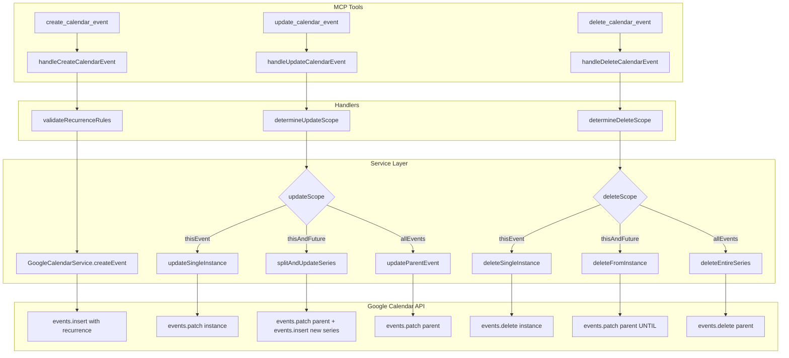

# Design Document

## Overview

定期イベント（Recurring Events）機能は、既存のGoogle Calendar統合を拡張して、RRULEベースの繰り返しイベントの作成・更新・削除をサポートします。この機能はGoogle Calendar APIの`recurrence`フィールドを活用し、MCP toolのインターフェースを通じてユーザーに提供されます。

## Steering Document Alignment

### Technical Standards (tech.md)

- **TypeScript**: 既存の型定義パターンに従い、`RecurrenceScope`型を追加
- **Zod Validation**: 既存の`validation.ts`パターンに従い、RRULEバリデーションスキーマを追加
- **Error Handling**: 既存の`retryWithBackoff`パターンと`createErrorResponse`を使用
- **Logging**: 既存のPino loggerパターン（`calendarLogger`）を使用

### Project Structure (structure.md)

- **Types**: `src/types/google-calendar-types.ts`に定期イベント関連型を追加
- **Service**: `src/integrations/google-calendar-service.ts`にメソッド追加
- **Handlers**: `src/tools/calendar/handlers.ts`のハンドラーを拡張
- **Validation**: `src/config/validation.ts`にRRULEスキーマ追加
- **Tool Definitions**: `src/tools/shared/calendar-tools.ts`のスキーマを拡張

## Code Reuse Analysis

### Existing Components to Leverage

- **`GoogleCalendarService`**: 既存の`createEvent()`, `updateEvent()`, `deleteEvent()`メソッドを拡張
- **`retryWithBackoff`**: API呼び出しのリトライロジック（そのまま使用）
- **`validateEventTypeProperties`**: イベントタイプバリデーション（パターン参考）
- **`convertGoogleToCalendarEvent`**: レスポンス変換（拡張して`recurrence`を含める）
- **`createErrorResponse`**: エラーレスポンス生成（そのまま使用）

### Integration Points

- **`create_calendar_event` handler**: `recurrence`パラメータ追加
- **`update_calendar_event` handler**: `updateScope`パラメータ追加
- **`delete_calendar_event` handler**: `deleteScope`パラメータ追加
- **`list_calendar_events` response**: `recurrence`と`recurringEventId`を含める

## Architecture



## Components and Interfaces

### Component 1: Recurrence Types

- **Purpose:** 定期イベント関連の型定義
- **Interfaces:**
  ```typescript
  type RecurrenceScope = 'thisEvent' | 'thisAndFuture' | 'allEvents';

  interface RecurrenceInfo {
    rules: string[];           // RRULE strings
    recurringEventId?: string; // Parent event ID for instances
    isRecurringInstance: boolean;
  }
  ```
- **Dependencies:** None
- **Reuses:** 既存の`GoogleCalendarEvent`型を拡張

### Component 2: RRULE Validator

- **Purpose:** RRULEフォーマットのバリデーション
- **Interfaces:**
  ```typescript
  function validateRecurrenceRules(rules: string[]): ValidationResult;
  function parseRRULE(rrule: string): ParsedRRULE | null;
  function describeRecurrence(rules: string[]): string; // Human-readable description
  ```
- **Dependencies:** Zod
- **Reuses:** 既存のZodバリデーションパターン

### Component 3: GoogleCalendarService Extensions

- **Purpose:** 定期イベントのCRUD操作
- **Interfaces:**
  ```typescript
  // Existing methods extended:
  createEvent(request: CreateEventRequest): Promise<CalendarEvent>;
  updateEvent(eventId: string, updates: Partial<CreateEventRequest>, scope?: RecurrenceScope): Promise<CalendarEvent>;
  deleteEvent(eventId: string, scope?: RecurrenceScope): Promise<void>;

  // New internal methods:
  private splitRecurringSeries(eventId: string, fromDate: string, updates: Partial<CreateEventRequest>): Promise<CalendarEvent>;
  private getParentEventId(instanceId: string): Promise<string>;
  ```
- **Dependencies:** Google Calendar API, `retryWithBackoff`
- **Reuses:** 既存の`createEvent`, `updateEvent`, `deleteEvent`実装

### Component 4: Handler Extensions

- **Purpose:** MCPツールハンドラーの拡張
- **Interfaces:**
  ```typescript
  // Extended input interfaces:
  interface CreateCalendarEventInput {
    // ... existing fields
    recurrence?: string[];  // NEW: RRULE strings
  }

  interface UpdateCalendarEventInput {
    // ... existing fields
    updateScope?: RecurrenceScope;  // NEW
  }

  interface DeleteCalendarEventInput {
    eventId: string;
    deleteScope?: RecurrenceScope;  // NEW
    calendarName?: string;
  }
  ```
- **Dependencies:** `GoogleCalendarService`, validators
- **Reuses:** 既存のハンドラーパターン

## Data Models

### RecurrenceScope

```typescript
/**
 * Scope for recurring event modifications
 * - thisEvent: Modify only the selected instance
 * - thisAndFuture: Modify selected and all future instances (splits series)
 * - allEvents: Modify the entire series (parent event)
 */
type RecurrenceScope = 'thisEvent' | 'thisAndFuture' | 'allEvents';
```

### Extended CalendarEvent

```typescript
interface CalendarEvent {
  // ... existing fields

  // NEW: Recurrence fields
  recurrence?: string[];           // RRULE strings (for parent events)
  recurringEventId?: string;       // Parent ID (for instances)
  recurrenceDescription?: string;  // Human-readable: "毎週月・水・金"
}
```

### ParsedRRULE (Internal)

```typescript
interface ParsedRRULE {
  freq: 'DAILY' | 'WEEKLY' | 'MONTHLY' | 'YEARLY';
  interval?: number;
  count?: number;
  until?: string;  // ISO date
  byDay?: string[];  // ['MO', 'WE', 'FR']
  byMonthDay?: number[];
  byMonth?: number[];
}
```

## Error Handling

### Error Scenarios

1. **Invalid RRULE Syntax**
   - **Handling:** Zodバリデーションで検出、詳細なエラーメッセージを返す
   - **User Impact:** 「RRULEの形式が不正です: FREQが必要です」

2. **Recurrence on Non-Google Calendar**
   - **Handling:** カレンダーソースチェック後にエラー
   - **User Impact:** 「定期イベントはGoogle Calendarのみサポートしています」

3. **COUNT and UNTIL Both Specified**
   - **Handling:** バリデーションで検出
   - **User Impact:** 「COUNTとUNTILは同時に指定できません」

4. **Update Scope on Non-Recurring Event**
   - **Handling:** スコープを無視して通常更新
   - **User Impact:** 影響なし（透過的に処理）

5. **Series Split Failure**
   - **Handling:** 元のシリーズを保持、エラーを返す
   - **User Impact:** 「シリーズの分割に失敗しました。元のイベントは変更されていません」

6. **Parent Event Not Found**
   - **Handling:** `recurringEventId`からの親イベント取得失敗
   - **User Impact:** 「定期イベントの親が見つかりません」

## Testing Strategy

### Unit Testing

- **RRULE Validator Tests** (`tests/unit/recurrence-validator.test.ts`)
  - 有効なRRULE文字列のパース
  - 無効なRRULEの検出とエラーメッセージ
  - COUNT/UNTIL排他性チェック
  - 人間可読な説明生成

- **Handler Tests** (`tests/unit/tools/calendar-handlers.test.ts` 拡張)
  - `recurrence`パラメータの処理
  - `updateScope`によるルーティング
  - `deleteScope`によるルーティング
  - 非定期イベントでのスコープ無視

### Integration Testing

- **Google Calendar Service Tests** (`tests/integration/google-calendar-recurrence.test.ts`)
  - 定期イベント作成
  - 単一インスタンス更新
  - シリーズ分割更新
  - 全イベント更新
  - 各スコープでの削除

### End-to-End Testing

- **MCP Tool Tests** (`tests/e2e/recurring-events.test.ts`)
  - 週次ミーティング作成フロー
  - 定期イベントの例外作成（単一インスタンス変更）
  - 将来の予定変更フロー
  - シリーズ全体のキャンセルフロー

## Implementation Notes

### Google Calendar API Specifics

1. **Creating Recurring Events**
   ```typescript
   // requestBody に recurrence を追加
   {
     summary: "Weekly Standup",
     recurrence: ["RRULE:FREQ=WEEKLY;BYDAY=MO,TU,WE,TH,FR"],
     start: { dateTime: "2025-01-13T09:00:00+09:00" },
     end: { dateTime: "2025-01-13T09:30:00+09:00" }
   }
   ```

2. **Updating "This and Future"**
   - 親イベントのRRULEに`UNTIL`を追加して終了
   - 新しいシリーズを選択インスタンスの日時から開始

3. **Instance vs Parent Event IDs**
   - インスタンスID: `{parentId}_{originalStartTime}` 形式
   - `recurringEventId`フィールドで親を特定

### RRULE Examples

| 頻度 | RRULE | 説明 |
|------|-------|------|
| 毎日 | `RRULE:FREQ=DAILY` | 毎日繰り返し |
| 平日 | `RRULE:FREQ=WEEKLY;BYDAY=MO,TU,WE,TH,FR` | 月〜金 |
| 隔週 | `RRULE:FREQ=WEEKLY;INTERVAL=2` | 2週間ごと |
| 毎月15日 | `RRULE:FREQ=MONTHLY;BYMONTHDAY=15` | 毎月15日 |
| 10回まで | `RRULE:FREQ=WEEKLY;COUNT=10` | 10回で終了 |
| 年末まで | `RRULE:FREQ=WEEKLY;UNTIL=20251231T235959Z` | 指定日まで |

## Default Scope Behavior

### Update Scope Defaults

```typescript
function determineUpdateScope(
  eventId: string,
  existingEvent: GoogleCalendarEvent,
  requestedScope?: RecurrenceScope
): RecurrenceScope {
  // 1. If scope is explicitly specified, use it
  if (requestedScope) return requestedScope;

  // 2. If event is a recurring instance (has recurringEventId), default to 'thisEvent'
  if (existingEvent.recurringEventId) return 'thisEvent';

  // 3. If event is a recurring parent (has recurrence rules), default to 'allEvents'
  if (existingEvent.recurrence && existingEvent.recurrence.length > 0) return 'allEvents';

  // 4. For non-recurring events, scope is ignored
  return 'thisEvent'; // No effect for non-recurring
}
```

### Delete Scope Defaults

```typescript
function determineDeleteScope(
  eventId: string,
  existingEvent: GoogleCalendarEvent,
  requestedScope?: RecurrenceScope
): RecurrenceScope {
  // 1. If scope is explicitly specified, use it
  if (requestedScope) return requestedScope;

  // 2. If event is a recurring instance, default to 'thisEvent'
  if (existingEvent.recurringEventId) return 'thisEvent';

  // 3. If event is a recurring parent, default to 'allEvents'
  if (existingEvent.recurrence && existingEvent.recurrence.length > 0) return 'allEvents';

  // 4. For non-recurring events, scope is ignored
  return 'thisEvent';
}
```

## Backward Compatibility

### Method Signature Extensions

既存のメソッドシグネチャを維持し、オプショナルパラメータとして`scope`を追加：

```typescript
// Before (existing):
updateEvent(eventId: string, updates: Partial<CreateEventRequest>, calendarId?: string): Promise<CalendarEvent>;

// After (backward compatible):
updateEvent(
  eventId: string,
  updates: Partial<CreateEventRequest>,
  calendarId?: string,
  scope?: RecurrenceScope  // NEW: optional parameter
): Promise<CalendarEvent>;

// Before (existing):
deleteEvent(eventId: string, calendarId?: string): Promise<void>;

// After (backward compatible):
deleteEvent(
  eventId: string,
  calendarId?: string,
  scope?: RecurrenceScope  // NEW: optional parameter
): Promise<void>;
```

### CreateEventRequest Extension

```typescript
// validation.ts - Extend existing schema
export const CreateEventRequestSchema = z.object({
  // ... existing fields unchanged
  title: z.string(),
  start: z.string(),
  end: z.string(),
  // ... etc

  // NEW: Optional recurrence field
  recurrence: z.array(z.string()).optional(),
});
```

## CalendarSourceManager Integration

### Source-Level Routing

`CalendarSourceManager`は既存のルーティングロジックを維持しつつ、定期イベントパラメータを透過的に渡します：

```typescript
// CalendarSourceManager.createEvent() extension
async createEvent(request: CreateEventRequest): Promise<CalendarEvent> {
  // Check if recurrence is requested
  if (request.recurrence && request.recurrence.length > 0) {
    // Recurrence is Google Calendar only
    if (!this.googleCalendarService) {
      throw new Error('定期イベントはGoogle Calendarのみサポートしています。Google Calendarを設定してください。');
    }
    // Force Google Calendar for recurring events
    return this.googleCalendarService.createEvent(request);
  }

  // Existing routing logic for non-recurring events
  // ...
}
```

### EventKit Rejection

EventKit経由でのリクエスト時のエラーハンドリング：

```typescript
// Handler level check
if (recurrence && recurrence.length > 0) {
  const calendarSource = await calendarSourceManager.getPreferredSource();
  if (calendarSource !== 'google') {
    return createErrorResponse(
      '定期イベントはGoogle Calendarのみサポートしています。' +
      'authenticate_google を実行してGoogle Calendarを設定してください。'
    );
  }
}
```

## Performance Requirements

### Response Time Targets

| 操作 | 目標時間 | API呼び出し数 |
|------|----------|--------------|
| 定期イベント作成 | <5秒 | 1回 |
| 単一インスタンス更新 | <5秒 | 2回（get + patch） |
| これ以降すべて更新 | <10秒 | 3回（get + patch + insert） |
| すべてのイベント更新 | <5秒 | 2回（get + patch） |
| 削除（全スコープ） | <5秒 | 1-2回 |

### Timeout Configuration

```typescript
const RECURRENCE_OPERATION_TIMEOUTS = {
  singleOperation: 15000,      // 15秒 - 単一API操作
  seriesSplit: 30000,          // 30秒 - シリーズ分割（複数API操作）
};
```

### Retry Strategy

既存の`retryWithBackoff`設定を使用：
- 最大試行回数: 3回
- 初期遅延: 1000ms
- リトライ対象: 429 (Rate Limit), 500, 503

## describeRecurrence() Specification

### Supported Patterns and Output

```typescript
function describeRecurrence(rules: string[]): string {
  // Parse first RRULE (primary rule)
  const parsed = parseRRULE(rules[0]);
  if (!parsed) return '繰り返し';

  // Generate Japanese description
  const parts: string[] = [];

  // Frequency
  const freqMap: Record<string, string> = {
    'DAILY': '毎日',
    'WEEKLY': '毎週',
    'MONTHLY': '毎月',
    'YEARLY': '毎年',
  };
  parts.push(freqMap[parsed.freq] || parsed.freq);

  // Interval (if > 1)
  if (parsed.interval && parsed.interval > 1) {
    parts[0] = `${parsed.interval}${parts[0].replace('毎', '')}ごと`;
  }

  // Day of week (BYDAY)
  if (parsed.byDay && parsed.byDay.length > 0) {
    const dayMap: Record<string, string> = {
      'MO': '月', 'TU': '火', 'WE': '水', 'TH': '木',
      'FR': '金', 'SA': '土', 'SU': '日',
    };
    const days = parsed.byDay.map(d => dayMap[d] || d).join('・');
    parts.push(days + '曜日');
  }

  // Day of month (BYMONTHDAY)
  if (parsed.byMonthDay && parsed.byMonthDay.length > 0) {
    parts.push(parsed.byMonthDay.join('・') + '日');
  }

  // End condition
  if (parsed.count) {
    parts.push(`(${parsed.count}回まで)`);
  } else if (parsed.until) {
    const untilDate = new Date(parsed.until);
    parts.push(`(${untilDate.toLocaleDateString('ja-JP')}まで)`);
  }

  return parts.join(' ');
}
```

### Output Examples

| RRULE | Japanese Description |
|-------|---------------------|
| `RRULE:FREQ=DAILY` | 毎日 |
| `RRULE:FREQ=WEEKLY;BYDAY=MO,WE,FR` | 毎週 月・水・金曜日 |
| `RRULE:FREQ=WEEKLY;INTERVAL=2` | 2週ごと |
| `RRULE:FREQ=MONTHLY;BYMONTHDAY=15` | 毎月 15日 |
| `RRULE:FREQ=WEEKLY;COUNT=10` | 毎週 (10回まで) |
| `RRULE:FREQ=DAILY;UNTIL=20251231T235959Z` | 毎日 (2025/12/31まで) |

## Tool Definition Updates

### calendar-tools.ts Extensions

```typescript
// Update existing updateCalendarEventTool
export const updateCalendarEventTool = defineTool(
  'update_calendar_event',
  'Update an existing calendar event. For recurring events, use updateScope to specify which occurrences to modify.',
  z.object({
    // ... existing fields
    updateScope: z
      .enum(['thisEvent', 'thisAndFuture', 'allEvents'])
      .optional()
      .describe('For recurring events: thisEvent (default for instances), thisAndFuture (split series), allEvents (modify all)'),
  })
);

// Update existing deleteCalendarEventTool or add new
export const deleteCalendarEventTool = defineTool(
  'delete_calendar_event',
  'Delete a calendar event. For recurring events, use deleteScope to specify which occurrences to delete.',
  z.object({
    eventId: z.string().describe('Event ID to delete'),
    deleteScope: z
      .enum(['thisEvent', 'thisAndFuture', 'allEvents'])
      .optional()
      .describe('For recurring events: thisEvent (default for instances), thisAndFuture, allEvents'),
    calendarName: z.string().optional().describe('Calendar name'),
  })
);

// Extend existing createCalendarEventTool
// Add recurrence parameter to schema
```

## Test Case Estimates

### Unit Tests (~20 test cases)

- RRULE Validator: 10 tests
  - Valid RRULE parsing (4)
  - Invalid RRULE detection (3)
  - COUNT/UNTIL exclusivity (1)
  - describeRecurrence output (2)

- Handler scope logic: 10 tests
  - determineUpdateScope (4)
  - determineDeleteScope (4)
  - Non-recurring event handling (2)

### Integration Tests (~10 test cases)

- GoogleCalendarService recurrence operations: 10 tests
  - Create recurring event (2)
  - Update single instance (2)
  - Update this and future (2)
  - Update all events (2)
  - Delete with scopes (2)

### E2E Tests (~5 scenarios)

- Weekly meeting creation
- Exception handling (single instance change)
- Future schedule change
- Series cancellation
- EventKit rejection
