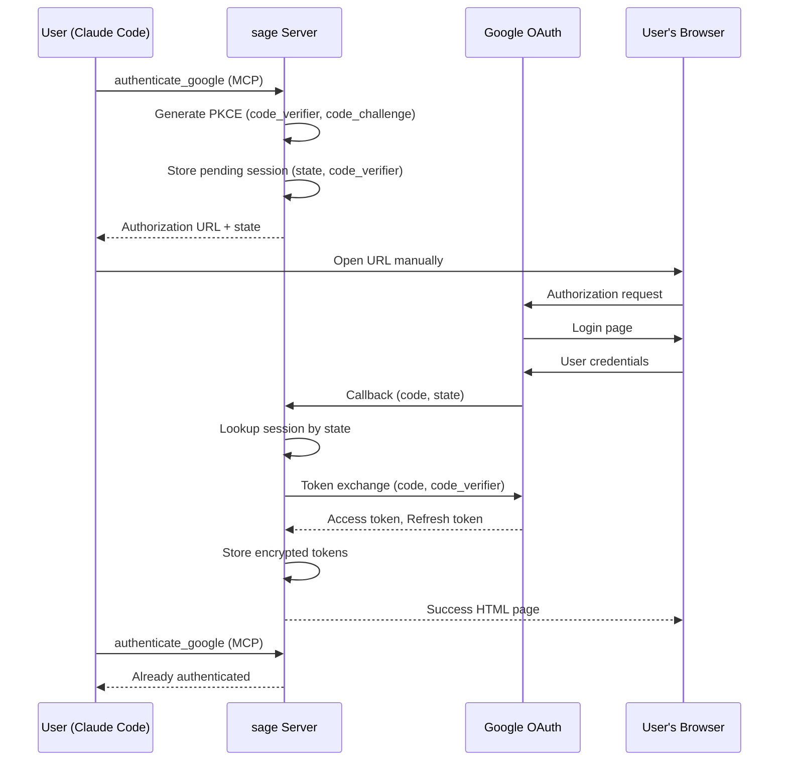

# Design: Remote Google OAuth Authentication

## Overview

リモートサーバーで実行されるsage MCPサーバーに対して、Google OAuthのサーバー直接コールバック方式を実装する。

## Architecture



## Components

### 1. PendingGoogleAuthStore

保留中のGoogle OAuth認証セッションを管理するストア。

```typescript
// src/oauth/pending-google-auth-store.ts

interface PendingGoogleAuth {
  state: string;           // CSRF protection token
  codeVerifier: string;    // PKCE code_verifier
  redirectUri: string;     // Callback URL used
  createdAt: number;       // Timestamp
  expiresAt: number;       // Expiration timestamp
}

class PendingGoogleAuthStore {
  private sessions: Map<string, PendingGoogleAuth>;
  private storagePath: string;

  // Create new pending auth session
  create(redirectUri: string): { state: string; codeChallenge: string; authUrl: string };

  // Find session by state
  findByState(state: string): PendingGoogleAuth | null;

  // Remove session (after use or expiration)
  remove(state: string): void;

  // Clean up expired sessions
  cleanupExpired(): void;

  // Persist to disk
  private persist(): Promise<void>;

  // Load from disk
  private load(): Promise<void>;
}
```

**設計決定:**
- セッションはメモリ + ファイル永続化（サーバー再起動対応）
- 既存の `EncryptionService` を使用して暗号化保存
- デフォルト有効期限: 10分
- `state` をキーとしてO(1)検索

### 2. GoogleOAuthCallbackHandler

HTTPサーバーに追加するGoogle OAuthコールバックハンドラー。

```typescript
// src/oauth/google-oauth-callback-handler.ts

interface GoogleOAuthCallbackHandlerOptions {
  pendingAuthStore: PendingGoogleAuthStore;
  googleOAuthHandler: GoogleOAuthHandler;
}

class GoogleOAuthCallbackHandler {
  // Handle GET /oauth/google/callback
  async handleCallback(
    req: IncomingMessage,
    res: ServerResponse
  ): Promise<void>;

  // Parse query parameters
  private parseCallbackParams(url: string): { code?: string; state?: string; error?: string };

  // Exchange code for tokens
  private async exchangeCodeForTokens(
    code: string,
    session: PendingGoogleAuth
  ): Promise<GoogleTokens>;

  // Render success HTML
  private renderSuccessPage(res: ServerResponse): void;

  // Render error HTML
  private renderErrorPage(res: ServerResponse, error: string): void;
}
```

### 3. authenticate_google ツール拡張

既存の `handleAuthenticateGoogle` を拡張してリモートモードをサポート。

```typescript
// src/tools/oauth/authenticate-google.ts (拡張)

interface AuthenticateGoogleResult {
  success: boolean;
  message: string;
  // 既存フィールド
  alreadyAuthenticated?: boolean;
  expiresAt?: string;
  scopes?: string[];
  // 新規フィールド (リモートモード)
  authorizationUrl?: string;      // ユーザーがブラウザで開くURL
  state?: string;                  // セッション識別子
  pendingAuth?: boolean;           // 認証待ち状態
  expiresIn?: number;              // セッション有効期限（秒）
}

// 動作モード判定
function isRemoteMode(): boolean {
  const redirectUri = process.env.GOOGLE_REDIRECT_URI;
  return redirectUri !== undefined && !redirectUri.includes('localhost');
}
```

**動作フロー:**
1. `isRemoteMode()` で動作モード判定
2. リモートモード: 認証URL生成 → セッション保存 → URL返却
3. ローカルモード: 既存フロー（ブラウザ自動起動 + localhost callback）

### 4. HTTPサーバー統合

`http-server-with-config.ts` にコールバックエンドポイントを追加。

```typescript
// src/cli/http-server-with-config.ts (変更箇所)

class HTTPServerWithConfigImpl {
  private googleOAuthCallbackHandler: GoogleOAuthCallbackHandler | null = null;
  private pendingGoogleAuthStore: PendingGoogleAuthStore | null = null;

  async start(): Promise<void> {
    // ... existing code ...

    // Initialize Google OAuth callback handler if configured
    if (process.env.GOOGLE_CLIENT_ID && process.env.GOOGLE_CLIENT_SECRET) {
      this.pendingGoogleAuthStore = new PendingGoogleAuthStore();
      await this.pendingGoogleAuthStore.load();

      const googleOAuthHandler = new GoogleOAuthHandler({
        clientId: process.env.GOOGLE_CLIENT_ID,
        clientSecret: process.env.GOOGLE_CLIENT_SECRET,
        redirectUri: process.env.GOOGLE_REDIRECT_URI || '',
      });

      this.googleOAuthCallbackHandler = new GoogleOAuthCallbackHandler({
        pendingAuthStore: this.pendingGoogleAuthStore,
        googleOAuthHandler,
      });
    }
  }

  private handleRequest(req: IncomingMessage, res: ServerResponse): void {
    // ... existing routing ...

    // Google OAuth callback (no auth required)
    if (path === '/oauth/google/callback' && method === 'GET') {
      if (this.googleOAuthCallbackHandler) {
        this.googleOAuthCallbackHandler.handleCallback(req, res);
      } else {
        res.writeHead(503);
        res.end('Google OAuth not configured');
      }
      return;
    }
  }
}
```

## Data Models

### PendingGoogleAuth (永続化)

```typescript
interface PendingGoogleAuth {
  state: string;           // UUID v4
  codeVerifier: string;    // 43-128 character random string
  redirectUri: string;     // Full callback URL
  createdAt: number;       // Unix timestamp (ms)
  expiresAt: number;       // Unix timestamp (ms)
}

// Storage format (encrypted JSON)
interface PendingGoogleAuthStorage {
  version: 1;
  sessions: PendingGoogleAuth[];
}
```

### 保存先

```
~/.sage/
  google_oauth_tokens.enc           # 既存: アクセストークン/リフレッシュトークン
  google_pending_auth.enc           # 新規: 保留中認証セッション
```

## API Design

### authenticate_google (MCP Tool)

**リモートモード時のレスポンス例:**

```json
{
  "success": true,
  "message": "以下のURLをブラウザで開いてGoogle認証を完了してください。",
  "authorizationUrl": "https://accounts.google.com/o/oauth2/v2/auth?...",
  "state": "abc123",
  "pendingAuth": true,
  "expiresIn": 600
}
```

**認証完了後のレスポンス例:**

```json
{
  "success": true,
  "message": "Google Calendar の認証が完了しました！",
  "alreadyAuthenticated": true,
  "expiresAt": "2026-01-06T15:00:00Z",
  "scopes": ["https://www.googleapis.com/auth/calendar"]
}
```

### GET /oauth/google/callback

**成功時:**
- HTTP 200
- Content-Type: text/html
- HTML: 「認証が完了しました。このウィンドウを閉じてください。」

**エラー時:**
- HTTP 200 (ブラウザ表示のため)
- Content-Type: text/html
- HTML: エラーメッセージ + 再試行手順

## Security Considerations

### PKCE Implementation

```typescript
// 既存の src/oauth/pkce.ts を使用
import { generateCodeVerifier, generateCodeChallenge } from './pkce.js';

// code_verifier: 43-128 characters (URL-safe)
// code_challenge: SHA-256 hash, base64url encoded
```

### State Parameter

```typescript
import { randomUUID } from 'crypto';

// Generate cryptographically random state
const state = randomUUID();
```

### Session Expiration

- デフォルト: 10分 (600秒)
- 環境変数 `GOOGLE_AUTH_SESSION_TIMEOUT` でカスタマイズ可能
- コールバック受信後は即座にセッション削除
- 定期的な期限切れセッションクリーンアップ（5分ごと）

## Error Handling

| Error | User Message | HTTP Status |
|-------|--------------|-------------|
| Session not found | 認証セッションが見つかりません。再度認証を開始してください。 | 200 (HTML) |
| Session expired | 認証の有効期限が切れました。再度認証を開始してください。 | 200 (HTML) |
| Token exchange failed | トークンの取得に失敗しました。再度認証を開始してください。 | 200 (HTML) |
| OAuth denied | 認証が拒否されました。 | 200 (HTML) |
| Server error | サーバーエラーが発生しました。 | 500 (HTML) |

## HTML Templates

### Success Page

```html
<!DOCTYPE html>
<html>
<head>
  <title>sage - Google Calendar 認証完了</title>
  <meta charset="utf-8">
  <style>
    body { font-family: system-ui; text-align: center; padding: 50px; background: #f9fafb; }
    .container { max-width: 400px; margin: 0 auto; background: white; padding: 40px; border-radius: 12px; }
    .success { color: #22c55e; font-size: 48px; }
    h1 { color: #111827; }
    p { color: #6b7280; }
  </style>
</head>
<body>
  <div class="container">
    <div class="success">✓</div>
    <h1>認証が完了しました</h1>
    <p>このウィンドウを閉じて、Claude に戻ってください。</p>
  </div>
</body>
</html>
```

### Error Page

```html
<!DOCTYPE html>
<html>
<head>
  <title>sage - Google Calendar 認証エラー</title>
  <meta charset="utf-8">
  <style>
    body { font-family: system-ui; text-align: center; padding: 50px; background: #f9fafb; }
    .container { max-width: 400px; margin: 0 auto; background: white; padding: 40px; border-radius: 12px; }
    .error { color: #ef4444; font-size: 48px; }
    h1 { color: #111827; }
    p { color: #6b7280; }
    .error-detail { background: #fef2f2; color: #991b1b; padding: 12px; border-radius: 8px; margin-top: 16px; }
  </style>
</head>
<body>
  <div class="container">
    <div class="error">✗</div>
    <h1>認証に失敗しました</h1>
    <p>Claude に戻って再試行してください。</p>
    <div class="error-detail">{{ERROR_MESSAGE}}</div>
  </div>
</body>
</html>
```

## Documentation Updates

### README.md に追加するセクション

```markdown
## Google Calendar 連携設定

### 1. Google Cloud Console でOAuthクライアントを作成

1. [Google Cloud Console](https://console.cloud.google.com/) にアクセス
2. 「APIとサービス」→「認証情報」→「認証情報を作成」→「OAuthクライアントID」
3. アプリケーションの種類: **Webアプリケーション**
4. 承認済みのリダイレクトURI:
   - ローカル開発: `http://localhost:3000/oauth/callback`
   - 本番サーバー: `https://mcp.example.com/oauth/google/callback`

### 2. 環境変数の設定

```bash
export GOOGLE_CLIENT_ID="your-client-id.apps.googleusercontent.com"
export GOOGLE_CLIENT_SECRET="your-client-secret"
export GOOGLE_REDIRECT_URI="https://mcp.example.com/oauth/google/callback"
```

### 3. 認証の実行

Claude から `authenticate_google` ツールを実行:

1. 表示されたURLをブラウザで開く
2. Googleアカウントでログイン
3. アクセスを許可
4. 「認証が完了しました」と表示されたらウィンドウを閉じる
5. Claude で認証状態を確認

### トラブルシューティング

| 問題 | 解決策 |
|------|--------|
| redirect_uri_mismatch | Google Cloud Console のリダイレクトURIが環境変数と一致しているか確認 |
| 認証URLが開けない | URLをコピーしてブラウザに貼り付け |
| セッション期限切れ | 10分以内に認証を完了してください |
```

## File Structure

```
src/
  oauth/
    pending-google-auth-store.ts    # 新規: 保留中認証セッション管理
    google-oauth-callback-handler.ts # 新規: コールバックハンドラー
    google-oauth-handler.ts         # 既存: 変更なし
    pkce.ts                         # 既存: 変更なし
  tools/
    oauth/
      authenticate-google.ts        # 既存: リモートモード対応を追加
  cli/
    http-server-with-config.ts      # 既存: コールバックエンドポイント追加
```

## Testing Strategy

### Unit Tests

1. `PendingGoogleAuthStore`
   - セッション作成/検索/削除
   - 期限切れクリーンアップ
   - 永続化/読み込み

2. `GoogleOAuthCallbackHandler`
   - 正常コールバック処理
   - エラーパラメータ処理
   - セッション不明/期限切れ

3. `handleAuthenticateGoogle` (リモートモード)
   - 認証URL生成
   - 保留中セッション検出
   - 認証完了検出

### Integration Tests

1. フルOAuthフロー (モック)
   - 認証開始 → コールバック → トークン保存

### E2E Tests

1. HTTPサーバーエンドポイント
   - `/oauth/google/callback` レスポンス確認

## Migration Notes

- 既存のローカル認証フローは変更なし
- `GOOGLE_REDIRECT_URI` が localhost 以外の場合のみリモートモード有効
- 既存のトークン保存形式は互換性維持
