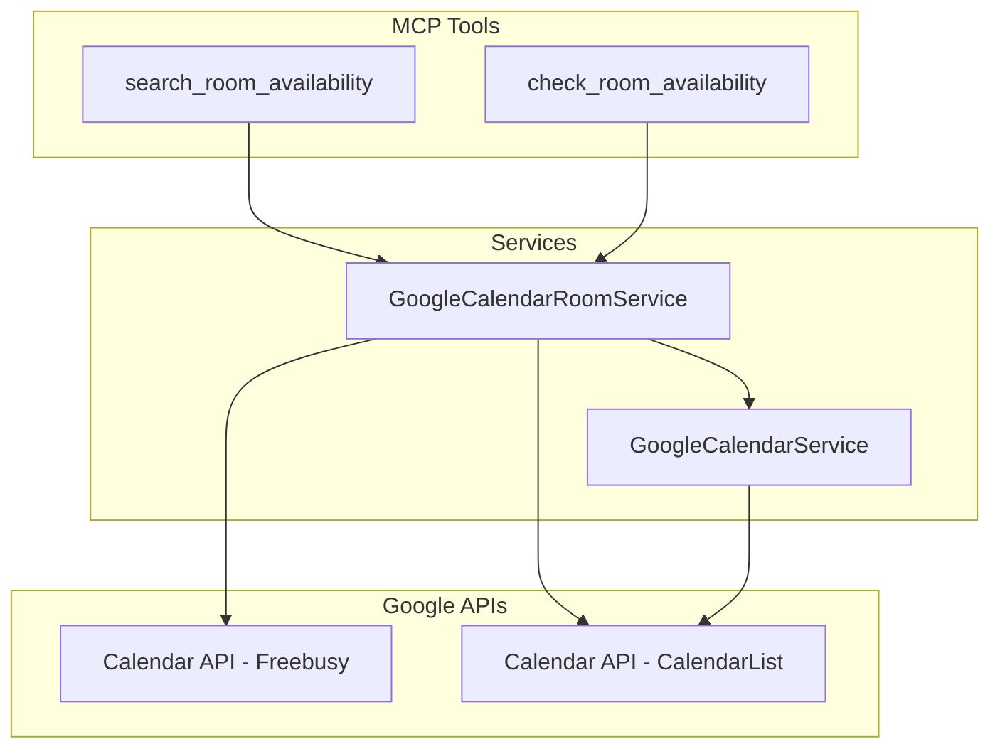

# Design Document: Room Availability Search

## Overview

Google Calendar の Freebusy API を活用して、Google Workspace 内の会議室リソースの空き状況を検索する機能を実装します。既存の `GoogleCalendarService` と `CalendarSourceManager` のパターンを拡張し、新しい MCP ツールとして提供します。

## Steering Document Alignment

### Technical Standards (tech.md)
- **googleapis**: 既存の Google Calendar API クライアントを再利用
- **Zod**: 入力パラメータのバリデーションに使用
- **Retry pattern**: 既存の `retryWithBackoff` を API 呼び出しに適用
- **Error Handling**: 既存のエラーハンドリングパターンを踏襲

### Project Structure (structure.md)
- **New service**: `src/integrations/google-calendar-room-service.ts`
- **Types**: `src/types/google-calendar-types.ts` に追加
- **MCP tools**: `src/index.ts` に新規ツールを追加
- **Tests**: `tests/unit/integrations/` と `tests/integration/` に配置

## Code Reuse Analysis

### Existing Components to Leverage
- **GoogleCalendarService**: OAuth 認証、API クライアント初期化、リトライロジック
- **CalendarSourceManager**: マルチソース統合パターン（将来の拡張用）
- **retryWithBackoff** (`src/utils/retry.ts`): API 呼び出しのリトライ処理
- **Zod schemas** (`src/config/validation.ts`): バリデーションパターン

### Integration Points
- **GoogleOAuthHandler**: 既存の OAuth トークン管理を使用
- **MCP Server** (`src/index.ts`): 新規ツールの登録
- **create_calendar_event**: 会議室予約時に attendee として追加

## Architecture



## Components and Interfaces

### Component 1: GoogleCalendarRoomService

- **Purpose:** 会議室リソースの取得と空き状況検索を担当
- **Interfaces:**
  ```typescript
  class GoogleCalendarRoomService {
    constructor(googleCalendarService: GoogleCalendarService)

    // 空き会議室検索（CalendarList + Freebusy API）
    async searchRoomAvailability(request: RoomAvailabilityRequest): Promise<RoomAvailability[]>

    // 特定会議室の空き確認
    async checkRoomAvailability(roomId: string, startTime: string, endTime: string): Promise<SingleRoomAvailability>

    // 内部: 会議室リソース取得（CalendarList API）
    private async fetchRoomResources(filters?: RoomResourceFilter): Promise<RoomResource[]>

    // 内部: 空き状況取得（Freebusy API）
    private async queryFreebusy(roomIds: string[], startTime: string, endTime: string): Promise<FreebusyResponse>

    // 内部: 結果のソート（capacity match → name）
    private sortByCapacityMatch(rooms: RoomAvailability[], requiredCapacity?: number): RoomAvailability[]
  }
  ```
- **Dependencies:** GoogleCalendarService, GoogleOAuthHandler
- **Reuses:** GoogleCalendarService の認証・リトライ機構

### Component 2: MCP Tools

- **Purpose:** ユーザー向けの MCP インターフェースを提供
- **Interfaces:**
  - `search_room_availability`: 空き会議室を検索（フィルター付き）
  - `check_room_availability`: 特定会議室の空き確認
- **Dependencies:** GoogleCalendarRoomService
- **Reuses:** 既存の MCP ツール登録パターン

## Data Models

### RoomResource
```typescript
interface RoomResource {
  id: string;              // Calendar ID (e.g., "room-huddle-1@company.com")
  name: string;            // Display name
  email: string;           // Resource email address
  capacity?: number;       // Room capacity
  features?: string[];     // ["videoConference", "whiteboard", etc.]
  building?: string;       // Building name
  floor?: string;          // Floor identifier
  description?: string;    // Room description
}
```

### RoomResourceFilter
```typescript
interface RoomResourceFilter {
  minCapacity?: number;    // Minimum required capacity
  building?: string;       // Filter by building
  floor?: string;          // Filter by floor
  features?: string[];     // Required features
}
```

### RoomAvailabilityRequest
```typescript
interface RoomAvailabilityRequest {
  startTime: string;       // ISO 8601 format (required)
  endTime?: string;        // ISO 8601 format (optional if durationMinutes specified)
  durationMinutes?: number; // Duration in minutes (optional if endTime specified)
  minCapacity?: number;    // Filter by minimum capacity
  building?: string;       // Filter by building
  floor?: string;          // Filter by floor
  features?: string[];     // Filter by required features
}
```

### RoomAvailability
```typescript
interface RoomAvailability {
  room: RoomResource;
  isAvailable: boolean;    // True if completely free during requested period
  busyPeriods: Array<{
    start: string;
    end: string;
  }>;
}
```

### SingleRoomAvailability
```typescript
interface SingleRoomAvailability {
  room: RoomResource;
  isAvailable: boolean;
  busyPeriods: Array<{
    start: string;
    end: string;
  }>;
  requestedPeriod: {
    start: string;
    end: string;
  };
}
```

## API Implementation Details

### CalendarList API for Room Discovery

Google Workspace の会議室は CalendarList API で取得可能です。会議室リソースは `accessRole` が `freeBusyReader` 以上で、カレンダーの種類で識別します。

```typescript
// CalendarList API を使用して会議室を取得
const response = await calendar.calendarList.list({
  minAccessRole: 'freeBusyReader',
  showHidden: true,
});

// 会議室リソースは summary や description からパターンマッチで識別
// または Google Workspace Admin が設定した resource calendar として識別
```

### Freebusy API for Availability Check

```typescript
// Freebusy API で空き状況を一括取得（最大50カレンダー）
const response = await calendar.freebusy.query({
  requestBody: {
    timeMin: startTime,
    timeMax: endTime,
    items: roomIds.map(id => ({ id })),
  },
});

// Response structure:
// {
//   calendars: {
//     "room-id@company.com": {
//       busy: [{ start: "...", end: "..." }, ...]
//     }
//   }
// }
```

### Duration to EndTime Calculation

```typescript
// durationMinutes が指定された場合、endTime を計算
function calculateEndTime(startTime: string, durationMinutes: number): string {
  const start = new Date(startTime);
  const end = new Date(start.getTime() + durationMinutes * 60 * 1000);
  return end.toISOString();
}
```

### Sorting Algorithm

```typescript
// Capacity match でソート: |required - actual| の昇順、同スコアは name の昇順
function sortByCapacityMatch(rooms: RoomAvailability[], requiredCapacity?: number): RoomAvailability[] {
  return rooms.sort((a, b) => {
    if (requiredCapacity) {
      const diffA = Math.abs((a.room.capacity ?? 0) - requiredCapacity);
      const diffB = Math.abs((b.room.capacity ?? 0) - requiredCapacity);
      if (diffA !== diffB) return diffA - diffB;
    }
    return a.room.name.localeCompare(b.room.name);
  });
}
```

## Error Handling

### Error Scenarios

1. **Google API 認証エラー**
   - **Handling:** 既存の OAuth リフレッシュロジックで再認証
   - **User Impact:** "Google Calendar の認証が必要です。再認証してください。"

2. **会議室が見つからない**
   - **Handling:** 空の配列を返却、またはエラーメッセージ
   - **User Impact:** "指定された会議室が見つかりません: {roomId}"

3. **API レート制限**
   - **Handling:** 既存の retryWithBackoff で exponential backoff
   - **User Impact:** 自動リトライ後、成功または "一時的にサービスが利用できません"

4. **無効な時間範囲**
   - **Handling:** Zod バリデーションでエラー
   - **User Impact:** "開始時間は終了時間より前である必要があります"

5. **Google Workspace 未設定**
   - **Handling:** Google Calendar ソースが無効の場合にエラー
   - **User Impact:** "Google Calendar が設定されていません。設定を確認してください。"

6. **endTime と durationMinutes の両方が未指定**
   - **Handling:** Zod バリデーションでエラー
   - **User Impact:** "endTime または durationMinutes のいずれかを指定してください"

## Testing Strategy

### Unit Testing
- **GoogleCalendarRoomService**: 各メソッドの単体テスト
- **Mock**: googleapis クライアントをモック
- **Coverage**: 正常系、エラー系、エッジケース
- **Sorting**: capacity match ソートロジックのテスト
- **Duration calculation**: endTime 計算ロジックのテスト

### Integration Testing
- **API 呼び出し**: 実際の Google Calendar API との統合テスト（テスト環境）
- **認証フロー**: OAuth トークンの取得・リフレッシュ

### End-to-End Testing
- **MCP ツール**: search_room_availability, check_room_availability の E2E テスト
- **シナリオ**: 会議室検索 → 空き確認 → 予約の一連のフロー

## MCP Tool Definitions

### search_room_availability

```typescript
{
  name: "search_room_availability",
  description: "Search for available meeting rooms during a specific time period. Returns rooms with their availability status, sorted by capacity match. Specify either endTime or durationMinutes.",
  inputSchema: {
    type: "object",
    properties: {
      startTime: {
        type: "string",
        description: "Start time in ISO 8601 format (e.g., 2026-01-08T14:00:00+09:00)"
      },
      endTime: {
        type: "string",
        description: "End time in ISO 8601 format. Required if durationMinutes is not specified."
      },
      durationMinutes: {
        type: "number",
        description: "Meeting duration in minutes. Required if endTime is not specified. (e.g., 30, 60)"
      },
      minCapacity: {
        type: "number",
        description: "Minimum room capacity required"
      },
      building: {
        type: "string",
        description: "Filter by building name"
      },
      floor: {
        type: "string",
        description: "Filter by floor"
      },
      features: {
        type: "array",
        items: { type: "string" },
        description: "Required features (e.g., 'videoConference', 'whiteboard')"
      }
    },
    required: ["startTime"]
  }
}
```

### check_room_availability

```typescript
{
  name: "check_room_availability",
  description: "Check if a specific meeting room is available during a time period. Returns availability status and busy periods.",
  inputSchema: {
    type: "object",
    properties: {
      roomId: {
        type: "string",
        description: "Room calendar ID to check (e.g., 'room-name@company.com')"
      },
      startTime: {
        type: "string",
        description: "Start time in ISO 8601 format"
      },
      endTime: {
        type: "string",
        description: "End time in ISO 8601 format"
      }
    },
    required: ["roomId", "startTime", "endTime"]
  }
}
```

## Performance Considerations

### Response Time Targets
- **Availability search (≤10 rooms)**: < 2 seconds
- **Single room check**: < 1 second

### Implementation Approach
- **Freebusy API**: 最大50カレンダーを1リクエストで一括クエリ（N回の個別クエリより効率的）
- **Parallel execution**: CalendarList と Freebusy を可能な限り並列実行
- **No caching**: リアルタイム精度を優先（requirements により）
- **Timeout**: Google API 呼び出しに 5 秒のタイムアウトを設定
