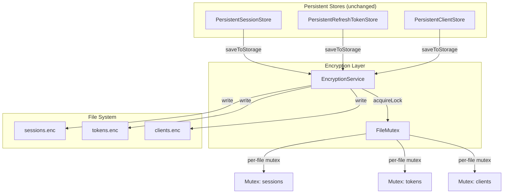
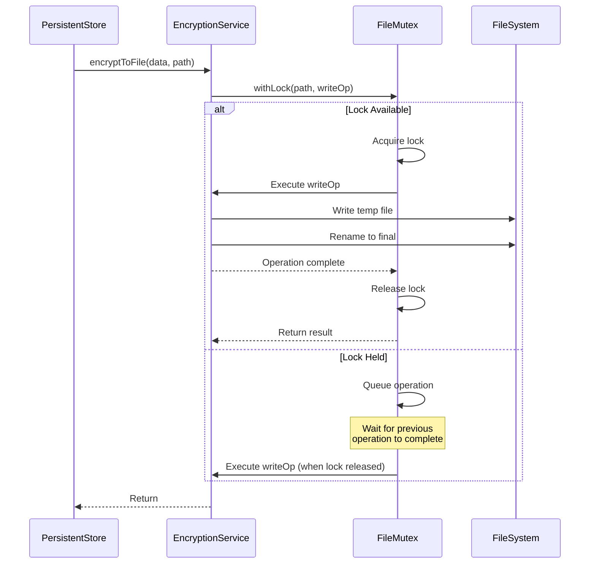

# Design Document: Session Store Mutex

## Overview

This design implements a file-level mutex mechanism to prevent race conditions during concurrent encrypted file operations in the OAuth persistent stores. The mutex will be integrated into `EncryptionService` to serialize file writes transparently, requiring no changes to the public APIs of the persistent stores.

## Steering Document Alignment

### Technical Standards (tech.md)

- **TypeScript**: Fully typed mutex implementation with generic Promise handling
- **No External Dependencies**: Pure TypeScript implementation using Promise queuing
- **Error Handling**: Proper error propagation with logging for debugging
- **Async/Await**: Consistent with existing async patterns in the codebase

### Project Structure (structure.md)

- **Location**: `src/oauth/file-mutex.ts` - New utility class in the oauth module
- **Integration**: Modify `src/oauth/encryption-service.ts` to use mutex
- **Tests**: `tests/unit/oauth/file-mutex.test.ts`

## Code Reuse Analysis

### Existing Components to Leverage

- **EncryptionService**: Will be extended to use the mutex internally
- **Existing atomic write pattern**: The temp file + rename pattern remains unchanged
- **Console logging**: Use existing `[OAuth]` log prefix pattern

### Integration Points

- **EncryptionService.encryptToFile()**: Wrap with mutex acquisition
- **EncryptionService.decryptFromFile()**: Wrap with mutex for read consistency
- **Persistent Stores**: No changes needed - mutex is transparent

## Architecture



## Components and Interfaces

### FileMutex Class

- **Purpose**: Provides per-file mutex for serializing file operations
- **File**: `src/oauth/file-mutex.ts`
- **Interfaces**:
  ```typescript
  class FileMutex {
    // Acquire lock for a file, execute operation, release lock
    async withLock<T>(filePath: string, operation: () => Promise<T>): Promise<T>;

    // Get metrics for monitoring/debugging
    getMetrics(): FileMutexMetrics;
  }
  ```
- **Dependencies**: None (pure TypeScript)
- **Reuses**: Promise queuing pattern

### FileMutex Internal Design



## Data Models

### FileMutexMetrics

```typescript
interface FileMutexMetrics {
  activeFiles: number;        // Number of files with active locks
  totalWaitTimeMs: number;    // Cumulative wait time across all operations
  longestWaitMs: number;      // Longest single wait time
  queueDepthWarnings: number; // Count of queue depth warnings
}
```

### MutexState (Internal)

```typescript
interface MutexState {
  queue: Array<{
    resolve: () => void;
    queuedAt: number;
  }>;
  isLocked: boolean;
}
```

## Implementation Details

### Promise Queue Pattern

The mutex uses a simple promise queue pattern that doesn't require external dependencies:

```typescript
class FileMutex {
  private locks: Map<string, MutexState> = new Map();

  async withLock<T>(filePath: string, operation: () => Promise<T>): Promise<T> {
    const normalizedPath = this.normalizePath(filePath);

    // Get or create mutex state for this file
    if (!this.locks.has(normalizedPath)) {
      this.locks.set(normalizedPath, { queue: [], isLocked: false });
    }

    const state = this.locks.get(normalizedPath)!;

    // Wait if locked
    if (state.isLocked) {
      const queuedAt = Date.now();
      await new Promise<void>(resolve => {
        state.queue.push({ resolve, queuedAt });
        this.checkQueueWarnings(normalizedPath, state);
      });
    }

    // Acquire lock
    state.isLocked = true;

    try {
      return await operation();
    } finally {
      // Release lock and notify next in queue
      if (state.queue.length > 0) {
        const next = state.queue.shift()!;
        const waitTime = Date.now() - next.queuedAt;
        this.recordWaitTime(waitTime);
        next.resolve();
      } else {
        state.isLocked = false;
        // Clean up empty mutex state
        this.locks.delete(normalizedPath);
      }
    }
  }
}
```

### EncryptionService Integration

```typescript
// In EncryptionService
private fileMutex: FileMutex = new FileMutex();

async encryptToFile(data: string, filePath: string): Promise<void> {
  await this.fileMutex.withLock(filePath, async () => {
    // Existing implementation unchanged
    const encrypted = await this.encrypt(data);
    const tempPath = `${filePath}.tmp`;
    await writeFile(tempPath, encrypted, { mode: 0o600 });
    await rename(tempPath, filePath);
  });
}

async decryptFromFile(filePath: string): Promise<string | null> {
  return await this.fileMutex.withLock(filePath, async () => {
    // Existing implementation unchanged
    if (!existsSync(filePath)) return null;
    const encrypted = await readFile(filePath, 'utf-8');
    return await this.decrypt(encrypted);
  });
}
```

## Error Handling

### Error Scenarios

1. **Operation throws during lock hold**
   - **Handling**: Lock is released in `finally` block, error propagates to caller
   - **User Impact**: Caller receives error, next queued operation proceeds

2. **Queue depth exceeds threshold (10 operations)**
   - **Handling**: Log warning `[OAuth] High mutex contention on {file}: {count} queued operations`
   - **User Impact**: None - operations continue, warning aids debugging

3. **Wait time exceeds threshold (5 seconds)**
   - **Handling**: Log warning `[OAuth] Long mutex wait on {file}: {time}ms`
   - **User Impact**: None - operation completes, warning aids debugging

4. **Process crash while holding lock**
   - **Handling**: In-memory mutex - lock is automatically released on process exit
   - **User Impact**: Temp files may remain, but next startup will work normally

## Testing Strategy

### Unit Testing

**File**: `tests/unit/oauth/file-mutex.test.ts`

1. **Basic lock/unlock**
   - Single operation acquires and releases lock correctly
   - Sequential operations execute in order

2. **Concurrent operations**
   - Multiple concurrent operations on same file serialize correctly
   - Operations on different files execute in parallel

3. **Error handling**
   - Lock is released even when operation throws
   - Error propagates to caller

4. **Metrics tracking**
   - Wait times are recorded accurately
   - Queue warnings trigger at correct threshold

### Integration Testing

**File**: `tests/integration/oauth-persistence.test.ts` (extend existing)

1. **Concurrent session creation**
   - Create 10 sessions concurrently
   - All sessions persist without ENOENT errors
   - All sessions retrievable after completion

2. **Mixed operations**
   - Concurrent create/read/delete operations
   - No race condition errors

3. **Cross-store independence**
   - Concurrent writes to sessions and tokens
   - Operations on different stores don't block each other

### End-to-End Testing

No additional E2E tests needed - existing OAuth tests will validate the mutex works correctly in production scenarios.

## Requirement Traceability

| Requirement | Design Element |
|-------------|----------------|
| FR-1 (Serialization) | `FileMutex.withLock()` queues operations |
| FR-2 (Per-file mutex) | `Map<string, MutexState>` provides file-level isolation |
| FR-3 (Seamless integration) | Mutex is internal to EncryptionService, no API changes |
| FR-4 (Graceful shutdown) | `flush()` methods unchanged, mutex completes pending ops |
| NFR-1 (< 1ms overhead) | Simple Promise operations, no external deps |
| NFR-2 (Log > 100ms wait) | `recordWaitTime()` with threshold logging |
| NFR-6 (Prevent ENOENT) | Serialized writes prevent temp file conflicts |
| NFR-7 (No deadlock) | Single lock per file, no nested locking |
