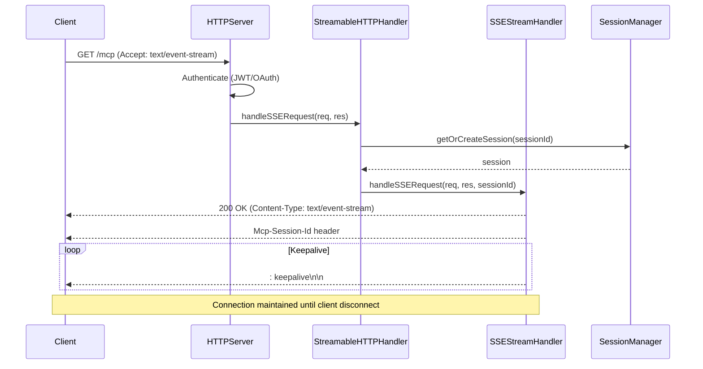
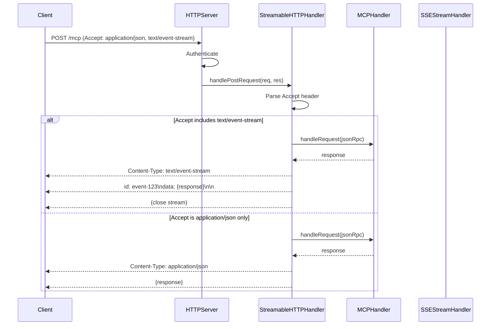

# Design: Streamable HTTP Transport

> **Last Updated**: 2026-01-19
> **Status**: Draft
> **Feature**: streamable-http-transport
> **Requirements**: [requirements.md](./requirements.md)

## Overview

既存の`SSEStreamHandler`を活用し、`HTTPServerWithConfig`にStreamable HTTP Transport対応を追加する。

## Architecture

### Component Diagram

```
┌─────────────────────────────────────────────────────────────────┐
│                    HTTPServerWithConfig                          │
│  ┌───────────────────────────────────────────────────────────┐  │
│  │                    handleRequest()                         │  │
│  │  ┌─────────────┐  ┌─────────────┐  ┌─────────────────┐   │  │
│  │  │ GET /mcp    │  │ POST /mcp   │  │ DELETE /mcp     │   │  │
│  │  │ (SSE Stream)│  │ (JSON-RPC)  │  │ (Session Term)  │   │  │
│  │  └──────┬──────┘  └──────┬──────┘  └────────┬────────┘   │  │
│  └─────────┼────────────────┼──────────────────┼────────────┘  │
│            │                │                  │                │
│  ┌─────────▼────────────────▼──────────────────▼────────────┐  │
│  │              StreamableHTTPHandler (NEW)                  │  │
│  │  ┌────────────────┐  ┌────────────────────────────────┐  │  │
│  │  │ SessionManager │  │ SSEStreamHandler (existing)    │  │  │
│  │  │ - sessions Map │  │ - connections Map              │  │  │
│  │  │ - eventBuffer  │  │ - keepalive timer              │  │  │
│  │  └────────────────┘  └────────────────────────────────┘  │  │
│  └───────────────────────────────────────────────────────────┘  │
│                              │                                   │
│  ┌───────────────────────────▼───────────────────────────────┐  │
│  │                      MCPHandler                            │  │
│  │              (existing JSON-RPC handling)                  │  │
│  └───────────────────────────────────────────────────────────┘  │
└─────────────────────────────────────────────────────────────────┘
```

### Sequence Diagram - SSE Stream Establishment



### Sequence Diagram - POST with SSE Response



## Data Models

### Session

```typescript
interface StreamableSession {
  /** Cryptographically secure session ID (UUID v4) */
  id: string;

  /** User ID from authentication */
  userId?: string;

  /** Creation timestamp */
  createdAt: number;

  /** Last activity timestamp */
  lastActivityAt: number;

  /** Active SSE connections for this session */
  activeStreams: Set<string>;

  /** Event buffer for resumability (event ID -> event data) */
  eventBuffer: Map<string, BufferedEvent>;

  /** MCP initialization state */
  initialized: boolean;

  /** MCP capabilities negotiated */
  capabilities?: MCPCapabilities;
}

interface BufferedEvent {
  id: string;
  streamId: string;
  data: unknown;
  timestamp: number;
}

interface MCPCapabilities {
  roots?: { listChanged?: boolean };
  sampling?: object;
  experimental?: Record<string, unknown>;
}
```

### SSE Connection (Extended)

```typescript
interface SSEConnection {
  /** Connection ID */
  id: string;

  /** Session ID this connection belongs to */
  sessionId: string;

  /** HTTP response object */
  response: ServerResponse;

  /** Keepalive timer */
  keepaliveTimer: NodeJS.Timeout | null;

  /** Last sent event ID */
  lastEventId: string;

  /** Event counter for this stream */
  eventCounter: number;
}
```

## Component Design

### StreamableHTTPHandler

新しいコンポーネントとして`StreamableHTTPHandler`を作成し、Streamable HTTP Transport固有のロジックをカプセル化する。

```typescript
// src/cli/streamable-http-handler.ts

export interface StreamableHTTPHandlerOptions {
  /** Session timeout in milliseconds (default: 1 hour) */
  sessionTimeout?: number;

  /** Event buffer retention in milliseconds (default: 5 minutes) */
  eventBufferRetention?: number;

  /** Keepalive interval in milliseconds (default: 30 seconds) */
  keepaliveInterval?: number;

  /** Maximum sessions per server (default: 1000) */
  maxSessions?: number;

  /** Maximum SSE connections per session (default: 5) */
  maxStreamsPerSession?: number;
}

export interface StreamableHTTPHandler {
  /**
   * Handle GET /mcp - Establish SSE stream
   * @param req - HTTP request
   * @param res - HTTP response
   * @param userId - Authenticated user ID (optional)
   */
  handleGetRequest(
    req: IncomingMessage,
    res: ServerResponse,
    userId?: string
  ): Promise<void>;

  /**
   * Handle POST /mcp - Process JSON-RPC with optional SSE response
   * @param req - HTTP request
   * @param res - HTTP response
   * @param userId - Authenticated user ID (optional)
   */
  handlePostRequest(
    req: IncomingMessage,
    res: ServerResponse,
    userId?: string
  ): Promise<void>;

  /**
   * Handle DELETE /mcp - Terminate session
   * @param req - HTTP request
   * @param res - HTTP response
   */
  handleDeleteRequest(
    req: IncomingMessage,
    res: ServerResponse
  ): Promise<void>;

  /**
   * Send server-initiated message to session
   * @param sessionId - Target session
   * @param message - JSON-RPC message
   */
  sendToSession(sessionId: string, message: unknown): boolean;

  /**
   * Get session by ID
   */
  getSession(sessionId: string): StreamableSession | undefined;

  /**
   * Get active session count
   */
  getActiveSessionCount(): number;

  /**
   * Cleanup expired sessions and connections
   */
  cleanup(): void;
}
```

### SessionManager

セッション管理を担当するコンポーネント。

```typescript
// src/cli/session-manager.ts

export interface SessionManager {
  /**
   * Create new session
   */
  createSession(userId?: string): StreamableSession;

  /**
   * Get existing session
   */
  getSession(sessionId: string): StreamableSession | undefined;

  /**
   * Update session activity
   */
  touchSession(sessionId: string): void;

  /**
   * Delete session
   */
  deleteSession(sessionId: string): boolean;

  /**
   * Add event to session buffer
   */
  bufferEvent(sessionId: string, event: BufferedEvent): void;

  /**
   * Get events after specified event ID
   */
  getEventsAfter(sessionId: string, lastEventId: string): BufferedEvent[];

  /**
   * Cleanup expired sessions
   */
  cleanupExpiredSessions(): number;

  /**
   * Get active session count
   */
  getSessionCount(): number;
}
```

## Integration with Existing Code

### HTTPServerWithConfig Changes

`src/cli/http-server-with-config.ts`の`handleRequest`メソッドを拡張：

```typescript
private handleRequest(req: IncomingMessage, res: ServerResponse): void {
  const url = req.url || '/';
  const method = req.method || 'GET';
  const path = url.split('?')[0];

  // ... existing CORS and preflight handling ...

  // MCP endpoint - Streamable HTTP Transport
  if (path === '/mcp') {
    switch (method) {
      case 'GET':
        // NEW: SSE stream establishment
        this.handleMCPGetRequest(req, res);
        return;
      case 'POST':
        // MODIFIED: Support SSE response mode
        this.handleMCPPostRequest(req, res);
        return;
      case 'DELETE':
        // NEW: Session termination
        this.handleMCPDeleteRequest(req, res);
        return;
      default:
        res.writeHead(405, { 'Content-Type': 'application/json' });
        res.end(JSON.stringify({ error: 'Method not allowed' }));
        return;
    }
  }

  // ... existing routing ...
}

private async handleMCPGetRequest(req: IncomingMessage, res: ServerResponse): Promise<void> {
  // Validate Accept header
  const accept = req.headers.accept || '';
  if (!accept.includes('text/event-stream')) {
    res.writeHead(406, { 'Content-Type': 'application/json' });
    res.end(JSON.stringify({ error: 'Accept header must include text/event-stream' }));
    return;
  }

  // Authenticate
  const authResult = await this.authenticateRequest(req);
  if (!authResult.authenticated) {
    res.writeHead(401, { 'Content-Type': 'application/json' });
    res.end(JSON.stringify({ error: 'Unauthorized' }));
    return;
  }

  // Delegate to StreamableHTTPHandler
  await this.streamableHandler.handleGetRequest(req, res, authResult.userId);
}

private async handleMCPPostRequest(req: IncomingMessage, res: ServerResponse): Promise<void> {
  // Authenticate
  const authResult = await this.authenticateRequest(req);
  if (!authResult.authenticated) {
    res.writeHead(401, { 'Content-Type': 'application/json' });
    res.end(JSON.stringify({ error: 'Unauthorized' }));
    return;
  }

  // Delegate to StreamableHTTPHandler
  await this.streamableHandler.handlePostRequest(req, res, authResult.userId);
}

private async handleMCPDeleteRequest(req: IncomingMessage, res: ServerResponse): Promise<void> {
  await this.streamableHandler.handleDeleteRequest(req, res);
}
```

### SSEStreamHandler Enhancement

既存の`src/cli/sse-stream-handler.ts`を拡張してセッション統合とイベントID対応を追加：

```typescript
// Enhanced SSEConnection
interface SSEConnection {
  id: string;           // NEW: Unique connection ID
  sessionId: string;
  response: ServerResponse;
  keepaliveTimer: NodeJS.Timeout | null;
  lastEventId: string;  // NEW: For resumability
  eventCounter: number; // NEW: Event ID counter
}

// Enhanced methods
interface SSEStreamHandler {
  // Existing
  handleSSERequest(req: IncomingMessage, res: ServerResponse): Promise<void>;
  sendEvent(eventType: string, data: unknown, sessionId?: string): void;

  // NEW: Send with event ID
  sendEventWithId(
    sessionId: string,
    data: unknown,
    eventId?: string
  ): { sent: boolean; eventId: string };

  // NEW: Get events for resumability
  getConnectionBySessionId(sessionId: string): SSEConnection | undefined;
}
```

## Error Handling

### Error Response Format

```typescript
interface StreamableHTTPError {
  /** HTTP status code */
  status: number;

  /** Error message */
  message: string;

  /** JSON-RPC error (if applicable) */
  jsonrpc?: {
    jsonrpc: '2.0';
    error: {
      code: number;
      message: string;
      data?: unknown;
    };
  };
}
```

### Error Mapping

| Scenario | HTTP Status | JSON-RPC Code | Message |
|----------|-------------|---------------|---------|
| Invalid Accept header | 406 | - | Accept header must include text/event-stream |
| Missing session ID | 400 | - | Mcp-Session-Id header required |
| Invalid session ID | 404 | - | Session not found |
| Expired session | 404 | - | Session expired |
| Unauthenticated | 401 | - | Unauthorized |
| Parse error | 400 | -32700 | Parse error |
| Invalid request | 400 | -32600 | Invalid Request |
| Method not found | 404 | -32601 | Method not found |
| Internal error | 500 | -32603 | Internal error |

## Security Considerations

### DNS Rebinding Protection

```typescript
private validateOrigin(req: IncomingMessage): boolean {
  const origin = req.headers.origin;
  const host = req.headers.host;

  // Reject requests with mismatched origin and host
  if (origin && host) {
    const originHost = new URL(origin).host;
    if (originHost !== host && !this.config.remote.cors.allowedOrigins.includes(origin)) {
      return false;
    }
  }

  return true;
}
```

### Session Security

- Session IDs are UUID v4 (cryptographically random)
- Sessions are bound to authenticated user
- Session timeout: 1 hour (configurable)
- Maximum sessions per user: 10 (configurable)

### Rate Limiting

- SSE connection establishment: 10 per minute per IP
- POST requests: 100 per minute per session

## Configuration

### remote-config.json Extension

```json
{
  "remote": {
    "streamableHttp": {
      "enabled": true,
      "sessionTimeout": 3600000,
      "eventBufferRetention": 300000,
      "keepaliveInterval": 30000,
      "maxSessions": 1000,
      "maxStreamsPerSession": 5
    }
  }
}
```

## Testing Strategy

### Unit Tests

- SessionManager: create, get, delete, expire sessions
- StreamableHTTPHandler: request routing, Accept header parsing
- SSEStreamHandler: event ID generation, resumability

### Integration Tests

- Full SSE connection lifecycle
- POST with SSE response mode
- Session management across requests
- Authentication integration

### E2E Tests

- Codex client connection
- Multiple simultaneous streams
- Reconnection with Last-Event-ID
- Session expiration handling

## File Structure

```
src/cli/
├── http-server-with-config.ts  # Modified: Add GET/DELETE /mcp routing
├── streamable-http-handler.ts  # NEW: Main Streamable HTTP handler
├── session-manager.ts          # NEW: Session management
├── sse-stream-handler.ts       # Modified: Add event ID support
└── mcp-handler.ts              # Existing: JSON-RPC handling

tests/
├── unit/
│   ├── streamable-http-handler.test.ts  # NEW
│   └── session-manager.test.ts          # NEW
├── integration/
│   └── streamable-http-transport.test.ts # NEW
└── e2e/
    └── codex-connection.test.ts          # NEW
```

## Migration Path

1. **Phase 1**: Add GET /mcp SSE support (FR-1)
2. **Phase 2**: Add session management (FR-3)
3. **Phase 3**: Add POST SSE response mode (FR-2)
4. **Phase 4**: Add resumability (FR-5)
5. **Phase 5**: Add DELETE /mcp (FR-3.5)
6. **Phase 6**: Testing and documentation
