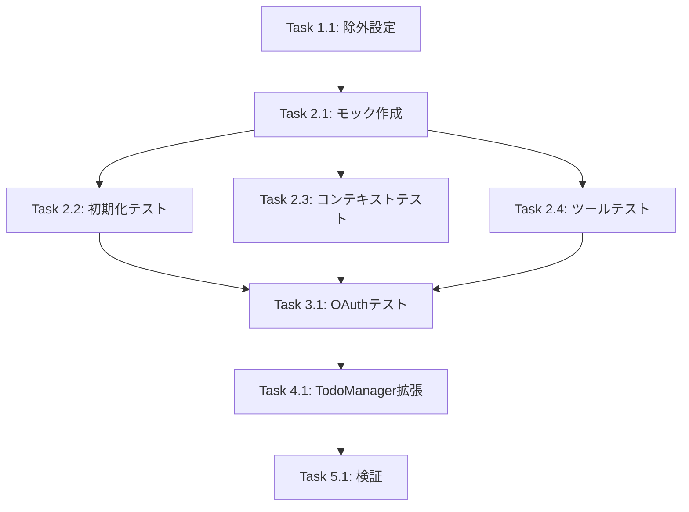

# Tasks: Test Coverage Improvement

## Overview
テスト追加によりカバレッジを80%閾値に到達させる。

## Task List

### Phase 1: Coverage Exclusions (REQ-2)

- [x] **Task 1.1**: jest.config.js に除外ファイルを追加
  - **Files**: `jest.config.js`
  - **Requirements**: REQ-2 (AC-2.1, AC-2.2, AC-2.3)
  - **Status**: 完了済み

### Phase 2: mcp-handler.ts テスト追加 (REQ-1)

- [x] **Task 2.1**: テストユーティリティとモックの作成
  - **Files**:
    - `tests/utils/mock-config.ts` (NEW)
  - **Requirements**: REQ-1
  - **Description**: ConfigLoader と UserConfig のモックヘルパーを作成
  - **Acceptance**: モックが正しく動作し、他のテストで再利用可能

- [x] **Task 2.2**: MCPHandler 初期化テストの作成
  - **Files**:
    - `tests/unit/mcp-handler-init.test.ts` (NEW)
  - **Requirements**: REQ-1 (AC-1.1)
  - **Description**: `initialize()`, `initializeServices()` のテスト
  - **Test Cases**:
    - 有効な設定での初期化
    - 設定読み込み失敗時のグレースフル処理
    - 2回目の初期化がスキップされること
  - **Leverage**: 既存の `tests/unit/mcp-handler.test.ts` のパターン

- [x] **Task 2.3**: MCPHandler コンテキスト生成テストの作成
  - **Files**:
    - `tests/unit/mcp-handler-contexts.test.ts` (NEW)
  - **Requirements**: REQ-1 (AC-1.1)
  - **Description**: 各 Context 生成メソッドのテスト
  - **Test Cases**:
    - SetupContext の生成と機能
    - TaskToolsContext の生成
    - CalendarToolsContext の生成
    - OAuthToolsContext の生成（環境変数あり/なし）
  - **Leverage**: 既存の `tests/unit/mcp-handler.test.ts` のパターン

- [x] **Task 2.4**: MCPHandler ツールハンドラテストの作成
  - **Files**:
    - `tests/unit/mcp-handler-tools.test.ts` (NEW)
  - **Requirements**: REQ-1 (AC-1.1)
  - **Description**: 各ツールカテゴリのハンドラテスト
  - **Test Cases**:
    - カレンダーツール (list_calendar_events, create_calendar_event)
    - リマインダーツール (set_reminder, list_todos)
    - タスクツール (analyze_tasks, sync_tasks)
  - **Leverage**: 既存の `tests/unit/mcp-handler.test.ts` のパターン

### Phase 3: oauth-handler.ts テスト追加 (REQ-1)

- [x] **Task 3.1**: OAuthHandler 基本テストの作成
  - **Files**:
    - `tests/unit/oauth-handler.test.ts` (NEW)
  - **Requirements**: REQ-1 (AC-1.1)
  - **Description**: OAuth認証フローの基本テスト
  - **Test Cases**:
    - OAuthHandler の初期化
    - 認証URLの生成
    - トークン検証
    - エラーハンドリング
  - **Leverage**: 既存の OAuth 関連テスト（`oauth-token-service.test.ts`）

### Phase 4: todo-list-manager.ts テスト拡張 (REQ-1)

- [x] **Task 4.1**: TodoListManager テストの拡張
  - **Files**:
    - `tests/unit/todo-list-manager.test.ts` (MODIFY)
  - **Requirements**: REQ-1 (AC-1.1)
  - **Description**: カバレッジの低いメソッドのテスト追加
  - **Test Cases**:
    - エッジケースのテスト
    - エラーハンドリングのテスト
    - 同期処理のテスト
  - **Leverage**: 既存テストパターン

### Phase 5: 検証とCI修正

- [x] **Task 5.1**: カバレッジ確認とCI実行
  - **Files**: なし
  - **Requirements**: REQ-1 (AC-1.1, AC-1.2)
  - **Description**: ローカルでカバレッジ確認、CIで成功確認
  - **Acceptance**:
    - `npm run test:coverage` が成功
    - CI が成功

## Task Dependencies

## Estimated Coverage Impact

| Task | Files | Expected Coverage Gain |
|------|-------|----------------------|
| 2.1-2.4 | mcp-handler.ts | +7-10% |
| 3.1 | oauth-handler.ts | +3-5% |
| 4.1 | todo-list-manager.ts | +2-3% |
| **Total** | | **+12-18%** |

## Notes

- Phase 1 は既に完了（jest.config.js の除外設定）
- 各タスクは独立して実行可能
- モック作成（Task 2.1）を最初に行うことで、後続タスクの効率が上がる
