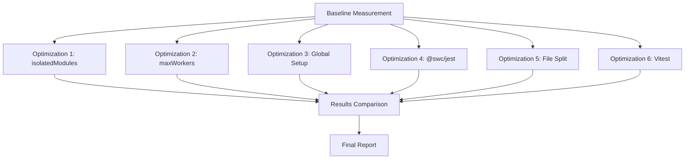

# Design Document: Test Performance Optimization

## Overview

sageプロジェクトのテスト実行パフォーマンスを改善するため、6つの施策を順次適用し、各施策の効果を定量的に測定する。施策は累積的ではなく、各施策を独立して測定し、最終的に最も効果的な組み合わせを採用する。

## Steering Document Alignment

### Technical Standards (tech.md)
- **Performance Guidelines**: Test Time < 30 seconds を目標とする
- **Testing Framework**: Jest → Vitest への移行を検討
- **TypeScript Configuration**: isolatedModules との互換性を確認

### Project Structure (structure.md)
- **Test File Location**: tests/unit/, tests/integration/, tests/e2e/ の構造を維持
- **Config Files**: jest.config.js を基本として変更を適用

## Code Reuse Analysis

### Existing Components to Leverage
- **jest.config.js**: 現在の設定をベースに各施策を適用
- **package.json**: devDependencies に新しいパッケージを追加
- **tests/**: 既存のテストファイルを再利用（Vitest移行時は軽微な修正のみ）

### Integration Points
- **CI/CD**: GitHub Actions での `npm run test` コマンドとの互換性
- **Coverage**: coverageThreshold 設定の維持

## Architecture



## Components and Interfaces

### Component 1: Performance Measurement Script

- **Purpose:** テスト実行時間、CPU使用率、メモリピークを測定
- **Interfaces:**
  ```bash
  measure_test_performance.sh [label] [test_command]
  # Output: JSON format with metrics
  ```
- **Dependencies:** /usr/bin/time, node, npm
- **Output Format:**
  ```json
  {
    "label": "baseline",
    "execution_time_sec": 180.5,
    "cpu_percent": 95,
    "memory_peak_mb": 1024,
    "timestamp": "2026-01-15T00:00:00Z"
  }
  ```

### Component 2: Jest Config Variants

- **Purpose:** 各施策に対応するJest設定ファイルを管理
- **Files:**
  - `jest.config.js` - オリジナル（ベースライン）
  - `jest.config.isolated.js` - isolatedModules有効
  - `jest.config.workers.js` - maxWorkers調整
  - `jest.config.swc.js` - @swc/jest使用
- **Dependencies:** ts-jest, @swc/jest

### Component 3: Global Setup File

- **Purpose:** 共通モックの一元化
- **File:** `tests/setup.ts`
- **Reuses:** 各テストファイルに散在するjest.mock呼び出し
- **Contents:**
  ```typescript
  // googleapis mock
  jest.mock('googleapis', () => ({...}));
  // run-applescript mock
  jest.mock('run-applescript', () => ({...}));
  ```

### Component 4: Vitest Configuration

- **Purpose:** Jest から Vitest への移行設定
- **File:** `vitest.config.ts`
- **Dependencies:** vitest, @vitest/coverage-v8
- **Key Differences:**
  - ESMネイティブサポート（transformIgnorePatterns不要）
  - より高速なHMRベースのwatch mode
  - Jest互換APIの使用

### Component 5: Test File Splitter

- **Purpose:** 大きなテストファイルを論理単位で分割
- **Target:** `tests/unit/google-calendar-service.test.ts` (3384 lines)
- **Split Strategy:**
  - `google-calendar-service-auth.test.ts` - 認証関連テスト
  - `google-calendar-service-events.test.ts` - イベント操作テスト
  - `google-calendar-service-calendars.test.ts` - カレンダー操作テスト

## Data Models

### Measurement Result
```typescript
interface MeasurementResult {
  label: string;              // "baseline", "isolatedModules", etc.
  executionTimeSec: number;   // Total test execution time
  cpuPercent: number;         // Average CPU usage
  memoryPeakMb: number;       // Peak memory usage
  testsTotal: number;         // Total test count
  testsPassed: number;        // Passed test count
  testsFailed: number;        // Failed test count
  timestamp: string;          // ISO 8601 timestamp
}
```

### Comparison Report
```typescript
interface ComparisonReport {
  baseline: MeasurementResult;
  optimizations: {
    name: string;
    result: MeasurementResult;
    improvementPercent: number;
    compatible: boolean;
    notes: string[];
  }[];
}
```

## Implementation Sequence

各施策は以下の順序で独立して測定する：

1. **Baseline**: 現在の設定でベースライン測定（3回平均）
2. **isolatedModules**: 型チェックスキップの効果測定
3. **maxWorkers**: 50%, 2, runInBand の3パターン測定
4. **Global Setup**: 共通モック一元化の効果測定
5. **@swc/jest**: トランスフォーマー変更の効果測定
6. **File Split**: ファイル分割による並列効率化の効果測定
7. **Vitest**: フレームワーク移行の効果測定

## Error Handling

### Error Scenarios

1. **施策適用でテスト失敗**
   - **Handling:** 設定をバックアップから復元、失敗を記録
   - **User Impact:** その施策は「非互換」として結果に記録

2. **測定中のタイムアウト**
   - **Handling:** 10分でタイムアウト、部分結果を記録
   - **User Impact:** 「タイムアウト」として結果に記録

3. **依存パッケージのインストール失敗**
   - **Handling:** npm install エラーを記録、その施策をスキップ
   - **User Impact:** 「インストール失敗」として結果に記録

## Testing Strategy

### Unit Testing
- 各施策適用後、既存のテストスイートが全てパスすることを確認
- テスト数が変わらないことを確認

### Integration Testing
- CI環境（GitHub Actions）での動作確認
- coverage threshold が維持されることを確認

### Performance Testing
- 各施策で3回測定し平均を採用
- 標準偏差が大きい場合は追加測定

## Rollback Strategy

各施策のロールバック方法：

| 施策 | ロールバック方法 |
|------|-----------------|
| isolatedModules | jest.config.jsから設定を削除 |
| maxWorkers | jest.config.jsから設定を削除 |
| Global Setup | setupFilesAfterEnv設定を削除、tests/setup.ts削除 |
| @swc/jest | devDependenciesから削除、jest.config.js復元 |
| File Split | 分割ファイルを削除、元のファイルを復元 |
| Vitest | vitest関連を削除、jest.config.js復元 |
