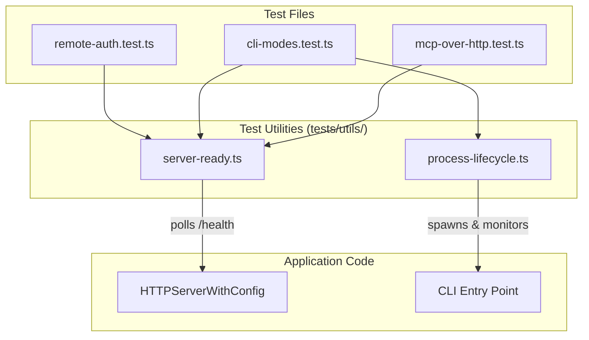
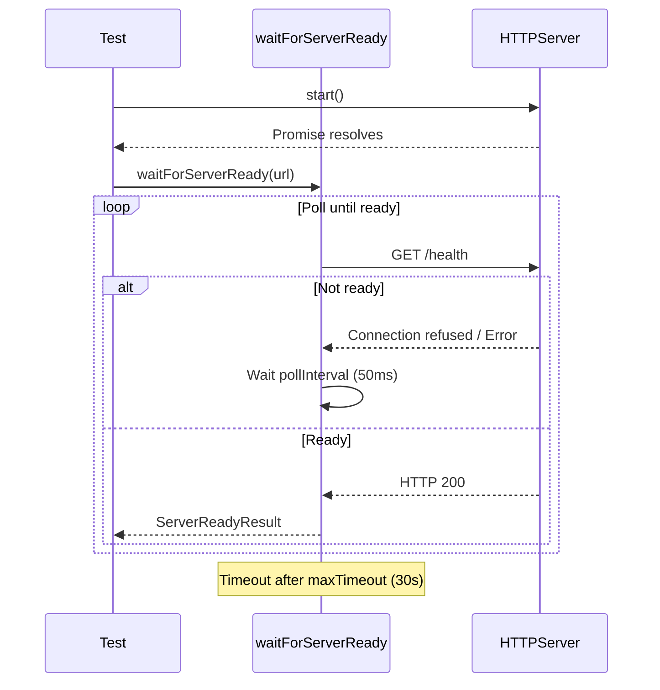
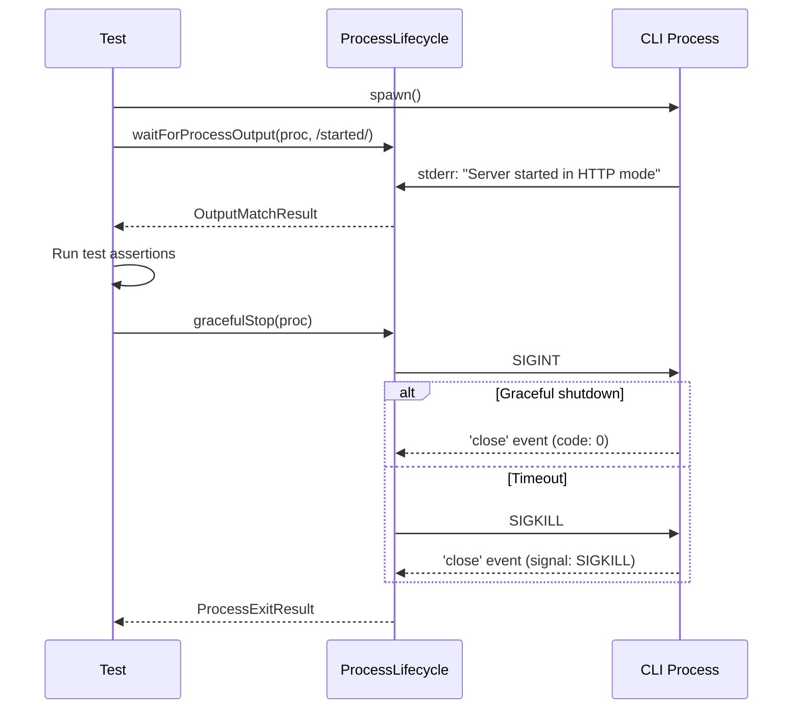

# Design Document

## Overview

テストにおけるサーバー起動/停止およびCLIプロセスの状態検知を、固定タイムアウトからイベント駆動方式に改善する。新しい `tests/utils/` ディレクトリにユーティリティ関数を配置し、既存のE2Eテストを移行する。

## Steering Document Alignment

### Technical Standards (tech.md)

- **TypeScript**: strict mode で実装
- **Testing Framework**: Jest 29+ の async/await パターンを使用
- **Error Handling**: 明確なエラーメッセージで失敗理由を伝達
- **Module System**: ESM (.js 拡張子でインポート)

### Project Structure (structure.md)

```
tests/
├── helpers/           # 既存: Mock factories
├── utils/             # 新規: Test lifecycle utilities
│   ├── server-ready.ts
│   └── process-lifecycle.ts
├── unit/
├── integration/
└── e2e/
```

## Code Reuse Analysis

### Existing Components to Leverage

- **`tests/helpers/mock-services.ts`**: Mock factory パターンを参考にユーティリティ設計
- **`HTTPServerWithConfig.start()`**: 既に Promise ベースで実装済み（変更不要）
- **`HTTPServerWithConfig.stop()`**: Promise ベースで実装済み（変更不要）
- **`cli-modes.test.ts` の `startHTTPServer()`**: イベント検知ロジックを抽出・汎用化

### Integration Points

- **Jest**: `beforeEach`/`afterEach` フックで使用
- **Node.js `child_process`**: ChildProcess イベント API を活用
- **Node.js `http`**: Server イベント API を活用

## Architecture



## Components and Interfaces

### Component 1: ServerReadyUtility (`tests/utils/server-ready.ts`)

- **Purpose:** HTTP サーバーの起動完了を検知
- **Interfaces:**

```typescript
interface WaitForServerReadyOptions {
  /** Maximum time to wait (safety net) - default: 30000ms */
  maxTimeout?: number;
  /** Polling interval - default: 50ms */
  pollInterval?: number;
  /** Expected status code - default: 200 */
  expectedStatus?: number;
}

interface ServerReadyResult {
  /** Time taken to become ready in ms */
  responseTime: number;
  /** HTTP status code received */
  statusCode: number;
}

/**
 * Wait for server to be ready by polling health endpoint
 * @param url - URL to poll (e.g., http://127.0.0.1:3000/health)
 * @param options - Configuration options
 * @returns Promise resolving when server is ready
 * @throws Error if timeout exceeded
 */
export async function waitForServerReady(
  url: string,
  options?: WaitForServerReadyOptions
): Promise<ServerReadyResult>;

/**
 * Wait for server to stop accepting connections
 * @param url - URL to check
 * @param options - Configuration options
 * @returns Promise resolving when server is stopped
 */
export async function waitForServerStopped(
  url: string,
  options?: WaitForServerReadyOptions
): Promise<void>;
```

- **Dependencies:** Node.js `fetch` (built-in)
- **Reuses:** None (new utility)

### Component 2: ProcessLifecycleUtility (`tests/utils/process-lifecycle.ts`)

- **Purpose:** CLI プロセスの起動・終了を検知
- **Interfaces:**

```typescript
import { ChildProcess } from 'child_process';

interface WaitForOutputOptions {
  /** Maximum time to wait (safety net) - default: 30000ms */
  maxTimeout?: number;
  /** Stream to monitor - default: 'both' */
  stream?: 'stdout' | 'stderr' | 'both';
}

interface OutputMatchResult {
  /** The matched output string */
  matched: string;
  /** Full output up to match */
  fullOutput: string;
  /** Time taken to match in ms */
  timeElapsed: number;
}

/**
 * Wait for process output to match a pattern
 * @param proc - ChildProcess to monitor
 * @param pattern - RegExp or string to match
 * @param options - Configuration options
 * @returns Promise resolving when pattern matches
 * @throws Error if timeout exceeded or process exits
 */
export async function waitForProcessOutput(
  proc: ChildProcess,
  pattern: RegExp | string,
  options?: WaitForOutputOptions
): Promise<OutputMatchResult>;

interface WaitForExitOptions {
  /** Maximum time to wait (safety net) - default: 10000ms */
  maxTimeout?: number;
  /** Send SIGKILL if timeout exceeded - default: true */
  forceKillOnTimeout?: boolean;
}

interface ProcessExitResult {
  /** Exit code (null if killed by signal) */
  code: number | null;
  /** Signal that killed process (null if exited normally) */
  signal: string | null;
}

/**
 * Wait for process to exit
 * @param proc - ChildProcess to monitor
 * @param options - Configuration options
 * @returns Promise resolving when process exits
 */
export async function waitForProcessExit(
  proc: ChildProcess,
  options?: WaitForExitOptions
): Promise<ProcessExitResult>;

/**
 * Gracefully stop a process (SIGINT, then SIGKILL if needed)
 * @param proc - ChildProcess to stop
 * @param options - Configuration options
 * @returns Promise resolving when process is stopped
 */
export async function gracefulStop(
  proc: ChildProcess,
  options?: WaitForExitOptions
): Promise<ProcessExitResult>;
```

- **Dependencies:** Node.js `child_process`
- **Reuses:** None (new utility)

## Data Models

### ServerReadyResult

```typescript
interface ServerReadyResult {
  responseTime: number;  // Time in milliseconds from start to ready
  statusCode: number;    // HTTP status code (e.g., 200)
}
```

### OutputMatchResult

```typescript
interface OutputMatchResult {
  matched: string;      // The text that matched the pattern
  fullOutput: string;   // All output captured up to the match
  timeElapsed: number;  // Time in milliseconds from start to match
}
```

### ProcessExitResult

```typescript
interface ProcessExitResult {
  code: number | null;   // Exit code (0 = success, null = killed)
  signal: string | null; // Signal name if killed (e.g., 'SIGTERM')
}
```

## Sequence Diagrams

### Server Startup Detection



### CLI Process Lifecycle



## Error Handling

### Error Scenarios

1. **Server startup timeout**
   - **Handling:** Throw `Error` with descriptive message including URL and elapsed time
   - **User Impact:** Test fails with clear message: "Server not ready at http://127.0.0.1:3000/health after 30000ms"

2. **Process output pattern not matched**
   - **Handling:** Throw `Error` with pattern and captured output
   - **User Impact:** Test fails with: "Pattern /started/ not found in output after 30000ms. Captured: [output]"

3. **Process exits before pattern match**
   - **Handling:** Throw `Error` with exit code and captured output
   - **User Impact:** Test fails with: "Process exited with code 1 before pattern match. Output: [output]"

4. **Process doesn't stop gracefully**
   - **Handling:** Send SIGKILL after timeout, return result with signal info
   - **User Impact:** Test continues but logs warning about forced kill

## Testing Strategy

### Unit Testing

ユーティリティ自体のユニットテストは作成しない（E2Eテストでカバー）。理由：
- ユーティリティはI/Oを行うため、モックが複雑になる
- 実際のサーバー/プロセスでの動作確認が重要

### Integration Testing

- 既存の `tests/integration/` テストは変更なし（分類1のタイムアウトを使用）

### End-to-End Testing

以下のテストファイルを移行：

| ファイル | 変更内容 |
|---------|----------|
| `tests/e2e/remote-auth.test.ts` | `waitForServerReady()` 使用 |
| `tests/e2e/cli-modes.test.ts` | `waitForProcessOutput()`, `gracefulStop()` 使用 |
| `tests/e2e/mcp-over-http.test.ts` | `waitForServerReady()` 使用 |

### Validation Criteria

移行後のテストが以下を満たすことを確認：
- [ ] 全テストがパスする
- [ ] `jest.setTimeout()` は最大上限としてのみ使用（または削除）
- [ ] 固定の `setTimeout()` 待機が排除されている
- [ ] サーバー起動後即座にテストが進む（ログで確認）
