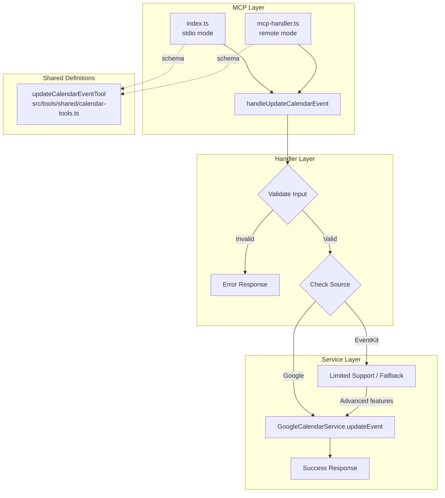

# Design Document: update-calendar-event

## Overview

既存のカレンダーイベントを編集する `update_calendar_event` MCP ツールを実装する。`GoogleCalendarService.updateEvent()` メソッドは既に実装済みのため、本設計ではこのメソッドを MCP ツールとして公開することに焦点を当てる。

## Steering Document Alignment

### Technical Standards (tech.md)
- TypeScript strict mode 使用
- Zod による入力バリデーション
- リトライロジック（既存の `retryWithBackoff` を活用）
- MCP Protocol 準拠

### Project Structure (structure.md)
- ハンドラ: `src/tools/calendar/handlers.ts` に追加
- 共有定義: `src/tools/shared/calendar-tools.ts` に新規作成
- ツール登録: `src/index.ts` と `src/cli/mcp-handler.ts` 両方に追加
- テスト: `tests/unit/` と `tests/integration/` に追加

## Code Reuse Analysis

### Existing Components to Leverage

| コンポーネント | ファイル | 再利用方法 |
|---------------|---------|----------|
| `GoogleCalendarService.updateEvent()` | `src/integrations/google-calendar-service.ts:640-836` | 直接呼び出し |
| `validateUpdateFieldsForEventType()` | `src/integrations/google-calendar-service.ts:74-97` | イベントタイプ検証 |
| `ALLOWED_UPDATE_FIELDS` | `src/integrations/google-calendar-service.ts:35-42` | フィールド制限の参照 |
| `CalendarToolsContext` | `src/tools/calendar/handlers.ts:26-34` | 共有コンテキスト |
| `createToolResponse()` | `src/tools/registry.ts` | レスポンス生成 |
| `createErrorFromCatch()` | `src/tools/registry.ts` | エラーハンドリング |
| `defineTool()` | `src/tools/shared/types.ts` | 共有ツール定義 |
| `toJsonSchema()` | `src/tools/shared/types.ts` | JSON Schema変換 |

### Integration Points

- **GoogleCalendarService**: `updateEvent()` メソッドを直接使用
- **CalendarSourceManager**: 現在 `updateEvent` は未実装。Google Calendar 直接アクセスを推奨
- **EventKit**: macOS の EventKit は更新 API が制限的。Google Calendar 経由を推奨

## Architecture



## Components and Interfaces

### Component 1: UpdateCalendarEventInput

**Purpose:** ツール入力の型定義
**File:** `src/tools/calendar/handlers.ts`
**Reuses:** `CreateCalendarEventInput` のパターン

```typescript
export interface UpdateCalendarEventInput {
  eventId: string;
  title?: string;
  startDate?: string;
  endDate?: string;
  location?: string;
  notes?: string;
  attendees?: string[];
  alarms?: string[];

  // Room management
  roomId?: string;
  removeRoom?: boolean;

  // Event type specific (for OOO/FocusTime)
  autoDeclineMode?: string;
  declineMessage?: string;
  chatStatus?: string;

  // Source control
  calendarName?: string;
  source?: 'eventkit' | 'google';
}
```

### Component 2: handleUpdateCalendarEvent

**Purpose:** イベント更新のビジネスロジック
**File:** `src/tools/calendar/handlers.ts`
**Dependencies:** `CalendarToolsContext`, `GoogleCalendarService`
**Reuses:** `handleCreateCalendarEvent`, `handleDeleteCalendarEvent` のパターン

```typescript
export async function handleUpdateCalendarEvent(
  ctx: CalendarToolsContext,
  args: UpdateCalendarEventInput
): Promise<ToolResponse>
```

**処理フロー:**
1. 設定の確認
2. 入力バリデーション
3. ソース判定（Google or EventKit）
4. 会議室の処理（追加/変更/削除）
5. `GoogleCalendarService.updateEvent()` 呼び出し
6. 成功レスポンス返却

### Component 3: updateCalendarEventTool

**Purpose:** 共有ツール定義（name, description, schema）
**File:** `src/tools/shared/calendar-tools.ts` (新規)
**Dependencies:** `zod`, `defineTool`
**Reuses:** `room-tools.ts` のパターン

```typescript
export const updateCalendarEventTool = defineTool(
  'update_calendar_event',
  'Update an existing calendar event...',
  z.object({
    eventId: z.string().describe('...'),
    title: z.string().optional().describe('...'),
    // ... other fields
  })
);
```

## Data Models

### UpdateEventRequest (existing)

`GoogleCalendarService.updateEvent()` は `Partial<CreateEventRequest>` を受け取る:

```typescript
interface CreateEventRequest {
  title: string;
  start: string;
  end: string;
  location?: string;
  description?: string;
  attendees?: string[];
  reminders?: {...};
  eventType?: GoogleCalendarEventType;
  outOfOfficeProperties?: OutOfOfficeProperties;
  focusTimeProperties?: FocusTimeProperties;
  workingLocationProperties?: WorkingLocationProperties;
  birthdayProperties?: BirthdayProperties;
}
```

### Room Handling

会議室は `attendees` 配列に `@resource.calendar.google.com` 形式で追加:

```typescript
// 会議室追加・変更
if (roomId) {
  const existingAttendees = existingEvent.attendees || [];
  const filteredAttendees = existingAttendees.filter(
    a => !a.includes('@resource.calendar.google.com')
  );
  filteredAttendees.push(roomId);
  updates.attendees = filteredAttendees;
}

// 会議室削除
if (removeRoom) {
  const existingAttendees = existingEvent.attendees || [];
  updates.attendees = existingAttendees.filter(
    a => !a.includes('@resource.calendar.google.com')
  );
}
```

## Error Handling

### Error Scenarios

| シナリオ | 処理 | ユーザーへの表示 |
|---------|------|-----------------|
| 設定未完了 | 早期リターン | `sageが設定されていません。check_setup_statusを実行してください。` |
| イベント未存在 (404) | エラーレスポンス | `指定されたイベントが見つかりませんでした。` |
| 認証エラー (401/403) | エラーレスポンス | `Google Calendarへのアクセス権限がありません。再認証してください。` |
| イベントタイプ制限 | エラーレスポンス | `このイベントタイプでは[field]を変更できません。` |
| 日時不整合 | エラーレスポンス | `開始日時は終了日時より前である必要があります。` |
| 会議室がGoogle以外 | エラーレスポンス | `会議室予約にはGoogle Calendarが必要です。` |
| ネットワークエラー | リトライ後エラー | `イベントの更新に失敗しました: [詳細]` |

## Testing Strategy

### Unit Testing

**File:** `tests/unit/update-calendar-event.test.ts`

| テストケース | 内容 |
|-------------|------|
| 基本更新 | タイトル、説明の更新 |
| 日時更新 | startDate, endDate の更新 |
| 会議室追加 | roomId 指定で会議室追加 |
| 会議室変更 | 既存会議室から別の会議室へ |
| 会議室削除 | removeRoom: true |
| イベントタイプ制限 | birthday イベントの制限フィールド |
| エラーハンドリング | 404, 401, 403 |
| 入力バリデーション | 必須フィールド、日時整合性 |

### Integration Testing

**File:** `tests/integration/update-calendar-event.test.ts`

| テストケース | 内容 |
|-------------|------|
| Google Calendar 更新 | 実際のAPI呼び出しモック |
| 会議室付きイベント更新 | 会議室の追加・変更フロー |
| マルチソース | source パラメータの動作確認 |

## Implementation Notes

### CalendarSourceManager への updateEvent 追加について

現在 `CalendarSourceManager` には `updateEvent` メソッドがない。以下の選択肢がある:

1. **GoogleCalendarService 直接使用（推奨）**
   - シンプルな実装
   - 会議室機能は Google Calendar 専用のため整合性が高い
   - EventKit は更新 API が制限的

2. **CalendarSourceManager に追加**
   - 将来の EventKit 対応に備える
   - 抽象化レイヤーを維持
   - 実装コストが高い

**決定:** Phase 1 では GoogleCalendarService 直接使用。EventKit 対応は将来の拡張として検討。

### Tool Parity Test 対応

`tests/unit/tool-parity.test.ts` が存在し、index.ts と mcp-handler.ts のツール一致を検証する。新しいツールは両方に追加する必要がある。

### 既存の updateEvent メソッドの活用

`GoogleCalendarService.updateEvent()` (L640-836) は以下を既に実装済み:
- 既存イベントの取得とタイプ検出
- フィールド制限の検証
- PATCH API の使用
- リトライロジック
- 参加者変更時の通知送信

ハンドラは主に以下を担当:
- MCP 入力から `CreateEventRequest` への変換
- 会議室 ID の attendees への変換
- ソース判定とルーティング
- レスポンスフォーマット
