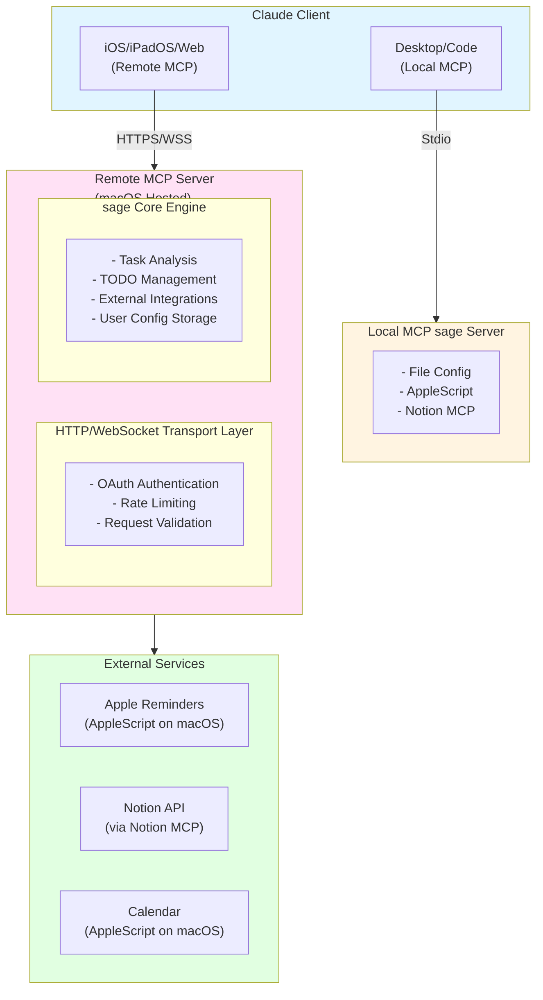

# アーキテクチャ文書

## 概要

sageは、Claude DesktopとClaude Code向けのAIタスク管理アシスタントです。個人の作業パターンを学習し、タスクの分析、優先順位付け、スケジューリング、リマインド管理を自動化します。

### プラットフォーム実装状況

| プラットフォーム | 状態 | 実装方式 | 機能レベル |
|----------------|------|---------|-----------|
| **Claude Desktop/Code** | ✅ 実装済み | Local MCPサーバー | 完全機能 |
| **Claude iOS/iPadOS/Web** | ✅ 実装済み | Remote MCPサーバー | 完全機能 |

### Remote MCP対応の利点

**全プラットフォームでの完全機能提供:**
- ✅ すべてのsage機能にアクセス可能
- ✅ 外部統合（Apple Reminders、Notion、Calendar）
- ✅ 永続的な設定管理（クラウド同期）
- ✅ 高度なタスク分析とTODOリスト管理
- ✅ OAuth認証とセキュリティ

**アーキテクチャの利点:**
- 単一のサーバー実装で全プラットフォーム対応（macOS上でホスト）
- クラウドベースの設定同期
- リモートアクセス対応（iOS/iPadOS/WebからHTTPS経由で接続）
- 統一されたユーザー体験

システムは以下の主要コンポーネントで構成されます：
- セットアップウィザード（初回設定）
- タスク分析エンジン（優先度・時間見積もり・関係者抽出）
- タスク分割エンジン（複雑タスクの分解）
- 外部統合（Apple Reminders via AppleScript、Notion via MCP、Calendar via AppleScript）
- 設定管理システム

## マルチプラットフォーム構成

### 構成図



### プラットフォーム別機能比較

| 機能 | Desktop/Code (Local MCP) | iOS/iPadOS/Web (Remote MCP) |
|------|-------------------------|----------------------------|
| タスク分析 | ✅ 完全版 | ✅ 完全版 |
| 優先順位付け | ✅ カスタムルール | ✅ カスタムルール |
| 時間見積もり | ✅ 学習機能付き | ✅ 学習機能付き |
| タスク分割 | ✅ 複雑な分割 | ✅ 複雑な分割 |
| TODOリスト管理 | ✅ 完全版 | ✅ 完全版 |
| 設定管理 | ✅ ローカルファイル | ✅ クラウド同期 |
| Apple Reminders | ✅ AppleScript | ✅ Remote MCP経由 |
| Calendar統合 | ✅ AppleScript | ✅ Remote MCP経由 |
| Notion統合 | ✅ Notion MCP | ✅ Notion MCP |

## レイヤー構成

### 1. MCP Interface Layer
- MCPプロトコルの実装
- ツール定義とリクエストハンドリング
- エラーハンドリングと応答フォーマット

### 2. Setup & Config Layer
- 初回セットアップウィザード
- 設定ストレージ（ローカルファイル / クラウド）
- 設定値の検証とバリデーション

### 3. Core Analysis Layer
- タスクの分割と整理
- 優先度判定ロジック
- 時間見積もりアルゴリズム
- 関係者抽出エンジン

### 4. Integration Layer
- 外部サービスとの統合（Apple Reminders, Notion, Calendar）
- データ変換とマッピング

## プラットフォーム別実装戦略

### 1. Desktop/Code (MCP Server)

**特徴:**
- 完全機能の実装
- ファイルシステムアクセス
- 外部プロセス実行（AppleScript）
- MCP経由でのNotion統合

**実装アプローチ:**
```typescript
// MCP Server Entry Point
class SageMCPServer {
  private setupWizard: SetupWizard;
  private taskAnalyzer: TaskAnalyzer;
  private configManager: ConfigManager;
  private integrations: {
    appleReminders: AppleRemindersService;
    calendar: CalendarService;
    notion: NotionMCPService;
  };

  async initialize(): Promise<void> {
    // ファイルベース設定の読み込み
    await this.configManager.loadFromFile('~/.sage/config.json');

    // 統合サービスの初期化
    await this.initializeIntegrations();
  }

  // MCPツールの実装
  async handleAnalyzeTasks(params: any): Promise<any> {
    const tasks = await this.taskAnalyzer.analyzeTasks(params.tasks, this.config);
    return this.formatMCPResponse(tasks);
  }
}
```

### 2. iOS/iPadOS (Remote MCP) - ✅ 実装済み

**特徴:**
- Remote MCPサーバー経由で完全機能アクセス
- クラウドベースの設定同期
- Web API経由のApple Reminders/Calendar統合
- Direct API経由のNotion統合

**実装アプローチ:**
```typescript
// Remote MCP経由でのiOS/iPadOS対応
// クライアントはHTTPS/WebSocket経由でRemote MCPサーバーに接続
// 認証後、すべてのsage機能にアクセス可能
```

### 3. Web (Remote MCP) - ✅ 実装済み

**特徴:**
- Remote MCPサーバー経由で完全機能アクセス
- クラウドベースの設定同期
- Web API経由の外部サービス統合
- OAuth認証とセキュリティ

**実装アプローチ:**
```typescript
// Remote MCP経由でのWeb対応
// Webブラウザからもデスクトップ版と同等の機能を提供
```

### 4. プラットフォーム検出とアダプター選択

```typescript
class PlatformDetector {
  static async detect(): Promise<PlatformInfo> {
    // Desktop MCP環境の検出
    if (typeof process !== 'undefined' && process.env.MCP_SERVER) {
      return {
        type: 'desktop_mcp',
        version: '1.0.0',
        capabilities: [
          { name: 'file_system', available: true, requiresPermission: false, fallbackAvailable: false },
          { name: 'applescript', available: true, requiresPermission: true, fallbackAvailable: true },
          { name: 'mcp_integration', available: true, requiresPermission: false, fallbackAvailable: false }
        ],
        integrations: ['applescript', 'notion_mcp']
      };
    }

    // Remote MCP経由のアクセス（iOS/iPadOS/Web）
    // これらのプラットフォームはRemote MCPサーバー経由で接続
    return {
      type: 'remote_mcp',
      version: '1.0.0',
      capabilities: [
        { name: 'remote_access', available: true, requiresPermission: true, fallbackAvailable: false },
        { name: 'cloud_storage', available: true, requiresPermission: false, fallbackAvailable: false }
      ],
      integrations: ['remote_mcp_server']
    };
  }
}

// ファクトリーパターンでの実装選択
class SageFactory {
  static async create(): Promise<SageCore> {
    const platform = await PlatformDetector.detect();

    switch (platform.type) {
      case 'desktop_mcp':
        return new SageMCPServer();
      case 'remote_mcp':
        return new SageRemoteMCPClient();
      default:
        throw new Error(`Unsupported platform: ${platform.type}`);
    }
  }
}
```

## パフォーマンス最適化

### レスポンス時間目標
- **セットアップ**: 各質問への応答 < 1秒
- **タスク分析**: 10タスクの分析 < 3秒
- **カレンダー検索**: 1週間の空き時間検索 < 2秒
- **リマインド作成**: 外部API呼び出し < 5秒

### 最適化戦略

#### キャッシング
```typescript
class CacheManager {
  private cache = new Map<string, CacheEntry>();

  get<T>(key: string): T | null {
    const entry = this.cache.get(key);
    if (entry && entry.expiry > Date.now()) {
      return entry.value;
    }
    return null;
  }

  set<T>(key: string, value: T, ttlMs: number): void {
    this.cache.set(key, {
      value,
      expiry: Date.now() + ttlMs
    });
  }
}
```

#### 並列処理
```typescript
async function analyzeTasksParallel(tasks: Task[]): Promise<AnalyzedTask[]> {
  const promises = tasks.map(task =>
    Promise.all([
      priorityEngine.determinePriority(task),
      timeEstimator.estimateDuration(task),
      stakeholderExtractor.extractStakeholders(task)
    ])
  );

  const results = await Promise.all(promises);
  return results.map(([priority, duration, stakeholders], index) => ({
    original: tasks[index],
    priority,
    estimatedMinutes: duration,
    stakeholders,
    // ...
  }));
}
```

#### バッチ処理
```typescript
class BatchProcessor {
  private queue: Task[] = [];
  private batchSize = 10;
  private batchTimeout = 1000; // 1秒

  async addTask(task: Task): Promise<AnalyzedTask> {
    return new Promise((resolve) => {
      this.queue.push({ task, resolve });
      this.scheduleBatch();
    });
  }

  private scheduleBatch(): void {
    if (this.queue.length >= this.batchSize) {
      this.processBatch();
    } else {
      setTimeout(() => this.processBatch(), this.batchTimeout);
    }
  }
}
```

## 国際化とローカライゼーション

### 多言語対応

```typescript
interface LocaleConfig {
  language: 'ja' | 'en';
  dateFormat: string;
  timeFormat: '12h' | '24h';
  timezone: string;
}

class I18nManager {
  private messages: Record<string, Record<string, string>>;

  t(key: string, params?: Record<string, any>): string {
    // 翻訳メッセージの取得と変数置換
  }

  formatDate(date: Date, format?: string): string {
    // ロケールに応じた日付フォーマット
  }

  formatTime(time: Date): string {
    // ロケールに応じた時刻フォーマット
  }
}
```

### 日本語対応の考慮事項
- **自然言語処理**: 日本語のタスク分析とキーワード抽出
- **日付時刻**: 日本のタイムゾーンと祝日対応
- **文字エンコーディング**: UTF-8での適切な文字処理

## 拡張性とメンテナンス性

### プラグインアーキテクチャ

```typescript
interface AnalysisPlugin {
  name: string;
  version: string;
  analyze(task: Task, context: AnalysisContext): Promise<AnalysisResult>;
}

class PluginManager {
  private plugins: Map<string, AnalysisPlugin> = new Map();

  register(plugin: AnalysisPlugin): void {
    this.plugins.set(plugin.name, plugin);
  }

  async runPlugins(task: Task, context: AnalysisContext): Promise<AnalysisResult[]> {
    const results = await Promise.all(
      Array.from(this.plugins.values()).map(plugin =>
        plugin.analyze(task, context)
      )
    );
    return results;
  }
}
```

### 設定の進化対応

```typescript
class ConfigMigrator {
  private migrations: Map<string, (config: any) => any> = new Map();

  migrate(config: any, fromVersion: string, toVersion: string): any {
    // バージョン間の設定マイグレーション
  }

  addMigration(version: string, migrationFn: (config: any) => any): void {
    this.migrations.set(version, migrationFn);
  }
}
```
