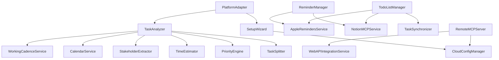

# コンポーネント設計

このドキュメントでは、sageシステムの主要コンポーネントとそのインターフェースを定義します。

## コンポーネント一覧

| ID | コンポーネント | 責任 |
|----|-------------|------|
| 0 | PlatformAdapter | プラットフォーム検出と適切なアダプターの選択 |
| 1 | SetupWizard | プラットフォーム適応型の初回セットアップウィザード |
| 2 | TaskSplitter | 複雑なタスクや複数タスクの分割 |
| 3 | TaskAnalyzer | タスクの包括的分析 |
| 4 | PriorityEngine | 優先度判定ロジック |
| 5 | TimeEstimator | 所要時間見積もり |
| 6 | StakeholderExtractor | 関係者の識別と抽出 |
| 7 | AppleRemindersService | プラットフォーム適応型Apple Reminders統合 |
| 8 | CalendarService | プラットフォーム適応型カレンダー統合と空き時間検出 |
| 9 | ReminderManager | リマインド設定と管理 |
| 10 | RemoteMCPServer | Remote MCP Server実装とHTTP/WebSocket通信 |
| 11 | CloudConfigManager | クラウドベースの設定管理とユーザーデータ同期 |
| 12 | WebAPIIntegrationService | Web API経由での外部サービス統合（Remote MCP専用） |
| 13 | TodoListManager | TODOリスト管理 |
| 14 | TaskSynchronizer | 複数ソース間でのタスク同期と競合解決 |
| 15 | NotionMCPService | Notion MCP統合 |
| 16 | WorkingCadenceService | ユーザーの勤務リズム取得と推奨事項生成 |

## 0. PlatformAdapter

**責任:** プラットフォーム検出と適切なアダプターの選択

```typescript
interface PlatformAdapter {
  detectPlatform(): Promise<PlatformInfo>;
  createSageInstance(): Promise<SageCore>;
  getAvailableFeatures(): FeatureSet;
}

interface PlatformInfo {
  type: 'desktop_mcp' | 'remote_mcp';
  version: string;
  capabilities: PlatformCapability[];
  integrations: string[];
}

interface PlatformCapability {
  name: string;
  available: boolean;
  requiresPermission: boolean;
  fallbackAvailable: boolean;
}

interface FeatureSet {
  taskAnalysis: boolean;
  persistentConfig: boolean;
  appleReminders: boolean;
  calendarIntegration: boolean;
  notionIntegration: boolean;
  fileSystemAccess: boolean;
}
```

## 1. SetupWizard

**責任:** プラットフォーム適応型の初回セットアップウィザード

```typescript
interface SetupWizard {
  checkStatus(): Promise<SetupStatus>;
  startWizard(mode?: 'full' | 'quick', platform?: PlatformInfo): Promise<WizardSession>;
  answerQuestion(sessionId: string, questionId: string, answer: any): Promise<AnswerResult>;
  saveConfig(sessionId: string, confirm: boolean): Promise<SaveResult>;
}

interface WizardSession {
  sessionId: string;
  currentStep: number;
  totalSteps: number;
  question: Question;
  progress: number;
  answers: Record<string, any>;
  platformOptimized: boolean;
}

interface Question {
  id: string;
  text: string;
  type: 'text' | 'select' | 'multiselect' | 'time' | 'days';
  options?: string[];
  defaultValue?: any;
  helpText?: string;
  validation?: ValidationRule[];
  platformSpecific?: string[];
}
```

## 2. TaskSplitter

**責任:** 複雑なタスクや複数タスクの分割

```typescript
interface TaskSplitter {
  splitTasks(input: string): Promise<SplitResult>;
  analyzeComplexity(task: Task): Promise<ComplexityAnalysis>;
}

interface SplitResult {
  originalInput: string;
  splitTasks: Task[];
  splitReason: string;
  recommendedOrder: number[];
  dependencies: TaskDependency[];
}

interface ComplexityAnalysis {
  isComplex: boolean;
  complexity: 'simple' | 'medium' | 'complex' | 'project';
  suggestedSplits?: SubTask[];
  reasoning: string;
}
```

## 3. TaskAnalyzer

**責任:** タスクの包括的分析

```typescript
interface TaskAnalyzer {
  analyzeTasks(tasks: Task[], config: UserConfig): Promise<AnalyzedTask[]>;
}

interface AnalyzedTask {
  original: Task;
  priority: Priority;
  estimatedMinutes: number;
  stakeholders: string[];
  suggestedReminders: Reminder[];
  suggestedTimeSlot?: TimeSlot;
  reasoning: AnalysisReasoning;
  tags: string[];
}

interface AnalysisReasoning {
  priorityReason: string;
  estimationReason: string;
  stakeholderReason: string;
  schedulingReason?: string;
}
```

## 4. PriorityEngine

**責任:** 優先度判定ロジック

```typescript
interface PriorityEngine {
  determinePriority(task: Task, rules: PriorityRules): Priority;
  evaluateConditions(task: Task, conditions: PriorityCondition[]): boolean;
}

interface PriorityCondition {
  type: 'deadline' | 'keyword' | 'stakeholder' | 'blocking' | 'custom';
  operator: '<' | '>' | '=' | 'contains' | 'matches';
  value: any;
  unit?: 'hours' | 'days' | 'weeks';
  description: string;
  weight?: number;
}

type Priority = 'P0' | 'P1' | 'P2' | 'P3';
```

## 5. TimeEstimator

**責任:** 所要時間見積もり

```typescript
interface TimeEstimator {
  estimateDuration(task: Task, config: EstimationConfig): number;
  analyzeKeywords(text: string): ComplexityKeywords;
}

interface EstimationConfig {
  simpleTaskMinutes: number;
  mediumTaskMinutes: number;
  complexTaskMinutes: number;
  projectTaskMinutes: number;
  keywordMapping: Record<string, string[]>;
  userAdjustments?: Record<string, number>;
}
```

## 6. StakeholderExtractor

**責任:** 関係者の識別と抽出

```typescript
interface StakeholderExtractor {
  extractStakeholders(task: Task, teamConfig: TeamConfig): string[];
  findMentions(text: string): string[];
  matchTeamMembers(text: string, team: TeamMember[]): TeamMember[];
}

interface TeamMember {
  name: string;
  role: 'manager' | 'lead' | 'team' | 'collaborator';
  keywords: string[];
  priority?: number;
}
```

## 7. AppleRemindersService

**責任:** プラットフォーム適応型Apple Reminders統合

```typescript
interface AppleRemindersService {
  createReminder(request: ReminderRequest): Promise<ReminderResult>;
  detectPlatform(): Promise<PlatformInfo>;
  isAvailable(): Promise<boolean>;
}

interface ReminderRequest {
  title: string;
  notes?: string;
  dueDate?: string;
  list?: string;
  priority?: 'low' | 'medium' | 'high';
  alarms?: AlarmConfig[];
}

interface ReminderResult {
  success: boolean;
  method: 'native' | 'applescript' | 'fallback';
  reminderId?: string;
  error?: string;
  platformInfo?: PlatformInfo;
}
```

## 8. CalendarService

**責任:** プラットフォーム適応型カレンダー統合と空き時間検出

```typescript
interface CalendarService {
  findAvailableSlots(request: SlotRequest, config: CalendarConfig): Promise<AvailableSlot[]>;
  fetchEvents(startDate: string, endDate: string): Promise<CalendarEvent[]>;
  listEvents(request: ListEventsRequest): Promise<ListEventsResponse>;
  calculateSuitability(slot: TimeSlot, config: CalendarConfig): SlotSuitability;
  detectCalendarPlatform(): Promise<CalendarPlatformInfo>;
  isCalendarAccessible(): Promise<boolean>;
}

interface CalendarPlatformInfo {
  platform: 'ios' | 'ipados' | 'macos' | 'web' | 'unknown';
  availableMethods: CalendarMethod[];
  recommendedMethod: CalendarMethod;
  requiresPermission: boolean;
  hasNativeAccess: boolean;
}

type CalendarMethod = 'native' | 'applescript' | 'caldav' | 'ical_url' | 'manual_input' | 'outlook';
```

## 9. ReminderManager

**責任:** リマインド設定と管理

```typescript
interface ReminderManager {
  setReminder(request: ReminderRequest, config: UserConfig): Promise<ReminderResult>;
  determineDestination(task: Task, config: UserConfig): 'apple' | 'notion';
  calculateReminderTimes(deadline: string, types: string[]): ReminderTime[];
}

interface ReminderResult {
  success: boolean;
  destination: 'apple_reminders' | 'notion_mcp';
  method?: 'native' | 'applescript' | 'fallback';
  reminderId?: string;
  reminderUrl?: string;
  error?: string;
}
```

## 10. RemoteMCPServer

**責任:** Remote MCP Server実装とHTTP/WebSocket通信

```typescript
interface RemoteMCPServer {
  startServer(port: number, config: RemoteMCPConfig): Promise<void>;
  handleMCPRequest(request: MCPRequest): Promise<MCPResponse>;
  authenticateUser(token: string): Promise<AuthResult>;
  validateRequest(request: MCPRequest): Promise<ValidationResult>;
}

interface RemoteMCPConfig {
  port: number;
  host: string;
  httpsEnabled: boolean;
  corsOrigins: string[];
  oauth: OAuthConfig;
  rateLimit: RateLimitConfig;
}

interface MCPRequest {
  method: string;
  params: any;
  id: string | number;
  jsonrpc: '2.0';
  headers: Record<string, string>;
  userId?: string;
}

interface MCPResponse {
  result?: any;
  error?: MCPError;
  id: string | number;
  jsonrpc: '2.0';
}
```

## 11. CloudConfigManager

**責任:** クラウドベースの設定管理とユーザーデータ同期

```typescript
interface CloudConfigManager {
  saveUserConfig(userId: string, config: UserConfig): Promise<SaveResult>;
  loadUserConfig(userId: string): Promise<UserConfig>;
  syncUserData(userId: string): Promise<SyncResult>;
  migrateFromLocal(localConfig: UserConfig, userId: string): Promise<MigrationResult>;
}

interface SaveResult {
  success: boolean;
  version: string;
  lastModified: string;
  error?: string;
}

interface SyncResult {
  success: boolean;
  conflictsResolved: number;
  lastSyncTime: string;
  error?: string;
}
```

## 12. WebAPIIntegrationService

**責任:** Web API経由での外部サービス統合（Remote MCP専用）

```typescript
interface WebAPIIntegrationService {
  // Apple Services (iCloud Web API)
  createAppleReminder(userId: string, request: ReminderRequest): Promise<ReminderResult>;
  getAppleCalendarEvents(userId: string, dateRange: DateRange): Promise<CalendarEvent[]>;

  // Notion Direct API
  createNotionPage(userId: string, request: NotionPageRequest): Promise<NotionPageResult>;
  getNotionTasks(userId: string, filter?: NotionFilter): Promise<NotionTask[]>;

  // Google Calendar API
  getGoogleCalendarEvents(userId: string, dateRange: DateRange): Promise<CalendarEvent[]>;

  // Microsoft Outlook API
  getOutlookCalendarEvents(userId: string, dateRange: DateRange): Promise<CalendarEvent[]>;
}
```

## 13. TodoListManager

**責任:** TODOリスト管理

```typescript
interface TodoListManager {
  listTodos(filter?: TodoFilter): Promise<TodoItem[]>;
  updateTaskStatus(taskId: string, status: TaskStatus, source: TaskSource): Promise<UpdateResult>;
  getTodaysTasks(): Promise<TodoItem[]>;
  syncTaskAcrossSources(taskId: string): Promise<SyncResult>;
}

interface TodoItem {
  id: string;
  title: string;
  description?: string;
  priority: Priority;
  status: TaskStatus;
  dueDate?: string;
  createdDate: string;
  updatedDate: string;
  source: TaskSource;
  sourceId: string;
  tags: string[];
  estimatedMinutes?: number;
  stakeholders?: string[];
}

type TaskSource = 'apple_reminders' | 'notion' | 'manual';
type TaskStatus = 'not_started' | 'in_progress' | 'completed' | 'cancelled';
```

## 14. TaskSynchronizer

**責任:** 複数ソース間でのタスク同期と競合解決

```typescript
interface TaskSynchronizer {
  syncAllTasks(): Promise<SyncAllResult>;
  resolveConflicts(conflicts: TaskConflict[]): Promise<ConflictResolution>;
  detectDuplicates(): Promise<DuplicateTask[]>;
  mergeDuplicates(duplicates: DuplicateTask[]): Promise<MergeResult>;
}

interface SyncAllResult {
  totalTasks: number;
  syncedTasks: number;
  conflicts: TaskConflict[];
  errors: SyncError[];
  duration: number;
}

interface TaskConflict {
  field: string;
  appleRemindersValue: any;
  notionValue: any;
  resolvedValue: any;
  resolution: 'apple_reminders' | 'notion' | 'manual';
}
```

## 15. NotionMCPService

**責任:** Notion MCP統合

```typescript
interface NotionMCPService {
  createPage(request: NotionPageRequest): Promise<NotionPageResult>;
  searchPages(query: string): Promise<NotionPage[]>;
  updatePage(pageId: string, updates: NotionPageUpdates): Promise<NotionPageResult>;
  isAvailable(): Promise<boolean>;
}

interface NotionPageRequest {
  databaseId: string;
  title: string;
  properties: Record<string, any>;
  content?: NotionBlock[];
}

interface NotionPageResult {
  success: boolean;
  pageId?: string;
  pageUrl?: string;
  error?: string;
}
```

## 16. WorkingCadenceService

**責任:** ユーザーの勤務リズム（Working Cadence）の取得と推奨事項の生成

```typescript
interface WorkingCadenceService {
  getWorkingCadence(request?: GetWorkingCadenceRequest): Promise<WorkingCadenceResult>;
  getDayType(dayOfWeek: string): 'deep-work' | 'meeting-heavy' | 'normal';
  getDayOfWeek(date: string): string;
  generateRecommendations(config: CalendarConfig): SchedulingRecommendation[];
}

interface GetWorkingCadenceRequest {
  dayOfWeek?: 'Monday' | 'Tuesday' | 'Wednesday' | 'Thursday' | 'Friday' | 'Saturday' | 'Sunday';
  date?: string; // ISO 8601形式
}

interface WorkingCadenceResult {
  success: boolean;
  user: { name: string; timezone: string; };
  workingHours: { start: string; end: string; totalMinutes: number; };
  weeklyPattern: {
    deepWorkDays: string[];
    meetingHeavyDays: string[];
    normalDays: string[];
  };
  deepWorkBlocks: DeepWorkBlockInfo[];
  weeklyReview?: { enabled: boolean; day: string; time: string; };
  specificDay?: {
    date?: string;
    dayOfWeek: string;
    dayType: 'deep-work' | 'meeting-heavy' | 'normal';
    deepWorkBlocks: DeepWorkBlockInfo[];
    recommendations: string[];
  };
  recommendations: SchedulingRecommendation[];
  summary: string;
}

interface SchedulingRecommendation {
  type: 'deep-work' | 'meeting' | 'quick-task' | 'review';
  recommendation: string;
  bestDays: string[];
  bestTimeSlots?: string[];
  reason: string;
}
```

## コンポーネント依存関係


