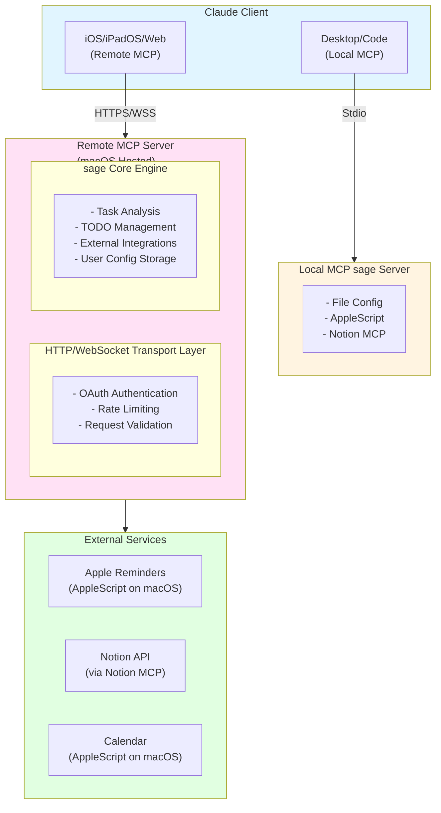

# デザイン文書

## 概要

sageは、Claude DesktopとClaude Code向けのAIタスク管理アシスタントです。個人の作業パターンを学習し、タスクの分析、優先順位付け、スケジューリング、リマインド管理を自動化します。

### プラットフォーム実装状況

| プラットフォーム | 状態 | 実装方式 | 機能レベル |
|----------------|------|---------|-----------|
| **Claude Desktop/Code** | ✅ 実装済み | Local MCPサーバー | 完全機能 |
| **Claude iOS/iPadOS/Web** | ✅ 実装済み | Remote MCPサーバー | 完全機能 |

### Remote MCP対応の利点

**全プラットフォームでの完全機能提供:**
- ✅ すべてのsage機能にアクセス可能
- ✅ 外部統合（Apple Reminders、Notion、Calendar）
- ✅ 永続的な設定管理（クラウド同期）
- ✅ 高度なタスク分析とTODOリスト管理
- ✅ OAuth認証とセキュリティ

**アーキテクチャの利点:**
- 単一のサーバー実装で全プラットフォーム対応（macOS上でホスト）
- クラウドベースの設定同期
- リモートアクセス対応（iOS/iPadOS/WebからHTTPS経由で接続）
- 統一されたユーザー体験

システムは以下の主要コンポーネントで構成されます：
- セットアップウィザード（初回設定）
- タスク分析エンジン（優先度・時間見積もり・関係者抽出）
- タスク分割エンジン（複雑タスクの分解）
- 外部統合（Apple Reminders via AppleScript、Notion via MCP、Calendar via AppleScript）
- 設定管理システム

## アーキテクチャ

### マルチプラットフォーム構成図



### プラットフォーム別機能比較

| 機能 | Desktop/Code (Local MCP) | iOS/iPadOS/Web (Remote MCP) |
|------|-------------------------|----------------------------|
| タスク分析 | ✅ 完全版 | ✅ 完全版 |
| 優先順位付け | ✅ カスタムルール | ✅ カスタムルール |
| 時間見積もり | ✅ 学習機能付き | ✅ 学習機能付き |
| タスク分割 | ✅ 複雑な分割 | ✅ 複雑な分割 |
| TODOリスト管理 | ✅ 完全版 | ✅ 完全版 |
| 設定管理 | ✅ ローカルファイル | ✅ クラウド同期 |
| Apple Reminders | ✅ AppleScript | ✅ Remote MCP経由 |
| Calendar統合 | ✅ AppleScript | ✅ Remote MCP経由 |
| Notion統合 | ✅ Notion MCP | ✅ Notion MCP |

### CLIインターフェース

sageは2つの動作モードをサポートします：

```
┌─────────────────────────────────────────────────────────────────┐
│                       sage CLI                                  │
├─────────────────────────────────────────────────────────────────┤
│                                                                 │
│  npx sage                    → Stdioモード（Local MCP）         │
│  npx sage --remote           → HTTPモード（Remote MCP）         │
│                                                                 │
├─────────────────────────────────────────────────────────────────┤
│  オプション:                                                     │
│    --remote              HTTPサーバーモードで起動               │
│    --config <path>       設定ファイルのパスを指定               │
│    --port <number>       HTTPサーバーのポート（デフォルト: 3000）│
│    --host <address>      リッスンアドレス（デフォルト: 0.0.0.0） │
│    --help                ヘルプを表示                           │
│    --version             バージョンを表示                       │
│                                                                 │
├─────────────────────────────────────────────────────────────────┤
│  環境変数:                                                       │
│    SAGE_REMOTE_MODE=true   HTTPサーバーモードで起動             │
│    SAGE_PORT=3000          HTTPサーバーのポート                 │
│    SAGE_HOST=0.0.0.0       リッスンアドレス                     │
│    SAGE_AUTH_SECRET=xxx    JWT認証のシークレットキー            │
│    SAGE_CONFIG_PATH=xxx    設定ファイルのパス                   │
│                                                                 │
└─────────────────────────────────────────────────────────────────┘
```

#### CLIオプション処理

```typescript
interface CLIOptions {
  remote: boolean;
  config?: string;
  port: number;
  host: string;
}

function parseArgs(args: string[]): CLIOptions {
  const options: CLIOptions = {
    remote: process.env.SAGE_REMOTE_MODE === 'true' || args.includes('--remote'),
    config: getArgValue(args, '--config') || process.env.SAGE_CONFIG_PATH,
    port: parseInt(getArgValue(args, '--port') || process.env.SAGE_PORT || '3000'),
    host: getArgValue(args, '--host') || process.env.SAGE_HOST || '0.0.0.0',
  };
  return options;
}

async function main(): Promise<void> {
  const options = parseArgs(process.argv.slice(2));
  const server = await createServer();

  if (options.remote) {
    // HTTPサーバーモード（Remote MCP）
    await startHTTPServer(server, options);
  } else {
    // Stdioモード（Local MCP）
    const transport = new StdioServerTransport();
    await server.connect(transport);
  }
}
```

#### HTTPサーバーエンドポイント

| エンドポイント | メソッド | 説明 |
|---------------|---------|------|
| `/health` | GET | ヘルスチェック |
| `/mcp` | GET | SSEストリーム（Streamable HTTP transport） |
| `/mcp` | POST | MCPリクエスト処理（JSON-RPC） |
| `/mcp` | OPTIONS | CORSプリフライト |
| `/auth/token` | POST | JWT認証トークン生成 |

#### Streamable HTTP Transport

MCP Streamable HTTP仕様に準拠したエンドポイント実装。Claude.aiからの接続をサポートします。

**GET /mcp - SSEストリーム:**

```typescript
interface SSEStreamHandler {
  // SSEストリームを開始
  startStream(res: ServerResponse): void;
  // keepaliveを送信（30秒間隔）
  sendKeepalive(res: ServerResponse): void;
  // サーバーからクライアントへ通知を送信
  sendEvent(res: ServerResponse, event: string, data: any): void;
  // ストリームをクリーンアップ
  cleanup(res: ServerResponse): void;
}
```

**レスポンスヘッダー:**
```
Content-Type: text/event-stream
Cache-Control: no-cache
Connection: keep-alive
Access-Control-Allow-Origin: *
Access-Control-Allow-Methods: GET, POST, OPTIONS
Access-Control-Allow-Headers: Content-Type, Authorization
```

**SSEフォーマット:**
```
# コメント（keepalive用）
: keepalive

# データ送信
data: {"jsonrpc":"2.0","method":"notifications/message","params":{...}}

# イベント付きデータ送信
event: message
data: {"jsonrpc":"2.0","method":"notifications/message","params":{...}}
```

**実装例:**
```typescript
function handleSSEStream(req: IncomingMessage, res: ServerResponse): void {
  // SSEヘッダーを設定
  res.setHeader('Content-Type', 'text/event-stream');
  res.setHeader('Cache-Control', 'no-cache');
  res.setHeader('Connection', 'keep-alive');
  res.setHeader('Access-Control-Allow-Origin', '*');
  res.setHeader('Access-Control-Allow-Methods', 'GET, POST, OPTIONS');
  res.setHeader('Access-Control-Allow-Headers', 'Content-Type, Authorization');

  res.writeHead(200);

  // 接続維持のためkeepaliveを送信（30秒間隔）
  const keepAliveInterval = setInterval(() => {
    res.write(': keepalive\n\n');
  }, 30000);

  // 接続切断時のクリーンアップ
  req.on('close', () => {
    clearInterval(keepAliveInterval);
  });
}
```

**POST /mcp - JSON-RPCリクエスト:**
既存の実装を維持。リクエストボディのJSON-RPCメッセージを処理し、レスポンスを返します。

#### Remote MCP設定ファイル

HTTPサーバーモードで起動時、システムは`~/.sage/remote-config.json`から設定を読み込みます。

```typescript
interface RemoteConfig {
  remote: {
    enabled: boolean;
    port: number;
    host: string;
    auth: {
      type: 'jwt' | 'none';
      secret?: string;       // JWT署名用シークレット（32文字以上推奨）
      expiresIn?: string;    // トークン有効期限（例: "24h", "7d"）
    };
    cors: {
      allowedOrigins: string[];  // ["*"] または ["https://example.com"]
    };
  };
}
```

**設定ファイル例** (`~/.sage/remote-config.json`):
```json
{
  "remote": {
    "enabled": true,
    "port": 3000,
    "host": "0.0.0.0",
    "auth": {
      "type": "jwt",
      "secret": "hwy1XJQ2Sef7mHVATyrpE8XPhchCIY6UojPyOeHeWkA=",
      "expiresIn": "24h"
    },
    "cors": {
      "allowedOrigins": ["*"]
    }
  }
}
```

#### 認証フロー

```
┌─────────────────────────────────────────────────────────────────┐
│                     認証フロー                                   │
├─────────────────────────────────────────────────────────────────┤
│                                                                 │
│  1. クライアントがsecretを使ってトークン取得                      │
│     POST /auth/token                                            │
│     Body: {"secret": "設定されたsecret"}                         │
│     Response: {"token": "jwt...", "expiresIn": 86400}          │
│                                                                 │
│  2. トークンを使ってMCPリクエスト                                 │
│     POST /mcp                                                   │
│     Headers: Authorization: Bearer <token>                      │
│     Body: {"jsonrpc": "2.0", "method": "...", ...}             │
│                                                                 │
├─────────────────────────────────────────────────────────────────┤
│  エラーレスポンス:                                               │
│    401 - Invalid secret / Invalid or expired token             │
│    403 - IP not allowed (IP whitelist設定時)                    │
└─────────────────────────────────────────────────────────────────┘
```

#### 設定読み込み優先順位

1. CLIオプション (`--port`, `--host`, etc.)
2. 環境変数 (`SAGE_PORT`, `SAGE_HOST`, etc.)
3. リモート設定ファイル (`~/.sage/remote-config.json`)
4. デフォルト値

### レイヤー構成

#### 1. MCP Interface Layer
- MCPプロトコルの実装
- ツール定義とリクエストハンドリング
- エラーハンドリングと応答フォーマット

#### 2. Setup & Config Layer
- 初回セットアップウィザード
- 設定ストレージ（ローカルファイル / クラウド）
- 設定値の検証とバリデーション

#### 3. Core Analysis Layer
- タスクの分割と整理
- 優先度判定ロジック
- 時間見積もりアルゴリズム
- 関係者抽出エンジン

#### 4. Integration Layer
- 外部サービスとの統合（Apple Reminders, Notion, Calendar）
- データ変換とマッピング

## コンポーネントと インターフェース

### 0. PlatformAdapter

**責任:** プラットフォーム検出と適切なアダプターの選択

```typescript
interface PlatformAdapter {
  detectPlatform(): Promise<PlatformInfo>;
  createSageInstance(): Promise<SageCore>;
  getAvailableFeatures(): FeatureSet;
}

interface PlatformInfo {
  type: 'desktop_mcp' | 'remote_mcp';
  version: string;
  capabilities: PlatformCapability[];
  integrations: string[];
}

interface PlatformCapability {
  name: string;
  available: boolean;
  requiresPermission: boolean;
  fallbackAvailable: boolean;
}

interface FeatureSet {
  taskAnalysis: boolean;
  persistentConfig: boolean;
  appleReminders: boolean;
  calendarIntegration: boolean;
  notionIntegration: boolean;
  fileSystemAccess: boolean;
}

// プラットフォーム別実装
class MCPAdapter implements PlatformAdapter {
  // Desktop/Code向けMCP実装（AppleScript統合）
}

class RemoteMCPAdapter implements PlatformAdapter {
  // iOS/iPadOS/Web向けRemote MCP実装
  // Remote MCPサーバー経由でDesktop版と同等の機能を提供
}
```

### 1. SetupWizard

**責任:** プラットフォーム適応型の初回セットアップウィザード

```typescript
interface SetupWizard {
  checkStatus(): Promise<SetupStatus>;
  startWizard(mode?: 'full' | 'quick', platform?: PlatformInfo): Promise<WizardSession>;
  answerQuestion(sessionId: string, questionId: string, answer: any): Promise<AnswerResult>;
  saveConfig(sessionId: string, confirm: boolean): Promise<SaveResult>;
}

interface WizardSession {
  sessionId: string;
  currentStep: number;
  totalSteps: number;
  question: Question;
  progress: number;
  answers: Record<string, any>;
  platformOptimized: boolean; // プラットフォーム最適化フラグ
}

interface Question {
  id: string;
  text: string;
  type: 'text' | 'select' | 'multiselect' | 'time' | 'days';
  options?: string[];
  defaultValue?: any;
  helpText?: string;
  validation?: ValidationRule[];
  platformSpecific?: string[]; // 特定プラットフォームでのみ表示
}

// プラットフォーム別セットアップ
interface SetupQuestionSet {
  common: Question[]; // 全プラットフォーム共通
  desktop: Question[]; // Desktop/Code専用
  ios: Question[]; // iOS/iPadOS専用
  web: Question[]; // Web専用
}
```

### 2. TaskSplitter

**責任:** 複雑なタスクや複数タスクの分割

```typescript
interface TaskSplitter {
  splitTasks(input: string): Promise<SplitResult>;
  analyzeComplexity(task: Task): Promise<ComplexityAnalysis>;
}

interface SplitResult {
  originalInput: string;
  splitTasks: Task[];
  splitReason: string;
  recommendedOrder: number[];
  dependencies: TaskDependency[];
}

interface ComplexityAnalysis {
  isComplex: boolean;
  complexity: 'simple' | 'medium' | 'complex' | 'project';
  suggestedSplits?: SubTask[];
  reasoning: string;
}

interface TaskDependency {
  taskIndex: number;
  dependsOn: number[];
  type: 'sequential' | 'parallel' | 'conditional';
}
```

### 3. TaskAnalyzer

**責任:** タスクの包括的分析

```typescript
interface TaskAnalyzer {
  analyzeTasks(tasks: Task[], config: UserConfig): Promise<AnalyzedTask[]>;
}

interface AnalyzedTask {
  original: Task;
  priority: Priority;
  estimatedMinutes: number;
  stakeholders: string[];
  suggestedReminders: Reminder[];
  suggestedTimeSlot?: TimeSlot;
  reasoning: AnalysisReasoning;
  tags: string[];
}

interface AnalysisReasoning {
  priorityReason: string;
  estimationReason: string;
  stakeholderReason: string;
  schedulingReason?: string;
}
```

### 4. PriorityEngine

**責任:** 優先度判定ロジック

```typescript
interface PriorityEngine {
  determinePriority(task: Task, rules: PriorityRules): Priority;
  evaluateConditions(task: Task, conditions: PriorityCondition[]): boolean;
}

interface PriorityCondition {
  type: 'deadline' | 'keyword' | 'stakeholder' | 'blocking' | 'custom';
  operator: '<' | '>' | '=' | 'contains' | 'matches';
  value: any;
  unit?: 'hours' | 'days' | 'weeks';
  description: string;
  weight?: number;
}

type Priority = 'P0' | 'P1' | 'P2' | 'P3';
```

### 5. TimeEstimator

**責任:** 所要時間見積もり

```typescript
interface TimeEstimator {
  estimateDuration(task: Task, config: EstimationConfig): number;
  analyzeKeywords(text: string): ComplexityKeywords;
}

interface EstimationConfig {
  simpleTaskMinutes: number;
  mediumTaskMinutes: number;
  complexTaskMinutes: number;
  projectTaskMinutes: number;
  keywordMapping: Record<string, string[]>;
  userAdjustments?: Record<string, number>;
}

interface ComplexityKeywords {
  simple: string[];
  medium: string[];
  complex: string[];
  project: string[];
  matched: string[];
}
```

### 6. StakeholderExtractor

**責任:** 関係者の識別と抽出

```typescript
interface StakeholderExtractor {
  extractStakeholders(task: Task, teamConfig: TeamConfig): string[];
  findMentions(text: string): string[];
  matchTeamMembers(text: string, team: TeamMember[]): TeamMember[];
}

interface TeamMember {
  name: string;
  role: 'manager' | 'lead' | 'team' | 'collaborator';
  keywords: string[];
  priority?: number;
}
```

### 7. AppleRemindersService

**責任:** プラットフォーム適応型Apple Reminders統合

```typescript
interface AppleRemindersService {
  createReminder(request: ReminderRequest): Promise<ReminderResult>;
  detectPlatform(): Promise<PlatformInfo>;
  isAvailable(): Promise<boolean>;
}

interface PlatformInfo {
  platform: 'ios' | 'ipados' | 'macos' | 'web' | 'unknown';
  hasNativeIntegration: boolean;
  supportsAppleScript: boolean;
  recommendedMethod: 'native' | 'applescript' | 'fallback';
}

interface ReminderRequest {
  title: string;
  notes?: string;
  dueDate?: string;
  list?: string;
  priority?: 'low' | 'medium' | 'high';
  alarms?: AlarmConfig[];
}

interface AlarmConfig {
  type: 'absolute' | 'relative';
  datetime?: string;
  offsetMinutes?: number;
}

interface ReminderResult {
  success: boolean;
  method: 'native' | 'applescript' | 'fallback';
  reminderId?: string;
  error?: string;
  platformInfo?: PlatformInfo;
}
```

### 8. CalendarService

**責任:** プラットフォーム適応型カレンダー統合と空き時間検出

```typescript
interface CalendarService {
  findAvailableSlots(request: SlotRequest, config: CalendarConfig): Promise<AvailableSlot[]>;
  fetchEvents(startDate: string, endDate: string): Promise<CalendarEvent[]>;
  listEvents(request: ListEventsRequest): Promise<ListEventsResponse>;
  calculateSuitability(slot: TimeSlot, config: CalendarConfig): SlotSuitability;
  detectCalendarPlatform(): Promise<CalendarPlatformInfo>;
  isCalendarAccessible(): Promise<boolean>;
}

interface CalendarPlatformInfo {
  platform: 'ios' | 'ipados' | 'macos' | 'web' | 'unknown';
  availableMethods: CalendarMethod[];
  recommendedMethod: CalendarMethod;
  requiresPermission: boolean;
  hasNativeAccess: boolean;
}

type CalendarMethod = 'native' | 'applescript' | 'caldav' | 'ical_url' | 'manual_input' | 'outlook';

interface SlotRequest {
  taskDuration: number;
  preferredDays?: string[];
  avoidDays?: string[];
  startDate?: string;
  endDate?: string;
  timeOfDay?: 'morning' | 'afternoon' | 'evening';
}

interface AvailableSlot {
  start: string;
  end: string;
  durationMinutes: number;
  suitability: 'excellent' | 'good' | 'acceptable';
  reason: string;
  conflicts: string[];
  dayType: 'deep-work' | 'meeting-heavy' | 'normal';
  source: CalendarMethod;
}

interface CalendarEvent {
  id: string;
  title: string;
  start: string;
  end: string;
  isAllDay: boolean;
  calendar: string;
  location?: string;
  source: CalendarMethod;
}

interface ListEventsRequest {
  startDate: string;  // ISO 8601形式 (例: "2025-01-15")
  endDate: string;    // ISO 8601形式 (例: "2025-01-20")
  calendarName?: string;  // 特定カレンダーでフィルタ（省略時は全カレンダー）
}

interface ListEventsResponse {
  events: CalendarEvent[];
  period: {
    start: string;
    end: string;
  };
  totalEvents: number;
}
```

**責任:** リマインド設定と管理

```typescript
interface ReminderManager {
  setReminder(request: ReminderRequest, config: UserConfig): Promise<ReminderResult>;
  determineDestination(task: Task, config: UserConfig): 'apple' | 'notion';
  calculateReminderTimes(deadline: string, types: string[]): ReminderTime[];
}

interface ReminderRequest {
  taskTitle: string;
  reminderType: string;
  targetDate?: string;
  list?: string;
  priority?: Priority;
}

interface ReminderResult {
  success: boolean;
  destination: 'apple_reminders' | 'notion_mcp';
  reminderId?: string;
  reminderUrl?: string;
  error?: string;
}

### 9. ReminderManager

**責任:** リマインド設定と管理

```typescript
interface ReminderManager {
  setReminder(request: ReminderRequest, config: UserConfig): Promise<ReminderResult>;
  determineDestination(task: Task, config: UserConfig): 'apple' | 'notion';
  calculateReminderTimes(deadline: string, types: string[]): ReminderTime[];
}

interface ReminderRequest {
  taskTitle: string;
  reminderType: string;
  targetDate?: string;
  list?: string;
  priority?: Priority;
}

interface ReminderResult {
  success: boolean;
  destination: 'apple_reminders' | 'notion_mcp';
  method?: 'native' | 'applescript' | 'fallback';
  reminderId?: string;
  reminderUrl?: string;
  error?: string;
}
```

### 10. RemoteMCPServer

**責任:** Remote MCP Server実装とHTTP/WebSocket通信

```typescript
interface RemoteMCPServer {
  startServer(port: number, config: RemoteMCPConfig): Promise<void>;
  handleMCPRequest(request: MCPRequest): Promise<MCPResponse>;
  authenticateUser(token: string): Promise<AuthResult>;
  validateRequest(request: MCPRequest): Promise<ValidationResult>;
}

interface RemoteMCPConfig {
  port: number;
  host: string;
  httpsEnabled: boolean;
  corsOrigins: string[];
  oauth: OAuthConfig;
  rateLimit: RateLimitConfig;
}

interface OAuthConfig {
  clientId: string;
  clientSecret: string;
  redirectUri: string;
  scopes: string[];
  provider: 'claude' | 'custom';
}

interface RateLimitConfig {
  requestsPerMinute: number;
  requestsPerHour: number;
  burstLimit: number;
  whitelistedIPs: string[];
}

interface MCPRequest {
  method: string;
  params: any;
  id: string | number;
  jsonrpc: '2.0';
  headers: Record<string, string>;
  userId?: string;
}

interface MCPResponse {
  result?: any;
  error?: MCPError;
  id: string | number;
  jsonrpc: '2.0';
}

interface MCPError {
  code: number;
  message: string;
  data?: any;
}

interface AuthResult {
  success: boolean;
  userId?: string;
  permissions: string[];
  error?: string;
}
```

### 11. CloudConfigManager

**責任:** クラウドベースの設定管理とユーザーデータ同期

```typescript
interface CloudConfigManager {
  saveUserConfig(userId: string, config: UserConfig): Promise<SaveResult>;
  loadUserConfig(userId: string): Promise<UserConfig>;
  syncUserData(userId: string): Promise<SyncResult>;
  migrateFromLocal(localConfig: UserConfig, userId: string): Promise<MigrationResult>;
}

interface SaveResult {
  success: boolean;
  version: string;
  lastModified: string;
  error?: string;
}

interface SyncResult {
  success: boolean;
  conflictsResolved: number;
  lastSyncTime: string;
  error?: string;
}

interface MigrationResult {
  success: boolean;
  migratedSettings: string[];
  warnings: string[];
  error?: string;
}

// クラウドストレージ実装例
class CloudConfigManagerImpl implements CloudConfigManager {
  private storage: CloudStorage; // AWS S3, Google Cloud Storage, etc.
  private encryption: EncryptionService;
  
  async saveUserConfig(userId: string, config: UserConfig): Promise<SaveResult> {
    try {
      const encryptedConfig = await this.encryption.encrypt(JSON.stringify(config));
      const key = `users/${userId}/config.json`;
      
      await this.storage.put(key, encryptedConfig, {
        metadata: {
          version: config.version,
          lastModified: new Date().toISOString(),
          userId
        }
      });
      
      return {
        success: true,
        version: config.version,
        lastModified: new Date().toISOString()
      };
    } catch (error) {
      return {
        success: false,
        version: config.version,
        lastModified: new Date().toISOString(),
        error: error.message
      };
    }
  }
}
```

### 12. WebAPIIntegrationService

**責任:** Web API経由での外部サービス統合（Remote MCP専用）

```typescript
interface WebAPIIntegrationService {
  // Apple Services (iCloud Web API)
  createAppleReminder(userId: string, request: ReminderRequest): Promise<ReminderResult>;
  getAppleCalendarEvents(userId: string, dateRange: DateRange): Promise<CalendarEvent[]>;
  
  // Notion Direct API
  createNotionPage(userId: string, request: NotionPageRequest): Promise<NotionPageResult>;
  getNotionTasks(userId: string, filter?: NotionFilter): Promise<NotionTask[]>;
  
  // Google Calendar API
  getGoogleCalendarEvents(userId: string, dateRange: DateRange): Promise<CalendarEvent[]>;
  
  // Microsoft Outlook API
  getOutlookCalendarEvents(userId: string, dateRange: DateRange): Promise<CalendarEvent[]>;
}

interface AppleWebAPIConfig {
  iCloudBaseUrl: string;
  clientId: string;
  clientSecret: string;
  redirectUri: string;
}

interface NotionDirectAPIConfig {
  apiKey: string;
  version: string;
  baseUrl: string;
}

// Apple iCloud Web API統合例
class AppleWebAPIService {
  private config: AppleWebAPIConfig;
  private tokenManager: TokenManager;
  
  async createReminder(userId: string, request: ReminderRequest): Promise<ReminderResult> {
    try {
      const token = await this.tokenManager.getAppleToken(userId);
      
      const response = await fetch(`${this.config.iCloudBaseUrl}/reminders/api/v1/reminders`, {
        method: 'POST',
        headers: {
          'Authorization': `Bearer ${token}`,
          'Content-Type': 'application/json'
        },
        body: JSON.stringify({
          title: request.title,
          notes: request.notes,
          dueDate: request.dueDate,
          list: request.list,
          priority: this.mapPriority(request.priority)
        })
      });
      
      if (!response.ok) {
        throw new Error(`Apple API error: ${response.status}`);
      }
      
      const result = await response.json();
      
      return {
        success: true,
        method: 'web_api',
        reminderId: result.id,
        reminderUrl: result.url
      };
    } catch (error) {
      return {
        success: false,
        method: 'web_api',
        error: `Apple Web API統合エラー: ${error.message}`
      };
    }
  }
}
```

### 13. TodoListManager

```typescript
interface TodoListManager {
  listTodos(filter?: TodoFilter): Promise<TodoItem[]>;
  updateTaskStatus(taskId: string, status: TaskStatus, source: TaskSource): Promise<UpdateResult>;
  getTodaysTasks(): Promise<TodoItem[]>;
  syncTaskAcrossSources(taskId: string): Promise<SyncResult>;
}

interface TodoFilter {
  priority?: Priority[];
  status?: TaskStatus[];
  dueDate?: DateRange;
  source?: TaskSource[];
  tags?: string[];
}

interface TodoItem {
  id: string;
  title: string;
  description?: string;
  priority: Priority;
  status: TaskStatus;
  dueDate?: string;
  createdDate: string;
  updatedDate: string;
  source: TaskSource;
  sourceId: string; // Apple Reminders ID or Notion Page ID
  tags: string[];
  estimatedMinutes?: number;
  stakeholders?: string[];
}

type TaskSource = 'apple_reminders' | 'notion' | 'manual';
type TaskStatus = 'not_started' | 'in_progress' | 'completed' | 'cancelled';

interface UpdateResult {
  success: boolean;
  taskId: string;
  updatedFields: string[];
  syncedSources: TaskSource[];
  error?: string;
}

interface SyncResult {
  success: boolean;
  taskId: string;
  syncedSources: TaskSource[];
  conflicts?: TaskConflict[];
  error?: string;
}

interface TaskConflict {
  field: string;
  appleRemindersValue: any;
  notionValue: any;
  resolvedValue: any;
  resolution: 'apple_reminders' | 'notion' | 'manual';
}

interface DateRange {
  start?: string;
  end?: string;
}
```

### 14. TaskSynchronizer

**責任:** 複数ソース間でのタスク同期と競合解決

```typescript
interface TaskSynchronizer {
  syncAllTasks(): Promise<SyncAllResult>;
  resolveConflicts(conflicts: TaskConflict[]): Promise<ConflictResolution>;
  detectDuplicates(): Promise<DuplicateTask[]>;
  mergeDuplicates(duplicates: DuplicateTask[]): Promise<MergeResult>;
}

interface SyncAllResult {
  totalTasks: number;
  syncedTasks: number;
  conflicts: TaskConflict[];
  errors: SyncError[];
  duration: number;
}

interface DuplicateTask {
  tasks: TodoItem[];
  similarity: number;
  suggestedMerge: TodoItem;
  confidence: 'high' | 'medium' | 'low';
}

interface MergeResult {
  success: boolean;
  mergedTask: TodoItem;
  removedTasks: string[];
  error?: string;
}

interface SyncError {
  taskId: string;
  source: TaskSource;
  error: string;
  recoverable: boolean;
}
```

### 15. NotionMCPService

```typescript
interface NotionMCPService {
  createPage(request: NotionPageRequest): Promise<NotionPageResult>;
  searchPages(query: string): Promise<NotionPage[]>;
  updatePage(pageId: string, updates: NotionPageUpdates): Promise<NotionPageResult>;
  isAvailable(): Promise<boolean>;
}

interface NotionPageRequest {
  databaseId: string;
  title: string;
  properties: Record<string, any>;
  content?: NotionBlock[];
}

interface NotionPageResult {
  success: boolean;
  pageId?: string;
  pageUrl?: string;
  error?: string;
}

interface NotionBlock {
  type: 'paragraph' | 'heading' | 'bulleted_list_item';
  content: string;
}
```

### 16. WorkingCadenceService

**責任:** ユーザーの勤務リズム（Working Cadence）の取得と推奨事項の生成

```typescript
interface WorkingCadenceService {
  getWorkingCadence(request?: GetWorkingCadenceRequest): Promise<WorkingCadenceResult>;
  getDayType(dayOfWeek: string): 'deep-work' | 'meeting-heavy' | 'normal';
  getDayOfWeek(date: string): string;
  generateRecommendations(config: CalendarConfig): SchedulingRecommendation[];
}

interface GetWorkingCadenceRequest {
  /** 特定の曜日の情報のみを取得 */
  dayOfWeek?: 'Monday' | 'Tuesday' | 'Wednesday' | 'Thursday' | 'Friday' | 'Saturday' | 'Sunday';
  /** 特定の日付の勤務パターンを取得（曜日から判定） */
  date?: string; // ISO 8601形式 (例: "2025-01-15")
}

interface WorkingCadenceResult {
  success: boolean;

  /** ユーザー情報 */
  user: {
    name: string;
    timezone: string;
  };

  /** 勤務時間 */
  workingHours: {
    start: string;        // 例: "09:00"
    end: string;          // 例: "18:00"
    totalMinutes: number; // 例: 540
  };

  /** 週間パターン */
  weeklyPattern: {
    deepWorkDays: string[];       // 例: ["Monday", "Wednesday", "Friday"]
    meetingHeavyDays: string[];   // 例: ["Tuesday", "Thursday"]
    normalDays: string[];         // どちらにも分類されない日
  };

  /** Deep Workブロック */
  deepWorkBlocks: DeepWorkBlockInfo[];

  /** 週次レビュー */
  weeklyReview?: {
    enabled: boolean;
    day: string;
    time: string;
    description: string;
  };

  /** 特定日の情報（date/dayOfWeekが指定された場合） */
  specificDay?: {
    date?: string;
    dayOfWeek: string;
    dayType: 'deep-work' | 'meeting-heavy' | 'normal';
    deepWorkBlocks: DeepWorkBlockInfo[];
    recommendations: string[];
  };

  /** スケジューリング推奨事項 */
  recommendations: SchedulingRecommendation[];

  /** 生成されたサマリーメッセージ */
  summary: string;
}

interface DeepWorkBlockInfo {
  day: string;
  startHour: number;
  endHour: number;
  startTime: string;     // 例: "09:00"
  endTime: string;       // 例: "12:00"
  durationMinutes: number;
  description: string;
}

interface SchedulingRecommendation {
  type: 'deep-work' | 'meeting' | 'quick-task' | 'review';
  recommendation: string;
  bestDays: string[];
  bestTimeSlots?: string[];
  reason: string;
}
```

### 実装例

```typescript
class WorkingCadenceServiceImpl implements WorkingCadenceService {
  constructor(private configLoader: ConfigLoader) {}

  async getWorkingCadence(request?: GetWorkingCadenceRequest): Promise<WorkingCadenceResult> {
    const config = await this.configLoader.load();

    // 勤務時間の計算
    const workingHours = this.calculateWorkingHours(config.calendar.workingHours);

    // 週間パターンの構築
    const weeklyPattern = this.buildWeeklyPattern(config.calendar);

    // Deep Workブロックの変換
    const deepWorkBlocks = this.transformDeepWorkBlocks(config.calendar.deepWorkBlocks);

    // 推奨事項の生成
    const recommendations = this.generateRecommendations(config.calendar);

    // 特定日の情報（指定時）
    let specificDay: WorkingCadenceResult['specificDay'];
    if (request?.dayOfWeek || request?.date) {
      const dayOfWeek = request.dayOfWeek || this.getDayOfWeek(request.date!);
      specificDay = this.buildSpecificDayInfo(dayOfWeek, request.date, config.calendar);
    }

    return {
      success: true,
      user: { name: config.user.name, timezone: config.user.timezone },
      workingHours,
      weeklyPattern,
      deepWorkBlocks,
      weeklyReview: config.reminders.weeklyReview,
      specificDay,
      recommendations,
      summary: this.generateSummary(workingHours, weeklyPattern, config.reminders.weeklyReview),
    };
  }

  getDayType(dayOfWeek: string): 'deep-work' | 'meeting-heavy' | 'normal' {
    // 設定から曜日タイプを判定
  }

  getDayOfWeek(date: string): string {
    const d = new Date(date);
    const days = ['Sunday', 'Monday', 'Tuesday', 'Wednesday', 'Thursday', 'Friday', 'Saturday'];
    return days[d.getDay()];
  }

  generateRecommendations(config: CalendarConfig): SchedulingRecommendation[] {
    const recommendations: SchedulingRecommendation[] = [];

    if (config.deepWorkDays.length > 0) {
      recommendations.push({
        type: 'deep-work',
        recommendation: `複雑なタスクは${this.formatDays(config.deepWorkDays)}にスケジュールしてください`,
        bestDays: config.deepWorkDays,
        reason: 'これらの日はDeep Work日として設定されており、集中作業に適しています',
      });
    }

    if (config.meetingHeavyDays.length > 0) {
      recommendations.push({
        type: 'meeting',
        recommendation: `ミーティングは${this.formatDays(config.meetingHeavyDays)}に集中させることを推奨します`,
        bestDays: config.meetingHeavyDays,
        reason: 'これらの日はミーティング集中日として設定されています',
      });
    }

    return recommendations;
  }

  private formatDays(days: string[]): string {
    const dayMap: Record<string, string> = {
      Monday: '月', Tuesday: '火', Wednesday: '水',
      Thursday: '木', Friday: '金', Saturday: '土', Sunday: '日'
    };
    return days.map(d => dayMap[d] || d).join('・');
  }
}
```

## データモデル

### Core Models

```typescript
interface Task {
  title: string;
  description?: string;
  deadline?: string;
  dependencies?: string[];
  status?: TaskStatus;
  tags?: string[];
  metadata?: Record<string, any>;
}

type TaskStatus = 'not_started' | 'in_progress' | 'blocked' | 'completed';

interface UserConfig {
  version: string;
  createdAt: string;
  lastUpdated: string;
  user: UserProfile;
  calendar: CalendarConfig;
  priorityRules: PriorityRules;
  estimation: EstimationConfig;
  reminders: RemindersConfig;
  team: TeamConfig;
  integrations: IntegrationsConfig;
  preferences: PreferencesConfig;
}

interface UserProfile {
  name: string;
  email?: string;
  timezone: string;
  role?: string;
}

interface CalendarConfig {
  workingHours: {
    start: string;
    end: string;
  };
  meetingHeavyDays: string[];
  deepWorkDays: string[];
  deepWorkBlocks: DeepWorkBlock[];
  timeZone: string;
}

interface DeepWorkBlock {
  day: string;
  startHour: number;
  endHour: number;
  description: string;
}
```

### Configuration Models

```typescript
interface PriorityRules {
  p0Conditions: PriorityCondition[];
  p1Conditions: PriorityCondition[];
  p2Conditions: PriorityCondition[];
  defaultPriority: Priority;
}

interface RemindersConfig {
  defaultTypes: string[];
  weeklyReview: {
    enabled: boolean;
    day: string;
    time: string;
    description: string;
  };
  customRules: ReminderRule[];
}

interface ReminderRule {
  condition: string;
  reminders: string[];
  description?: string;
}

interface TeamConfig {
  manager?: TeamMember;
  frequentCollaborators: TeamMember[];
  departments: string[];
}

interface IntegrationsConfig {
  appleReminders: AppleRemindersConfig;
  notion: NotionConfig;
  googleCalendar: GoogleCalendarConfig;
  platform: PlatformSpecificConfig; // プラットフォーム固有設定
}

interface PlatformSpecificConfig {
  type: 'desktop_mcp' | 'remote_mcp';
  fallbackMethods: string[];
}

interface AppleRemindersConfig {
  enabled: boolean;
  threshold: number;
  unit: 'days' | 'hours';
  defaultList: string;
  lists: Record<string, string>;
  appleScriptEnabled: boolean; // macOSでAppleScript使用
}

interface NotionConfig {
  enabled: boolean;
  threshold: number;
  unit: 'days' | 'hours';
  databaseId: string;
  databaseUrl?: string;
  mcpServerName: string; // MCP経由でのNotion接続用
  propertyMappings?: Record<string, string>;
}

interface CalendarConfig {
  enabled: boolean;
  method: CalendarMethod;
  // AppleScript用（macOS MCP）
  appleScriptEnabled: boolean;
  // 代替手段用
  icalUrl?: string;
  manualInputFallback: boolean;
  defaultCalendar?: string;
  conflictDetection: boolean;
  lookAheadDays: number;
}
```

## プラットフォーム別実装戦略

### 1. Desktop/Code (MCP Server)

**特徴:**
- 完全機能の実装
- ファイルシステムアクセス
- 外部プロセス実行（AppleScript）
- MCP経由でのNotion統合

**実装アプローチ:**
```typescript
// MCP Server Entry Point
class SageMCPServer {
  private setupWizard: SetupWizard;
  private taskAnalyzer: TaskAnalyzer;
  private configManager: ConfigManager;
  private integrations: {
    appleReminders: AppleRemindersService;
    calendar: CalendarService;
    notion: NotionMCPService;
  };
  
  async initialize(): Promise<void> {
    // ファイルベース設定の読み込み
    await this.configManager.loadFromFile('~/.sage/config.json');
    
    // 統合サービスの初期化
    await this.initializeIntegrations();
  }
  
  // MCPツールの実装
  async handleAnalyzeTasks(params: any): Promise<any> {
    const tasks = await this.taskAnalyzer.analyzeTasks(params.tasks, this.config);
    return this.formatMCPResponse(tasks);
  }
}
```

### 2. iOS/iPadOS (Remote MCP) - ✅ 実装済み

**特徴:**
- Remote MCPサーバー経由で完全機能アクセス
- クラウドベースの設定同期
- Web API経由のApple Reminders/Calendar統合
- Direct API経由のNotion統合

**実装アプローチ:**
```typescript
// Remote MCP経由でのiOS/iPadOS対応
// クライアントはHTTPS/WebSocket経由でRemote MCPサーバーに接続
// 認証後、すべてのsage機能にアクセス可能
```

### 3. Web (Remote MCP) - ✅ 実装済み

**特徴:**
- Remote MCPサーバー経由で完全機能アクセス
- クラウドベースの設定同期
- Web API経由の外部サービス統合
- OAuth認証とセキュリティ

**実装アプローチ:**
```typescript
// Remote MCP経由でのWeb対応
// Webブラウザからもデスクトップ版と同等の機能を提供
```

### 4. プラットフォーム検出とアダプター選択

```typescript
class PlatformDetector {
  static async detect(): Promise<PlatformInfo> {
    // Desktop MCP環境の検出
    if (typeof process !== 'undefined' && process.env.MCP_SERVER) {
      return {
        type: 'desktop_mcp',
        version: '1.0.0',
        capabilities: [
          { name: 'file_system', available: true, requiresPermission: false, fallbackAvailable: false },
          { name: 'applescript', available: true, requiresPermission: true, fallbackAvailable: true },
          { name: 'mcp_integration', available: true, requiresPermission: false, fallbackAvailable: false }
        ],
        integrations: ['applescript', 'notion_mcp']
      };
    }

    // Remote MCP経由のアクセス（iOS/iPadOS/Web）
    // これらのプラットフォームはRemote MCPサーバー経由で接続
    return {
      type: 'remote_mcp',
      version: '1.0.0',
      capabilities: [
        { name: 'remote_access', available: true, requiresPermission: true, fallbackAvailable: false },
        { name: 'cloud_storage', available: true, requiresPermission: false, fallbackAvailable: false }
      ],
      integrations: ['remote_mcp_server']
    };
  }
}

// ファクトリーパターンでの実装選択
class SageFactory {
  static async create(): Promise<SageCore> {
    const platform = await PlatformDetector.detect();

    switch (platform.type) {
      case 'desktop_mcp':
        return new SageMCPServer();
      case 'remote_mcp':
        return new SageRemoteMCPClient();
      default:
        throw new Error(`Unsupported platform: ${platform.type}`);
    }
  }
}
```

## エラーハンドリング

### エラー分類

```typescript
enum ErrorType {
  SETUP_ERROR = 'SETUP_ERROR',
  CONFIG_ERROR = 'CONFIG_ERROR',
  VALIDATION_ERROR = 'VALIDATION_ERROR',
  INTEGRATION_ERROR = 'INTEGRATION_ERROR',
  ANALYSIS_ERROR = 'ANALYSIS_ERROR',
  NETWORK_ERROR = 'NETWORK_ERROR',
  AUTH_ERROR = 'AUTH_ERROR'
}

interface SageError {
  type: ErrorType;
  code: string;
  message: string;
  details?: any;
  recoverable: boolean;
  suggestions?: string[];
}
```

### エラーハンドリング戦略

1. **Graceful Degradation**: 一部の機能が失敗しても、他の機能は継続動作
2. **Retry Logic**: ネットワークエラーや一時的な障害に対する自動リトライ
3. **User-Friendly Messages**: 技術的なエラーをユーザーにわかりやすく説明
4. **Recovery Suggestions**: エラー解決のための具体的な提案

```typescript
class ErrorHandler {
  static handle(error: Error, context: string): SageError {
    // エラー分類とユーザーフレンドリーなメッセージ生成
  }
  
  static shouldRetry(error: SageError): boolean {
    // リトライ可能かどうかの判定
  }
  
  static getSuggestions(error: SageError): string[] {
    // エラー解決のための提案生成
  }
}
```

## テスト戦略

### テストピラミッド

```
    ┌─────────────────┐
    │   E2E Tests     │  ← 統合テスト（少数）
    │   (5-10%)       │
    ├─────────────────┤
    │ Integration     │  ← API統合テスト（中程度）
    │ Tests (20-30%)  │
    ├─────────────────┤
    │  Unit Tests     │  ← 単体テスト（多数）
    │  (60-70%)       │
    └─────────────────┘
```

### テスト分類

#### 1. Unit Tests
- 各コンポーネントの単体テスト
- ビジネスロジックの検証
- エッジケースのテスト

```typescript
describe('PriorityEngine', () => {
  describe('determinePriority', () => {
    it('should return P0 for tasks with 24h deadline', () => {
      // テスト実装
    });
    
    it('should return P0 for tasks with urgent keywords', () => {
      // テスト実装
    });
    
    it('should return P1 for manager requests', () => {
      // テスト実装
    });
  });
});
```

#### 2. Integration Tests
- 外部API統合のテスト
- 設定ファイルの読み書きテスト
- エラーハンドリングのテスト

```typescript
describe('NotionService Integration', () => {
  it('should create page in Notion database', async () => {
    // Notion API統合テスト
  });
  
  it('should handle API rate limits gracefully', async () => {
    // レート制限のテスト
  });
});
```

#### 3. E2E Tests
- 完全なワークフローのテスト
- ユーザーシナリオの検証

```typescript
describe('Complete Task Analysis Flow', () => {
  it('should analyze tasks from setup to reminder creation', async () => {
    // 1. セットアップ
    // 2. タスク分析
    // 3. リマインド作成
    // 4. 結果検証
  });
});
```

### モックとスタブ

```typescript
// 外部API呼び出しのモック
jest.mock('./integrations/notion', () => ({
  NotionService: {
    createPage: jest.fn().mockResolvedValue({ id: 'mock-page-id' })
  }
}));

// 設定ファイルのスタブ
const mockConfig: UserConfig = {
  // テスト用設定
};
```

## セキュリティ考慮事項

### 1. データ保護
- **ローカルストレージ**: すべてのユーザーデータは`~/.sage/`に保存
- **暗号化**: 機密情報（APIキー）は環境変数で管理
- **アクセス制御**: 設定ファイルの適切なパーミッション設定

### 2. API セキュリティ
- **認証**: 各統合サービスの適切な認証方式を使用
- **レート制限**: API呼び出し頻度の制限

### 3. 入力検証
- **サニタイゼーション**: ユーザー入力の適切な検証とサニタイゼーション
- **インジェクション対策**: SQLインジェクション、スクリプトインジェクションの防止

```typescript
class SecurityValidator {
  static sanitizeInput(input: string): string {
    // 入力のサニタイゼーション
  }
  
  static validateApiKey(key: string): boolean {
    // APIキーの形式検証
  }
  
  static checkPermissions(filePath: string): boolean {
    // ファイルパーミッションの確認
  }
}
```

## パフォーマンス最適化

### 1. レスポンス時間目標
- **セットアップ**: 各質問への応答 < 1秒
- **タスク分析**: 10タスクの分析 < 3秒
- **カレンダー検索**: 1週間の空き時間検索 < 2秒
- **リマインド作成**: 外部API呼び出し < 5秒

### 2. 最適化戦略

#### キャッシング
```typescript
class CacheManager {
  private cache = new Map<string, CacheEntry>();
  
  get<T>(key: string): T | null {
    const entry = this.cache.get(key);
    if (entry && entry.expiry > Date.now()) {
      return entry.value;
    }
    return null;
  }
  
  set<T>(key: string, value: T, ttlMs: number): void {
    this.cache.set(key, {
      value,
      expiry: Date.now() + ttlMs
    });
  }
}
```

#### 並列処理
```typescript
async function analyzeTasksParallel(tasks: Task[]): Promise<AnalyzedTask[]> {
  const promises = tasks.map(task => 
    Promise.all([
      priorityEngine.determinePriority(task),
      timeEstimator.estimateDuration(task),
      stakeholderExtractor.extractStakeholders(task)
    ])
  );
  
  const results = await Promise.all(promises);
  return results.map(([priority, duration, stakeholders], index) => ({
    original: tasks[index],
    priority,
    estimatedMinutes: duration,
    stakeholders,
    // ...
  }));
}
```

#### バッチ処理
```typescript
class BatchProcessor {
  private queue: Task[] = [];
  private batchSize = 10;
  private batchTimeout = 1000; // 1秒
  
  async addTask(task: Task): Promise<AnalyzedTask> {
    return new Promise((resolve) => {
      this.queue.push({ task, resolve });
      this.scheduleBatch();
    });
  }
  
  private scheduleBatch(): void {
    if (this.queue.length >= this.batchSize) {
      this.processBatch();
    } else {
      setTimeout(() => this.processBatch(), this.batchTimeout);
    }
  }
}
```

## 国際化とローカライゼーション

### 多言語対応

```typescript
interface LocaleConfig {
  language: 'ja' | 'en';
  dateFormat: string;
  timeFormat: '12h' | '24h';
  timezone: string;
}

class I18nManager {
  private messages: Record<string, Record<string, string>>;
  
  t(key: string, params?: Record<string, any>): string {
    // 翻訳メッセージの取得と変数置換
  }
  
  formatDate(date: Date, format?: string): string {
    // ロケールに応じた日付フォーマット
  }
  
  formatTime(time: Date): string {
    // ロケールに応じた時刻フォーマット
  }
}
```

### 日本語対応の考慮事項
- **自然言語処理**: 日本語のタスク分析とキーワード抽出
- **日付時刻**: 日本のタイムゾーンと祝日対応
- **文字エンコーディング**: UTF-8での適切な文字処理

## 拡張性とメンテナンス性

### プラグインアーキテクチャ

```typescript
interface AnalysisPlugin {
  name: string;
  version: string;
  analyze(task: Task, context: AnalysisContext): Promise<AnalysisResult>;
}

class PluginManager {
  private plugins: Map<string, AnalysisPlugin> = new Map();
  
  register(plugin: AnalysisPlugin): void {
    this.plugins.set(plugin.name, plugin);
  }
  
  async runPlugins(task: Task, context: AnalysisContext): Promise<AnalysisResult[]> {
    const results = await Promise.all(
      Array.from(this.plugins.values()).map(plugin => 
        plugin.analyze(task, context)
      )
    );
    return results;
  }
}
```

### 設定の進化対応

```typescript
class ConfigMigrator {
  private migrations: Map<string, (config: any) => any> = new Map();

  migrate(config: any, fromVersion: string, toVersion: string): any {
    // バージョン間の設定マイグレーション
  }

  addMigration(version: string, migrationFn: (config: any) => any): void {
    this.migrations.set(version, migrationFn);
  }
}
```

## カレンダーイベント返信機能

### 14. CalendarEventResponseService

**責任:** カレンダーイベントへの返信（承諾/辞退/仮承諾）の処理

```typescript
type EventResponseType = 'accept' | 'decline' | 'tentative';

interface EventResponseRequest {
  eventId: string;
  response: EventResponseType;
  comment?: string;
}

interface EventResponseBatchRequest {
  eventIds: string[];
  response: EventResponseType;
  comment?: string;
}

interface EventResponseResult {
  success: boolean;
  eventId: string;
  title: string;
  action: 'responded' | 'skipped' | 'failed';
  reason: string;
  method?: 'eventkit' | 'google_api' | 'calendar_app';
}

interface BatchResponseResult {
  success: boolean;
  summary: {
    total: number;
    responded: number;
    skipped: number;
    failed: number;
  };
  details: {
    responded: EventResponseResult[];
    skipped: EventResponseResult[];
    failed: EventResponseResult[];
  };
  message: string;
}

interface CalendarEventResponseService {
  respondToEvent(request: EventResponseRequest): Promise<EventResponseResult>;
  respondToEventsBatch(request: EventResponseBatchRequest): Promise<BatchResponseResult>;
  canRespondToEvent(eventId: string): Promise<EventEligibility>;
}

interface EventEligibility {
  canRespond: boolean;
  reason?: string;
  isOrganizer: boolean;
  hasAttendees: boolean;
  isReadOnly: boolean;
  calendarType: 'google' | 'icloud' | 'exchange' | 'local';
}
```

### カレンダータイプ検出と返信戦略

```typescript
class CalendarEventResponseServiceImpl implements CalendarEventResponseService {

  /**
   * イベントIDからカレンダータイプを検出
   */
  private detectCalendarType(eventId: string): CalendarType {
    if (eventId.includes('@google.com')) {
      return 'google';
    } else if (eventId.includes('@icloud.com')) {
      return 'icloud';
    } else if (eventId.includes('@outlook.com') || eventId.includes('@exchange')) {
      return 'exchange';
    }
    return 'local';
  }

  /**
   * イベントへの返信
   */
  async respondToEvent(request: EventResponseRequest): Promise<EventResponseResult> {
    // 1. イベント情報取得
    const event = await this.fetchEventDetails(request.eventId);

    // 2. 返信可否チェック
    const eligibility = await this.canRespondToEvent(request.eventId);
    if (!eligibility.canRespond) {
      return {
        success: false,
        eventId: request.eventId,
        title: event.title,
        action: 'skipped',
        reason: eligibility.reason || '返信できません'
      };
    }

    // 3. カレンダータイプに応じた返信処理
    const calendarType = this.detectCalendarType(request.eventId);

    switch (calendarType) {
      case 'google':
        return this.respondViaGoogleAPI(request, event);
      case 'icloud':
      case 'local':
        return this.respondViaEventKit(request, event);
      case 'exchange':
        return this.respondViaCalendarApp(request, event);
      default:
        return this.respondViaCalendarApp(request, event);
    }
  }

  /**
   * イベントへの返信可否チェック
   */
  async canRespondToEvent(eventId: string): Promise<EventEligibility> {
    const event = await this.fetchEventDetails(eventId);

    // 主催者チェック
    if (event.organizer?.isCurrentUser) {
      return {
        canRespond: false,
        reason: '主催者のためスキップ',
        isOrganizer: true,
        hasAttendees: event.attendees?.length > 0,
        isReadOnly: false,
        calendarType: this.detectCalendarType(eventId)
      };
    }

    // 出席者チェック（個人の予定）
    if (!event.attendees || event.attendees.length === 0) {
      return {
        canRespond: false,
        reason: '出席者なしのためスキップ',
        isOrganizer: false,
        hasAttendees: false,
        isReadOnly: false,
        calendarType: this.detectCalendarType(eventId)
      };
    }

    // 読み取り専用カレンダーチェック
    if (event.calendar?.isReadOnly) {
      return {
        canRespond: false,
        reason: '読み取り専用カレンダー',
        isOrganizer: false,
        hasAttendees: true,
        isReadOnly: true,
        calendarType: this.detectCalendarType(eventId)
      };
    }

    return {
      canRespond: true,
      isOrganizer: false,
      hasAttendees: true,
      isReadOnly: false,
      calendarType: this.detectCalendarType(eventId)
    };
  }
}
```

### Google Calendar API返信

```typescript
class GoogleCalendarResponseService {
  private oauth2Client: OAuth2Client;

  async respondToEvent(
    eventId: string,
    calendarId: string,
    response: EventResponseType,
    comment?: string
  ): Promise<EventResponseResult> {
    try {
      // Google Calendar APIでイベント取得
      const calendar = google.calendar({ version: 'v3', auth: this.oauth2Client });

      const event = await calendar.events.get({
        calendarId,
        eventId: this.extractGoogleEventId(eventId)
      });

      // 自分の出席者エントリを更新
      const updatedAttendees = event.data.attendees?.map(attendee => {
        if (attendee.self) {
          return {
            ...attendee,
            responseStatus: response === 'accept' ? 'accepted' :
                           response === 'decline' ? 'declined' : 'tentative',
            comment: comment
          };
        }
        return attendee;
      });

      // イベント更新
      await calendar.events.patch({
        calendarId,
        eventId: this.extractGoogleEventId(eventId),
        requestBody: {
          attendees: updatedAttendees
        },
        sendUpdates: 'all' // 主催者に通知を送信
      });

      return {
        success: true,
        eventId,
        title: event.data.summary || '',
        action: 'responded',
        reason: `${response === 'decline' ? '辞退' : response === 'accept' ? '承諾' : '仮承諾'}しました`,
        method: 'google_api'
      };
    } catch (error) {
      return {
        success: false,
        eventId,
        title: '',
        action: 'failed',
        reason: `Google API エラー: ${error.message}`,
        method: 'google_api'
      };
    }
  }

  private extractGoogleEventId(eventKitId: string): string {
    // EventKitのIDからGoogle Event IDを抽出
    // 形式: "xxxxx@google.com" または base64エンコード
    const match = eventKitId.match(/([a-zA-Z0-9_-]+)@google\.com/);
    return match ? match[1] : eventKitId;
  }
}
```

### EventKit経由の返信（iCloud/ローカル）

```typescript
class EventKitResponseService {

  async respondToEvent(
    eventId: string,
    response: EventResponseType
  ): Promise<EventResponseResult> {
    // AppleScriptObjCを使用してEventKitにアクセス
    const script = this.buildEventKitResponseScript(eventId, response);

    try {
      const result = await runAppleScript(script);
      return JSON.parse(result);
    } catch (error) {
      // EventKitで直接変更できない場合、Calendar.appを開く
      return this.fallbackToCalendarApp(eventId, response);
    }
  }

  private buildEventKitResponseScript(eventId: string, response: EventResponseType): string {
    const statusCode = response === 'accept' ? 1 : response === 'decline' ? 2 : 3;

    return `
use AppleScript version "2.7"
use framework "Foundation"
use framework "EventKit"
use scripting additions

set theStore to current application's EKEventStore's alloc()'s init()
theStore's requestFullAccessToEventsWithCompletion:(missing value)
delay 0.5

set theEvent to theStore's eventWithIdentifier:"${eventId}"

if theEvent is missing value then
  return "{\\"success\\": false, \\"reason\\": \\"イベントが見つかりません\\"}"
end if

-- 出席者の中から自分を探す
set attendees to theEvent's attendees()
if attendees is missing value or (count of attendees) = 0 then
  return "{\\"success\\": false, \\"reason\\": \\"出席者なし\\"}"
end if

-- 注意: EKParticipantは読み取り専用
-- Calendar.appへのフォールバックが必要な場合あり
set eventTitle to (theEvent's title()) as text
return "{\\"success\\": true, \\"title\\": \\"" & eventTitle & "\\", \\"needsFallback\\": true}"
`;
  }

  private async fallbackToCalendarApp(
    eventId: string,
    response: EventResponseType
  ): Promise<EventResponseResult> {
    // Calendar.appを使用してイベントを開く
    const script = `
tell application "Calendar"
  activate
  -- calendar:// URLスキームを使用してイベントを開く
end tell
`;

    await runAppleScript(script);

    return {
      success: false,
      eventId,
      title: '',
      action: 'failed',
      reason: 'Calendar.appを開きました。手動で返信してください。',
      method: 'calendar_app'
    };
  }
}
```

### バッチ処理の実装

```typescript
class BatchEventResponseProcessor {
  private responseService: CalendarEventResponseService;
  private concurrency = 5; // 同時実行数

  async processBatch(request: EventResponseBatchRequest): Promise<BatchResponseResult> {
    const results: EventResponseResult[] = [];

    // 並列処理（レート制限付き）
    for (let i = 0; i < request.eventIds.length; i += this.concurrency) {
      const batch = request.eventIds.slice(i, i + this.concurrency);
      const batchResults = await Promise.all(
        batch.map(eventId =>
          this.responseService.respondToEvent({
            eventId,
            response: request.response,
            comment: request.comment
          })
        )
      );
      results.push(...batchResults);

      // レート制限対策
      if (i + this.concurrency < request.eventIds.length) {
        await this.delay(500);
      }
    }

    // 結果の集計
    const responded = results.filter(r => r.action === 'responded');
    const skipped = results.filter(r => r.action === 'skipped');
    const failed = results.filter(r => r.action === 'failed');

    return {
      success: failed.length === 0,
      summary: {
        total: results.length,
        responded: responded.length,
        skipped: skipped.length,
        failed: failed.length
      },
      details: {
        responded,
        skipped,
        failed
      },
      message: this.buildSummaryMessage(responded.length, skipped.length, failed.length, request.response)
    };
  }

  private buildSummaryMessage(
    responded: number,
    skipped: number,
    failed: number,
    response: EventResponseType
  ): string {
    const action = response === 'decline' ? '辞退' :
                   response === 'accept' ? '承諾' : '仮承諾';
    const total = responded + skipped + failed;

    if (failed === 0 && skipped === 0) {
      return `${total}件のイベントを${action}しました。`;
    } else if (failed === 0) {
      return `${total}件中${responded}件のイベントを${action}しました。${skipped}件はスキップされました。`;
    } else {
      return `${total}件中${responded}件のイベントを${action}しました。${skipped}件スキップ、${failed}件失敗。`;
    }
  }

  private delay(ms: number): Promise<void> {
    return new Promise(resolve => setTimeout(resolve, ms));
  }
}
```

## カレンダーイベント削除機能

### 15. CalendarEventDeleterService

カレンダーイベントの削除をEventKit（AppleScriptObjC）経由で実行するサービス。
`create_calendar_event`と同じアプローチでEventKitフレームワークを使用。

```typescript
interface DeleteCalendarEventRequest {
  eventId: string;                  // 必須: イベントID（UUIDまたはフルID）
  calendarName?: string;            // オプション: カレンダー名
}

interface DeleteCalendarEventResult {
  success: boolean;
  eventId: string;
  title?: string;
  calendarName?: string;
  error?: string;
  message: string;
}

interface DeleteCalendarEventsBatchRequest {
  eventIds: string[];
  calendarName?: string;
}

interface DeleteCalendarEventsBatchResult {
  success: boolean;
  summary: {
    total: number;
    succeeded: number;
    failed: number;
  };
  results: Array<{
    eventId: string;
    title?: string;
    success: boolean;
    error?: string;
  }>;
  message: string;
}

interface CalendarEventDeleterService {
  deleteEvent(request: DeleteCalendarEventRequest): Promise<DeleteCalendarEventResult>;
  deleteEventsBatch(request: DeleteCalendarEventsBatchRequest): Promise<DeleteCalendarEventsBatchResult>;
  extractUid(eventId: string): string;
}
```

### イベントID抽出ロジック

`list_calendar_events`から取得したIDはフルID形式の場合があるため、UUIDを抽出する。

```typescript
/**
 * フルIDからUUIDを抽出
 * 例: "218F62EC-7F99-49A0-8344-1C75CB06F13D:CB9F0431-7EA1-4122-83A6-240AE1339429"
 *     → "CB9F0431-7EA1-4122-83A6-240AE1339429"
 */
function extractUid(eventId: string): string {
  if (eventId.includes(':')) {
    return eventId.split(':').pop() || eventId;
  }
  return eventId;
}
```

### EventKit AppleScriptObjC削除スクリプト

#### カレンダー指定時

```applescript
use AppleScript version "2.7"
use framework "Foundation"
use framework "EventKit"
use scripting additions

set theStore to current application's EKEventStore's alloc()'s init()
theStore's requestFullAccessToEventsWithCompletion:(missing value)
delay 0.5

-- Find calendar by name
set targetCalendar to missing value
set allCalendars to theStore's calendarsForEntityType:0
repeat with aCal in allCalendars
  if ((aCal's title()) as text) is equal to "${calendarName}" then
    set targetCalendar to aCal
    exit repeat
  end if
end repeat

if targetCalendar is missing value then
  return "ERROR|カレンダーが見つかりません"
end if

-- Find event by identifier
set theEvent to theStore's eventWithIdentifier:"${eventId}"
if theEvent is missing value then
  return "ERROR|イベントが見つかりません"
end if

-- Delete event
set eventTitle to (theEvent's title()) as text
set deleteSuccess to theStore's removeEvent:theEvent span:0 |error|:(missing value)

if deleteSuccess then
  return "SUCCESS|" & eventTitle
else
  return "ERROR|イベントの削除に失敗しました"
end if
```

#### 全カレンダー検索時（カレンダー未指定）

```applescript
use AppleScript version "2.7"
use framework "Foundation"
use framework "EventKit"
use scripting additions

set theStore to current application's EKEventStore's alloc()'s init()
theStore's requestFullAccessToEventsWithCompletion:(missing value)
delay 0.5

-- Find event by identifier (searches across all calendars)
set theEvent to theStore's eventWithIdentifier:"${eventId}"
if theEvent is missing value then
  return "ERROR|イベントが見つかりません"
end if

-- Get event info before deletion
set eventTitle to (theEvent's title()) as text
set calName to ((theEvent's calendar())'s title()) as text

-- Delete event
set deleteSuccess to theStore's removeEvent:theEvent span:0 |error|:(missing value)

if deleteSuccess then
  return "SUCCESS|" & eventTitle & "|" & calName
else
  return "ERROR|イベントの削除に失敗しました"
end if
```

### CalendarEventDeleterService実装

```typescript
class CalendarEventDeleterServiceImpl implements CalendarEventDeleterService {
  private runAppleScript: ((script: string) => Promise<string>) | null = null;

  async deleteEvent(request: DeleteCalendarEventRequest): Promise<DeleteCalendarEventResult> {
    const uid = this.extractUid(request.eventId);

    try {
      if (!this.runAppleScript) {
        const module = await import('run-applescript');
        this.runAppleScript = module.runAppleScript;
      }

      const script = this.buildDeleteScript(uid, request.calendarName);
      const result = await this.runAppleScript(script);

      return this.parseDeleteResult(result, request.eventId);
    } catch (error) {
      return {
        success: false,
        eventId: request.eventId,
        error: `削除エラー: ${error instanceof Error ? error.message : 'Unknown error'}`,
        message: 'イベントの削除に失敗しました',
      };
    }
  }

  async deleteEventsBatch(request: DeleteCalendarEventsBatchRequest): Promise<DeleteCalendarEventsBatchResult> {
    const results: Array<{eventId: string; title?: string; success: boolean; error?: string}> = [];

    for (const eventId of request.eventIds) {
      const result = await this.deleteEvent({
        eventId,
        calendarName: request.calendarName,
      });

      results.push({
        eventId,
        title: result.title,
        success: result.success,
        error: result.error,
      });

      // Rate limiting: 100ms delay between deletions
      await this.delay(100);
    }

    const succeeded = results.filter(r => r.success).length;
    const failed = results.filter(r => !r.success).length;
    const total = results.length;

    return {
      success: failed === 0,
      summary: { total, succeeded, failed },
      results,
      message: this.buildBatchMessage(succeeded, failed, total),
    };
  }

  extractUid(eventId: string): string {
    if (eventId.includes(':')) {
      return eventId.split(':').pop() || eventId;
    }
    return eventId;
  }

  private buildDeleteScript(uid: string, calendarName?: string): string {
    const baseScript = `
use AppleScript version "2.7"
use framework "Foundation"
use framework "EventKit"
use scripting additions

set theStore to current application's EKEventStore's alloc()'s init()
theStore's requestFullAccessToEventsWithCompletion:(missing value)
delay 0.5

-- Check access
set accessStatus to current application's EKEventStore's authorizationStatusForEntityType:0
if accessStatus is not 3 then
  return "ERROR|カレンダーへのアクセス権限がありません"
end if
`;

    if (calendarName) {
      const escapedCalendar = calendarName.replace(/"/g, '\\"');
      return baseScript + `
-- Find calendar by name
set targetCalendar to missing value
set allCalendars to theStore's calendarsForEntityType:0
repeat with aCal in allCalendars
  if ((aCal's title()) as text) is equal to "${escapedCalendar}" then
    set targetCalendar to aCal
    exit repeat
  end if
end repeat

if targetCalendar is missing value then
  return "ERROR|カレンダーが見つかりません: ${escapedCalendar}"
end if

-- Find and delete event
set theEvent to theStore's eventWithIdentifier:"${uid}"
if theEvent is missing value then
  return "ERROR|イベントが見つかりません"
end if

set eventTitle to (theEvent's title()) as text
set deleteSuccess to theStore's removeEvent:theEvent span:0 |error|:(missing value)

if deleteSuccess then
  return "SUCCESS|" & eventTitle
else
  return "ERROR|イベントの削除に失敗しました"
end if`;
    } else {
      return baseScript + `
-- Find event by identifier (searches across all calendars)
set theEvent to theStore's eventWithIdentifier:"${uid}"
if theEvent is missing value then
  return "ERROR|イベントが見つかりません"
end if

set eventTitle to (theEvent's title()) as text
set calName to ((theEvent's calendar())'s title()) as text
set deleteSuccess to theStore's removeEvent:theEvent span:0 |error|:(missing value)

if deleteSuccess then
  return "SUCCESS|" & eventTitle & "|" & calName
else
  return "ERROR|イベントの削除に失敗しました"
end if`;
    }
  }

  private parseDeleteResult(result: string, eventId: string): DeleteCalendarEventResult {
    if (result.startsWith('SUCCESS|')) {
      const parts = result.split('|');
      return {
        success: true,
        eventId,
        title: parts[1],
        calendarName: parts[2],
        message: `イベント「${parts[1]}」を削除しました`,
      };
    }

    return {
      success: false,
      eventId,
      error: result.replace('ERROR|', ''),
      message: 'イベントの削除に失敗しました',
    };
  }

  private buildBatchMessage(succeeded: number, failed: number, total: number): string {
    if (failed === 0) {
      return `${total}件中${succeeded}件のイベントを削除しました`;
    }
    return `${total}件中${succeeded}件のイベントを削除しました。${failed}件失敗。`;
  }

  private delay(ms: number): Promise<void> {
    return new Promise(resolve => setTimeout(resolve, ms));
  }
}
```

### Google Calendar OAuth2設定

Google Calendar APIを使用するには、OAuth2認証が必要です。

```typescript
interface GoogleCalendarConfig {
  clientId: string;
  clientSecret: string;
  redirectUri: string;
  scopes: string[];
}

// 必要なスコープ
const GOOGLE_CALENDAR_SCOPES = [
  'https://www.googleapis.com/auth/calendar.events'  // イベントの読み書き
];
```

**設定ファイル追加** (`~/.sage/config.json`):
```json
{
  "integrations": {
    "googleCalendar": {
      "enabled": true,
      "clientId": "your-client-id.apps.googleusercontent.com",
      "clientSecret": "your-client-secret",
      "tokens": {
        "access_token": "...",
        "refresh_token": "...",
        "expiry_date": 1234567890000
      }
    }
  }
}
```

この設計により、要件で定義されたすべての機能を実装し、将来の拡張にも対応できる柔軟で保守性の高いシステムを構築できます。