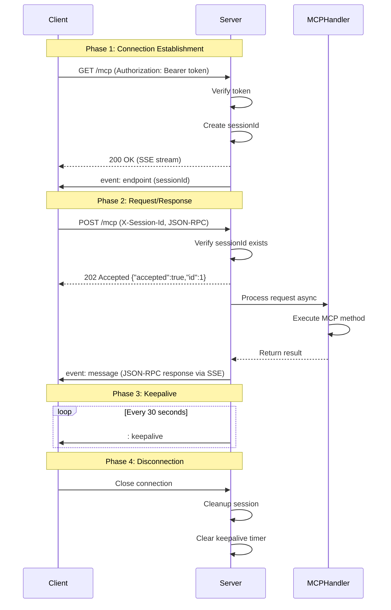

# MCP over SSE (Streamable HTTP Transport) - Complete Implementation Spec

## 概要

このドキュメントは、Server-Sent Events (SSE) を使用した完全なMCP (Model Context Protocol) 実装の仕様を定義します。Streamable HTTP Transportプロトコルに準拠し、クライアントとサーバー間の双方向通信を実現します。

## プロトコルフロー

### 1. 接続確立フェーズ

```
Client                                Server
  |                                      |
  |------- GET /mcp -------------------->|
  |       (Authorization: Bearer <token>)|
  |                                      |
  |<------ 200 OK ----------------------|
  |       Content-Type: text/event-stream
  |       (SSE stream established)      |
  |                                      |
  |<------ event: endpoint --------------|
  |       data: {"sessionId": "uuid"}   |
  |                                      |
  |<------ : keepalive ------------------|
  |       (every 30 seconds)            |
```

### 2. リクエスト/レスポンスフェーズ

```
Client                                Server
  |                                      |
  |------- POST /mcp ------------------->|
  |       X-Session-Id: <sessionId>     |
  |       Content-Type: application/json |
  |       {"jsonrpc":"2.0","id":1,...}  |
  |                                      |
  |<------ 202 Accepted -----------------|
  |       {"accepted": true, "id": 1}   |
  |                                      |
  |                  ... (processing) ...|
  |                                      |
  |<------ event: message ---------------|
  |       data: {"jsonrpc":"2.0","id":1, |
  |              "result": {...}}       |
  |                  (via SSE stream)   |
```

## 要件

### 要件1: SSEストリーム確立

**目的**: クライアントがサーバーとの永続的なSSE接続を確立する

#### 受け入れ基準

1.1. クライアントが `GET /mcp` リクエストを送信したとき、サーバーはSSEストリームを確立すること
1.2. 認証が有効な場合、サーバーは `Authorization: Bearer <token>` ヘッダーを検証すること
1.3. 認証に失敗した場合、サーバーは401 Unauthorizedを返すこと
1.4. SSEレスポンスヘッダーに以下を含めること：
   - `Content-Type: text/event-stream`
   - `Cache-Control: no-cache`
   - `Connection: keep-alive`
   - `X-Accel-Buffering: no`
   - 適切なCORSヘッダー
1.5. 接続確立後、サーバーは `event: endpoint` イベントで一意の `sessionId` を送信すること
1.6. サーバーは30秒ごとに `: keepalive\n\n` コメントを送信すること

### 要件2: セッション管理

**目的**: SSE接続とMCPリクエストを関連付けるためのセッション管理

#### 受け入れ基準

2.1. サーバーは各SSE接続に一意の `sessionId` (UUID v4) を割り当てること
2.2. サーバーは `sessionId` と SSE `ServerResponse` オブジェクトのマッピングを保持すること
2.3. クライアントが接続を切断したとき、サーバーはセッションをクリーンアップすること
2.4. keepaliveタイマーは接続切断時に確実にクリアされること
2.5. サーバーはアクティブなセッション数を追跡できること

### 要件3: MCPリクエストの送信（POST /mcp）

**目的**: クライアントがJSON-RPCリクエストをサーバーに送信する

#### 受け入れ基準

3.1. クライアントが `POST /mcp` リクエストを送信したとき、サーバーはリクエストを受け付けること
3.2. リクエストヘッダーに `X-Session-Id: <sessionId>` を含めること
3.3. リクエストボディはJSON-RPC 2.0形式であること
3.4. 認証が有効な場合、サーバーは `Authorization: Bearer <token>` ヘッダーを検証すること
3.5. `sessionId` が存在しない場合、サーバーは400 Bad Requestを返すこと
3.6. `sessionId` が無効な場合、サーバーは404 Not Foundを返すこと
3.7. リクエストが受け付けられた場合、サーバーは **202 Accepted** を即座に返すこと
   - レスポンスボディ: `{"accepted": true, "id": <request-id>}`
3.8. サーバーはリクエストを非同期で処理すること

### 要件4: MCPレスポンスの送信（SSE経由）

**目的**: サーバーがリクエストの処理結果をSSEストリーム経由で返す

#### 受け入れ基準

4.1. リクエスト処理が完了したとき、サーバーは対応する `sessionId` のSSE接続にレスポンスを送信すること
4.2. レスポンスは `event: message` イベントとして送信すること
4.3. レスポンスデータはJSON-RPC 2.0形式であること
4.4. レスポンスの `id` フィールドはリクエストの `id` と一致すること
4.5. 処理中にエラーが発生した場合、JSON-RPC 2.0 エラーフォーマットで送信すること
4.6. `sessionId` の接続が既に切断されている場合、サーバーはエラーをログに記録すること

### 要件5: エラーハンドリング

**目的**: 各種エラーケースを適切に処理する

#### 受け入れ基準

5.1. JSON-RPCパースエラーが発生した場合、サーバーは標準的なJSON-RPCエラーレスポンスを返すこと
   - `code: -32700` (Parse error)
5.2. JSON-RPC形式が無効な場合、サーバーはエラーレスポンスを返すこと
   - `code: -32600` (Invalid Request)
5.3. MCP固有のエラーが発生した場合、適切なエラーコードとメッセージを含むこと
5.4. 処理タイムアウトが発生した場合、タイムアウトエラーを返すこと
5.5. すべてのエラーレスポンスはSSEストリーム経由で送信すること

### 要件6: 並行処理とスループット

**目的**: 複数のクライアントと複数のリクエストを効率的に処理する

#### 受け入れ基準

6.1. サーバーは複数のSSE接続を同時に処理できること
6.2. 各セッションは独立してリクエストを処理できること
6.3. 1つのセッションで複数のリクエストを並行して処理できること
6.4. リクエストIDを使用してレスポンスを正しくマッピングすること
6.5. 処理順序は保証されないこと（並行処理のため）

### 要件7: クリーンアップと切断

**目的**: リソースリークを防ぎ、適切にクリーンアップする

#### 受け入れ基準

7.1. クライアント接続が切断されたとき、サーバーは即座にセッションを削除すること
7.2. keepaliveタイマーを確実に停止すること
7.3. 処理中のリクエストがある場合でも、セッションをクリーンアップすること
7.4. サーバーシャットダウン時、すべてのSSE接続を適切にクローズすること
7.5. メモリリークが発生しないこと

## データフォーマット

### エンドポイントイベント

```typescript
interface EndpointEvent {
  type: 'endpoint';
  url: '/mcp';
  sessionId: string; // UUID v4
}
```

**SSE形式**:
```
event: endpoint
data: {"type":"endpoint","url":"/mcp","sessionId":"550e8400-e29b-41d4-a716-446655440000"}

```

### MCPリクエスト（POST /mcp）

**ヘッダー**:
```
POST /mcp HTTP/1.1
Content-Type: application/json
X-Session-Id: 550e8400-e29b-41d4-a716-446655440000
Authorization: Bearer <token>
```

**ボディ**:
```json
{
  "jsonrpc": "2.0",
  "id": 1,
  "method": "tools/list",
  "params": {}
}
```

### 即座のACKレスポンス（202 Accepted）

```json
{
  "accepted": true,
  "id": 1
}
```

### MCPレスポンス（SSE経由）

**SSE形式**:
```
event: message
data: {"jsonrpc":"2.0","id":1,"result":{"tools":[...]}}

```

### エラーレスポンス（SSE経由）

**SSE形式**:
```
event: message
data: {"jsonrpc":"2.0","id":1,"error":{"code":-32603,"message":"Internal error"}}

```

## シーケンス図



## 実装上の注意事項

### セッションIDの伝搬

- POSTリクエストに `X-Session-Id` ヘッダーを使用
- サーバーは `X-Session-Id` を検証し、有効なセッションにのみレスポンス送信
- `sessionId` が無効な場合、適切なエラーレスポンスを返す（SSEではなくHTTP）

### 非同期処理

- POST /mcp は即座に202 Acceptedを返す
- 実際の処理は非同期で実行
- 処理完了後、SSEストリーム経由でレスポンス送信

### エラー処理

- JSON-RPCパースエラー: 即座にHTTPレスポンスで返す（400 Bad Request）
- MCP処理エラー: SSEストリーム経由でJSON-RPCエラーとして返す
- セッション不在エラー: 404 Not Found（SSEストリーム確立前）

### タイムアウト

- リクエスト処理タイムアウト: 60秒（設定可能）
- タイムアウト発生時、SSE経由でタイムアウトエラーを返す

## テスト要件

### ユニットテスト

1. セッション管理
   - sessionId生成
   - セッション追加/削除
   - セッション検索

2. リクエスト/レスポンスルーティング
   - sessionIdによるルーティング
   - 無効なsessionIdのハンドリング
   - 並行リクエストの処理

3. SSEフォーマット
   - エンドポイントイベントのフォーマット
   - メッセージイベントのフォーマット
   - keepaliveコメントのフォーマット

### E2Eテスト

1. 完全なフロー
   - GET /mcp → 接続確立 → POST /mcp → SSEレスポンス受信
   - 複数リクエストの順次処理
   - 並行リクエストの処理

2. エラーケース
   - 無効なsessionId
   - JSON-RPCパースエラー
   - 接続切断中のレスポンス

3. 認証
   - Bearer token検証
   - 無効なtokenでの拒否

4. クリーンアップ
   - 接続切断時のクリーンアップ
   - メモリリークのチェック

## 既存実装との統合

### 変更が必要なファイル

1. `src/cli/http-server-with-config.ts`
   - `handleMCPRequest()` を更新: 202 Acceptedを返し、SSE経由でレスポンス
   - `X-Session-Id` ヘッダーの検証を追加

2. `src/cli/sse-stream-handler.ts`
   - セッションIDベースのレスポンス送信機能を追加
   - `sendResponse(sessionId, response)` メソッドを追加

3. `src/cli/mcp-handler.ts`
   - 非同期処理のサポート（既に実装済み）

### 新規作成が必要なファイル

1. `tests/e2e/mcp-over-sse-complete.test.ts`
   - 完全なMCP over SSEフローのE2Eテスト

2. `tests/unit/sse-session-manager.test.ts`
   - セッション管理のユニットテスト
